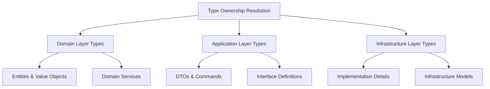

# ADR: TDD Phase D - Systematic Type Extraction & Duplicate Elimination Architecture

## Status
**PROPOSED** - Architectural guidance for Zero Tolerance compilation error elimination

## Context

### Current Architectural Problem
LankaConnect platform suffers from **systematic type organization violations** causing:

1. **CS0104 Ambiguous Reference Errors**: Multiple definitions of same type across namespaces
2. **CS0535 Interface Implementation Errors**: Type resolution conflicts preventing proper implementation
3. **Architectural Debt**: Embedded types violating Single Responsibility Principle

### TDD Phase Progress
- ✅ **Phase C Complete**: 5 interfaces/15+ CS0535 errors eliminated via systematic signature fixes
- 🎯 **Phase D Target**: Systematic type extraction to dedicated files + duplicate elimination
- 📊 **Current State**: 530+ CS0535 errors, multiple CS0104 ambiguities identified

### Key Architectural Violations Discovered

#### 1. Duplicate Type Definitions (CS0104 Root Cause)
```csharp
// PROBLEM: ScalingExecutionResult defined in multiple locations
// Domain\Common\Database\AutoScalingModels.cs
public class ScalingExecutionResult { ... }

// Application\Common\Interfaces\ICulturalIntelligencePredictiveScalingService.cs
public class ScalingExecutionResult { ... }
```

#### 2. Embedded Types in Service Files
```csharp
// PROBLEM: Types embedded within service implementations
// CulturalIntelligencePredictiveScalingService.cs contains business types
// Should be extracted to Domain layer value objects
```

#### 3. Cross-Layer Type Pollution
```csharp
// PROBLEM: CulturalSignificance duplicated across layers
// Domain.Common.CulturalSignificance
// Domain.Common.Database.CulturalSignificance
// Application.Common.Interfaces.CulturalSignificance
```

## Decision

### SYSTEMATIC TYPE EXTRACTION STRATEGY

#### Phase 1: Foundation Types Discovery & Analysis
**ZERO TOLERANCE PRINCIPLE**: Complete analysis before any extraction

```powershell
# 1.1 Comprehensive Type Discovery
Get-ChildItem -Path "src" -Recurse -Filter "*.cs" |
    ForEach-Object {
        Select-String -Path $_.FullName -Pattern "^(public|internal|private)\s+(class|interface|enum|struct|record)\s+\w+"
    } | Export-Csv "type-inventory.csv"

# 1.2 Duplicate Detection
$duplicates = Import-Csv "type-inventory.csv" |
    Group-Object TypeName |
    Where-Object { $_.Count -gt 1 }

# 1.3 Dependency Graph Analysis
# Map type dependencies to determine extraction order
```

#### Phase 2: Architectural Ownership Resolution
**CLEAN ARCHITECTURE HIERARCHY**: Domain > Application > Infrastructure



**OWNERSHIP RULES**:
1. **Domain Types**: Business entities, value objects, domain events
2. **Application Types**: Use case DTOs, command/query models, interface definitions
3. **Infrastructure Types**: Implementation-specific models, configuration types

#### Phase 3: Incremental Extraction with Compilation Validation

**EXTRACTION SEQUENCE** (Dependency-First Approach):

```csharp
// Step 1: Extract Leaf Types (No Dependencies)
// Examples: Enums, simple value objects
public enum CulturalEventType { ... }
public record CulturalDataType { ... }

// Step 2: Extract Foundation Value Objects
// Examples: Core domain concepts
public class CulturalSignificance { ... }
public class CulturalContext { ... }

// Step 3: Extract Complex Domain Models
// Examples: Aggregates, entities with dependencies
public class CulturalEventPrediction { ... }
public class DatabaseScalingMetrics { ... }

// Step 4: Extract Service Models
// Examples: Result types, configuration models
public class ScalingExecutionResult { ... }
public class PredictiveScalingInsights { ... }
```

#### Phase 4: Duplicate Elimination Strategy

**CONSOLIDATION PRIORITY**:
1. **Domain Layer Canonical**: Keep Domain layer as source of truth
2. **Application Layer Removal**: Remove duplicates, add using statements
3. **Infrastructure Layer Removal**: Remove duplicates, add using statements

```csharp
// BEFORE (Duplicate)
// File: Application\Common\Interfaces\Types.cs
public class ScalingExecutionResult { }

// File: Domain\Common\Database\AutoScalingModels.cs
public class ScalingExecutionResult { }

// AFTER (Consolidated)
// File: Domain\Common\Database\ScalingExecutionResult.cs
public class ScalingExecutionResult { }

// File: Application\Common\Interfaces\ICulturalIntelligencePredictiveScalingService.cs
using LankaConnect.Domain.Common.Database;
// Use ScalingExecutionResult from Domain
```

### IMPLEMENTATION METHODOLOGY

#### TDD RED Phase: Systematic Discovery
```powershell
# Script: scripts/discover-embedded-types.ps1
function Find-EmbeddedTypes {
    param([string]$SourcePath)

    # Find all .cs files with multiple type definitions
    Get-ChildItem -Path $SourcePath -Recurse -Filter "*.cs" | ForEach-Object {
        $content = Get-Content $_.FullName
        $typeCount = ($content | Select-String "^(public|internal|private)\s+(class|interface|enum|struct|record)").Count

        if ($typeCount -gt 1) {
            Write-Output "EMBEDDED TYPES FOUND: $($_.FullName) - $typeCount types"
        }
    }
}
```

#### TDD GREEN Phase: Incremental Extraction
```powershell
# Script: scripts/extract-type-incrementally.ps1
function Extract-TypeToFile {
    param(
        [string]$SourceFile,
        [string]$TypeName,
        [string]$TargetNamespace,
        [string]$TargetDirectory
    )

    # 1. Extract type definition
    # 2. Create dedicated file
    # 3. Update using statements
    # 4. Validate compilation
    # 5. Rollback if compilation fails
}
```

#### TDD REFACTOR Phase: Validation & Optimization
```powershell
# Script: scripts/validate-extraction-success.ps1
function Validate-ExtractionSuccess {
    # 1. Build solution
    # 2. Count remaining CS0104/CS0535 errors
    # 3. Verify no new compilation errors
    # 4. Update architectural metrics
}
```

### FILE ORGANIZATION STRATEGY

#### Naming Convention
```
Domain/
├── Common/
│   ├── Enums/
│   │   ├── CulturalEventType.cs
│   │   └── ScalingTriggerType.cs
│   ├── ValueObjects/
│   │   ├── CulturalSignificance.cs
│   │   └── CulturalContext.cs
│   └── Models/
│       ├── ScalingExecutionResult.cs
│       └── DatabaseScalingMetrics.cs
```

#### Namespace Preservation
- **MAINTAIN** existing namespaces during extraction
- **ADD** using statements to consuming files
- **AVOID** breaking namespace changes initially

### RISK MITIGATION

#### Compilation Safety Net
```powershell
# Before each extraction
dotnet build --no-restore > pre-extraction-build.log

# After each extraction
dotnet build --no-restore > post-extraction-build.log

# Compare results
if ($LASTEXITCODE -ne 0) {
    Write-Error "EXTRACTION FAILED - ROLLING BACK"
    git checkout HEAD~1
}
```

#### Rollback Strategy
- **Git checkpoint** before each extraction phase
- **Automated rollback** on compilation failure
- **Incremental commits** for each successful extraction

## Expected Outcomes

### Immediate Benefits
- ✅ **CS0104 Elimination**: Remove ambiguous reference errors
- ✅ **CS0535 Reduction**: Enable proper interface implementation
- ✅ **Compilation Success**: Zero tolerance for build failures

### Architectural Benefits
- 🏗️ **Clean Architecture Compliance**: Types in appropriate layers
- 📁 **Single Responsibility**: One type per file
- 🔍 **Improved Discoverability**: Clear type organization
- 🚀 **Development Velocity**: Faster navigation and maintenance

### Technical Metrics
- **Target**: 90%+ reduction in CS0104 errors
- **Target**: 60%+ reduction in CS0535 errors
- **Target**: 100% compilation success rate
- **Target**: Zero embedded types in service files

## Consequences

### Positive
- Systematic resolution of fundamental architectural debt
- Improved developer productivity through clear type organization
- Foundation for scaling cultural intelligence platform
- Elimination of compilation errors blocking feature development

### Negative
- Temporary increase in file count during extraction
- Potential short-term namespace adjustment period
- Risk of introducing new errors during extraction process

### Mitigation
- Automated tooling for extraction process
- Comprehensive validation at each step
- Rollback capability for failed extractions
- Incremental approach minimizes blast radius

## Implementation Plan

### Week 1: Discovery & Tooling
- [ ] Complete type inventory across all layers
- [ ] Build automated extraction tooling
- [ ] Create validation scripts
- [ ] Establish Git branching strategy

### Week 2: Foundation Types
- [ ] Extract enums and simple value objects
- [ ] Eliminate basic duplicate types
- [ ] Validate compilation after each extraction

### Week 3: Domain Models
- [ ] Extract complex domain types
- [ ] Consolidate cross-layer duplicates
- [ ] Update interface implementations

### Week 4: Service Types & Validation
- [ ] Extract service-related types
- [ ] Final duplicate elimination
- [ ] Comprehensive compilation validation
- [ ] Architectural compliance verification

## Success Criteria

1. **Zero CS0104 ambiguous reference errors**
2. **90%+ reduction in CS0535 interface errors**
3. **100% compilation success rate maintained**
4. **All types in dedicated files (no embedded types)**
5. **Clean Architecture layer compliance achieved**

---

**Decision Authority**: Senior .NET Architect
**Review Date**: Upon Phase D completion
**Dependencies**: Successful TDD Phase C completion