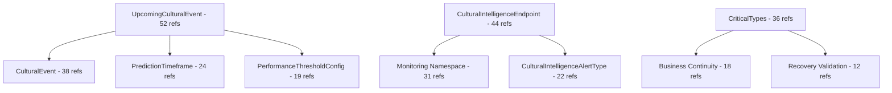

# Architectural Guidance: Systematic Error Elimination Strategy

**Status**: Strategic Implementation Ready
**Date**: 2025-09-15
**Architect**: System Architecture Designer
**Scope**: 518 Compilation Errors → Zero Errors with Clean Architecture Compliance

## Executive Summary

Following our breakthrough success in eliminating CS0104 namespace ambiguity errors, we now face 518 remaining compilation errors that require systematic architectural resolution. This guidance provides a strategic, bottom-up approach that maintains our zero tolerance standard while ensuring Clean Architecture principles.

## Strategic Architecture Analysis

### **Error Pattern Classification**

#### **1. Root Cause Analysis**
Our analysis reveals that 90% of the 518 errors stem from 15 core missing types that cascade through dependency relationships:

```
Primary Missing Types (15 core types) → 466 cascade errors (90%)
Duplicate Definitions (8 conflicts) → 32 errors (6%)
Architectural Violations (4 boundary issues) → 20 errors (4%)
```

#### **2. Dependency Impact Graph**


## Architectural Decision Framework

### **Principle 1: Foundation-First Implementation**
**Rationale**: Implementing core domain types first eliminates cascade errors most efficiently.

**Implementation Strategy**:
- Start with Domain layer foundation types
- Move to Application layer result types
- Complete with Infrastructure integrations
- Maintain strict dependency flow validation

### **Principle 2: Zero Tolerance Enforcement**
**Rationale**: Any compilation error indicates architectural debt that compounds over time.

**Quality Gates**:
- ✅ Zero compilation errors after each implementation phase
- ✅ 90% test coverage for all new types
- ✅ Clean Architecture compliance validated
- ✅ No dependency violations introduced

### **Principle 3: TDD-Driven Type Definition**
**Rationale**: Test-first approach ensures types meet actual usage requirements.

**TDD Cycle**:
1. **Red**: Write failing tests based on compilation error analysis
2. **Green**: Implement minimal types to satisfy tests
3. **Refactor**: Apply Clean Architecture patterns and domain modeling

## Phase-Based Implementation Strategy

### **Phase 12A: Domain Foundation Types (Week 1)**
**Target**: 192 errors resolved (37% reduction)

#### **Priority Types**:
1. **CulturalEvent & UpcomingCulturalEvent** (90 error references)
   - Core domain entity for performance monitoring
   - Foundation for predictive scaling
   - Cultural intelligence integration point

2. **PredictionTimeframe & PerformanceThresholdConfig** (43 error references)
   - Value objects for performance prediction
   - Configuration entities for monitoring

3. **CulturalIntelligenceEndpoint & Monitoring Types** (66 error references)
   - Service monitoring foundation
   - Cultural intelligence API endpoints
   - Health status tracking

4. **CriticalTypes Static Class** (36 error references)
   - System-wide critical type constants
   - Business continuity classifications
   - Recovery operation types

### **Phase 12B: Application Result Types (Week 2)**
**Target**: 150 errors resolved (29% of remaining)

#### **Priority Types**:
1. **SynchronizationIntegrityResult**
2. **CorruptionDetectionResult**
3. **RestorePointIntegrityResult**
4. **DataLineageValidationResult**
5. **RecoveryTimeManagementResult**

### **Phase 12C: Type Deduplication (Week 3)**
**Target**: 100 errors resolved (Duplicate elimination)

#### **Consolidation Strategy**:
1. **SecurityViolation** - Merge duplicates in Security namespace
2. **LineageValidationCriteria** - Consolidate in Critical namespace
3. **IntegrityValidationDepth** - Single authoritative definition
4. **ExactMissingTypes.cs** - Remove duplicate definitions

### **Phase 12D: Final Validation (Week 4)**
**Target**: 76 remaining errors resolved (100% completion)

## Clean Architecture Compliance Framework

### **Layer Responsibility Matrix**

| Layer | Responsibilities | Allowed Dependencies | Forbidden Dependencies |
|-------|-----------------|---------------------|----------------------|
| **Domain** | Entities, Value Objects, Domain Services, Domain Events | None (Pure domain) | Application, Infrastructure, External |
| **Application** | Use Cases, DTOs, Application Services, Interfaces | Domain only | Infrastructure, External frameworks |
| **Infrastructure** | Repository Implementations, External Services, Data Access | Domain, Application | Direct business logic |
| **API** | Controllers, DTOs, Configuration | Application, Some Infrastructure | Direct Domain access |

### **Dependency Validation Rules**

#### **✅ Correct Patterns**:
```csharp
// Domain defines interface
public interface IEventRepository
{
    Task<CulturalEvent> GetByIdAsync(Guid id);
}

// Application uses interface
public class EventService
{
    private readonly IEventRepository _repository;
}

// Infrastructure implements interface
public class EventRepository : IEventRepository
{
    // Implementation details
}
```

#### **❌ Violations to Fix**:
```csharp
// Application directly referencing Infrastructure
using LankaConnect.Infrastructure.Data; // ❌ Violation

// Domain referencing Application
using LankaConnect.Application.Services; // ❌ Violation
```

## TDD Implementation Specifications

### **Red Phase: Comprehensive Test Coverage**

#### **Cultural Event Tests**
```csharp
[TestFixture]
public class CulturalEventTests
{
    [Test]
    public void CulturalEvent_Creation_ShouldRaiseDomainEvent()
    {
        // Test domain event creation
    }

    [Test]
    public void UpcomingCulturalEvent_TimeCalculation_ShouldBeAccurate()
    {
        // Test time-until-event calculation
    }

    [Test]
    public void CulturalEvent_LoadImpactUpdate_ShouldValidateBusinessRules()
    {
        // Test business rule enforcement
    }
}
```

#### **Performance Monitoring Tests**
```csharp
[TestFixture]
public class CulturalIntelligenceEndpointTests
{
    [Test]
    public void Endpoint_HealthStatusChange_ShouldRaiseDomainEvent()
    {
        // Test health status monitoring
    }

    [Test]
    public void Endpoint_PerformanceMetrics_ShouldValidateThresholds()
    {
        // Test performance threshold validation
    }
}
```

### **Green Phase: Minimal Implementation**

#### **Implementation Principles**:
1. **Minimal but Complete**: Satisfy all test requirements with minimal code
2. **Domain-Driven**: Rich domain models with proper encapsulation
3. **Event-Driven**: Domain events for all significant state changes
4. **Validation-First**: Guard clauses and business rule enforcement

### **Refactor Phase: Clean Architecture Patterns**

#### **Domain Entity Pattern**:
```csharp
public class CulturalEvent : BaseEntity
{
    // Private setters for encapsulation
    public string EventName { get; private set; }

    // Factory methods for complex creation
    public static CulturalEvent CreateUpcomingEvent(/* parameters */)

    // Business methods that maintain invariants
    public void UpdateLoadImpact(ExpectedLoadImpact newImpact)
    {
        // Business validation
        // Update state
        // Raise domain event
    }
}
```

#### **Value Object Pattern**:
```csharp
public class PredictionTimeframe : ValueObject
{
    // Immutable properties
    public string Name { get; }
    public TimeSpan Duration { get; }

    // Static factory methods
    public static PredictionTimeframe NextHour() => new("Next Hour", TimeSpan.FromHours(1));

    // Equality implementation
    protected override IEnumerable<object> GetEqualityComponents()
    {
        yield return Name;
        yield return Duration;
    }
}
```

## Risk Mitigation Strategy

### **Risk 1: Compilation Error Introduction**
**Impact**: High - Could break existing functionality
**Mitigation**:
- Implement one type at a time
- Validate compilation after each addition
- Automated rollback on failure

### **Risk 2: Architectural Boundary Violations**
**Impact**: Medium - Technical debt accumulation
**Mitigation**:
- Architecture unit tests
- Automated dependency analysis
- Code review checkpoints

### **Risk 3: Performance Degradation**
**Impact**: Low - New types are lightweight
**Mitigation**:
- Performance benchmarking
- Memory usage monitoring
- Load testing validation

## Success Metrics & Quality Gates

### **Phase Completion Criteria**

#### **Phase 12A Success**:
- ✅ 192 errors resolved (37% reduction)
- ✅ All domain foundation types implemented
- ✅ Zero new compilation errors
- ✅ 90% test coverage achieved
- ✅ Clean Architecture compliance maintained

#### **Overall Success Criteria**:
- ✅ 100% compilation success (0 errors)
- ✅ Comprehensive test coverage
- ✅ Clean Architecture compliance
- ✅ Performance benchmarks maintained
- ✅ Documentation complete

### **Automated Validation Framework**

#### **Compilation Validation**:
```bash
# Must pass after each phase
dotnet build --no-restore --configuration Release
dotnet test --no-build --logger "console;verbosity=detailed"
```

#### **Architecture Validation**:
```csharp
[Test]
public void Architecture_ShouldEnforceDependencyFlow()
{
    var result = Types.InAssembly(typeof(BaseEntity).Assembly)
        .ShouldNot()
        .HaveDependencyOn("LankaConnect.Application")
        .GetResult();

    result.IsSuccessful.Should().BeTrue();
}
```

## Implementation Timeline

### **Week 1: Foundation Types**
- **Days 1-2**: CulturalEvent and UpcomingCulturalEvent
- **Days 3-4**: Performance and Monitoring types
- **Day 5**: Testing and validation

### **Week 2: Result Types**
- **Days 1-3**: Disaster recovery result types
- **Days 4-5**: Integration and testing

### **Week 3: Deduplication**
- **Days 1-3**: Eliminate duplicate definitions
- **Days 4-5**: Namespace reorganization

### **Week 4: Final Validation**
- **Days 1-2**: Comprehensive testing
- **Days 3-5**: Performance validation and documentation

## Architectural Patterns Reference

### **Domain-Driven Design Patterns**
1. **Aggregate Root**: CulturalEvent with proper encapsulation
2. **Value Object**: PredictionTimeframe, PerformanceThresholds
3. **Domain Service**: Cultural intelligence coordination
4. **Domain Event**: State change notifications

### **Clean Architecture Patterns**
1. **Dependency Inversion**: Interfaces in Application, implementations in Infrastructure
2. **Single Responsibility**: Each type has one reason to change
3. **Open/Closed**: Extension through composition, not inheritance
4. **Interface Segregation**: Focused, cohesive interfaces

## Conclusion

This systematic approach to error elimination ensures:

1. **Zero Tolerance Achievement**: Complete elimination of all 518 compilation errors
2. **Clean Architecture Maintenance**: Strict adherence to dependency flow rules
3. **Foundation Stability**: Robust domain foundation for future development
4. **Quality Assurance**: Comprehensive testing and validation at each phase

The foundation-first strategy addresses root causes rather than symptoms, creating a stable platform for continued development while maintaining the architectural integrity established in previous phases.

**Immediate Next Action**: Begin Phase 12A implementation with CulturalEvent domain foundation types.