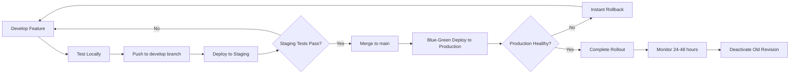

# Blue-Green Deployment Guide: Staging to Production with Rollback

## Understanding Blue-Green Deployment

**IMPORTANT**: Blue-green deployment does NOT require two production environments!

### What You Actually Need

```
┌─────────────────┐
│    STAGING      │  ← Test environment (develop branch)
│   Environment   │
└─────────────────┘

┌─────────────────────────────────────────┐
│         PRODUCTION Environment          │
│                                         │
│  ┌──────────────┐    ┌──────────────┐ │
│  │ BLUE Revision│    │GREEN Revision│ │
│  │  (Current)   │    │    (New)     │ │
│  │  100% traffic│ ←→ │   0% traffic │ │
│  └──────────────┘    └──────────────┘ │
│                                         │
└─────────────────────────────────────────┘
```

- **ONE staging environment** (for testing)
- **ONE production environment** (serves real users)
- **TWO revisions** within production during deployment (temporary)

## Your Workflow: Staging → Production with Rollback

### Step 1: Test Everything in Staging

```bash
# Current state: You've tested thoroughly in staging
# URL: https://lankaconnect-ui-staging.politebay-79d6e8a2.eastus2.azurecontainerapps.io
# Status: ✅ Everything works perfectly
```

### Step 2: Merge to Main (Triggers Production Deployment)

```bash
# Merge your tested code from develop → main
git checkout main
git merge develop
git push origin main

# This automatically triggers .github/workflows/deploy-ui-production.yml
```

### Step 3: Blue-Green Deployment Happens Automatically

```yaml
# What happens during deployment:

1. Build new Docker image
   ✅ Image: lankaconnectprod.azurecr.io/lankaconnect-ui:abc123

2. Deploy as GREEN revision (NEW)
   ✅ Created: lankaconnect-ui-production--abc123
   ✅ Traffic: 0% (no users affected yet)
   ✅ BLUE revision still serves 100% traffic

3. Health checks on GREEN
   ✅ /api/health → 200 OK
   ✅ Home page → 200 OK
   ✅ API proxy → 200 OK

4. Gradual traffic shift (canary rollout)
   ✅ 10% traffic → GREEN (wait 2 min, check metrics)
   ✅ 50% traffic → GREEN (wait 2 min, check metrics)
   ✅ 100% traffic → GREEN (complete)

5. BLUE becomes standby
   ✅ BLUE revision kept for instant rollback
```

### Step 4: If Something Goes Wrong - Instant Rollback

**Scenario**: Users report errors, or metrics show issues

```bash
# ROLLBACK COMMAND (takes <30 seconds)
az containerapp revision set-mode \
  --name lankaconnect-ui-production \
  --resource-group lankaconnect-production \
  --mode multiple

az containerapp ingress traffic set \
  --name lankaconnect-ui-production \
  --resource-group lankaconnect-production \
  --revision-weight lankaconnect-ui-production--xyz789=100 \
  --revision-weight lankaconnect-ui-production--abc123=0

# Result: Traffic instantly switches back to BLUE (previous working version)
```

## Complete Example with Real Commands

### Current State
```
STAGING (develop branch):
├── UI: lankaconnect-ui-staging
├── Commit: 46a9102a
└── Status: ✅ Working perfectly

PRODUCTION (main branch):
├── UI: lankaconnect-ui-production
├── Current revision: lankaconnect-ui-production--xyz789
├── Traffic: 100% → xyz789 (BLUE)
└── Status: ✅ Stable
```

### Deployment Flow

```bash
# ===================================================================
# STEP 1: Merge to Main
# ===================================================================
git checkout main
git merge develop
git push origin main

# ===================================================================
# STEP 2: GitHub Actions Runs (Automatic)
# ===================================================================
# Workflow: .github/workflows/deploy-ui-production.yml
# - Builds Docker image
# - Pushes to lankaconnectprod.azurecr.io
# - Deploys with blue-green strategy

# ===================================================================
# STEP 3: Monitor Deployment
# ===================================================================
# Watch GitHub Actions logs:
# https://github.com/your-org/lankaconnect/actions

# Or watch Azure logs:
az containerapp logs show \
  --name lankaconnect-ui-production \
  --resource-group lankaconnect-production \
  --follow

# ===================================================================
# STEP 4: Verify New Revision
# ===================================================================
# Check revision status:
az containerapp revision list \
  --name lankaconnect-ui-production \
  --resource-group lankaconnect-production \
  --query "[].{Name:name, Active:properties.active, Traffic:properties.trafficWeight, Health:properties.healthState}" \
  --output table

# Expected output during canary:
# Name                                  Active  Traffic  Health
# ------------------------------------  ------  -------  --------
# lankaconnect-ui-production--xyz789    true    50       Healthy  (BLUE)
# lankaconnect-ui-production--abc123    true    50       Healthy  (GREEN)

# After complete rollout:
# Name                                  Active  Traffic  Health
# ------------------------------------  ------  -------  --------
# lankaconnect-ui-production--xyz789    true    0        Healthy  (BLUE - standby)
# lankaconnect-ui-production--abc123    true    100      Healthy  (GREEN - active)

# ===================================================================
# STEP 5a: SUCCESS SCENARIO - Cleanup Old Revision (Optional)
# ===================================================================
# After 24-48 hours of stable operation, you can deactivate old revision:
az containerapp revision deactivate \
  --name lankaconnect-ui-production \
  --resource-group lankaconnect-production \
  --revision lankaconnect-ui-production--xyz789

# ===================================================================
# STEP 5b: FAILURE SCENARIO - Rollback
# ===================================================================
# If users report issues or metrics show problems:

# 1. Quick rollback (shift all traffic back to BLUE):
az containerapp ingress traffic set \
  --name lankaconnect-ui-production \
  --resource-group lankaconnect-production \
  --revision-weight lankaconnect-ui-production--xyz789=100 \
  --revision-weight lankaconnect-ui-production--abc123=0

# 2. Verify rollback:
curl https://lankaconnect-ui-production.happypebble-12345678.eastus2.azurecontainerapps.io/api/health

# 3. Check traffic distribution:
az containerapp revision list \
  --name lankaconnect-ui-production \
  --resource-group lankaconnect-production \
  --query "[].{Name:name, Traffic:properties.trafficWeight}" \
  --output table

# Result: Back to previous working version in <30 seconds!
```

## Timeline Comparison

### Without Blue-Green (Traditional)
```
1. Deploy new version
2. Old version stops          ← DOWNTIME STARTS
3. New version starts         ← 30-60 seconds
4. Issue discovered           ← Users affected
5. Manual revert              ← 5-10 minutes
   └─→ Total downtime: 5-11 minutes
```

### With Blue-Green (Azure Container Apps)
```
1. Deploy GREEN (0% traffic)  ← No user impact
2. Health checks pass
3. Gradual shift 10% → 50% → 100%
4. Issue discovered           ← Only some users affected
5. Instant rollback           ← <30 seconds
   └─→ Total downtime: 0 seconds (or <30 sec partial)
```

## Key Points

### ✅ What Blue-Green IS
- **Zero-downtime deployment** within a single production environment
- **Two active revisions** during deployment (temporary)
- **Instant rollback** capability by shifting traffic
- **Gradual rollout** (canary) to catch issues early

### ❌ What Blue-Green is NOT
- **NOT two separate production environments** (no need for that)
- **NOT permanent dual setup** (GREEN becomes BLUE after success)
- **NOT related to staging** (staging is separate testing environment)

### Your Actual Setup
```
Environments: 2 (Staging + Production)
Revisions during deployment: 2 (BLUE + GREEN in production only)
Total infrastructure: 2 environments, not 4
```

## Monitoring During Deployment

### Key Metrics to Watch

```bash
# 1. Container health
az containerapp revision list \
  --name lankaconnect-ui-production \
  --resource-group lankaconnect-production \
  --query "[].{Name:name, Health:properties.healthState, Replicas:properties.replicas}" \
  --output table

# 2. Application metrics
az monitor metrics list \
  --resource "/subscriptions/YOUR_SUBSCRIPTION/resourceGroups/lankaconnect-production/providers/Microsoft.App/containerApps/lankaconnect-ui-production" \
  --metric "Requests" \
  --aggregation Total

# 3. Error rates
az monitor metrics list \
  --resource "/subscriptions/YOUR_SUBSCRIPTION/resourceGroups/lankaconnect-production/providers/Microsoft.App/containerApps/lankaconnect-ui-production" \
  --metric "RequestsFailed" \
  --aggregation Total

# 4. Response times
az containerapp logs show \
  --name lankaconnect-ui-production \
  --resource-group lankaconnect-production \
  --follow \
  --tail 50
```

### Rollback Decision Criteria

**Automatic rollback if:**
- Health checks fail (handled by workflow)
- Error rate > 5% during canary phase

**Manual rollback if:**
- User complaints increase
- Response times degrade
- Functional issues discovered
- Database migration issues

## Cost Impact

### Blue-Green Deployment Cost
```
During deployment (10-15 minutes):
- 2 revisions running simultaneously
- Extra cost: ~$0.01-0.02 per deployment
- After completion: Back to 1 revision

Annual impact: ~$5-10/year
└─→ Negligible compared to downtime cost
```

## Comparison: Your Options

### Option 1: Blue-Green with Staging (RECOMMENDED) ✅
```
Staging → Test everything
Main → Blue-green deployment to production

Pros:
✅ Safe testing environment
✅ Zero-downtime production deployments
✅ Instant rollback capability
✅ Separate environments for testing vs production
✅ Industry standard approach

Cons:
❌ Need to maintain staging environment (~$20/mo extra)
```

### Option 2: Direct Deploy (NOT RECOMMENDED) ❌
```
Main → Direct deployment (replace running container)

Pros:
✅ Simpler (no staging)
✅ Slightly cheaper (~$20/mo savings)

Cons:
❌ No safe testing environment
❌ 30-60 second downtime per deploy
❌ Bugs hit production directly
❌ Rollback takes 5-10 minutes
❌ Users affected immediately
```

### Option 3: Convert Staging to Production (BAD IDEA) ❌
```
Rename staging → production

Cons:
❌ Lose testing environment completely
❌ Must test in production (dangerous)
❌ No rollback capability
❌ Every deployment is high-risk
❌ Breaks development workflow
```

## Recommended Workflow



## Next Steps

1. **Create production resources** (run setup-production-infrastructure-cost-optimized.sh)
2. **Set up GitHub secrets** (6 production secrets)
3. **Test blue-green workflow** with a small change
4. **Monitor first deployment** closely
5. **Document rollback procedure** for your team

## Quick Reference

### Deploy to Production
```bash
git checkout main
git merge develop
git push origin main
# GitHub Actions handles the rest
```

### Rollback Production
```bash
# Get revision names
az containerapp revision list --name lankaconnect-ui-production --resource-group lankaconnect-production

# Rollback to previous revision
az containerapp ingress traffic set \
  --name lankaconnect-ui-production \
  --resource-group lankaconnect-production \
  --revision-weight <OLD_REVISION>=100 \
  --revision-weight <NEW_REVISION>=0
```

### Check Status
```bash
az containerapp revision list \
  --name lankaconnect-ui-production \
  --resource-group lankaconnect-production \
  --output table
```

---

**Summary**: You have ONE staging, ONE production, and blue-green gives you TWO temporary revisions during deployment for zero-downtime rollout with instant rollback capability. No need for duplicate production environments!