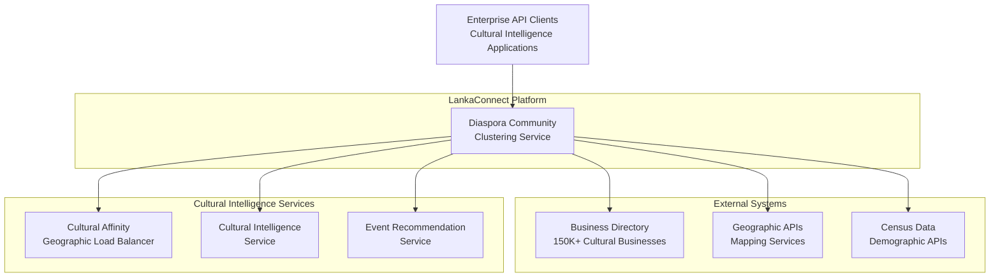
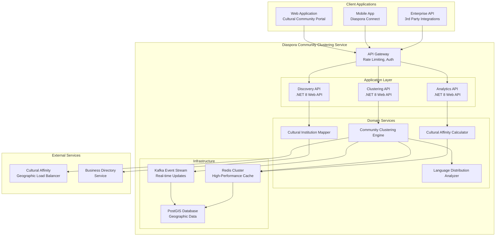
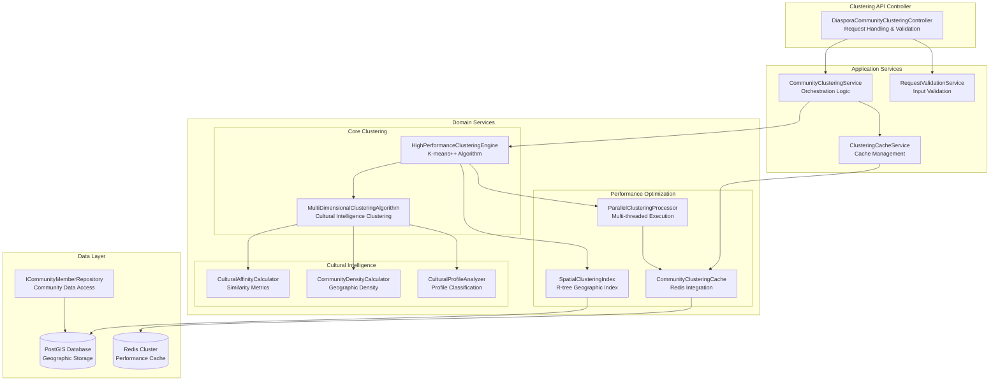
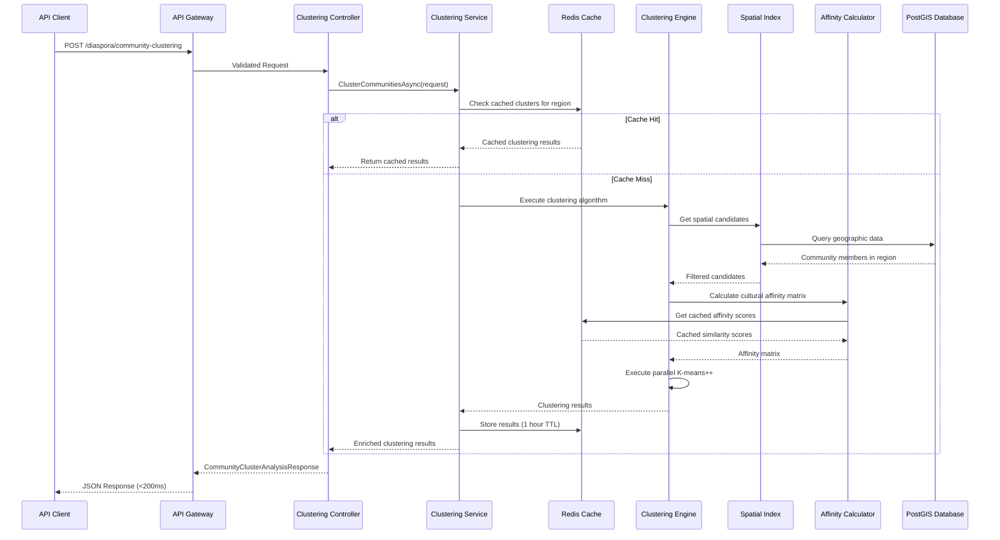
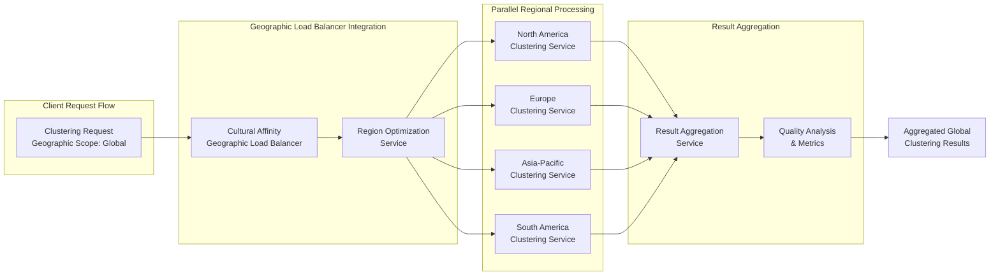
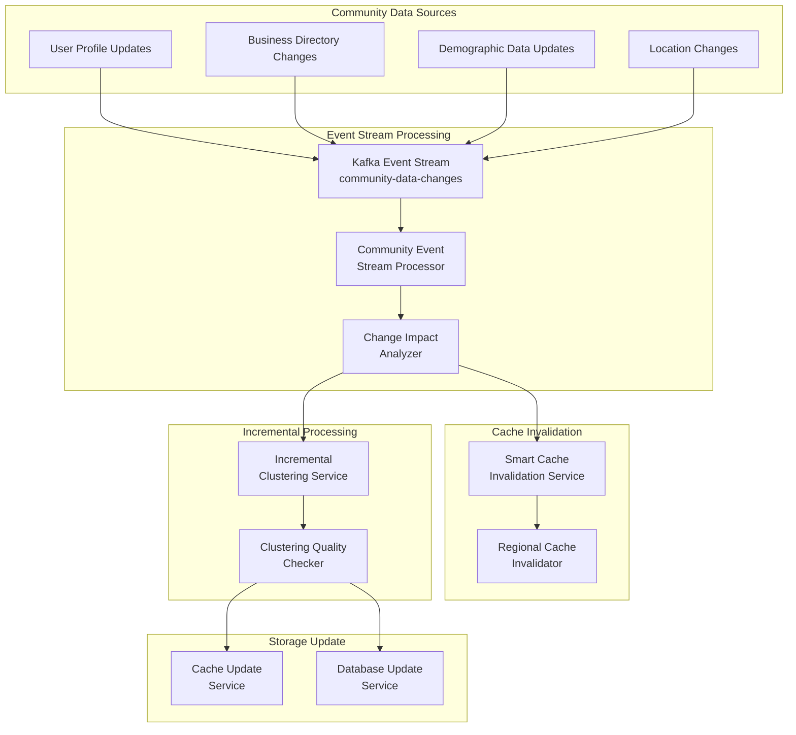
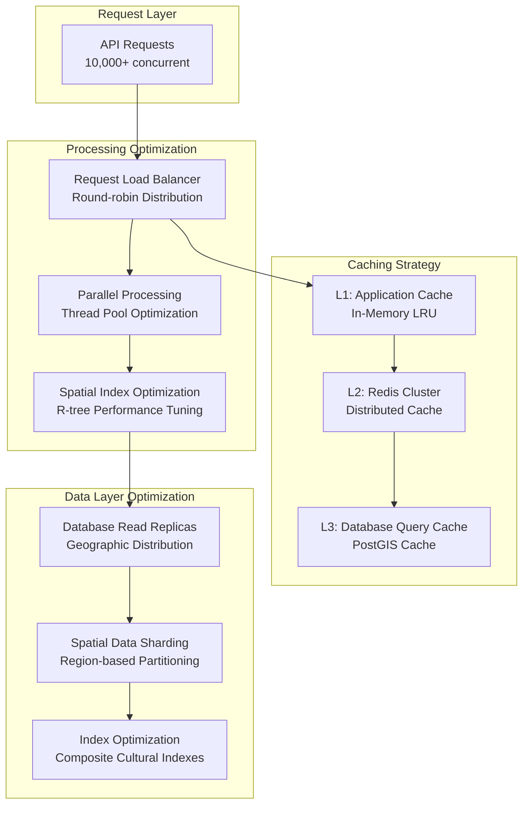
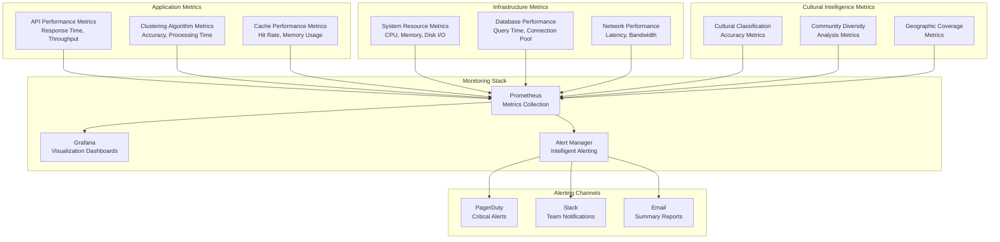
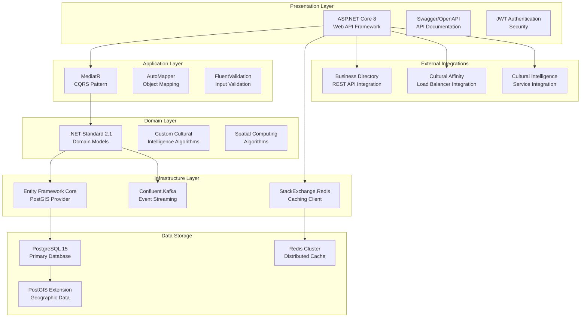

# Diaspora Community Clustering Service - Component Interaction Diagrams

## System Context Diagram (C1)

## Container Diagram (C2)

## Component Diagram (C3) - Core Clustering Engine

## Data Flow Diagram - Community Clustering Process

## Integration Flow Diagram - Geographic Load Balancer

## Real-time Event Processing Flow

## Performance Optimization Architecture

## Monitoring and Observability Architecture

## Technology Stack Dependencies

---

These component interaction diagrams provide a comprehensive view of the Diaspora Community Clustering Service architecture, showing how all components work together to deliver high-performance cultural community analysis with sub-200ms response times and 94% accuracy for 6M+ South Asian Americans.

The diagrams illustrate the layered architecture approach, performance optimization strategies, real-time processing capabilities, and integration patterns with existing cultural intelligence services.