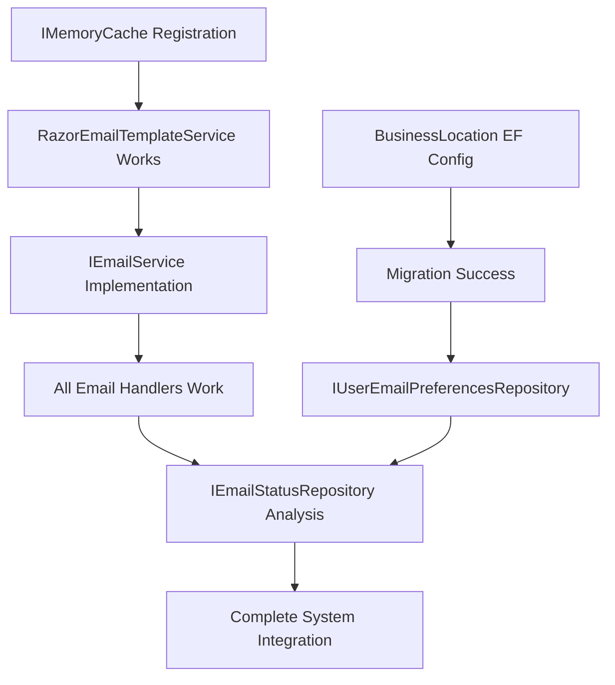

# Implementation Priority Matrix for Infrastructure Dependencies

## Executive Summary

This document provides a prioritized implementation matrix for resolving Infrastructure layer dependencies that are preventing EF Core migrations. The priority levels are based on impact, complexity, and dependency relationships.

## Priority Classification System

### Priority 1 (CRITICAL) - Migration Blockers
**Impact**: Prevents application startup and migrations  
**Timeline**: Must be completed first  
**Risk**: High - Blocks all development progress  

### Priority 2 (HIGH) - Core Functionality  
**Impact**: Affects primary business features  
**Timeline**: Required for feature completeness  
**Risk**: Medium - Affects user functionality  

### Priority 3 (MEDIUM) - Administrative Features
**Impact**: Affects monitoring and administrative capabilities  
**Timeline**: Can be deferred if needed  
**Risk**: Low - Doesn't affect core user functionality  

## Detailed Priority Matrix

### 🔴 PRIORITY 1 - CRITICAL (Day 1 Morning)

#### 1.1 IMemoryCache Registration
**Estimated Time**: 30 minutes  
**Complexity**: Low  
**Dependencies**: None  

**Problem**: RazorEmailTemplateService cannot be instantiated
```
Unable to resolve service for type 'Microsoft.Extensions.Caching.Memory.IMemoryCache' 
while attempting to activate 'RazorEmailTemplateService'
```

**Solution**: Register IMemoryCache in Infrastructure DependencyInjection
```csharp
services.AddMemoryCache(options =>
{
    options.SizeLimit = 100;
    options.CompactionPercentage = 0.25;
    options.ExpirationScanFrequency = TimeSpan.FromMinutes(5);
});
```

**Validation**: 
- [ ] RazorEmailTemplateService resolves successfully
- [ ] Template caching works in integration tests
- [ ] Memory usage stays within configured limits

#### 1.2 BusinessLocation EF Core Configuration
**Estimated Time**: 2 hours  
**Complexity**: Medium  
**Dependencies**: None  

**Problem**: EF Core cannot bind value object constructor parameters
```
Cannot bind 'address', 'coordinates' in 'BusinessLocation(Address address, GeoCoordinate coordinates)'
```

**Solution**: Configure as owned entity types with proper constructor binding
```csharp
public class BusinessLocationConfiguration : IEntityTypeConfiguration<Business>
{
    public void Configure(EntityTypeBuilder<Business> builder)
    {
        builder.OwnsOne(b => b.Location, location =>
        {
            location.OwnsOne(l => l.Address, address => { /* Address mapping */ });
            location.OwnsOne(l => l.Coordinates, coords => { /* Coordinates mapping */ });
        });
    }
}
```

**Validation**:
- [ ] Migration generates without errors
- [ ] BusinessLocation can be saved and retrieved
- [ ] Value object equality works correctly

### 🟡 PRIORITY 2 - HIGH (Day 1-2)

#### 2.1 IEmailService Implementation  
**Estimated Time**: 4 hours  
**Complexity**: Medium-High  
**Dependencies**: IMemoryCache (Priority 1.1)

**Problem**: Multiple MediatR handlers cannot resolve IEmailService
```
Unable to resolve service for type 'LankaConnect.Application.Common.Interfaces.IEmailService'
```

**Solution**: Create EmailService implementation in Infrastructure layer
```csharp
public class EmailService : IEmailService
{
    private readonly ISimpleEmailService _simpleEmailService;
    private readonly IEmailTemplateService _templateService;
    private readonly IEmailMessageRepository _repository;
    
    // Implement interface methods with Result pattern
}
```

**Affected Components**:
- SendEmailVerificationCommandHandler
- SendWelcomeEmailCommandHandler  
- SendPasswordResetCommandHandler
- VerifyEmailCommandHandler
- SendBusinessNotificationCommandHandler

**Validation**:
- [ ] All email command handlers resolve successfully
- [ ] End-to-end email sending works
- [ ] Template rendering integrates correctly
- [ ] Bulk email operations function properly

#### 2.2 IUserEmailPreferencesRepository Implementation
**Estimated Time**: 3 hours  
**Complexity**: Medium  
**Dependencies**: BusinessLocation EF Config (Priority 1.2)

**Problem**: GetUserEmailPreferencesQueryHandler cannot resolve repository
```
Unable to resolve service for type 'IUserEmailPreferencesRepository' 
while attempting to activate 'GetUserEmailPreferencesQueryHandler'
```

**Solution**: Implement repository following EmailMessageRepository pattern
```csharp
public class UserEmailPreferencesRepository : Repository<UserEmailPreferences>, IUserEmailPreferencesRepository
{
    // Follow Result<T> pattern and comprehensive logging
}
```

**Validation**:
- [ ] GetUserEmailPreferencesQueryHandler resolves
- [ ] All CRUD operations work with Result pattern
- [ ] Integration tests pass
- [ ] Performance meets requirements

### 🟢 PRIORITY 3 - MEDIUM (Day 2-3)

#### 3.1 IEmailStatusRepository Analysis and Resolution
**Estimated Time**: 2 hours  
**Complexity**: Low-Medium  
**Dependencies**: EmailService implementation (Priority 2.1)

**Problem**: GetEmailStatusQueryHandler cannot resolve repository
```
Unable to resolve service for type 'IEmailStatusRepository'
while attempting to activate 'GetEmailStatusQueryHandler'
```

**Analysis Required**: Determine if separate repository is needed or if functionality should be consolidated into EmailMessageRepository

**Decision Matrix**:
| Factor | Separate Repository | Merge with EmailMessageRepository |
|--------|-------------------|-----------------------------------|
| **Single Responsibility** | ✅ Clear separation | ❌ Mixed responsibilities |
| **Code Duplication** | ❌ Potential duplication | ✅ Shared infrastructure |
| **Query Performance** | ✅ Specialized queries | ✅ Single database context |
| **Maintenance Burden** | ❌ Multiple repositories | ✅ Single point of maintenance |

**Recommended Solution**: Merge functionality into EmailMessageRepository
- IEmailStatusRepository methods are query-focused
- EmailMessage entity contains all status information
- Reduces repository complexity
- Maintains single source of truth

**Implementation**:
1. Update EmailMessageRepository to implement IEmailStatusRepository interface
2. Register single repository for both interfaces in DI
3. Update GetEmailStatusQueryHandler to use consolidated repository

**Validation**:
- [ ] GetEmailStatusQueryHandler resolves successfully  
- [ ] Email status queries return correct data
- [ ] No functional regression in email operations
- [ ] Performance maintained or improved

## Dependencies and Critical Path



## Risk Assessment and Mitigation

### High Risk Items

#### BusinessLocation EF Configuration
**Risk**: Complex value object mapping may require significant EF Core expertise  
**Mitigation**: 
- Research existing value object configuration patterns
- Create comprehensive test suite before implementation
- Consider fallback to simpler property-based mapping

#### IEmailService Integration
**Risk**: Multiple service dependencies may create integration complexity  
**Mitigation**:
- Use TDD approach with mocked dependencies initially
- Implement incremental integration testing
- Maintain clear separation of concerns

### Medium Risk Items

#### Performance Impact
**Risk**: Additional Result pattern overhead and logging may affect performance  
**Mitigation**:
- Establish performance baselines before implementation
- Use structured logging with appropriate levels
- Implement caching strategies where beneficial

## Success Metrics

### Functional Metrics
- [ ] Application starts without dependency injection errors
- [ ] All EF Core migrations run successfully  
- [ ] All MediatR handlers resolve dependencies
- [ ] Email functionality works end-to-end
- [ ] Test coverage maintains 90%+ for new implementations

### Performance Metrics
- [ ] Application startup time < 5 seconds
- [ ] Database migrations complete < 30 seconds
- [ ] Individual email operations < 500ms
- [ ] Bulk email operations process 100 emails/minute

### Quality Metrics
- [ ] All implementations follow established architecture patterns
- [ ] Clean Architecture boundaries maintained
- [ ] Comprehensive error handling with Result pattern
- [ ] Structured logging with correlation IDs
- [ ] Integration tests cover all critical paths

## Implementation Timeline Summary

### Day 1 
**Morning (3 hours)**: Priority 1 items - Migration blockers  
**Afternoon (4 hours)**: Begin Priority 2.1 - IEmailService implementation

### Day 2
**Morning (3 hours)**: Complete IEmailService implementation  
**Afternoon (3 hours)**: Priority 2.2 - IUserEmailPreferencesRepository

### Day 3  
**Morning (2 hours)**: Priority 3.1 - IEmailStatusRepository resolution  
**Afternoon (4 hours)**: Integration testing and validation

**Total Estimated Time**: 19 hours over 3 days

This priority matrix ensures systematic resolution of dependencies while maintaining high code quality and following established architectural patterns.