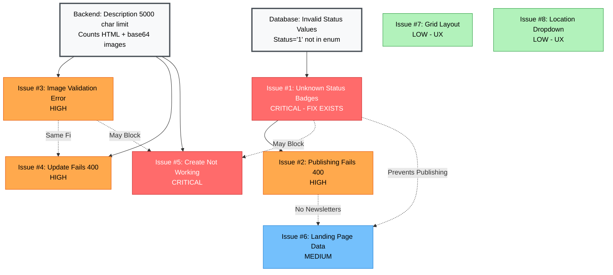

# Newsletter Issues - Dependency Map

**Visual guide showing how issues relate to each other and fix order**

---

## Issue Dependency Graph



---

## Fix Order (Optimal Path)

```
┌─────────────────────────────────────────────────────────────┐
│ PHASE 1: CRITICAL FIXES (1 hour)                            │
└─────────────────────────────────────────────────────────────┘

Step 1: Issue #1 (5 min)
├─ Verify migration deployed
├─ Check database for invalid status
└─ Deploy migration if needed
    ↓
    ├── UNBLOCKS → Issue #2 (Publishing)
    ├── UNBLOCKS → Issue #5 (Create - partial)
    └── ENABLES → Issue #6 (Landing Page - partial)

Step 2: Issue #3 (30 min)
├─ Increase MaxLength to 50,000
├─ Create migration if DB column too small
└─ Deploy backend
    ↓
    ├── FIXES → Issue #4 (Update) - Same root cause
    ├── UNBLOCKS → Issue #5 (Create - full)
    └── ENABLES → Rich content newsletters

Step 3: Issue #5 (10 min)
├─ Test create with minimal data
├─ Test create with image
└─ Verify redirect works
    ↓
    └── ENABLES → Users can create newsletters

Step 4: Issue #2 (10 min)
├─ Test publishing flow
└─ Verify Draft → Active transition
    ↓
    └── ENABLES → Issue #6 (Landing Page - full)

┌─────────────────────────────────────────────────────────────┐
│ PHASE 2: DATA QUALITY (30 min)                              │
└─────────────────────────────────────────────────────────────┘

Step 5: Issue #6 (10 min)
├─ Query for Active newsletters
├─ Create test newsletters if needed
└─ Verify landing page API
    ↓
    └── ENABLES → Public newsletter discovery

┌─────────────────────────────────────────────────────────────┐
│ PHASE 3: UX ENHANCEMENTS (2 hours)                          │
└─────────────────────────────────────────────────────────────┘

Step 6: Issue #8 (30 min)
└─ Replace MultiSelect with TreeDropdown
    ↓
    └── IMPROVES → Location selection UX

Step 7: Issue #7 (1 hour)
└─ Change grid to list layout
    ↓
    └── IMPROVES → Newsletter browsing UX

Step 8: Issue #3 Enhancement (30 min)
└─ Fix character counter accuracy
    ↓
    └── IMPROVES → User feedback
```

---

## Root Cause Clusters

### Cluster A: Database Data Integrity
```
Root: Invalid newsletter status values in database

Affected Issues:
├── Issue #1: Unknown Status Badges (DIRECT)
├── Issue #2: Publishing Fails (INDIRECT - validation checks status)
├── Issue #5: Create Not Working (INDIRECT - may hit status issues)
└── Issue #6: Landing Page (INDIRECT - no Active newsletters)

Fix Impact: Resolving this fixes 1 issue directly, unblocks 3 others

Fix Already Exists:
  Migration: 20260114013838_Phase6A74Part9BC_FixInvalidNewsletterStatus.cs
  Status: NEEDS DEPLOYMENT VERIFICATION
```

### Cluster B: Validation Logic Mismatch
```
Root: Description length validation (5000 vs 50000)
      Frontend counts text, Backend counts HTML+base64

Affected Issues:
├── Issue #3: Image Validation Error (DIRECT)
├── Issue #4: Update Fails (DIRECT - same validation)
└── Issue #5: Create Not Working (DIRECT - same validation)

Fix Impact: Single fix resolves 3 issues

Fix Required:
  File: NewsletterDescription.cs
  Change: MaxLength = 50000 (was 5000)
  Deployment: Backend rebuild + database migration if needed
```

### Cluster C: UX/Component Selection
```
Root: Design decisions and component choices

Affected Issues:
├── Issue #7: Grid Layout (INDEPENDENT)
└── Issue #8: Location Dropdown (INDEPENDENT)

Fix Impact: Each fix improves UX independently

Fix Type: Frontend only, no backend changes
```

---

## Issue Relationships Matrix

| From Issue | Blocks | Unblocks | Related | Same Fix |
|------------|--------|----------|---------|----------|
| Issue #1   | #2, #5, #6 | - | - | - |
| Issue #2   | #6 | - | #1 | - |
| Issue #3   | #4, #5 | - | #4, #5 | #4 |
| Issue #4   | - | - | #3, #5 | #3 |
| Issue #5   | - | - | #1, #3, #4 | - |
| Issue #6   | - | - | #1, #2 | - |
| Issue #7   | - | - | - | - |
| Issue #8   | - | - | - | - |

---

## Risk Assessment

### High Risk Issues (If Not Fixed)
1. **Issue #1 + #3**: Complete workflow blocked
   - Users cannot create, update, or publish
   - Feature appears completely broken
   - **Risk Level**: CRITICAL

2. **Issue #5**: Data loss potential
   - Users may try multiple times to create
   - Frustration leads to abandonment
   - **Risk Level**: HIGH

### Medium Risk Issues
1. **Issue #6**: Poor first impression
   - Landing page non-functional
   - Anonymous users see no content
   - **Risk Level**: MEDIUM

### Low Risk Issues
1. **Issue #7 + #8**: UX suboptimal
   - Features work but not ideal
   - User preference, not blocker
   - **Risk Level**: LOW

---

## Success Dependencies

### For Newsletter Workflow to Work:
```
Must Fix:
  ✓ Issue #1 (Status values)
  ✓ Issue #3 (Description validation)
  ✓ Issue #5 (Create)
  ✓ Issue #2 (Publish)

Then These Work:
  → Create newsletter (Draft)
  → Edit newsletter
  → Publish newsletter (Active)
  → Send newsletter email
  → View on landing page
```

### For Public Discovery to Work:
```
Must Fix:
  ✓ Issue #1 (Can create Active newsletters)
  ✓ Issue #2 (Can publish newsletters)
  ✓ Issue #6 (Landing page API works)

Then These Work:
  → Published newsletters visible
  → Anonymous users can browse
  → Location filtering works
  → Search works
```

### For Optimal UX:
```
Should Fix:
  ✓ Issue #8 (Better location selector)
  ✓ Issue #7 (Better layout)
  ✓ Issue #3 Enhancement (Accurate counter)

Then These Improve:
  → Easier location selection
  → Better newsletter browsing
  → Clear validation feedback
```

---

## Testing Strategy

### Test 1: Core Workflow (After Phase 1)
```
Prerequisites:
  - Issue #1 fixed (status values)
  - Issue #3 fixed (description validation)

Test Steps:
  1. Create newsletter with plain text ✓
  2. Create newsletter with image ✓
  3. Update newsletter content ✓
  4. Publish newsletter ✓
  5. Check status badge shows "Active" ✓
  6. Verify appears on landing page ✓

Expected: ALL steps succeed
```

### Test 2: Edge Cases (After Phase 1)
```
Prerequisites:
  - Core workflow tests pass

Test Steps:
  1. Create newsletter with 45KB description (near limit) ✓
  2. Embed multiple images ✓
  3. Create with special characters ✓
  4. Update published newsletter (should fail) ✓
  5. Unpublish → Edit → Republish ✓

Expected: Proper validation messages
```

### Test 3: Public Discovery (After Phase 2)
```
Prerequisites:
  - At least 3 Active newsletters in database
  - Different locations

Test Steps:
  1. Load /newsletters page (anonymous) ✓
  2. Filter by location ✓
  3. Search by keyword ✓
  4. Filter by date range ✓
  5. Click newsletter → Detail page ✓

Expected: All filters work, data displays
```

---

## Monitoring & Alerts

### Key Metrics to Watch Post-Fix

1. **Newsletter Operations**
   - Create success rate (target: >95%)
   - Publish success rate (target: >98%)
   - Update success rate (target: >98%)

2. **Validation Errors**
   - Description length errors (target: <5%)
   - Status validation errors (target: 0%)
   - Business rule violations (track and analyze)

3. **Public Engagement**
   - Landing page views
   - Newsletter detail views
   - Filter usage patterns

### Alerts to Set Up

```yaml
alerts:
  - name: "Newsletter Create Failures"
    condition: "error_rate > 10%"
    action: "Check backend logs immediately"

  - name: "Invalid Status in Database"
    condition: "SELECT COUNT(*) WHERE status NOT IN valid_values > 0"
    action: "Data integrity issue - investigate"

  - name: "Description Validation Errors"
    condition: "validation_error_count > 50/day"
    action: "May need further limit increase"
```

---

## Rollback Plan

### If Phase 1 Fixes Cause Issues

**Rollback Issue #1 (Status Fix)**:
```sql
-- Remove constraint (allows rollback)
ALTER TABLE communications.newsletters
DROP CONSTRAINT IF EXISTS ck_newsletters_status_valid;

-- Revert migration
-- (Manual rollback needed, no automatic down migration)
```

**Rollback Issue #3 (Description Length)**:
```csharp
// Revert code change
private const int MaxLength = 5000; // Restore original

// Database: No migration needed unless column altered
```

### If Issues Persist After Fixes

1. Check logs for new error messages
2. Verify migration actually applied
3. Test with minimal data first
4. Check for caching issues (React Query, API Gateway)

---

**Document Version**: 1.0
**Related Documents**:
- Root Cause Analysis: `NEWSLETTER_ISSUES_ROOT_CAUSE_ANALYSIS.md`
- Quick Reference: `NEWSLETTER_ISSUES_QUICK_REFERENCE.md`
- Original Plan: `PHASE_6A74_PART_9_UNKNOWN_STATUS_FIX_PLAN.md`
