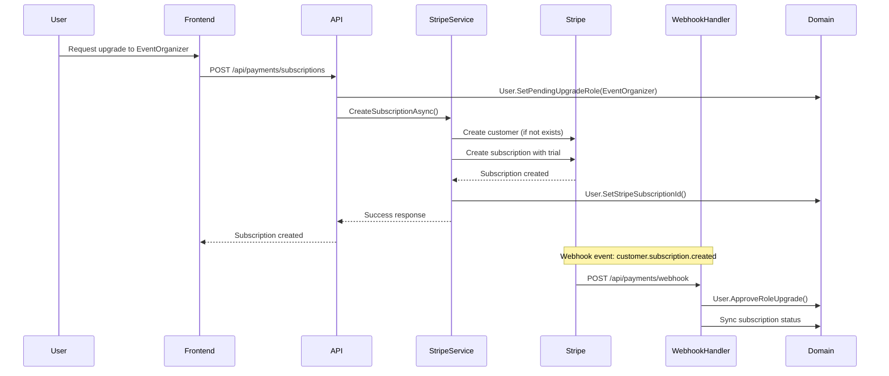

# Phase 6A.4: Stripe Payment Integration - Architectural Design Document

**Status**: Design Phase
**Priority**: High
**Blocked By**: Stripe API keys configuration
**Created**: 2025-11-23
**Architecture Pattern**: Clean Architecture with DDD
**Related**: Phase 6A.1 (Subscription System), Phase 6A.10 (Subscription Expiry Notifications)

---

## Table of Contents

1. [Executive Summary](#executive-summary)
2. [Architecture Decision Records](#architecture-decision-records)
3. [Database Schema Design](#database-schema-design)
4. [Service Layer Architecture](#service-layer-architecture)
5. [API Endpoint Specifications](#api-endpoint-specifications)
6. [Security Implementation](#security-implementation)
7. [Frontend Component Structure](#frontend-component-structure)
8. [Integration with Existing Subscription System](#integration-with-existing-subscription-system)
9. [Error Handling & Retry Strategy](#error-handling-retry-strategy)
10. [Testing Strategy](#testing-strategy)
11. [Deployment Considerations](#deployment-considerations)
12. [Implementation Roadmap](#implementation-roadmap)

---

## Executive Summary

### Business Context

LankaConnect requires a robust payment processing system to support the subscription-based pricing model:

- **Event Organizer**: $10/month (after 6-month free trial)
- **Business Owner**: $10/month (Phase 2 - after 6-month free trial)
- **Combined Role**: $15/month (Phase 2 - after 6-month free trial)

### Technical Scope

Phase 6A.4 implements Stripe integration to handle:
1. Subscription creation and management
2. Payment processing (recurring monthly charges)
3. Webhook event handling for subscription lifecycle
4. Secure API key management via Azure Key Vault
5. Payment method management
6. Invoice and payment history tracking
7. Subscription upgrades/downgrades/cancellations

### Key Constraints

1. **Clean Architecture**: All Stripe-specific code isolated in Infrastructure layer
2. **DDD Patterns**: Domain models remain payment-provider agnostic
3. **Security First**: No API keys in source code or appsettings.json
4. **Azure Deployment**: Integration with Azure Key Vault for production secrets
5. **Existing System**: Must integrate seamlessly with Phase 6A.1 subscription tracking

---

## Architecture Decision Records

### ADR-010: Stripe as Payment Provider

**Context**: Need a reliable, PCI-compliant payment processor with strong .NET SDK support.

**Decision**: Use Stripe as the primary payment provider.

**Rationale**:
- Industry-leading security and PCI compliance
- Excellent .NET SDK (Stripe.net)
- Webhook-based event system for reliable state synchronization
- Built-in subscription management
- Test mode for development
- Comprehensive documentation

**Consequences**:
- Positive: Reduced PCI compliance burden, reliable payment processing
- Negative: Vendor lock-in (mitigated by interface abstraction)

---

### ADR-011: Domain Model Independence

**Context**: Payment provider may change; domain logic must remain stable.

**Decision**: Keep domain models payment-provider agnostic; map to Stripe objects in infrastructure layer.

**Architecture**:
```
Domain Layer (Provider-Agnostic)
├── User entity with subscription fields
├── SubscriptionStatus enum (domain concept)
├── Domain events (UserRoleChangedEvent, etc.)
└── Business rules (subscription eligibility, etc.)

Infrastructure Layer (Stripe-Specific)
├── StripePaymentService (implements IStripePaymentService)
├── StripeWebhookHandler (existing)
├── Stripe entity mappings
└── Stripe SDK integration
```

**Rationale**:
- Domain model stability if payment provider changes
- Clear separation of concerns
- Testability without Stripe dependency

---

### ADR-012: Azure Key Vault for API Keys

**Context**: Stripe API keys are sensitive credentials requiring secure storage.

**Decision**: Store Stripe keys in Azure Key Vault for staging/production; use User Secrets for development.

**Implementation**:
```json
// Development (User Secrets)
{
  "Stripe": {
    "PublishableKey": "pk_test_...",
    "SecretKey": "sk_test_...",
    "WebhookSecret": "whsec_..."
  }
}

// Production (Azure Key Vault)
Secrets:
- Stripe--PublishableKey
- Stripe--SecretKey
- Stripe--WebhookSecret
```

**Rationale**:
- Follows Azure security best practices
- Automatic key rotation support
- Audit logging of secret access
- No secrets in source control

---

### ADR-013: Webhook Idempotency

**Context**: Stripe may send duplicate webhook events; must handle gracefully.

**Decision**: Implement idempotency using event ID tracking in database.

**Schema**:
```sql
CREATE TABLE stripe_webhook_events (
  id UUID PRIMARY KEY,
  event_id VARCHAR(255) UNIQUE NOT NULL,  -- Stripe's event ID
  event_type VARCHAR(100) NOT NULL,
  processed_at TIMESTAMP NOT NULL,
  payload JSONB NOT NULL,
  INDEX idx_event_id (event_id)
);
```

**Rationale**:
- Prevents duplicate processing
- Provides audit trail
- Enables replay for debugging

---

### ADR-014: Trial Period Handling

**Context**: Event Organizers get 6-month free trial; need to track trial status.

**Decision**: Use Stripe's built-in trial period feature with domain-level tracking.

**Implementation**:
- User entity tracks `TrialStartDate` and `TrialEndDate`
- Stripe subscription created with `trial_period_days = 180`
- Webhook events sync trial status to domain model

**Rationale**:
- Leverages Stripe's trial management
- Domain model maintains source of truth
- Consistent trial tracking across cancellation/reactivation

---

## Database Schema Design

### New Entities

#### 1. StripeCustomer (Many-to-One with User)

```sql
CREATE TABLE stripe_customers (
  id UUID PRIMARY KEY DEFAULT gen_random_uuid(),
  user_id UUID NOT NULL UNIQUE REFERENCES users(id) ON DELETE CASCADE,
  stripe_customer_id VARCHAR(255) NOT NULL UNIQUE,
  created_at TIMESTAMP NOT NULL DEFAULT NOW(),
  updated_at TIMESTAMP,

  INDEX idx_user_id (user_id),
  INDEX idx_stripe_customer_id (stripe_customer_id)
);
```

**Purpose**: Maps LankaConnect users to Stripe customer IDs.

---

#### 2. StripeSubscription (Many-to-One with User)

```sql
CREATE TABLE stripe_subscriptions (
  id UUID PRIMARY KEY DEFAULT gen_random_uuid(),
  user_id UUID NOT NULL REFERENCES users(id) ON DELETE CASCADE,
  stripe_subscription_id VARCHAR(255) NOT NULL UNIQUE,
  stripe_customer_id VARCHAR(255) NOT NULL,
  status VARCHAR(50) NOT NULL,  -- active, trialing, past_due, canceled, etc.
  current_period_start TIMESTAMP NOT NULL,
  current_period_end TIMESTAMP NOT NULL,
  trial_start TIMESTAMP,
  trial_end TIMESTAMP,
  canceled_at TIMESTAMP,
  ended_at TIMESTAMP,
  amount DECIMAL(10,2) NOT NULL,
  currency VARCHAR(3) NOT NULL DEFAULT 'USD',
  metadata JSONB,
  created_at TIMESTAMP NOT NULL DEFAULT NOW(),
  updated_at TIMESTAMP,

  INDEX idx_user_id (user_id),
  INDEX idx_stripe_subscription_id (stripe_subscription_id),
  INDEX idx_status (status),
  INDEX idx_current_period_end (current_period_end)
);
```

**Purpose**: Tracks Stripe subscription details synced from webhooks.

---

#### 3. StripePaymentMethod (Many-to-One with User)

```sql
CREATE TABLE stripe_payment_methods (
  id UUID PRIMARY KEY DEFAULT gen_random_uuid(),
  user_id UUID NOT NULL REFERENCES users(id) ON DELETE CASCADE,
  stripe_payment_method_id VARCHAR(255) NOT NULL UNIQUE,
  stripe_customer_id VARCHAR(255) NOT NULL,
  type VARCHAR(50) NOT NULL,  -- card, bank_account, etc.
  card_brand VARCHAR(50),  -- visa, mastercard, etc.
  card_last4 VARCHAR(4),
  card_exp_month INT,
  card_exp_year INT,
  is_default BOOLEAN NOT NULL DEFAULT false,
  created_at TIMESTAMP NOT NULL DEFAULT NOW(),
  updated_at TIMESTAMP,

  INDEX idx_user_id (user_id),
  INDEX idx_stripe_payment_method_id (stripe_payment_method_id),
  INDEX idx_is_default (is_default)
);
```

**Purpose**: Stores user payment methods for subscription billing.

---

#### 4. StripeInvoice (Many-to-One with User)

```sql
CREATE TABLE stripe_invoices (
  id UUID PRIMARY KEY DEFAULT gen_random_uuid(),
  user_id UUID NOT NULL REFERENCES users(id) ON DELETE CASCADE,
  stripe_invoice_id VARCHAR(255) NOT NULL UNIQUE,
  stripe_subscription_id VARCHAR(255),
  status VARCHAR(50) NOT NULL,  -- draft, open, paid, void, uncollectible
  amount_due DECIMAL(10,2) NOT NULL,
  amount_paid DECIMAL(10,2) NOT NULL DEFAULT 0,
  currency VARCHAR(3) NOT NULL DEFAULT 'USD',
  invoice_pdf_url TEXT,
  hosted_invoice_url TEXT,
  period_start TIMESTAMP NOT NULL,
  period_end TIMESTAMP NOT NULL,
  paid_at TIMESTAMP,
  created_at TIMESTAMP NOT NULL DEFAULT NOW(),
  updated_at TIMESTAMP,

  INDEX idx_user_id (user_id),
  INDEX idx_stripe_invoice_id (stripe_invoice_id),
  INDEX idx_stripe_subscription_id (stripe_subscription_id),
  INDEX idx_status (status),
  INDEX idx_period_end (period_end)
);
```

**Purpose**: Tracks invoice history for billing transparency.

---

#### 5. StripeWebhookEvent (Idempotency Tracking)

```sql
CREATE TABLE stripe_webhook_events (
  id UUID PRIMARY KEY DEFAULT gen_random_uuid(),
  event_id VARCHAR(255) NOT NULL UNIQUE,
  event_type VARCHAR(100) NOT NULL,
  api_version VARCHAR(50),
  processed_at TIMESTAMP NOT NULL DEFAULT NOW(),
  payload JSONB NOT NULL,
  processing_result VARCHAR(20) NOT NULL,  -- success, failure, skipped
  error_message TEXT,

  INDEX idx_event_id (event_id),
  INDEX idx_event_type (event_type),
  INDEX idx_processed_at (processed_at)
);
```

**Purpose**: Prevents duplicate webhook processing and provides audit trail.

---

### User Table Updates (Existing)

```sql
-- Add subscription tracking fields to users table
ALTER TABLE users ADD COLUMN IF NOT EXISTS trial_start_date TIMESTAMP;
ALTER TABLE users ADD COLUMN IF NOT EXISTS trial_end_date TIMESTAMP;
ALTER TABLE users ADD COLUMN IF NOT EXISTS subscription_status VARCHAR(50) DEFAULT 'none';

-- Index for subscription queries
CREATE INDEX IF NOT EXISTS idx_users_subscription_status ON users(subscription_status);
CREATE INDEX IF NOT EXISTS idx_users_trial_end_date ON users(trial_end_date);
```

**Note**: These fields may already exist from Phase 6A.1. Migration will check and add only if missing.

---

## Service Layer Architecture

### Interface Definitions

#### IStripePaymentService (Already Exists)

Location: `src/LankaConnect.Application/Common/Interfaces/IStripePaymentService.cs`

**Current Methods** (from analysis):
- `CreateSubscriptionAsync`
- `CreateEnterpriseSubscriptionAsync`
- `ChargeUsageAsync`
- `CreatePartnerPayoutAsync`
- `CancelSubscriptionAsync`
- `UpdateSubscriptionAsync`
- `ProcessWebhookAsync`

**New Methods Needed**:
```csharp
// Customer management
Task<Result<StripeCustomerResponse>> CreateCustomerAsync(CreateStripeCustomerRequest request, CancellationToken cancellationToken);
Task<Result<StripeCustomerResponse>> GetCustomerAsync(string stripeCustomerId, CancellationToken cancellationToken);

// Payment method management
Task<Result<PaymentMethodResponse>> AttachPaymentMethodAsync(AttachPaymentMethodRequest request, CancellationToken cancellationToken);
Task<Result> DetachPaymentMethodAsync(string paymentMethodId, CancellationToken cancellationToken);
Task<Result<List<PaymentMethodResponse>>> ListPaymentMethodsAsync(string customerId, CancellationToken cancellationToken);
Task<Result> SetDefaultPaymentMethodAsync(string customerId, string paymentMethodId, CancellationToken cancellationToken);

// Invoice management
Task<Result<InvoiceResponse>> GetUpcomingInvoiceAsync(string customerId, CancellationToken cancellationToken);
Task<Result<List<InvoiceResponse>>> ListInvoicesAsync(string customerId, CancellationToken cancellationToken);

// Subscription management (enhanced)
Task<Result<SubscriptionResponse>> GetSubscriptionAsync(string subscriptionId, CancellationToken cancellationToken);
Task<Result<SubscriptionResponse>> PauseSubscriptionAsync(string subscriptionId, CancellationToken cancellationToken);
Task<Result<SubscriptionResponse>> ResumeSubscriptionAsync(string subscriptionId, CancellationToken cancellationToken);
```

---

#### IStripeWebhookHandler (Already Exists)

Location: `src/LankaConnect.Application/Billing/StripeWebhookHandler.cs`

**Current Webhook Events Handled**:
- `customer.subscription.created`
- `customer.subscription.updated`
- `customer.subscription.deleted`
- `invoice.payment_succeeded`
- `invoice.payment_failed`
- `customer.subscription.trial_will_end`

**New Events to Handle**:
- `payment_method.attached`
- `payment_method.detached`
- `customer.updated`
- `invoice.created`
- `invoice.finalized`
- `payment_intent.succeeded`
- `payment_intent.payment_failed`

---

### StripePaymentService Implementation

Location: `src/LankaConnect.Infrastructure/Payments/StripePaymentService.cs`

```csharp
public class StripePaymentService : IStripePaymentService
{
    private readonly StripeOptions _options;
    private readonly IApplicationDbContext _context;
    private readonly ILogger<StripePaymentService> _logger;

    public StripePaymentService(
        IOptions<StripeOptions> options,
        IApplicationDbContext context,
        ILogger<StripePaymentService> logger)
    {
        _options = options.Value;
        _context = context;
        _logger = logger;

        // Set Stripe API key
        StripeConfiguration.ApiKey = _options.SecretKey;
    }

    // Implementation details...
}
```

**Key Responsibilities**:
1. Stripe API SDK calls
2. Entity mapping (Domain <-> Stripe)
3. Database persistence (StripeCustomer, StripeSubscription, etc.)
4. Error handling and logging
5. Idempotency key generation

---

### Configuration Class

Location: `src/LankaConnect.Infrastructure/Payments/Configuration/StripeOptions.cs`

```csharp
public class StripeOptions
{
    public const string SectionName = "Stripe";

    public string PublishableKey { get; set; } = string.Empty;
    public string SecretKey { get; set; } = string.Empty;
    public string WebhookSecret { get; set; } = string.Empty;

    // Price IDs for subscription plans (configured in Stripe Dashboard)
    public string EventOrganizerPriceId { get; set; } = string.Empty;
    public string BusinessOwnerPriceId { get; set; } = string.Empty;
    public string CombinedRolePriceId { get; set; } = string.Empty;

    // Trial configuration
    public int TrialPeriodDays { get; set; } = 180;  // 6 months

    // Retry configuration
    public int MaxRetryAttempts { get; set; } = 3;
    public int RetryDelayMilliseconds { get; set; } = 1000;

    // Webhook configuration
    public int WebhookToleranceSeconds { get; set; } = 300;  // 5 minutes
}
```

---

## API Endpoint Specifications

### PaymentsController

Location: `src/LankaConnect.API/Controllers/PaymentsController.cs`

```csharp
[ApiController]
[Route("api/[controller]")]
[Authorize]
public class PaymentsController : BaseController
{
    // 1. Create subscription for current user
    [HttpPost("subscriptions")]
    [Authorize(Roles = "GeneralUser")]
    public async Task<IActionResult> CreateSubscription(
        [FromBody] CreateSubscriptionRequest request)
    {
        // Request upgrade to EventOrganizer role
        // Creates Stripe customer if not exists
        // Creates Stripe subscription with trial period
        // Returns payment method setup intent for frontend
    }

    // 2. Get current user's subscription details
    [HttpGet("subscriptions/me")]
    public async Task<IActionResult> GetMySubscription()
    {
        // Returns subscription status, trial info, next billing date
    }

    // 3. Cancel subscription
    [HttpDelete("subscriptions/{subscriptionId}")]
    public async Task<IActionResult> CancelSubscription(string subscriptionId)
    {
        // Cancels at period end (user retains access until end of billing cycle)
    }

    // 4. Add payment method
    [HttpPost("payment-methods")]
    public async Task<IActionResult> AttachPaymentMethod(
        [FromBody] AttachPaymentMethodRequest request)
    {
        // Attaches payment method from Stripe Elements
    }

    // 5. List payment methods
    [HttpGet("payment-methods")]
    public async Task<IActionResult> ListPaymentMethods()
    {
        // Returns user's saved payment methods
    }

    // 6. Set default payment method
    [HttpPut("payment-methods/{paymentMethodId}/default")]
    public async Task<IActionResult> SetDefaultPaymentMethod(string paymentMethodId)
    {
        // Sets default payment method for subscriptions
    }

    // 7. Remove payment method
    [HttpDelete("payment-methods/{paymentMethodId}")]
    public async Task<IActionResult> DetachPaymentMethod(string paymentMethodId)
    {
        // Detaches payment method (must have another if subscription active)
    }

    // 8. Get upcoming invoice
    [HttpGet("invoices/upcoming")]
    public async Task<IActionResult> GetUpcomingInvoice()
    {
        // Preview of next invoice amount
    }

    // 9. List invoice history
    [HttpGet("invoices")]
    public async Task<IActionResult> ListInvoices(
        [FromQuery] int limit = 10,
        [FromQuery] string? startingAfter = null)
    {
        // Paginated invoice history
    }

    // 10. Get publishable key (for Stripe Elements)
    [HttpGet("config")]
    [AllowAnonymous]
    public IActionResult GetPublishableKey()
    {
        // Returns publishable key for frontend Stripe.js
    }

    // 11. Stripe webhook endpoint
    [HttpPost("webhook")]
    [AllowAnonymous]
    public async Task<IActionResult> StripeWebhook()
    {
        // Verifies signature and processes webhook events
    }
}
```

---

### Request/Response DTOs

Location: `src/LankaConnect.Application/Payments/DTOs/`

```csharp
// Create subscription request
public class CreateSubscriptionRequest
{
    public UserRole UpgradeToRole { get; init; }  // EventOrganizer, BusinessOwner, etc.
    public string? PaymentMethodId { get; init; }  // Optional: attach payment method immediately
    public string? PromoCode { get; init; }
}

// Subscription response
public class SubscriptionResponse
{
    public string SubscriptionId { get; init; }
    public string Status { get; init; }
    public decimal Amount { get; init; }
    public string Currency { get; init; }
    public DateTime? TrialStart { get; init; }
    public DateTime? TrialEnd { get; init; }
    public DateTime CurrentPeriodEnd { get; init; }
    public bool CancelAtPeriodEnd { get; init; }
    public PaymentMethodSummary? DefaultPaymentMethod { get; init; }
}

// Payment method response
public class PaymentMethodResponse
{
    public string PaymentMethodId { get; init; }
    public string Type { get; init; }
    public CardDetails? Card { get; init; }
    public bool IsDefault { get; init; }
}

public class CardDetails
{
    public string Brand { get; init; }
    public string Last4 { get; init; }
    public int ExpMonth { get; init; }
    public int ExpYear { get; init; }
}

// Invoice response
public class InvoiceResponse
{
    public string InvoiceId { get; init; }
    public string Status { get; init; }
    public decimal AmountDue { get; init; }
    public decimal AmountPaid { get; init; }
    public string Currency { get; init; }
    public DateTime PeriodStart { get; init; }
    public DateTime PeriodEnd { get; init; }
    public string? InvoicePdfUrl { get; init; }
    public string? HostedInvoiceUrl { get; init; }
    public DateTime? PaidAt { get; init; }
}
```

---

## Security Implementation

### 1. Azure Key Vault Integration

#### Development Environment (User Secrets)

```bash
# Initialize user secrets
cd src/LankaConnect.API
dotnet user-secrets init
dotnet user-secrets set "Stripe:PublishableKey" "pk_test_51SWmO9Lvfbr023L1IcikyK7oaCvUokb9RnQSrvsE5zSXI8tSmGZlnILQ6V4CL3ccG3Hf1H2iD9PWejASpYUwsN7G00PM5ZVZo8"
dotnet user-secrets set "Stripe:SecretKey" "sk_test_51SWmO9Lvfbr023L1geZLpjMfnSLfatsSBDw2Nkgpc7Gjdc8QdjQjVgI0VZr8vFcT98PuO79CirQWB2pPV2MJkhJP00Z9QF8ZiV"
dotnet user-secrets set "Stripe:WebhookSecret" "whsec_[generated-from-stripe-dashboard]"
```

#### Production/Staging (Azure Key Vault)

Location: `src/LankaConnect.API/Program.cs`

```csharp
// Add Azure Key Vault configuration
if (builder.Environment.IsProduction() || builder.Environment.IsStaging())
{
    var keyVaultUri = builder.Configuration["KeyVault:Uri"];
    if (!string.IsNullOrEmpty(keyVaultUri))
    {
        builder.Configuration.AddAzureKeyVault(
            new Uri(keyVaultUri),
            new DefaultAzureCredential());
    }
}
```

**Azure Key Vault Secrets**:
- `Stripe--PublishableKey` → Production publishable key
- `Stripe--SecretKey` → Production secret key
- `Stripe--WebhookSecret` → Production webhook signing secret
- `Stripe--EventOrganizerPriceId` → Stripe price ID for EventOrganizer plan
- `Stripe--BusinessOwnerPriceId` → Stripe price ID for BusinessOwner plan
- `Stripe--CombinedRolePriceId` → Stripe price ID for combined role plan

---

### 2. Webhook Signature Validation

Location: `src/LankaConnect.Infrastructure/Payments/StripePaymentService.cs`

```csharp
public async Task<Result> ProcessWebhookAsync(
    string payload,
    string signature,
    CancellationToken cancellationToken)
{
    try
    {
        // Verify webhook signature
        var stripeEvent = EventUtility.ConstructEvent(
            payload,
            signature,
            _options.WebhookSecret,
            throwOnApiVersionMismatch: false);

        // Check for duplicate processing
        var isDuplicate = await _context.StripeWebhookEvents
            .AnyAsync(e => e.EventId == stripeEvent.Id, cancellationToken);

        if (isDuplicate)
        {
            _logger.LogInformation("Webhook event {EventId} already processed", stripeEvent.Id);
            return Result.Success();
        }

        // Process event via handler
        var result = await _webhookHandler.HandleWebhookEventAsync(
            stripeEvent, cancellationToken);

        // Record event processing
        await RecordWebhookEventAsync(stripeEvent, result, cancellationToken);

        return result;
    }
    catch (StripeException ex)
    {
        _logger.LogError(ex, "Stripe webhook signature validation failed");
        return Result.Failure("Invalid webhook signature");
    }
}
```

---

### 3. PCI Compliance

**Key Principles**:
1. **Never store card details**: Use Stripe.js/Elements for client-side collection
2. **Use payment methods**: Store Stripe payment method IDs, not raw card data
3. **Webhook verification**: Always validate webhook signatures
4. **HTTPS only**: All payment endpoints require HTTPS
5. **Audit logging**: Track all payment operations

**Frontend Integration**:
```typescript
// Use Stripe Elements to collect payment details client-side
// Card data never touches LankaConnect servers
const stripe = await loadStripe(publishableKey);
const elements = stripe.elements();
const cardElement = elements.create('card');

// Create payment method client-side
const { paymentMethod, error } = await stripe.createPaymentMethod({
  type: 'card',
  card: cardElement,
});

// Send only payment method ID to backend
await fetch('/api/payments/payment-methods', {
  method: 'POST',
  body: JSON.stringify({ paymentMethodId: paymentMethod.id })
});
```

---

### 4. Authorization Rules

Location: `src/LankaConnect.API/Controllers/PaymentsController.cs`

```csharp
// User can only access their own payment data
private async Task<Result> ValidateUserOwnership(string resourceUserId)
{
    var currentUserId = GetCurrentUserId();
    if (currentUserId != resourceUserId)
    {
        return Result.Failure("Unauthorized access to payment data");
    }
    return Result.Success();
}

// Subscription creation requires GeneralUser role
[Authorize(Roles = "GeneralUser")]
public async Task<IActionResult> CreateSubscription(...)

// Payment management requires authenticated user
[Authorize]
public async Task<IActionResult> ListPaymentMethods(...)

// Webhook endpoint is public but verified via signature
[AllowAnonymous]
public async Task<IActionResult> StripeWebhook(...)
```

---

## Frontend Component Structure

### React/Next.js Components

Location: `web/src/components/payments/`

#### 1. SubscriptionUpgradeFlow.tsx

```typescript
/**
 * Multi-step upgrade flow for Event Organizer subscription
 * Steps:
 * 1. Role selection (EventOrganizer)
 * 2. Payment method collection (Stripe Elements)
 * 3. Review subscription details
 * 4. Confirmation
 */
export function SubscriptionUpgradeFlow() {
  const [currentStep, setCurrentStep] = useState(1);
  const [selectedRole, setSelectedRole] = useState<UserRole | null>(null);
  const [paymentMethodId, setPaymentMethodId] = useState<string | null>(null);

  // Step 1: Role selection
  // Step 2: Payment method via <PaymentMethodForm />
  // Step 3: Review subscription (show trial period, price after trial)
  // Step 4: Submit and redirect to dashboard
}
```

---

#### 2. PaymentMethodForm.tsx

```typescript
/**
 * Stripe Elements integration for secure card collection
 * Uses @stripe/react-stripe-js
 */
export function PaymentMethodForm({ onSuccess }: PaymentMethodFormProps) {
  const stripe = useStripe();
  const elements = useElements();

  const handleSubmit = async (e: FormEvent) => {
    e.preventDefault();

    // Create payment method via Stripe.js (client-side)
    const { paymentMethod, error } = await stripe!.createPaymentMethod({
      type: 'card',
      card: elements!.getElement(CardElement)!,
    });

    if (error) {
      // Handle error
      return;
    }

    // Send payment method ID to backend
    const response = await fetch('/api/payments/payment-methods', {
      method: 'POST',
      headers: { 'Content-Type': 'application/json' },
      body: JSON.stringify({ paymentMethodId: paymentMethod.id }),
    });

    if (response.ok) {
      onSuccess(paymentMethod.id);
    }
  };

  return (
    <form onSubmit={handleSubmit}>
      <CardElement options={CARD_ELEMENT_OPTIONS} />
      <button type="submit" disabled={!stripe}>
        Add Payment Method
      </button>
    </form>
  );
}
```

---

#### 3. SubscriptionManagement.tsx

```typescript
/**
 * Dashboard component for subscription management
 * Features:
 * - View current subscription status
 * - Trial countdown
 * - Payment method management
 * - Cancel subscription
 * - View invoice history
 */
export function SubscriptionManagement() {
  const { data: subscription } = useQuery('subscription', fetchSubscription);
  const { data: paymentMethods } = useQuery('paymentMethods', fetchPaymentMethods);

  return (
    <div>
      <SubscriptionCard subscription={subscription} />
      <PaymentMethodsList methods={paymentMethods} />
      <InvoiceHistory userId={currentUserId} />
    </div>
  );
}
```

---

#### 4. InvoiceHistory.tsx

```typescript
/**
 * Invoice history table with download links
 */
export function InvoiceHistory({ userId }: InvoiceHistoryProps) {
  const { data: invoices } = useQuery(['invoices', userId], fetchInvoices);

  return (
    <Table>
      <thead>
        <tr>
          <th>Invoice Date</th>
          <th>Amount</th>
          <th>Status</th>
          <th>Actions</th>
        </tr>
      </thead>
      <tbody>
        {invoices?.map(invoice => (
          <tr key={invoice.invoiceId}>
            <td>{formatDate(invoice.periodEnd)}</td>
            <td>{formatCurrency(invoice.amountPaid)}</td>
            <td><Badge status={invoice.status} /></td>
            <td>
              <a href={invoice.invoicePdfUrl} target="_blank">
                Download PDF
              </a>
            </td>
          </tr>
        ))}
      </tbody>
    </Table>
  );
}
```

---

### Integration with Dashboard

Location: `web/src/app/(dashboard)/dashboard/page.tsx`

```typescript
// Add subscription status card to dashboard
export default function DashboardPage() {
  const { user } = useAuth();

  return (
    <div className="dashboard-grid">
      {/* Existing dashboard cards */}

      {/* New subscription status card */}
      {user.role !== 'GeneralUser' && (
        <SubscriptionStatusCard />
      )}

      {/* Show upgrade CTA for GeneralUser */}
      {user.role === 'GeneralUser' && (
        <UpgradeCallToAction />
      )}
    </div>
  );
}
```

---

## Integration with Existing Subscription System

### Phase 6A.1 Review

**Existing Infrastructure** (from Phase 6A.1):
- User entity has subscription-related fields
- SubscriptionStatus enum (None, Trialing, Active, PastDue, Canceled, Expired)
- SubscriptionTier enum (Free, Basic, Standard, Premium, etc.)
- Domain events for subscription changes

**Integration Points**:

#### 1. User Entity Updates

Location: `src/LankaConnect.Domain/Users/User.cs`

**New Fields Needed**:
```csharp
// Stripe-specific tracking (nullable - only for paid users)
public string? StripeCustomerId { get; private set; }
public string? StripeSubscriptionId { get; private set; }

// Methods
public Result SetStripeCustomerId(string stripeCustomerId)
{
    if (string.IsNullOrWhiteSpace(stripeCustomerId))
        return Result.Failure("Stripe customer ID is required");

    StripeCustomerId = stripeCustomerId;
    MarkAsUpdated();
    return Result.Success();
}

public Result SetStripeSubscriptionId(string stripeSubscriptionId)
{
    if (string.IsNullOrWhiteSpace(stripeSubscriptionId))
        return Result.Failure("Stripe subscription ID is required");

    StripeSubscriptionId = stripeSubscriptionId;
    MarkAsUpdated();
    return Result.Success();
}
```

---

#### 2. Subscription Lifecycle Flow



---

#### 3. Webhook Event Mapping

| Stripe Event | Domain Action | User Field Updated |
|--------------|---------------|-------------------|
| `customer.subscription.created` | `ApproveRoleUpgrade()` | `Role`, `SubscriptionStatus = Trialing` |
| `customer.subscription.updated` | Sync subscription dates | `TrialEndDate`, `SubscriptionStatus` |
| `customer.subscription.trial_will_end` | Send notification | None (handled by Phase 6A.10) |
| `invoice.payment_succeeded` | Confirm active status | `SubscriptionStatus = Active` |
| `invoice.payment_failed` | Update to past due | `SubscriptionStatus = PastDue` |
| `customer.subscription.deleted` | Downgrade role | `Role = GeneralUser`, `SubscriptionStatus = Canceled` |

---

#### 4. Trial Period Management

```csharp
// In StripePaymentService.CreateSubscriptionAsync()
public async Task<Result<SubscriptionResponse>> CreateSubscriptionAsync(
    CreateSubscriptionRequest request,
    CancellationToken cancellationToken)
{
    // Get user
    var user = await _context.Users.FindAsync(request.UserId);

    // Create Stripe customer if not exists
    if (string.IsNullOrEmpty(user.StripeCustomerId))
    {
        var customerResult = await CreateStripeCustomerAsync(user);
        if (!customerResult.IsSuccess)
            return Result<SubscriptionResponse>.Failure(customerResult.Error);

        user.SetStripeCustomerId(customerResult.Value.Id);
    }

    // Determine price ID based on role
    var priceId = request.UpgradeToRole switch
    {
        UserRole.EventOrganizer => _options.EventOrganizerPriceId,
        UserRole.BusinessOwner => _options.BusinessOwnerPriceId,
        UserRole.EventOrganizerAndBusinessOwner => _options.CombinedRolePriceId,
        _ => throw new InvalidOperationException("Invalid upgrade role")
    };

    // Create subscription with trial
    var subscriptionOptions = new SubscriptionCreateOptions
    {
        Customer = user.StripeCustomerId,
        Items = new List<SubscriptionItemOptions>
        {
            new() { Price = priceId }
        },
        TrialPeriodDays = _options.TrialPeriodDays,  // 180 days
        PaymentBehavior = "default_incomplete",
        PaymentSettings = new SubscriptionPaymentSettingsOptions
        {
            SaveDefaultPaymentMethod = "on_subscription"
        },
        Metadata = new Dictionary<string, string>
        {
            { "user_id", user.Id.ToString() },
            { "upgrade_to_role", request.UpgradeToRole.ToString() }
        }
    };

    var subscriptionService = new SubscriptionService();
    var subscription = await subscriptionService.CreateAsync(subscriptionOptions, cancellationToken: cancellationToken);

    // Set trial dates in domain model
    user.SetTrialPeriod(
        subscription.TrialStart.Value,
        subscription.TrialEnd.Value);

    await _context.SaveChangesAsync(cancellationToken);

    return Result<SubscriptionResponse>.Success(MapToResponse(subscription));
}
```

---

## Error Handling & Retry Strategy

### 1. Stripe API Error Classification

```csharp
public enum StripeErrorType
{
    // Retriable errors
    ApiConnectionError,      // Network issues
    ApiError,                // Stripe server error
    RateLimitError,          // Too many requests

    // Non-retriable errors
    CardError,               // Card declined, insufficient funds
    InvalidRequestError,     // Invalid parameters
    AuthenticationError,     // Invalid API key
    PermissionError          // Unauthorized operation
}
```

---

### 2. Retry Policy with Polly

Location: `src/LankaConnect.Infrastructure/DependencyInjection.cs`

```csharp
services.AddHttpClient<StripePaymentService>()
    .AddPolicyHandler((services, request) =>
        HttpPolicyExtensions
            .HandleTransientHttpError()
            .OrResult(msg => msg.StatusCode == System.Net.HttpStatusCode.TooManyRequests)
            .WaitAndRetryAsync(
                retryCount: 3,
                sleepDurationProvider: retryAttempt => TimeSpan.FromSeconds(Math.Pow(2, retryAttempt)),
                onRetry: (outcome, timespan, retryAttempt, context) =>
                {
                    var logger = services.GetRequiredService<ILogger<StripePaymentService>>();
                    logger.LogWarning(
                        "Stripe API retry attempt {RetryAttempt} after {Delay}ms. Reason: {Reason}",
                        retryAttempt,
                        timespan.TotalMilliseconds,
                        outcome.Exception?.Message ?? outcome.Result?.ReasonPhrase);
                }));
```

---

### 3. Webhook Retry Handling

**Stripe's Retry Behavior**:
- Stripe retries failed webhooks for up to 3 days
- Exponential backoff: 1 hour, 6 hours, 12 hours, 24 hours, etc.

**LankaConnect Response Strategy**:
```csharp
[HttpPost("webhook")]
[AllowAnonymous]
public async Task<IActionResult> StripeWebhook()
{
    try
    {
        var json = await new StreamReader(HttpContext.Request.Body).ReadToEndAsync();
        var signature = Request.Headers["Stripe-Signature"];

        var result = await _stripePaymentService.ProcessWebhookAsync(json, signature);

        if (result.IsSuccess)
            return Ok();  // 200 - Stripe stops retrying

        // Log error but return 200 for known issues (e.g., duplicate)
        if (result.Error.Contains("duplicate"))
            return Ok();

        // Return 500 for retriable errors - Stripe will retry
        _logger.LogError("Webhook processing failed: {Error}", result.Error);
        return StatusCode(500);
    }
    catch (Exception ex)
    {
        _logger.LogError(ex, "Webhook processing exception");
        return StatusCode(500);  // Trigger Stripe retry
    }
}
```

---

### 4. Idempotency Key Usage

```csharp
// For payment operations that could be retried by user
public async Task<Result> ChargeAsync(ChargeRequest request)
{
    var idempotencyKey = request.IdempotencyKey ?? Guid.NewGuid().ToString();

    var requestOptions = new RequestOptions
    {
        IdempotencyKey = idempotencyKey
    };

    var chargeService = new ChargeService();
    var charge = await chargeService.CreateAsync(chargeOptions, requestOptions);

    // If this is a retry with same idempotency key, Stripe returns the original charge
}
```

---

## Testing Strategy

### 1. Unit Tests

Location: `tests/LankaConnect.Infrastructure.Tests/Payments/`

```csharp
public class StripePaymentServiceTests
{
    [Fact]
    public async Task CreateSubscription_WithValidUser_CreatesStripeSubscription()
    {
        // Arrange
        var mockContext = new Mock<IApplicationDbContext>();
        var options = Options.Create(new StripeOptions
        {
            SecretKey = "sk_test_...",
            EventOrganizerPriceId = "price_test_..."
        });
        var service = new StripePaymentService(options, mockContext.Object, Mock.Of<ILogger<StripePaymentService>>());

        // Act
        var result = await service.CreateSubscriptionAsync(new CreateSubscriptionRequest
        {
            UserId = UserId.New(),
            UpgradeToRole = UserRole.EventOrganizer
        });

        // Assert
        result.IsSuccess.Should().BeTrue();
        result.Value.TrialEnd.Should().BeCloseTo(DateTime.UtcNow.AddDays(180), TimeSpan.FromHours(1));
    }

    [Fact]
    public async Task ProcessWebhook_WithDuplicateEvent_ReturnsSuccessWithoutProcessing()
    {
        // Test idempotency
    }

    [Fact]
    public async Task ProcessWebhook_WithInvalidSignature_ReturnsFailure()
    {
        // Test signature validation
    }
}
```

---

### 2. Integration Tests

Location: `tests/LankaConnect.IntegrationTests/Payments/`

```csharp
public class StripeWebhookIntegrationTests : IClassFixture<WebApplicationFactory<Program>>
{
    [Fact]
    public async Task SubscriptionCreatedWebhook_UpdatesUserRole()
    {
        // Arrange
        var client = _factory.CreateClient();
        var webhookPayload = CreateStripeWebhookPayload("customer.subscription.created");
        var signature = GenerateStripeSignature(webhookPayload);

        // Act
        var response = await client.PostAsync("/api/payments/webhook",
            new StringContent(webhookPayload, Encoding.UTF8, "application/json")
            {
                Headers = { { "Stripe-Signature", signature } }
            });

        // Assert
        response.StatusCode.Should().Be(HttpStatusCode.OK);

        // Verify user role updated
        var user = await _context.Users.FirstAsync(u => u.Email.Value == "test@example.com");
        user.Role.Should().Be(UserRole.EventOrganizer);
        user.SubscriptionStatus.Should().Be(SubscriptionStatus.Trialing);
    }
}
```

---

### 3. Stripe Test Cards

**Development Testing**:
```
Success: 4242 4242 4242 4242 (Visa)
Decline: 4000 0000 0000 0002 (Generic decline)
Insufficient funds: 4000 0000 0000 9995
3D Secure: 4000 0025 0000 3155 (Requires authentication)
```

**Test Mode Webhooks**:
- Use Stripe CLI for local webhook testing:
  ```bash
  stripe listen --forward-to localhost:5000/api/payments/webhook
  stripe trigger customer.subscription.created
  ```

---

### 4. End-to-End Tests

Location: `tests/LankaConnect.E2ETests/Payments/`

```typescript
// Using Playwright/Cypress
describe('Subscription Upgrade Flow', () => {
  it('should allow GeneralUser to upgrade to EventOrganizer with trial', async () => {
    // 1. Login as GeneralUser
    await loginAs('generaluser@example.com');

    // 2. Navigate to upgrade page
    await page.goto('/dashboard/upgrade');

    // 3. Select EventOrganizer role
    await page.click('[data-testid="role-event-organizer"]');

    // 4. Enter test card details (Stripe Elements)
    await fillStripeCard('4242424242424242', '12/25', '123');

    // 5. Submit upgrade
    await page.click('[data-testid="submit-upgrade"]');

    // 6. Verify success
    await expect(page.locator('[data-testid="subscription-status"]'))
      .toHaveText('Free Trial');

    // 7. Verify role changed
    const userRole = await page.locator('[data-testid="user-role"]').textContent();
    expect(userRole).toBe('Event Organizer');
  });
});
```

---

## Deployment Considerations

### 1. Azure Key Vault Setup

**Prerequisites**:
- Azure Key Vault created: `lankaconnect-keyvault-prod`
- Managed Identity enabled for App Service
- Key Vault access policy configured

**Setup Steps**:
```bash
# Create Key Vault (if not exists)
az keyvault create \
  --name lankaconnect-keyvault-prod \
  --resource-group lankaconnect-rg \
  --location eastus

# Enable system-assigned managed identity for App Service
az webapp identity assign \
  --name lankaconnect-api-prod \
  --resource-group lankaconnect-rg

# Grant App Service access to Key Vault
az keyvault set-policy \
  --name lankaconnect-keyvault-prod \
  --object-id <app-service-managed-identity-id> \
  --secret-permissions get list

# Add Stripe secrets
az keyvault secret set \
  --vault-name lankaconnect-keyvault-prod \
  --name "Stripe--PublishableKey" \
  --value "pk_live_..."

az keyvault secret set \
  --vault-name lankaconnect-keyvault-prod \
  --name "Stripe--SecretKey" \
  --value "sk_live_..."

az keyvault secret set \
  --vault-name lankaconnect-keyvault-prod \
  --name "Stripe--WebhookSecret" \
  --value "whsec_..."
```

---

### 2. Stripe Webhook Configuration

**Production Setup**:
1. Go to Stripe Dashboard > Developers > Webhooks
2. Add endpoint: `https://lankaconnect-api-prod.azurewebsites.net/api/payments/webhook`
3. Select events:
   - `customer.subscription.created`
   - `customer.subscription.updated`
   - `customer.subscription.deleted`
   - `invoice.payment_succeeded`
   - `invoice.payment_failed`
   - `customer.subscription.trial_will_end`
   - `payment_method.attached`
   - `payment_method.detached`
4. Copy webhook signing secret to Key Vault

**Staging Setup**:
- Separate webhook endpoint: `https://lankaconnect-api-staging.azurewebsites.net/api/payments/webhook`
- Use test mode API keys
- Same event selection

---

### 3. Database Migrations

```bash
# Create migration for Stripe entities
cd src/LankaConnect.Infrastructure
dotnet ef migrations add AddStripePaymentEntities --context AppDbContext

# Review generated migration
# Apply to staging
dotnet ef database update --context AppDbContext --connection "<staging-connection-string>"

# Apply to production (via Azure DevOps pipeline)
```

**Migration Checklist**:
- [ ] Backup production database before migration
- [ ] Test migration on staging first
- [ ] Verify indexes created correctly
- [ ] Check foreign key constraints
- [ ] Validate data types and constraints

---

### 4. Configuration Management

**appsettings.Production.json**:
```json
{
  "Stripe": {
    "PublishableKey": "",  // Loaded from Key Vault
    "SecretKey": "",       // Loaded from Key Vault
    "WebhookSecret": "",   // Loaded from Key Vault
    "EventOrganizerPriceId": "price_1ABCDEF123456789",  // From Stripe Dashboard
    "BusinessOwnerPriceId": "price_1GHIJKL987654321",
    "CombinedRolePriceId": "price_1MNOPQR135792468",
    "TrialPeriodDays": 180,
    "MaxRetryAttempts": 3,
    "RetryDelayMilliseconds": 1000,
    "WebhookToleranceSeconds": 300
  },
  "KeyVault": {
    "Uri": "https://lankaconnect-keyvault-prod.vault.azure.net/"
  }
}
```

---

### 5. Monitoring & Alerts

**Application Insights Metrics**:
- Subscription creation rate
- Payment success/failure rate
- Webhook processing latency
- Webhook failure rate
- Trial conversion rate

**Alert Rules**:
```yaml
- name: High Payment Failure Rate
  condition: payment_failures > 5 in 5 minutes
  action: Send email to dev team

- name: Webhook Processing Delay
  condition: webhook_latency > 10 seconds
  action: Send SMS to on-call engineer

- name: Stripe API Error Rate
  condition: stripe_api_errors > 10 in 1 minute
  action: Create incident in PagerDuty
```

---

## Implementation Roadmap

### Phase 1: Foundation (Week 1)

**Tasks**:
1. ✅ Review existing Stripe interfaces and webhook handler
2. ✅ Design database schema (this document)
3. Create EF Core migration for Stripe entities
4. Implement StripeOptions configuration class
5. Set up Azure Key Vault integration (dev/staging/prod)
6. Configure User Secrets for development

**Deliverables**:
- Database schema deployed to staging
- Configuration infrastructure ready
- API keys securely stored

---

### Phase 2: Core Service Implementation (Week 2)

**Tasks**:
1. Implement StripePaymentService (IStripePaymentService)
   - CreateCustomerAsync
   - CreateSubscriptionAsync
   - AttachPaymentMethodAsync
   - CancelSubscriptionAsync
2. Enhance StripeWebhookHandler
   - Add new webhook events
   - Implement idempotency tracking
   - Add domain event publishing
3. Create repository implementations
   - StripeCustomerRepository
   - StripeSubscriptionRepository
4. Unit tests for service layer (90% coverage)

**Deliverables**:
- StripePaymentService fully implemented
- Webhook handler enhanced
- Unit test suite passing

---

### Phase 3: API Layer (Week 3)

**Tasks**:
1. Create PaymentsController
   - All 11 endpoints (see API Endpoint Specifications)
   - Authorization policies
   - Request/response DTOs
2. Create Application layer commands/queries
   - CreateSubscriptionCommand
   - AttachPaymentMethodCommand
   - ListInvoicesQuery
3. Integration tests for API endpoints
4. Postman collection for manual testing

**Deliverables**:
- PaymentsController complete
- Integration tests passing
- API documentation updated

---

### Phase 4: Frontend Integration (Week 4)

**Tasks**:
1. Install Stripe.js and @stripe/react-stripe-js
2. Create React components
   - SubscriptionUpgradeFlow
   - PaymentMethodForm (Stripe Elements)
   - SubscriptionManagement
   - InvoiceHistory
3. Update Dashboard with subscription status
4. Add upgrade CTA for GeneralUser
5. E2E tests with Playwright

**Deliverables**:
- Frontend components complete
- Dashboard integration done
- E2E test suite passing

---

### Phase 5: Testing & QA (Week 5)

**Tasks**:
1. Full subscription lifecycle testing
   - Create subscription with trial
   - Trial expiry handling
   - Payment success/failure scenarios
   - Subscription cancellation
   - Reactivation flow
2. Webhook testing with Stripe CLI
3. Load testing payment endpoints
4. Security audit
5. Accessibility testing (WCAG 2.1 AA)

**Deliverables**:
- All test scenarios passing
- Security audit report
- Performance benchmarks

---

### Phase 6: Staging Deployment (Week 6)

**Tasks**:
1. Deploy to staging environment
2. Configure staging Stripe webhook
3. End-to-end smoke tests on staging
4. User acceptance testing (UAT)
5. Update documentation

**Deliverables**:
- Staging deployment successful
- UAT sign-off
- Documentation complete

---

### Phase 7: Production Deployment (Week 7)

**Tasks**:
1. Production database migration
2. Configure production Stripe webhook
3. Deploy to production
4. Monitoring and alerts setup
5. Post-deployment verification
6. Update PHASE_6A_MASTER_INDEX.md

**Deliverables**:
- Production deployment successful
- Monitoring active
- Phase 6A.4 marked as complete

---

## Success Criteria

### Functional Requirements

- [ ] Event Organizers can subscribe with 6-month free trial
- [ ] Payment method collection via Stripe Elements (PCI compliant)
- [ ] Subscription automatically starts billing after trial ends
- [ ] Users can manage payment methods (add, remove, set default)
- [ ] Users can view invoice history and download PDFs
- [ ] Users can cancel subscriptions (access retained until period end)
- [ ] Webhooks sync subscription status to domain model
- [ ] Role changes trigger upon subscription activation

---

### Non-Functional Requirements

- [ ] 99.9% uptime for payment processing
- [ ] Payment endpoint response time < 2 seconds (p95)
- [ ] Webhook processing latency < 5 seconds (p95)
- [ ] Zero payment data stored in LankaConnect database (PCI compliance)
- [ ] All Stripe API keys stored in Azure Key Vault
- [ ] 90%+ test coverage on payment logic
- [ ] HTTPS enforced on all payment endpoints
- [ ] Webhook signature validation 100% enforced

---

## Risk Mitigation

| Risk | Likelihood | Impact | Mitigation |
|------|------------|--------|------------|
| Stripe API key exposure | Low | Critical | Azure Key Vault, no secrets in code |
| Webhook processing failure | Medium | High | Idempotency tracking, retry logic |
| Payment method decline | High | Medium | Clear error messages, retry guidance |
| Trial period miscalculation | Low | High | Comprehensive unit tests, staging validation |
| Database migration failure | Low | Critical | Backup before migration, rollback plan |
| Webhook signature bypass | Low | Critical | Enforce signature validation, no exceptions |

---

## Appendices

### A. Stripe Test Mode Checklist

- [ ] Use test API keys (pk_test_*, sk_test_*)
- [ ] Configure test webhook endpoint
- [ ] Use Stripe CLI for local webhook testing
- [ ] Test with Stripe test cards (4242 4242 4242 4242)
- [ ] Verify test mode indicator in Stripe Dashboard

---

### B. Production Readiness Checklist

- [ ] Production API keys in Azure Key Vault
- [ ] Production webhook configured in Stripe Dashboard
- [ ] Database migration applied to production
- [ ] Monitoring and alerts configured
- [ ] Incident response plan documented
- [ ] Rollback plan documented
- [ ] Support team trained on payment issues

---

### C. Compliance Checklist

- [ ] PCI DSS: No card data stored in LankaConnect database
- [ ] GDPR: Payment data retention policy defined
- [ ] Security: All payment endpoints use HTTPS
- [ ] Audit: All payment operations logged
- [ ] Accessibility: Payment forms WCAG 2.1 AA compliant

---

## References

- [Stripe API Documentation](https://stripe.com/docs/api)
- [Stripe .NET SDK](https://github.com/stripe/stripe-dotnet)
- [Stripe Elements](https://stripe.com/docs/stripe-js)
- [Stripe Webhooks Guide](https://stripe.com/docs/webhooks)
- [Azure Key Vault Documentation](https://docs.microsoft.com/en-us/azure/key-vault/)
- [Clean Architecture Principles](https://blog.cleancoder.com/uncle-bob/2012/08/13/the-clean-architecture.html)

---

## Document History

| Version | Date | Author | Changes |
|---------|------|--------|---------|
| 1.0 | 2025-11-23 | System Architect | Initial architecture design document |

---

**Next Steps**: Review this architecture document with the development team, get approval, and proceed with Phase 1 implementation (Foundation).
