# Complete Production Deployment Guide: Frontend + Backend + Custom Domain

**Date:** 2026-01-08
**Budget:** $150-180/month (cost-optimized for <200 users)
**Custom Domain:** lankaconnect.app (coming soon)

---

## Table of Contents

1. [Overview](#1-overview)
2. [Database Setup](#2-database-setup-new-production-database)
3. [Infrastructure Setup](#3-infrastructure-setup)
4. [Custom Domain Configuration](#4-custom-domain-configuration-lankaconnectapp)
5. [Configuration Changes](#5-configuration-changes-for-production)
6. [GitHub Secrets Setup](#6-github-secrets-setup)
7. [Deployment Process](#7-deployment-process-staging-to-production)
8. [Blue-Green Deployment](#8-blue-green-deployment-both-ui-and-backend)
9. [Rollback Procedures](#9-rollback-procedures)
10. [Post-Deployment Checklist](#10-post-deployment-checklist)

---

## 1. Overview

### What You'll Deploy

```
Production Environment (2 Container Apps + Database):
├── Backend API (lankaconnect-api-prod)
│   ├── URL (temp): https://lankaconnect-api-prod.eastus.azurecontainerapps.io
│   └── URL (custom): https://api.lankaconnect.app
│
├── Frontend UI (lankaconnect-ui-prod)
│   ├── URL (temp): https://lankaconnect-ui-prod.eastus.azurecontainerapps.io
│   └── URL (custom): https://lankaconnect.app
│
└── Azure SQL Database (Serverless)
    ├── Name: lankaconnect-db (production)
    ├── Data: Empty with reference data only
    └── Auto-pause: After 60 minutes inactivity
```

### Cost Breakdown

| Component | Configuration | Monthly Cost |
|-----------|--------------|--------------|
| Backend API | 0.25 vCPU, 1 replica | $15-20 |
| Frontend UI | 0.25 vCPU, 1 replica | $15-20 |
| Azure SQL Serverless | 0.5-1 vCore, auto-pause | $50-60 |
| Storage Account | Standard LRS, 100 GB | $15-20 |
| Key Vault | Standard tier | $5 |
| Application Insights | 30-day retention | $20-30 |
| Container Registry | Basic tier | $5 |
| Custom Domain SSL | Free (Azure-managed) | $0 |
| Bandwidth | ~100 GB egress | $20-30 |
| **TOTAL** | | **$150-180/month** ✅ |

---

## 2. Database Setup (New Production Database)

### Q: Do we need a separate production database?

**YES!** ✅ You MUST create a new, separate production database.

**Why?**
- Staging has test data (fake users, test events, test payments)
- Production needs EMPTY database (except reference data)
- Different backup strategies (7-day vs 30-day retention)
- Different access controls and security policies
- Stripe test vs live keys require separate data

### Production Database Creation

```bash
# ===================================================================
# STEP 1: Create Production SQL Server (if not exists)
# ===================================================================
az sql server create \
  --name lankaconnect-prod-sql \
  --resource-group lankaconnect-prod \
  --location eastus2 \
  --admin-user sqladmin \
  --admin-password "<SECURE_PASSWORD>"

# ===================================================================
# STEP 2: Create Serverless Production Database
# ===================================================================
az sql db create \
  --resource-group lankaconnect-prod \
  --server lankaconnect-prod-sql \
  --name lankaconnect-db \
  --edition GeneralPurpose \
  --compute-model Serverless \
  --family Gen5 \
  --capacity 1 \
  --min-capacity 0.5 \
  --auto-pause-delay 60 \
  --backup-storage-redundancy Local

# ===================================================================
# STEP 3: Configure Firewall Rules
# ===================================================================
# Allow Azure services
az sql server firewall-rule create \
  --resource-group lankaconnect-prod \
  --server lankaconnect-prod-sql \
  --name AllowAzureServices \
  --start-ip-address 0.0.0.0 \
  --end-ip-address 0.0.0.0

# (Optional) Allow your IP for manual access
az sql server firewall-rule create \
  --resource-group lankaconnect-prod \
  --server lankaconnect-prod-sql \
  --name AllowMyIP \
  --start-ip-address <YOUR_IP> \
  --end-ip-address <YOUR_IP>

# ===================================================================
# STEP 4: Get Connection String
# ===================================================================
CONNECTION_STRING="Server=tcp:lankaconnect-prod-sql.database.windows.net,1433;Initial Catalog=lankaconnect-db;User ID=sqladmin;Password=<PASSWORD>;Encrypt=True;TrustServerCertificate=False;Connection Timeout=30;"

echo $CONNECTION_STRING
```

### Database Migration Strategy

**Option 1: EF Core Migrations (Recommended)**
```bash
# Run from GitHub Actions during first deployment
# .github/workflows/deploy-production.yml already includes this step

# Manual approach (if needed):
cd src/LankaConnect.API

dotnet ef database update \
  --connection "$CONNECTION_STRING" \
  --project ../LankaConnect.Infrastructure/LankaConnect.Infrastructure.csproj \
  --context AppDbContext
```

**Option 2: Manual SQL Script (With Reference Data)**
```bash
# If you have a script with reference data (countries, metro areas, etc.)
# Example: scripts/production-seed-data.sql

# Run via Azure Portal Query Editor or SQL Management Studio
sqlcmd -S lankaconnect-prod-sql.database.windows.net \
  -d lankaconnect-db \
  -U sqladmin \
  -P <PASSWORD> \
  -i scripts/production-seed-data.sql
```

### What Data to Include?

**✅ Include (Reference Data Only):**
- Countries table
- Metro Areas table
- Event Categories
- System configuration defaults
- Admin user account (your account only)

**❌ Do NOT Include:**
- Test user accounts
- Test events
- Test payments/transactions
- Staging-specific data

---

## 3. Infrastructure Setup

### Run the Cost-Optimized Setup Script

```bash
# ===================================================================
# Run the automated infrastructure setup
# ===================================================================
cd scripts
bash setup-production-infrastructure-cost-optimized.sh

# This creates:
# - Resource group: lankaconnect-prod
# - Container Apps environment
# - Azure SQL Serverless database
# - Storage account (Standard LRS)
# - Key Vault (Standard tier)
# - Container Registry (Basic tier)
# - Application Insights (30-day retention)
# - Budget alert ($200/month threshold)
```

**Duration:** 2-3 hours
**User Input Required:**
- SQL admin password (secure, 8+ chars)
- Confirmation prompts

---

## 4. Custom Domain Configuration (lankaconnect.app)

### Domain Records to Configure

Once your `lankaconnect.app` domain is ready, configure these DNS records:

#### A. Backend API: api.lankaconnect.app

```dns
Type: CNAME
Name: api
Value: lankaconnect-api-prod.eastus.azurecontainerapps.io
TTL: 3600
```

#### B. Frontend UI: lankaconnect.app (root domain)

```dns
Type: A or CNAME
Name: @  (or leave blank for root)
Value: lankaconnect-ui-prod.eastus.azurecontainerapps.io
TTL: 3600
```

**Note:** Some DNS providers don't support CNAME for root domains. If that's the case:
1. Check if your provider supports ALIAS records (recommended)
2. OR use subdomain like `www.lankaconnect.app`

#### C. Configure Custom Domain in Azure Container Apps

```bash
# ===================================================================
# Add Custom Domain to Backend API
# ===================================================================
az containerapp hostname add \
  --hostname api.lankaconnect.app \
  --resource-group lankaconnect-prod \
  --name lankaconnect-api-prod

# Bind certificate (Azure-managed, free SSL)
az containerapp hostname bind \
  --hostname api.lankaconnect.app \
  --resource-group lankaconnect-prod \
  --name lankaconnect-api-prod \
  --environment lankaconnect-prod-env \
  --validation-method CNAME

# ===================================================================
# Add Custom Domain to Frontend UI
# ===================================================================
az containerapp hostname add \
  --hostname lankaconnect.app \
  --resource-group lankaconnect-prod \
  --name lankaconnect-ui-prod

az containerapp hostname bind \
  --hostname lankaconnect.app \
  --resource-group lankaconnect-prod \
  --name lankaconnect-ui-prod \
  --environment lankaconnect-prod-env \
  --validation-method HTTP
```

### SSL Certificate (Automatic & Free)

- Azure Container Apps provides **free Azure-managed SSL certificates**
- Automatically renews every 90 days
- No Let's Encrypt setup needed
- No cost!

---

## 5. Configuration Changes for Production

### 5.1 Backend Configuration Updates

#### File: `src/LankaConnect.API/appsettings.Production.json`

**Key Differences from Staging:**

```jsonc
{
  // CHANGE 1: Email sender name (remove "Staging")
  "EmailSettings": {
    "SenderName": "LankaConnect",  // ← Was "LankaConnect Staging"
    "AzureSenderAddress": "noreply@lankaconnect.app"  // ← NEW custom domain
  },

  // CHANGE 2: Frontend URL (custom domain)
  "ApplicationUrls": {
    "FrontendBaseUrl": "https://lankaconnect.app",  // ← Was staging URL
    "EmailVerificationPath": "/verify-email",
    "UnsubscribePath": "/unsubscribe",
    "EventDetailsPath": "/events/{eventId}"
  },

  // CHANGE 3: Log retention (90 days vs 7 for staging)
  "Serilog": {
    "WriteTo": [{
      "Name": "File",
      "Args": {
        "retainedFileCountLimit": 90  // ← Was 7 in staging
      }
    }]
  }
}
```

**Environment Variables (Set via GitHub Actions):**
```bash
# Production uses Key Vault secrets, not direct env vars
ConnectionStrings__DefaultConnection=secretref:database-connection-string
Jwt__Key=secretref:jwt-secret-key
Jwt__Issuer=secretref:jwt-issuer
Jwt__Audience=secretref:jwt-audience
EmailSettings__AzureConnectionString=secretref:azure-email-connection-string
EmailSettings__AzureSenderAddress=secretref:azure-email-sender-address
Stripe__SecretKey=secretref:stripe-secret-key  # ← LIVE key (sk_live_...)
Stripe__PublishableKey=secretref:stripe-publishable-key  # ← LIVE key (pk_live_...)
Stripe__WebhookSecret=secretref:stripe-webhook-secret  # ← LIVE webhook
```

### 5.2 Frontend Configuration Updates

#### File: `web/.env.production` (if exists, otherwise set in workflow)

```bash
# CHANGE 1: Backend API URL (custom domain after DNS configured)
BACKEND_API_URL=https://api.lankaconnect.app/api

# CHANGE 2: Public API URL (proxy path)
NEXT_PUBLIC_API_URL=/api/proxy

# CHANGE 3: Environment name
NEXT_PUBLIC_ENV=production

# CHANGE 4: Telemetry (disabled in production)
NEXT_TELEMETRY_DISABLED=1
```

#### GitHub Workflow Updates

**File: `.github/workflows/deploy-ui-production.yml`**

**Lines 76-78:** Update backend URL after custom domain configured:
```yaml
# BEFORE DNS configuration:
export BACKEND_API_URL="https://lankaconnect-api-prod.eastus.azurecontainerapps.io/api"

# AFTER DNS configuration (lankaconnect.app):
export BACKEND_API_URL="https://api.lankaconnect.app/api"
```

**Lines 175-176:** Same change in deployment step:
```yaml
# Update to custom domain after DNS configured
"BACKEND_API_URL=https://api.lankaconnect.app/api"
```

### 5.3 Email Configuration Changes

**Key Change:** Custom domain for email sender

**Staging:**
```
From: noreply@staging.lankaconnect.app
Sender Name: LankaConnect Staging
```

**Production:**
```
From: noreply@lankaconnect.app
Sender Name: LankaConnect
```

**Setup Required:**
1. Configure Azure Communication Services with custom domain
2. Add SPF/DKIM records to lankaconnect.app DNS
3. Update Key Vault secret: `azure-email-sender-address`

---

## 6. GitHub Secrets Setup

### Required Secrets for Production

You need **6 new production-specific secrets** in GitHub:

```bash
# ===================================================================
# Navigate to GitHub Settings > Secrets and Variables > Actions
# ===================================================================

# SECRET 1: AZURE_CREDENTIALS_PROD
# Get this from Azure service principal
az ad sp create-for-rbac \
  --name "lankaconnect-prod-github" \
  --role contributor \
  --scopes /subscriptions/<SUBSCRIPTION_ID>/resourceGroups/lankaconnect-prod \
  --sdk-auth

# Copy the JSON output to GitHub secret AZURE_CREDENTIALS_PROD

# SECRET 2: ACR_USERNAME_PROD
az acr credential show \
  --name lankaconnectprod \
  --query username \
  --output tsv

# SECRET 3: ACR_PASSWORD_PROD
az acr credential show \
  --name lankaconnectprod \
  --query "passwords[0].value" \
  --output tsv

# SECRET 4: STRIPE_SECRET_KEY_PROD
# Get from Stripe Dashboard > API Keys
# Use LIVE secret key (sk_live_...)
# ⚠️  NOT test key (sk_test_...)

# SECRET 5: STRIPE_PUBLISHABLE_KEY_PROD
# Get from Stripe Dashboard > API Keys
# Use LIVE publishable key (pk_live_...)
# ⚠️  NOT test key (pk_test_...)

# SECRET 6: STRIPE_WEBHOOK_SECRET_PROD
# Get from Stripe Dashboard > Webhooks
# Create new webhook endpoint: https://api.lankaconnect.app/api/webhooks/stripe
# Copy webhook signing secret (whsec_...)
```

### Add Secrets to GitHub

```bash
# Using GitHub CLI (gh):
gh secret set AZURE_CREDENTIALS_PROD --body '<JSON_OUTPUT>'
gh secret set ACR_USERNAME_PROD --body '<USERNAME>'
gh secret set ACR_PASSWORD_PROD --body '<PASSWORD>'
gh secret set STRIPE_SECRET_KEY_PROD --body 'sk_live_...'
gh secret set STRIPE_PUBLISHABLE_KEY_PROD --body 'pk_live_...'
gh secret set STRIPE_WEBHOOK_SECRET_PROD --body 'whsec_...'
```

### Add Secrets to Azure Key Vault

```bash
# ===================================================================
# Store secrets in Azure Key Vault (used by Container Apps)
# ===================================================================
az keyvault secret set \
  --vault-name lankaconnect-prod-kv \
  --name database-connection-string \
  --value "Server=tcp:lankaconnect-prod-sql.database.windows.net,1433;Initial Catalog=lankaconnect-db;User ID=sqladmin;Password=<PASSWORD>;Encrypt=True;"

az keyvault secret set \
  --vault-name lankaconnect-prod-kv \
  --name jwt-secret-key \
  --value "<GENERATE_NEW_KEY>"  # Use: openssl rand -base64 64

az keyvault secret set \
  --vault-name lankaconnect-prod-kv \
  --name jwt-issuer \
  --value "https://api.lankaconnect.app"

az keyvault secret set \
  --vault-name lankaconnect-prod-kv \
  --name jwt-audience \
  --value "https://lankaconnect.app"

az keyvault secret set \
  --vault-name lankaconnect-prod-kv \
  --name stripe-secret-key \
  --value "sk_live_..."  # ⚠️  LIVE KEY

az keyvault secret set \
  --vault-name lankaconnect-prod-kv \
  --name stripe-publishable-key \
  --value "pk_live_..."  # ⚠️  LIVE KEY

az keyvault secret set \
  --vault-name lankaconnect-prod-kv \
  --name stripe-webhook-secret \
  --value "whsec_..."  # ⚠️  LIVE WEBHOOK

az keyvault secret set \
  --vault-name lankaconnect-prod-kv \
  --name azure-email-connection-string \
  --value "<AZURE_COMMUNICATION_SERVICES_CONNECTION_STRING>"

az keyvault secret set \
  --vault-name lankaconnect-prod-kv \
  --name azure-email-sender-address \
  --value "noreply@lankaconnect.app"  # ← Custom domain

az keyvault secret set \
  --vault-name lankaconnect-prod-kv \
  --name entra-enabled \
  --value "true"

az keyvault secret set \
  --vault-name lankaconnect-prod-kv \
  --name entra-tenant-id \
  --value "<YOUR_TENANT_ID>"

az keyvault secret set \
  --vault-name lankaconnect-prod-kv \
  --name entra-client-id \
  --value "<YOUR_CLIENT_ID>"

az keyvault secret set \
  --vault-name lankaconnect-prod-kv \
  --name entra-audience \
  --value "api://lankaconnect-prod"

az keyvault secret set \
  --vault-name lankaconnect-prod-kv \
  --name azure-storage-connection-string \
  --value "<STORAGE_CONNECTION_STRING>"
```

---

## 7. Deployment Process (Staging to Production)

### Complete Workflow: Test → Deploy → Monitor

```mermaid
graph LR
    A[Test in Staging] --> B{Tests Pass?}
    B -->|No| A
    B -->|Yes| C[Merge develop → main]
    C --> D[GitHub Actions Triggered]
    D --> E[Backend Deploy Blue-Green]
    D --> F[Frontend Deploy Blue-Green]
    E --> G[Health Checks]
    F --> G
    G --> H{Healthy?}
    H -->|No| I[Auto Rollback]
    H -->|Yes| J[Canary 10%]
    J --> K[Monitor 5 min]
    K --> L{Issues?}
    L -->|Yes| M[Manual Rollback]
    L -->|No| N[Full Cutover 100%]
    N --> O[Production Live!]
```



### Step-by-Step Deployment

```bash
# ===================================================================
# STEP 1: Verify Staging is Working
# ===================================================================
# Test thoroughly in staging:
# - Login flow (Entra ID)
# - Event CRUD operations
# - Payment flow (Stripe test mode)
# - Email notifications
# - API proxy from UI to backend

# ===================================================================
# STEP 2: Merge to Main Branch
# ===================================================================
git checkout main
git pull origin main
git merge develop
git push origin main

# ===================================================================
# STEP 3: GitHub Actions Automatically Deploy
# ===================================================================
# Two workflows run in parallel:
# 1. .github/workflows/deploy-production.yml (Backend API)
# 2. .github/workflows/deploy-ui-production.yml (Frontend UI)

# Monitor at: https://github.com/your-org/lankaconnect/actions

# ===================================================================
# STEP 4: Deployment Sequence (Per Workflow)
# ===================================================================
# For EACH app (Backend + Frontend):

# Phase 1: Build & Test
# - Build Docker image
# - Run unit tests (backend only)
# - Verify build output

# Phase 2: Database Migration (backend only)
# - Apply EF Core migrations
# - Retry 3 times if fails

# Phase 3: Deploy GREEN Revision
# - Deploy new image with 0% traffic
# - Old revision (BLUE) still serves 100% traffic
# - No users affected yet!

# Phase 4: Health Checks
# - Wait for revision to become Healthy
# - Test /health endpoint
# - Test key endpoints

# Phase 5: Canary Rollout (10% traffic)
# - Shift 10% traffic to GREEN
# - BLUE still serves 90%
# - Monitor for 5 minutes

# Phase 6: Full Cutover (100% traffic)
# - Shift 100% traffic to GREEN
# - BLUE becomes standby (instant rollback ready)

# Phase 7: Cleanup
# - Deactivate old BLUE revision (kept for rollback)
# - Deployment complete!

# ===================================================================
# STEP 5: Verify Production
# ===================================================================
# Backend API
curl https://api.lankaconnect.app/health
# Expected: {"status":"healthy","service":"lankaconnect-api",...}

# Frontend UI
curl https://lankaconnect.app/api/health
# Expected: {"status":"healthy","service":"lankaconnect-ui",...}

# Test login
open https://lankaconnect.app/login
```

---

## 8. Blue-Green Deployment (Both UI and Backend)

### How It Works (Same for Both Apps)

```
┌─────────────────────────────────────────────────────────────┐
│  Production Environment: lankaconnect-api-prod              │
│                                                             │
│  BEFORE DEPLOYMENT:                                         │
│  ┌──────────────────────────────────────────┐              │
│  │ BLUE Revision (revision--abc123)         │              │
│  │ Traffic: 100%                            │              │
│  └──────────────────────────────────────────┘              │
│                                                             │
│  DURING DEPLOYMENT (Canary Phase):                          │
│  ┌──────────────────────────────────────────┐              │
│  │ BLUE Revision (revision--abc123)         │              │
│  │ Traffic: 90% → 50% → 0%                  │              │
│  └──────────────────────────────────────────┘              │
│  ┌──────────────────────────────────────────┐              │
│  │ GREEN Revision (revision--def456)  NEW!  │              │
│  │ Traffic: 10% → 50% → 100%                │              │
│  └──────────────────────────────────────────┘              │
│                                                             │
│  AFTER SUCCESSFUL DEPLOYMENT:                               │
│  ┌──────────────────────────────────────────┐              │
│  │ BLUE Revision (standby for rollback)    │              │
│  │ Traffic: 0%                              │              │
│  └──────────────────────────────────────────┘              │
│  ┌──────────────────────────────────────────┐              │
│  │ GREEN Revision (now active)              │              │
│  │ Traffic: 100%                            │              │
│  └──────────────────────────────────────────┘              │
└─────────────────────────────────────────────────────────────┘
```

### Canary Rollout Timeline

```
Time    Backend API                  Frontend UI
─────   ────────────────────────    ──────────────────────────
0:00    Deploy GREEN (0% traffic)   Deploy GREEN (0% traffic)
0:30    Health checks               Health checks
1:00    Canary: 10% → GREEN         Canary: 10% → GREEN
6:00    Monitor (5 minutes)         Monitor (3 minutes)
6:01    Cutover: 100% → GREEN       Cutover: 100% → GREEN
─────   ────────────────────────    ──────────────────────────
Total:  ~6-7 minutes                ~4-5 minutes
```

**Zero Downtime:** Users never experience downtime because traffic gradually shifts!

---

## 9. Rollback Procedures

### Instant Rollback (<30 seconds)

If something goes wrong after deployment:

#### Backend API Rollback

```bash
# ===================================================================
# Get current revisions
# ===================================================================
az containerapp revision list \
  --name lankaconnect-api-prod \
  --resource-group lankaconnect-prod \
  --query "[].{Name:name, Traffic:properties.trafficWeight, Health:properties.healthState}" \
  --output table

# Output:
# Name                              Traffic  Health
# --------------------------------  -------  --------
# lankaconnect-api-prod--abc123     0        Healthy   (OLD - BLUE)
# lankaconnect-api-prod--def456     100      Healthy   (NEW - GREEN)

# ===================================================================
# Rollback: Shift 100% traffic back to OLD revision
# ===================================================================
az containerapp ingress traffic set \
  --name lankaconnect-api-prod \
  --resource-group lankaconnect-prod \
  --revision-weight lankaconnect-api-prod--abc123=100 \
  --revision-weight lankaconnect-api-prod--def456=0

# ✅ Done! Traffic shifted back in <30 seconds
```

#### Frontend UI Rollback

```bash
# ===================================================================
# Get current revisions
# ===================================================================
az containerapp revision list \
  --name lankaconnect-ui-prod \
  --resource-group lankaconnect-prod \
  --query "[].{Name:name, Traffic:properties.trafficWeight}" \
  --output table

# ===================================================================
# Rollback: Shift traffic back
# ===================================================================
az containerapp ingress traffic set \
  --name lankaconnect-ui-prod \
  --resource-group lankaconnect-prod \
  --revision-weight lankaconnect-ui-prod--xyz789=100 \
  --revision-weight lankaconnect-ui-prod--xyz999=0
```

### When to Rollback?

**Immediate Rollback If:**
- ❌ Health endpoint returns 500 errors
- ❌ Users can't login
- ❌ Payments fail (Stripe errors)
- ❌ Database connection errors
- ❌ Critical functionality broken

**Monitor and Decide:**
- ⚠️ Slow response times (>2s P95)
- ⚠️ Error rate 1-5% (acceptable for canary, rollback if persists)
- ⚠️ User complaints (check specifics)

---

## 10. Post-Deployment Checklist

### Critical Tests (Run Immediately)

```bash
# ===================================================================
# TEST 1: Health Endpoints
# ===================================================================
# Backend
curl https://api.lankaconnect.app/health
# Expected: {"status":"healthy",...}

# Frontend
curl https://lankaconnect.app/api/health
# Expected: {"status":"healthy",...}

# ===================================================================
# TEST 2: Login Flow
# ===================================================================
# Open browser, test Entra ID login
open https://lankaconnect.app/login

# Verify:
# ✅ Redirect to Microsoft login
# ✅ Successful authentication
# ✅ HttpOnly cookie set
# ✅ Dashboard loads

# ===================================================================
# TEST 3: API Proxy (UI → Backend)
# ===================================================================
# From UI, test API call
# Open DevTools > Network tab
# Navigate to /events page

# Verify:
# ✅ Requests go to /api/proxy/events
# ✅ Backend responds (api.lankaconnect.app)
# ✅ Data loads correctly

# ===================================================================
# TEST 4: Event CRUD Operations
# ===================================================================
# Create new event
# Edit event
# Delete event

# Verify:
# ✅ No errors
# ✅ Changes persist
# ✅ No console errors

# ===================================================================
# TEST 5: Payment Flow (STRIPE LIVE MODE!)
# ===================================================================
# ⚠️  IMPORTANT: Use Stripe test cards, then refund immediately!
# Card: 4242 4242 4242 4242 (test card works in live mode)
# OR use Stripe test mode endpoint for initial testing

# Verify:
# ✅ Payment form loads
# ✅ Stripe Elements render
# ✅ Test payment succeeds
# ✅ Webhook received
# ✅ IMMEDIATELY REFUND test payment!

# ===================================================================
# TEST 6: Email Notifications
# ===================================================================
# Register new user account

# Verify:
# ✅ Verification email received
# ✅ Sender: noreply@lankaconnect.app
# ✅ Links work correctly
# ✅ No staging references in email

# ===================================================================
# TEST 7: Database Connection
# ===================================================================
# Check Container Apps logs
az containerapp logs show \
  --name lankaconnect-api-prod \
  --resource-group lankaconnect-prod \
  --tail 50

# Verify:
# ✅ No "database connection failed" errors
# ✅ EF Core migrations applied
# ✅ Queries executing successfully
```

### Monitoring Setup (30 minutes)

```bash
# ===================================================================
# Configure Application Insights Alerts
# ===================================================================
# Alert 1: Availability (health check failures)
az monitor metrics alert create \
  --name "Production Health Check Failed" \
  --resource-group lankaconnect-prod \
  --scopes /subscriptions/<SUB>/resourceGroups/lankaconnect-prod/providers/Microsoft.App/containerApps/lankaconnect-api-prod \
  --condition "count availabilityResults/count < 95" \
  --description "Health endpoint failing >5% of requests" \
  --evaluation-frequency 5m \
  --window-size 15m

# Alert 2: Error Rate
az monitor metrics alert create \
  --name "Production High Error Rate" \
  --resource-group lankaconnect-prod \
  --scopes /subscriptions/<SUB>/resourceGroups/lankaconnect-prod/providers/Microsoft.App/containerApps/lankaconnect-api-prod \
  --condition "count exceptions/count > 10" \
  --description "More than 10 exceptions in 15 minutes" \
  --evaluation-frequency 5m \
  --window-size 15m

# Alert 3: Response Time
az monitor metrics alert create \
  --name "Production Slow Response" \
  --resource-group lankaconnect-prod \
  --scopes /subscriptions/<SUB>/resourceGroups/lankaconnect-prod/providers/Microsoft.App/containerApps/lankaconnect-api-prod \
  --condition "avg requests/duration > 3000" \
  --description "P95 latency >3 seconds" \
  --evaluation-frequency 5m \
  --window-size 15m

# Alert 4: Database DTU Usage
az monitor metrics alert create \
  --name "Production Database High Usage" \
  --resource-group lankaconnect-prod \
  --scopes /subscriptions/<SUB>/resourceGroups/lankaconnect-prod/providers/Microsoft.Sql/servers/lankaconnect-prod-sql/databases/lankaconnect-db \
  --condition "avg cpu_percent > 80" \
  --description "Database CPU >80%" \
  --evaluation-frequency 5m \
  --window-size 15m

# Alert 5: Container Restarts
az monitor metrics alert create \
  --name "Production Container Restarts" \
  --resource-group lankaconnect-prod \
  --scopes /subscriptions/<SUB>/resourceGroups/lankaconnect-prod/providers/Microsoft.App/containerApps/lankaconnect-api-prod \
  --condition "count restarts/count > 3" \
  --description "Container restarted >3 times in 1 hour" \
  --evaluation-frequency 5m \
  --window-size 1h
```

### Cost Monitoring

```bash
# ===================================================================
# Set Up Cost Alert ($200/month threshold)
# ===================================================================
az consumption budget create \
  --budget-name lankaconnect-prod-budget \
  --amount 200 \
  --category Cost \
  --time-grain Monthly \
  --time-period start=$(date +%Y-%m-01) \
  --resource-group lankaconnect-prod

# ===================================================================
# Check Current Month's Cost
# ===================================================================
az consumption usage list \
  --subscription <SUBSCRIPTION_ID> \
  --start-date 2026-01-01 \
  --end-date 2026-01-31 \
  --query "value[?contains(instanceName, 'lankaconnect-prod')]" \
  --output table
```

---

## Summary: Your Complete Production Checklist

### Before Deployment

- [ ] **Database:** New production database created, migrations ready
- [ ] **Infrastructure:** Run `setup-production-infrastructure-cost-optimized.sh`
- [ ] **DNS:** Configure `lankaconnect.app` and `api.lankaconnect.app` (or wait until after first deploy)
- [ ] **GitHub Secrets:** All 6 production secrets configured
- [ ] **Key Vault:** All secrets stored in `lankaconnect-prod-kv`
- [ ] **Stripe:** Live keys configured, webhook endpoint created
- [ ] **Email:** Azure Communication Services configured with custom domain
- [ ] **Staging:** Thoroughly tested, all features working

### During Deployment

- [ ] **Merge:** `develop` → `main` pushed
- [ ] **Monitor:** Watch GitHub Actions workflows
- [ ] **Health Checks:** Both apps become Healthy
- [ ] **Canary:** Monitor 10% traffic for issues
- [ ] **Cutover:** 100% traffic shifted successfully

### After Deployment

- [ ] **Health Endpoints:** Both returning 200 OK
- [ ] **Login Flow:** Entra ID authentication working
- [ ] **API Proxy:** UI → Backend communication working
- [ ] **Event CRUD:** All operations successful
- [ ] **Payment Flow:** Stripe live mode tested (refund immediately!)
- [ ] **Email:** Notifications sent from `noreply@lankaconnect.app`
- [ ] **Monitoring:** 5 critical alerts configured
- [ ] **Budget Alert:** $200/month threshold set
- [ ] **Custom Domain:** SSL certificates active (if DNS configured)
- [ ] **Documentation:** Update README with production URLs

### Emergency Contacts

```
Rollback Command:
  az containerapp ingress traffic set \
    --name <APP_NAME> \
    --resource-group lankaconnect-prod \
    --revision-weight <OLD_REVISION>=100

View Logs:
  az containerapp logs show \
    --name <APP_NAME> \
    --resource-group lankaconnect-prod \
    --follow

Database Connection String:
  az keyvault secret show \
    --vault-name lankaconnect-prod-kv \
    --name database-connection-string \
    --query value -o tsv
```

---

## Next Steps After Production Launch

### Week 1: Monitor Closely

- Check Application Insights daily
- Review error logs
- Monitor response times
- Track database performance
- Verify cost is within budget ($150-180/mo)

### Week 2-4: Optimize

- Identify slow queries
- Optimize database indexes
- Review error patterns
- Fine-tune auto-scaling rules
- Consider CDN if global users

### Month 2+: Scale as Needed

When you reach these thresholds, consider upgrading:

| Metric | Current | Scale Up At | Upgrade Action |
|--------|---------|-------------|----------------|
| Users | <200 | >500 | Increase to 2 min replicas |
| Database CPU | <30% | >60% | Upgrade to 2 vCores |
| Container CPU | <50% | >70% | Increase to 0.5 vCPU |
| Response Time | <500ms | >2s | Add replicas or cache |
| Monthly Cost | $150-180 | N/A | Re-evaluate architecture |

---

**Status:** Ready for Production Deployment ✅
**Estimated Setup Time:** 1 day infrastructure + 2 days testing = 3-5 days total
**Cost:** $150-180/month (within budget)
**Scalability:** Can grow to 1000+ users with incremental upgrades

**Good luck with your production launch! 🚀**