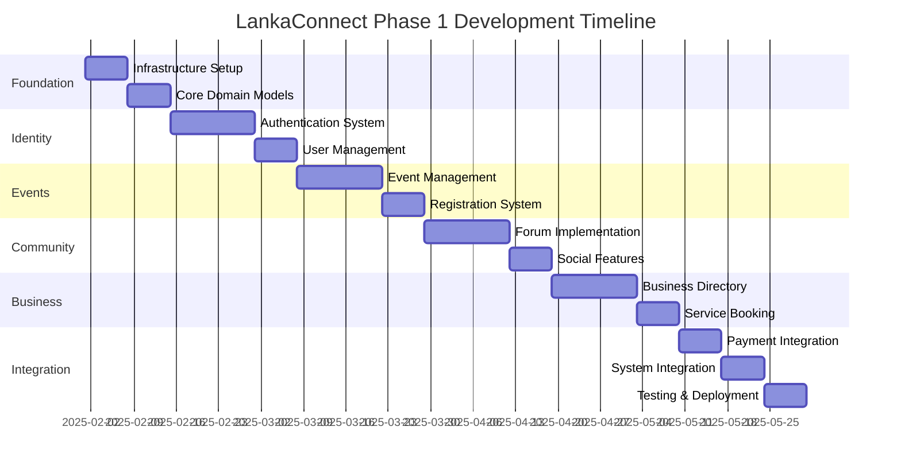

# LankaConnect - Project Plan & Development Timeline
## Strategic Implementation Document

**Version:** 1.0  
**Last Updated:** January 2025  
**Status:** Final  
**Owner:** Development Team  
**Target Audience:** Claude Code Agents, Project Managers, Development Team

---

## 1. Executive Summary

This document provides a comprehensive 12-week development plan for LankaConnect Phase 1, structured for 4-hour development sessions using Claude Code agents. It includes sprint breakdowns, milestone definitions, risk mitigation strategies, and detailed session-by-session implementation guides.

### 1.1 Document Purpose
- Define 12-week sprint schedule with clear deliverables
- Create session-based development plans (4-hour blocks)
- Establish milestone criteria and success metrics
- Provide risk mitigation strategies
- Enable efficient Claude Code agent utilization

### 1.2 Project Overview
- **Duration:** 12 weeks (3 months)
- **Team Structure:** 1-2 developers + Claude Code agents
- **Session Format:** 4-hour focused development blocks
- **Methodology:** Agile with 2-week sprints
- **Primary Goal:** Launch MVP with core features

---

## 2. Development Timeline Overview

### 2.1 Phase 1 Timeline (12 Weeks)


### 2.2 Sprint Schedule
| Sprint | Weeks | Focus Area | Key Deliverables |
|--------|-------|------------|------------------|
| Sprint 0 | Week 0 | Setup | Infrastructure, CI/CD, Development Environment |
| Sprint 1 | Weeks 1-2 | Foundation | Domain Models, Repository Pattern, Basic API |
| Sprint 2 | Weeks 3-4 | Identity | Authentication, User Management, Profiles |
| Sprint 3 | Weeks 5-6 | Events | Event CRUD, Search, Registration |
| Sprint 4 | Weeks 7-8 | Community | Forums, Topics, Comments, Reactions |
| Sprint 5 | Weeks 9-10 | Business | Directory, Services, Booking System |
| Sprint 6 | Weeks 11-12 | Polish | Integration, Testing, Deployment |

---

## 3. Sprint 0: Infrastructure Setup (Week 0)

### 3.1 Objectives
- Set up Azure infrastructure
- Configure development environment
- Establish CI/CD pipeline
- Initialize project structure

### 3.2 Session Breakdown

#### Session 0.1: Azure Infrastructure (4 hours)
```yaml
Tasks:
  - Create Azure subscription and resource group
  - Provision Azure Container Apps environment
  - Set up PostgreSQL flexible server
  - Configure Redis cache
  - Create Azure Storage account
  - Set up Application Insights

Deliverables:
  - infrastructure/bicep/main.bicep
  - infrastructure/bicep/parameters.json
  - Azure resources provisioned
  - Connection strings documented

Claude Agent Instructions:
  - Use Bicep templates from Azure Services Integration document
  - Follow security best practices
  - Enable monitoring from the start
```

#### Session 0.2: Local Development Environment (4 hours)
```yaml
Tasks:
  - Create solution structure
  - Set up Docker Compose for local services
  - Configure development certificates
  - Initialize Git repository
  - Set up .gitignore and .editorconfig

Deliverables:
  - docker-compose.yml
  - docker-compose.override.yml
  - .env.example
  - README.md with setup instructions
  - Solution file structure

Code Structure:
  /src
    /LankaConnect.Domain
    /LankaConnect.Application
    /LankaConnect.Infrastructure
    /LankaConnect.API
    /LankaConnect.Web
  /tests
    /LankaConnect.UnitTests
    /LankaConnect.IntegrationTests
  /infrastructure
    /bicep
    /scripts
```

#### Session 0.3: CI/CD Pipeline Setup (4 hours)
```yaml
Tasks:
  - Create GitHub Actions workflows
  - Set up build pipeline
  - Configure test automation
  - Set up deployment pipeline
  - Configure environment secrets

Deliverables:
  - .github/workflows/build.yml
  - .github/workflows/test.yml
  - .github/workflows/deploy.yml
  - GitHub secrets configured
  - Branch protection rules

Pipeline Configuration:
  Build:
    - Restore packages
    - Build solution
    - Run unit tests
    - Publish artifacts
  
  Test:
    - Run integration tests
    - Generate coverage reports
    - Run security scans
  
  Deploy:
    - Deploy to staging
    - Run smoke tests
    - Deploy to production (manual approval)
```

---

## 4. Sprint 1: Foundation & Domain Models (Weeks 1-2)

### 4.1 Objectives
- Implement core domain models
- Set up repository pattern
- Create basic API structure
- Establish testing patterns

### 4.2 Week 1 Sessions

#### Session 1.1: Domain Models - Identity & Common (4 hours)
```csharp
Tasks:
  - Implement Entity base class
  - Create ValueObject base class
  - Implement Identity domain models
  - Create common domain services

Key Models:
  // Entity Base
  public abstract class Entity
  {
      public Guid Id { get; protected set; }
      public DateTime CreatedAt { get; private set; }
      public DateTime? UpdatedAt { get; private set; }
      
      private readonly List<IDomainEvent> _domainEvents = new();
      public IReadOnlyCollection<IDomainEvent> DomainEvents => _domainEvents.AsReadOnly();
  }

  // User Aggregate
  public class User : Entity, IAggregateRoot
  {
      public Email Email { get; private set; }
      public PersonName Name { get; private set; }
      public UserProfile Profile { get; private set; }
      public UserStatus Status { get; private set; }
      
      // Domain logic here
  }

Test Coverage:
  - Unit tests for all value objects
  - Domain model validation tests
  - Domain event tests
```

#### Session 1.2: Domain Models - Events & Business (4 hours)
```csharp
Tasks:
  - Implement Event aggregate
  - Create Business aggregate
  - Implement domain services
  - Create domain events

Key Models:
  // Event Aggregate
  public class Event : Entity, IAggregateRoot
  {
      public Title Title { get; private set; }
      public Description Description { get; private set; }
      public EventCategory Category { get; private set; }
      public DateTimeRange Schedule { get; private set; }
      public Location Location { get; private set; }
      public Money Price { get; private set; }
      
      private readonly List<Registration> _registrations = new();
      public IReadOnlyCollection<Registration> Registrations => _registrations.AsReadOnly();
  }

  // Business Aggregate
  public class Business : Entity, IAggregateRoot
  {
      public BusinessName Name { get; private set; }
      public BusinessCategory Category { get; private set; }
      public ContactInfo ContactInfo { get; private set; }
      public Location Location { get; private set; }
      
      private readonly List<Service> _services = new();
      public IReadOnlyCollection<Service> Services => _services.AsReadOnly();
  }
```

#### Session 1.3: Repository Pattern Implementation (4 hours)
```csharp
Tasks:
  - Implement generic repository interface
  - Create EF Core DbContext
  - Implement repository base class
  - Configure entity mappings

Implementation:
  // Repository Interface
  public interface IRepository<T> where T : IAggregateRoot
  {
      Task<T> GetByIdAsync(Guid id, CancellationToken cancellationToken = default);
      Task<List<T>> GetAllAsync(CancellationToken cancellationToken = default);
      Task AddAsync(T entity, CancellationToken cancellationToken = default);
      Task UpdateAsync(T entity, CancellationToken cancellationToken = default);
      Task DeleteAsync(T entity, CancellationToken cancellationToken = default);
  }

  // EF Core Implementation
  public class Repository<T> : IRepository<T> where T : Entity, IAggregateRoot
  {
      protected readonly AppDbContext _context;
      protected readonly DbSet<T> _dbSet;
      
      public Repository(AppDbContext context)
      {
          _context = context;
          _dbSet = context.Set<T>();
      }
      
      // Implementation details
  }

Testing:
  - Integration tests with TestContainers
  - Repository pattern validation
  - Transaction handling tests
```

### 4.3 Week 2 Sessions

#### Session 1.4: CQRS & MediatR Setup (4 hours)
```yaml
Tasks:
  - Configure MediatR in Application layer
  - Create command/query base classes
  - Implement validation pipeline
  - Create first commands and queries

Deliverables:
  - CQRS base classes
  - Pipeline behaviors
  - Validation infrastructure
  - Sample commands/queries with tests
```

#### Session 1.5: API Structure & Swagger (4 hours)
```yaml
Tasks:
  - Create API controller base class
  - Configure Swagger/OpenAPI
  - Implement global exception handling
  - Set up API versioning

Deliverables:
  - BaseController with standard responses
  - Swagger configuration with JWT
  - Exception middleware
  - API documentation
```

#### Session 1.6: Testing Infrastructure (4 hours)
```yaml
Tasks:
  - Set up test fixtures
  - Configure TestContainers
  - Create test data builders
  - Implement integration test base

Deliverables:
  - Test infrastructure classes
  - Database test fixtures
  - API test client
  - Test data generators
```

---

## 5. Sprint 2: Identity & Authentication (Weeks 3-4)

### 5.1 Objectives
- Implement Azure AD B2C integration
- Create user management system
- Build profile management
- Establish authorization patterns

### 5.2 Week 3 Sessions

#### Session 2.1: Azure AD B2C Integration (4 hours)
```yaml
Tasks:
  - Configure Azure AD B2C tenant
  - Set up user flows
  - Integrate with API
  - Implement JWT validation

Key Implementations:
  - Custom policies for registration
  - Multi-language support
  - Email verification flow
  - Password reset flow

Testing:
  - Auth flow integration tests
  - Token validation tests
  - User flow testing
```

#### Session 2.2: User Management API (4 hours)
```yaml
Tasks:
  - Create user registration command
  - Implement profile update commands
  - Build user query endpoints
  - Add role management

Endpoints:
  POST   /api/users/register
  GET    /api/users/profile
  PUT    /api/users/profile
  POST   /api/users/avatar
  DELETE /api/users/account
```

#### Session 2.3: Authorization & Permissions (4 hours)
```yaml
Tasks:
  - Implement policy-based authorization
  - Create permission system
  - Build authorization handlers
  - Add resource-based auth

Implementation:
  - Role-based policies
  - Resource ownership checks
  - Custom authorization attributes
  - Permission middleware
```

### 5.3 Week 4 Sessions

#### Session 2.4: Profile Management Features (4 hours)
```yaml
Tasks:
  - Implement profile completion flow
  - Add preference management
  - Create notification settings
  - Build privacy controls

Features:
  - Profile completion wizard
  - Language preferences
  - Email notification settings
  - Privacy level controls
```

#### Session 2.5: Social Authentication (4 hours)
```yaml
Tasks:
  - Add Google authentication
  - Implement Facebook login
  - Configure OAuth flows
  - Handle account linking

Implementation:
  - External login providers
  - Account linking logic
  - Profile data mapping
  - Security considerations
```

#### Session 2.6: Identity Testing & Security (4 hours)
```yaml
Tasks:
  - Security testing
  - Performance testing auth flows
  - Load test authentication
  - Security audit

Testing Focus:
  - JWT token security
  - Authorization bypass tests
  - Rate limiting on auth endpoints
  - Session management
```

---

## 6. Sprint 3: Event Management (Weeks 5-6)

### 6.1 Objectives
- Build complete event management system
- Implement event search and filtering
- Create registration system
- Add calendar integration

### 6.2 Week 5 Sessions

#### Session 3.1: Event CRUD Operations (4 hours)
```yaml
Tasks:
  - Create event command handlers
  - Implement event queries
  - Build event API endpoints
  - Add image upload support

API Endpoints:
  POST   /api/events
  GET    /api/events
  GET    /api/events/{id}
  PUT    /api/events/{id}
  DELETE /api/events/{id}
  POST   /api/events/{id}/images
```

#### Session 3.2: Event Search & Filtering (4 hours)
```yaml
Tasks:
  - Implement search functionality
  - Add category filtering
  - Create location-based search
  - Build date range queries

Features:
  - Full-text search
  - Multi-category filter
  - Proximity search
  - Calendar view queries
```

#### Session 3.3: Advanced Event Features (4 hours)
```yaml
Tasks:
  - Add recurring events
  - Implement event series
  - Create event templates
  - Build draft functionality

Implementation:
  - Recurrence rules (RFC 5545)
  - Series management
  - Template system
  - Auto-save drafts
```

### 6.3 Week 6 Sessions

#### Session 3.4: Registration System (4 hours)
```yaml
Tasks:
  - Build registration commands
  - Create ticket types
  - Implement capacity management
  - Add waitlist functionality

Features:
  - Multiple ticket types
  - Early bird pricing
  - Capacity tracking
  - Automatic waitlist
```

#### Session 3.5: Calendar Integration (4 hours)
```yaml
Tasks:
  - Generate ICS files
  - Add to calendar buttons
  - Create calendar feeds
  - Build reminder system

Implementation:
  - iCal format generation
  - Google Calendar integration
  - Outlook integration
  - Email reminders
```

#### Session 3.6: Event Analytics (4 hours)
```yaml
Tasks:
  - Track event views
  - Registration analytics
  - Conversion tracking
  - Generate reports

Metrics:
  - View count tracking
  - Registration funnel
  - Popular categories
  - Geographic distribution
```

---

## 7. Sprint 4: Community Features (Weeks 7-8)

### 7.1 Objectives
- Implement forum system
- Build commenting functionality
- Add social interactions
- Create moderation tools

### 7.2 Week 7 Sessions

#### Session 4.1: Forum Foundation (4 hours)
```yaml
Tasks:
  - Create forum domain models
  - Build topic management
  - Implement categories
  - Add basic CRUD operations

Models:
  - Forum categories
  - Topics/threads
  - Posts/replies
  - User participation
```

#### Session 4.2: Rich Content Editor (4 hours)
```yaml
Tasks:
  - Integrate markdown editor
  - Add image uploads
  - Implement mentions
  - Create formatting tools

Features:
  - Markdown support
  - Drag-drop images
  - @mentions
  - Code highlighting
```

#### Session 4.3: Social Interactions (4 hours)
```yaml
Tasks:
  - Implement reactions
  - Add voting system
  - Create following system
  - Build notifications

Features:
  - Like/reaction system
  - Upvote/downvote
  - Follow users/topics
  - Real-time notifications
```

### 7.3 Week 8 Sessions

#### Session 4.4: Real-time Features (4 hours)
```yaml
Tasks:
  - Set up SignalR hubs
  - Implement live updates
  - Add typing indicators
  - Create presence system

SignalR Hubs:
  - ForumHub
  - NotificationHub
  - PresenceHub
  - ChatHub
```

#### Session 4.5: Moderation System (4 hours)
```yaml
Tasks:
  - Build reporting system
  - Create moderation queue
  - Add automated filters
  - Implement ban system

Features:
  - Content reporting
  - Moderation dashboard
  - Spam detection
  - User sanctions
```

#### Session 4.6: Community Analytics (4 hours)
```yaml
Tasks:
  - Track engagement metrics
  - Build leaderboards
  - Create activity feeds
  - Generate insights

Metrics:
  - Post engagement
  - Active users
  - Top contributors
  - Topic trends
```

---

## 8. Sprint 5: Business Directory (Weeks 9-10)

### 8.1 Objectives
- Build business directory
- Implement service catalog
- Create booking system
- Add review functionality

### 8.2 Week 9 Sessions

#### Session 5.1: Business Management (4 hours)
```yaml
Tasks:
  - Create business registration
  - Build profile management
  - Add verification system
  - Implement claim process

Features:
  - Business onboarding
  - Profile customization
  - Verification badges
  - Ownership claims
```

#### Session 5.2: Service Catalog (4 hours)
```yaml
Tasks:
  - Create service models
  - Build pricing system
  - Add availability management
  - Implement categories

Implementation:
  - Service definitions
  - Dynamic pricing
  - Schedule management
  - Service packages
```

#### Session 5.3: Search & Discovery (4 hours)
```yaml
Tasks:
  - Build search engine
  - Add filters and sorting
  - Create recommendations
  - Implement geolocation

Features:
  - Elasticsearch integration
  - Advanced filtering
  - ML recommendations
  - Map integration
```

### 8.3 Week 10 Sessions

#### Session 5.4: Booking System (4 hours)
```yaml
Tasks:
  - Create booking flow
  - Build calendar system
  - Add payment integration
  - Implement confirmations

Features:
  - Availability checking
  - Booking calendar
  - Payment processing
  - Email confirmations
```

#### Session 5.5: Review System (4 hours)
```yaml
Tasks:
  - Implement review models
  - Build rating system
  - Add photo reviews
  - Create moderation flow

Features:
  - Star ratings
  - Written reviews
  - Photo uploads
  - Review responses
```

#### Session 5.6: Business Analytics (4 hours)
```yaml
Tasks:
  - Create dashboard
  - Build reporting system
  - Add insights engine
  - Implement exports

Analytics:
  - Booking analytics
  - Revenue tracking
  - Customer insights
  - Performance metrics
```

---

## 9. Sprint 6: Integration & Polish (Weeks 11-12)

### 9.1 Objectives
- Complete system integration
- Perform comprehensive testing
- Optimize performance
- Prepare for deployment

### 9.2 Week 11 Sessions

#### Session 6.1: Payment Integration (4 hours)
```yaml
Tasks:
  - Integrate payment gateway
  - Implement checkout flow
  - Add refund system
  - Create invoice generation

Implementation:
  - Stripe/PayPal integration
  - PCI compliance
  - Refund automation
  - PDF invoices
```

#### Session 6.2: Email & Notifications (4 hours)
```yaml
Tasks:
  - Set up email service
  - Create email templates
  - Build notification system
  - Add SMS integration

Features:
  - SendGrid integration
  - Multi-language templates
  - Push notifications
  - SMS alerts
```

#### Session 6.3: Performance Optimization (4 hours)
```yaml
Tasks:
  - Implement caching strategy
  - Optimize database queries
  - Add CDN integration
  - Perform load testing

Optimizations:
  - Redis caching
  - Query optimization
  - Static asset CDN
  - API response compression
```

### 9.3 Week 12 Sessions

#### Session 6.4: Security Hardening (4 hours)
```yaml
Tasks:
  - Security audit
  - Penetration testing
  - Fix vulnerabilities
  - Implement monitoring

Security Measures:
  - OWASP compliance
  - Security headers
  - API rate limiting
  - Intrusion detection
```

#### Session 6.5: Final Testing (4 hours)
```yaml
Tasks:
  - E2E testing
  - User acceptance testing
  - Performance benchmarking
  - Bug fixes

Testing Coverage:
  - Complete user flows
  - Cross-browser testing
  - Mobile responsiveness
  - Load testing
```

#### Session 6.6: Deployment & Launch (4 hours)
```yaml
Tasks:
  - Production deployment
  - DNS configuration
  - SSL certificates
  - Monitoring setup

Launch Checklist:
  - Database migrations
  - Environment variables
  - Backup procedures
  - Rollback plan
```

---

## 10. Risk Management

### 10.1 Technical Risks
| Risk | Impact | Probability | Mitigation |
|------|--------|-------------|------------|
| Azure service limitations | High | Medium | Early testing, fallback options |
| Performance issues | High | Medium | Continuous monitoring, caching |
| Security vulnerabilities | High | Low | Regular audits, best practices |
| Integration failures | Medium | Medium | Thorough testing, documentation |

### 10.2 Project Risks
| Risk | Impact | Probability | Mitigation |
|------|--------|-------------|------------|
| Scope creep | High | High | Clear requirements, sprint planning |
| Technical debt | Medium | Medium | Code reviews, refactoring time |
| Knowledge gaps | Medium | Low | Documentation, pair programming |
| Timeline delays | High | Medium | Buffer time, priority management |

### 10.3 Mitigation Strategies
```yaml
Technical Mitigation:
  - Implement circuit breakers
  - Use feature flags
  - Maintain 80% test coverage
  - Regular security scans

Process Mitigation:
  - Daily progress tracking
  - Weekly risk reviews
  - Sprint retrospectives
  - Continuous documentation

Resource Mitigation:
  - Knowledge sharing sessions
  - Detailed documentation
  - Recorded demo sessions
  - Backup developer access
```

---

## 11. Success Metrics

### 11.1 Development Metrics
- **Code Coverage:** > 80%
- **Build Success Rate:** > 95%
- **Sprint Velocity:** Consistent or improving
- **Technical Debt Ratio:** < 5%
- **Bug Density:** < 5 bugs per KLOC

### 11.2 Performance Metrics
- **API Response Time:** < 200ms (p95)
- **Page Load Time:** < 2 seconds
- **System Uptime:** > 99.9%
- **Concurrent Users:** Support 1,000+
- **Database Query Time:** < 50ms (avg)

### 11.3 Business Metrics
- **Feature Completion:** 100% of Phase 1
- **User Satisfaction:** > 4.0/5.0
- **Active Users:** 1,000+ in first month
- **Performance SLA:** Meeting all targets
- **Security:** Zero critical vulnerabilities

---

## 12. Session Management Guidelines

### 12.1 4-Hour Session Structure
```yaml
Session Template:
  0:00-0:30  Planning & Setup
    - Review previous session
    - Define session goals
    - Set up environment
    
  0:30-2:30  Core Development
    - Implement features
    - Write tests (TDD)
    - Regular commits
    
  2:30-3:30  Testing & Integration
    - Run test suite
    - Integration testing
    - Fix issues
    
  3:30-4:00  Documentation & Handoff
    - Update documentation
    - Create session notes
    - Plan next session
```

### 12.2 Claude Agent Best Practices
```yaml
Before Each Session:
  - Review architecture documents
  - Check previous session notes
  - Prepare development environment
  - Clear success criteria

During Session:
  - Follow TDD approach
  - Commit every 30 minutes
  - Run tests frequently
  - Document decisions

After Session:
  - Update progress tracking
  - Document blockers
  - Prepare handoff notes
  - Update task board
```

### 12.3 Progress Tracking
```yaml
Daily Tracking:
  - Update burn-down chart
  - Log completed tasks
  - Note blockers
  - Update estimates

Weekly Reviews:
  - Sprint progress
  - Velocity metrics
  - Risk assessment
  - Stakeholder update

Sprint Reviews:
  - Demo completed features
  - Gather feedback
  - Update backlog
  - Plan next sprint
```

---

## 13. Conclusion

This comprehensive project plan provides a structured approach to developing LankaConnect Phase 1 in 12 weeks. The session-based format optimizes Claude Code agent utilization while maintaining consistent progress and quality.

Key success factors:
- **Structured Sessions:** 4-hour focused blocks
- **Clear Deliverables:** Defined outputs per session
- **Risk Management:** Proactive mitigation strategies
- **Quality Focus:** TDD and continuous testing
- **Documentation:** Comprehensive knowledge transfer

Following this plan ensures systematic progress toward a successful Phase 1 launch while building a solid foundation for Phase 2 features.