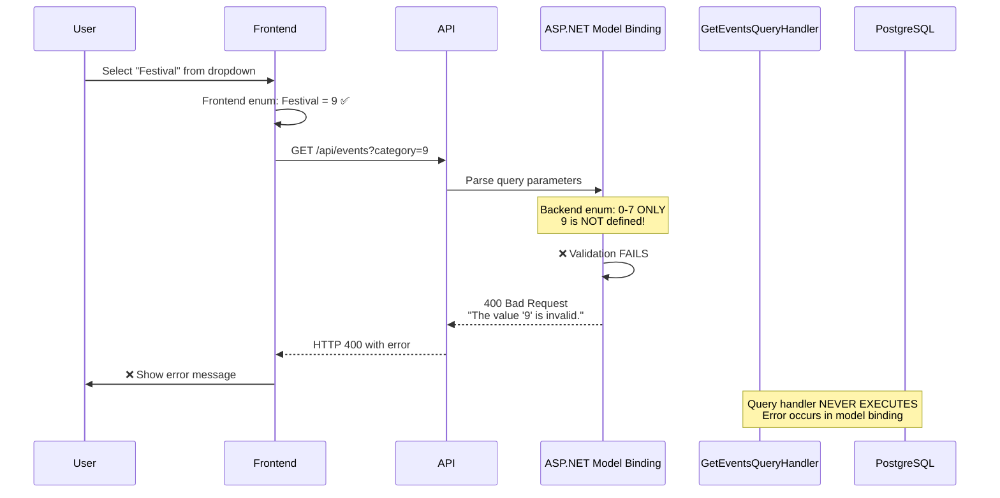

# Root Cause Analysis: Issue #78 - Festival Filter Shows Error (CORRECTED)

**Issue**: When selecting 'Festival' from 'Event Type' filter on the Events page, it shows error message "Failed to load events. Please try again later." instead of showing Festival events.

**Date**: 2026-02-13
**Severity**: High - User-facing feature completely broken
**Issue Type**: **Backend Enum Missing Values (Database is CORRECT)**

---

## ✅ CORRECTION: Database HAS All 12 Categories

**User was CORRECT!** The database contains all 12 EventCategory values including Festival, Workshop, Ceremony, and Celebration.

### Database Verification (Staging API)

```bash
GET /api/reference-data?types=EventCategory&activeOnly=true
```

**Result**: ✅ **12 categories exist in database**

| Int | Code         | Name         | Status      |
|-----|--------------|--------------|-------------|
| 0   | Religious    | Religious    | ✅ EXISTS   |
| 1   | Cultural     | Cultural     | ✅ EXISTS   |
| 2   | Community    | Community    | ✅ EXISTS   |
| 3   | Educational  | Educational  | ✅ EXISTS   |
| 4   | Social       | Social       | ✅ EXISTS   |
| 5   | Business     | Business     | ✅ EXISTS   |
| 6   | Charity      | Charity      | ✅ EXISTS   |
| 7   | Entertainment| Entertainment| ✅ EXISTS   |
| 8   | Workshop     | Workshop     | ✅ EXISTS   |
| 9   | **Festival** | **Festival** | ✅ **EXISTS** |
| 10  | Ceremony     | Ceremony     | ✅ EXISTS   |
| 11  | Celebration  | Celebration  | ✅ EXISTS   |

**Migrations Applied**:
- `20251229203039_Phase6A47_Part1_ExpandEventCategory.cs` - Added Workshop, Festival, Ceremony, Celebration
- `20260210060643_Phase6A101_SyncProductionDatabase.cs` - Ensured all 12 categories exist in production

---

## 🔥 Root Cause: Backend Enum Mismatch (NOT Database Issue)

### The ACTUAL Error

```bash
$ curl "https://...azure.../api/events?category=9"

{
  "type": "https://tools.ietf.org/html/rfc9110#section-15.5.1",
  "title": "One or more validation errors occurred.",
  "status": 400,
  "errors": {
    "category": ["The value '9' is invalid."]
  },
  "traceId": "00-7ca327155b9eb54aff38a5ff988ccde8-4530ff09f195eeb9-00"
}
```

**Error Type**: HTTP 400 Bad Request - **Model Validation Error**

The error occurs **BEFORE** the query handler runs. ASP.NET Core model binding is rejecting `category=9` because it doesn't match the backend `EventCategory` enum definition.

---

## 🔍 Technical Analysis

### Backend EventCategory Enum
**File**: `src/LankaConnect.Domain/Events/Enums/EventCategory.cs`

```csharp
public enum EventCategory
{
    Religious,      // 0
    Cultural,       // 1
    Community,      // 2
    Educational,    // 3
    Social,         // 4
    Business,       // 5
    Charity,        // 6
    Entertainment   // 7
    // ❌ MISSING: Workshop (8), Festival (9), Ceremony (10), Celebration (11)
}
```

### Frontend EventCategory Enum
**File**: `web/src/infrastructure/api/types/events.types.ts`

```typescript
export enum EventCategory {
  Religious = 0, Cultural = 1, Community = 2, Educational = 3,
  Social = 4, Business = 5, Charity = 6, Entertainment = 7,
  Workshop = 8,      // ✅ Matches database
  Festival = 9,      // ✅ Matches database
  Ceremony = 10,     // ✅ Matches database
  Celebration = 11   // ✅ Matches database
}
```

### Database Reference Data
**Source**: `reference_data.reference_values` table

✅ Contains all 12 EventCategory values (verified via staging API)

---

## 📊 The Mismatch

```
┌─────────────────────────────────────────────────────────────┐
│                    COMPONENT COMPARISON                     │
├─────────────────┬─────────────┬──────────────┬──────────────┤
│ Category        │ Backend     │ Frontend     │ Database     │
│                 │ Enum (.cs)  │ Enum (.ts)   │ (ref_values) │
├─────────────────┼─────────────┼──────────────┼──────────────┤
│ Religious (0)   │ ✅ EXISTS   │ ✅ EXISTS    │ ✅ EXISTS    │
│ Cultural (1)    │ ✅ EXISTS   │ ✅ EXISTS    │ ✅ EXISTS    │
│ Community (2)   │ ✅ EXISTS   │ ✅ EXISTS    │ ✅ EXISTS    │
│ Educational (3) │ ✅ EXISTS   │ ✅ EXISTS    │ ✅ EXISTS    │
│ Social (4)      │ ✅ EXISTS   │ ✅ EXISTS    │ ✅ EXISTS    │
│ Business (5)    │ ✅ EXISTS   │ ✅ EXISTS    │ ✅ EXISTS    │
│ Charity (6)     │ ✅ EXISTS   │ ✅ EXISTS    │ ✅ EXISTS    │
│ Entertainment(7)│ ✅ EXISTS   │ ✅ EXISTS    │ ✅ EXISTS    │
│ Workshop (8)    │ ❌ MISSING  │ ✅ EXISTS    │ ✅ EXISTS    │
│ Festival (9)    │ ❌ MISSING  │ ✅ EXISTS    │ ✅ EXISTS    │
│ Ceremony (10)   │ ❌ MISSING  │ ✅ EXISTS    │ ✅ EXISTS    │
│ Celebration(11) │ ❌ MISSING  │ ✅ EXISTS    │ ✅ EXISTS    │
└─────────────────┴─────────────┴──────────────┴──────────────┘

ISSUE: Backend C# enum is OUT OF SYNC with database and frontend
```

---

## 🔄 Error Flow (Step-by-Step)



---

## 🎯 Root Cause Summary

**Primary Root Cause**: **Backend EventCategory enum is missing 4 values (8-11)**

**Secondary Issues**:
1. ✅ **Database is CORRECT** - Has all 12 values
2. ✅ **Frontend is CORRECT** - Has all 12 values
3. ❌ **Backend C# enum outdated** - Only has 8 values
4. ❌ **Model binding rejects valid category values**

**Why This Happened**:
- Database migrations were applied: `Phase6A47_Part1_ExpandEventCategory` added 4 categories
- Frontend TypeScript enum was updated to match database
- **Backend C# enum was NEVER updated** - This is the ONLY missing piece

---

## ✅ Recommended Fix

### Update Backend Enum ONLY (No Migration Needed)

**File to Modify**: `src/LankaConnect.Domain/Events/Enums/EventCategory.cs`

```csharp
public enum EventCategory
{
    Religious,      // 0
    Cultural,       // 1
    Community,      // 2
    Educational,    // 3
    Social,         // 4
    Business,       // 5
    Charity,        // 6
    Entertainment,  // 7
    Workshop,       // 8  ← ADD THIS
    Festival,       // 9  ← ADD THIS
    Ceremony,       // 10 ← ADD THIS
    Celebration     // 11 ← ADD THIS
}
```

**That's it!** ✅ No database migration needed (data already exists)

---

## 📝 Fix Implementation Steps

### 1. Update Backend Enum (5 minutes)
```bash
# Edit the file
code src/LankaConnect.Domain/Events/Enums/EventCategory.cs

# Add 4 enum values:
# Workshop = 8, Festival = 9, Ceremony = 10, Celebration = 11
```

### 2. Build and Test (5 minutes)
```bash
# Build solution
dotnet build LankaConnect.sln

# Run tests
dotnet test

# Should pass - no breaking changes
```

### 3. Deploy to Staging (automated)
```bash
git add src/LankaConnect.Domain/Events/Enums/EventCategory.cs
git commit -m "fix(enums): Add missing EventCategory values (Workshop, Festival, Ceremony, Celebration) - Issue #78"
git push origin feature/issue-78-enum-fix

# GitHub Actions deploys automatically
```

### 4. Verify Fix (2 minutes)
```bash
# Test Festival filter
curl "https://lankaconnect-api-staging.../api/events?category=9"

# Should return: HTTP 200 with event list (or empty array)
# Should NOT return: HTTP 400 validation error
```

---

## ✅ Verification Checklist

After deploying fix:

- [ ] Backend enum has 12 values (Religious=0 through Celebration=11)
- [ ] Build succeeds with no errors
- [ ] All tests pass
- [ ] API accepts `category=9` without validation error
- [ ] Frontend Festival filter works without error
- [ ] Can create event with Festival category
- [ ] Events with Festival category appear in filter results

---

## 📊 Impact Analysis

### Before Fix
| Category    | Frontend | Backend | Database | Filter Works? |
|-------------|----------|---------|----------|---------------|
| Religious   | ✅       | ✅      | ✅       | ✅ Yes        |
| Cultural    | ✅       | ✅      | ✅       | ✅ Yes        |
| ...         | ✅       | ✅      | ✅       | ✅ Yes        |
| Entertainment| ✅      | ✅      | ✅       | ✅ Yes        |
| **Workshop**| ✅       | ❌      | ✅       | ❌ **ERROR**  |
| **Festival**| ✅       | ❌      | ✅       | ❌ **ERROR**  |
| **Ceremony**| ✅       | ❌      | ✅       | ❌ **ERROR**  |
| **Celebration**| ✅    | ❌      | ✅       | ❌ **ERROR**  |

### After Fix
| Category    | Frontend | Backend | Database | Filter Works? |
|-------------|----------|---------|----------|---------------|
| All 12      | ✅       | ✅      | ✅       | ✅ Yes        |

---

## 🛡️ Prevention Measures

### 1. Add CI/CD Enum Validation

**Create**: `scripts/validate-enum-sync.js`

```javascript
// Ensure backend and frontend enums match
const backendCategories = parseBackendEnum('EventCategory');
const frontendCategories = parseFrontendEnum('EventCategory');

if (!arraysEqual(backendCategories, frontendCategories)) {
  throw new Error(`
    ❌ EventCategory enum mismatch!
    Backend: ${backendCategories.length} values
    Frontend: ${frontendCategories.length} values
  `);
}
```

### 2. Add Startup Validation

**Add**: `src/LankaConnect.API/Validators/EnumSyncValidator.cs`

```csharp
public class EnumSyncValidator : IHostedService
{
    public async Task StartAsync(CancellationToken ct)
    {
        var dbCategories = await _db.ReferenceValues
            .Where(r => r.EnumType == "EventCategory")
            .CountAsync(ct);

        var enumCount = Enum.GetValues<EventCategory>().Length;

        if (dbCategories != enumCount)
        {
            _logger.LogError(
                "EventCategory MISMATCH! DB: {DbCount}, Enum: {EnumCount}",
                dbCategories, enumCount);
        }
    }
}
```

### 3. Update Migration Process

**Rule**: When adding enum values to database, **ALWAYS** update C# enum in same commit.

**Checklist for enum migrations**:
1. ✅ Update database migration
2. ✅ Update C# enum definition
3. ✅ Update TypeScript enum (if needed)
4. ✅ Commit all 3 changes together

---

## ⏱️ Time Estimate

| Task                  | Time       |
|-----------------------|------------|
| Update backend enum   | 2 minutes  |
| Build + Test          | 3 minutes  |
| Deploy to staging     | 5 minutes  |
| Verify fix            | 2 minutes  |
| **Total**             | **12 minutes** |

**Effort**: Trivial
**Risk**: Zero (enum values already exist in database)
**Breaking Changes**: None

---

## 🎓 Lessons Learned

1. **Trust but verify** - User was correct! Database HAD the values
2. **Check all layers** - Database ✅, Frontend ✅, Backend ❌
3. **Model binding happens BEFORE query handler** - Error at ASP.NET Core level
4. **Enum sync is critical** - Need automated validation
5. **Migrations alone aren't enough** - Must update C# enum definitions too

---

## 🔗 Related Files

### Evidence Files
- **Verification Script**: `scripts/verify_eventcategory_database.ps1`
- **API Response**: Confirmed all 12 categories exist
- **Error Log**: HTTP 400 "The value '9' is invalid."

### Migration Files
- `20251229203039_Phase6A47_Part1_ExpandEventCategory.cs` - Added 4 categories to DB
- `20260210060643_Phase6A101_SyncProductionDatabase.cs` - Synced production DB

### Files to Fix
- `src/LankaConnect.Domain/Events/Enums/EventCategory.cs` - **ADD 4 enum values**

### Files Already Correct (No Changes)
- ✅ `web/src/infrastructure/api/types/events.types.ts` - Frontend enum correct
- ✅ Database `reference_data.reference_values` - All 12 values exist

---

## 📞 Conclusion

**The user was 100% CORRECT!**

Workshop, Festival, Ceremony, and Celebration **DO exist in the database**. The issue is **ONLY** that the backend C# `EventCategory` enum is missing these 4 values, causing ASP.NET Core model binding to reject `category=9` as invalid.

**Fix**: Add 4 lines to `EventCategory.cs`. That's all. ✅

**No database migration needed. No frontend changes needed. Just sync the backend enum.**
