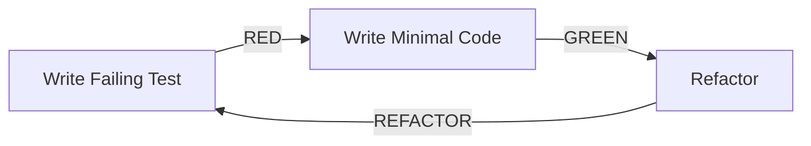

# TESTING_GUIDELINES.md - TDD & Quality Assurance Standards
## Test-Driven Development Guide for Claude Code Agents

**Project:** LankaConnect  
**Methodology:** Test-Driven Development (TDD)  
**Coverage Target:** 80% minimum  
**Testing Framework:** xUnit + FluentAssertions + Moq

---

## 1. TDD Philosophy & Principles

### 1.1 The Three Laws of TDD
```
1. You may not write production code until you have written a failing unit test.
2. You may not write more of a unit test than is sufficient to fail.
3. You may not write more production code than is sufficient to pass the test.
```

### 1.2 Red-Green-Refactor Cycle


### 1.3 Testing Pyramid
```
         /\
        /  \  E2E Tests (5%)
       /----\
      /      \ Integration Tests (15%)
     /--------\
    /          \ Unit Tests (80%)
   /____________\
```

---

## 2. Unit Testing Standards

### 2.1 Test Structure - AAA Pattern
```csharp
[Fact]
public async Task MethodName_ScenarioUnderTest_ExpectedBehavior()
{
    // Arrange - Set up test data and dependencies
    var command = new CreateEventCommand
    {
        Title = "Test Event",
        Description = "Test Description",
        StartDate = DateTime.UtcNow.AddDays(7)
    };
    
    var mockRepository = new Mock<IEventRepository>();
    mockRepository.Setup(x => x.ExistsAsync(It.IsAny<string>()))
                  .ReturnsAsync(false);
    
    var handler = new CreateEventCommandHandler(
        mockRepository.Object,
        _unitOfWork.Object,
        _mapper);
    
    // Act - Execute the method under test
    var result = await handler.Handle(command, CancellationToken.None);
    
    // Assert - Verify the outcome
    result.Should().BeSuccess();
    result.Value.Should().NotBeEmpty();
    mockRepository.Verify(x => x.AddAsync(It.IsAny<Event>()), Times.Once);
}
```

### 2.2 Naming Conventions
```csharp
// Pattern: MethodName_Scenario_ExpectedResult

// Good Examples:
Create_WithValidData_ShouldReturnSuccess()
Create_WithNullTitle_ShouldReturnFailure()
Create_WithDuplicateEmail_ShouldThrowException()
GetById_WhenEventExists_ShouldReturnEvent()
GetById_WhenEventNotFound_ShouldReturnNull()
Register_WhenEventIsFull_ShouldReturnFailure()
Register_WithValidData_ShouldAddRegistration()

// Bad Examples:
Test1()
CreateTest()
ItShouldWork()
TestCreateEvent()
```

### 2.3 Test Organization
```csharp
public class EventTests
{
    // Nested classes for logical grouping
    public class CreateMethod
    {
        [Fact]
        public void WithValidData_ShouldCreateEvent()
        {
            // Arrange
            var title = Title.Create("Valid Title").Value;
            var description = Description.Create("Valid Description").Value;
            
            // Act
            var @event = Event.Create(title, description, EventCategory.Cultural, UserId.New());
            
            // Assert
            @event.Should().NotBeNull();
            @event.Title.Should().Be(title);
            @event.Status.Should().Be(EventStatus.Draft);
        }
        
        [Theory]
        [InlineData(null)]
        [InlineData("")]
        [InlineData(" ")]
        public void WithInvalidTitle_ShouldThrowException(string invalidTitle)
        {
            // Arrange & Act
            var act = () => Event.Create(
                Title.Create(invalidTitle).Value, 
                Description.Create("Valid").Value,
                EventCategory.Cultural,
                UserId.New());
            
            // Assert
            act.Should().Throw<ArgumentException>();
        }
    }
    
    public class RegisterMethod
    {
        private Event _event;
        
        public RegisterMethod()
        {
            // Common setup for all tests in this class
            _event = EventBuilder.Create()
                .WithCapacity(100)
                .Build();
        }
        
        [Fact]
        public void WhenCapacityAvailable_ShouldSucceed()
        {
            // Test implementation
        }
        
        [Fact]
        public void WhenEventFull_ShouldReturnFailure()
        {
            // Test implementation
        }
    }
}
```

---

## 3. Domain Layer Testing

### 3.1 Entity Testing
```csharp
public class UserTests
{
    [Fact]
    public void Create_WithValidData_ShouldSetPropertiesCorrectly()
    {
        // Arrange
        var email = Email.Create("test@example.com").Value;
        var name = PersonName.Create("John", "Doe").Value;
        
        // Act
        var user = User.Create(email, name);
        
        // Assert
        user.Should().NotBeNull();
        user.Email.Should().Be(email);
        user.Name.Should().Be(name);
        user.Status.Should().Be(UserStatus.Active);
        user.CreatedAt.Should().BeCloseTo(DateTime.UtcNow, TimeSpan.FromSeconds(1));
    }
    
    [Fact]
    public void Create_ShouldRaiseDomainEvent()
    {
        // Arrange
        var email = Email.Create("test@example.com").Value;
        var name = PersonName.Create("John", "Doe").Value;
        
        // Act
        var user = User.Create(email, name);
        
        // Assert
        user.DomainEvents.Should().ContainSingle();
        user.DomainEvents.First().Should().BeOfType<UserRegisteredEvent>();
        
        var @event = user.DomainEvents.First() as UserRegisteredEvent;
        @event.UserId.Should().Be(user.Id);
        @event.Email.Should().Be(email.Value);
    }
    
    [Fact]
    public void UpdateProfile_WithValidData_ShouldUpdateAndRaiseEvent()
    {
        // Arrange
        var user = UserBuilder.Create().Build();
        var newName = PersonName.Create("Jane", "Smith").Value;
        
        // Act
        var result = user.UpdateProfile(newName, "New bio", "Colombo");
        
        // Assert
        result.Should().BeSuccess();
        user.Name.Should().Be(newName);
        user.DomainEvents.Should().Contain(e => e is ProfileUpdatedEvent);
    }
}
```

### 3.2 Value Object Testing
```csharp
public class EmailTests
{
    [Theory]
    [InlineData("user@example.com")]
    [InlineData("user.name@example.co.uk")]
    [InlineData("user+tag@example.com")]
    public void Create_WithValidEmail_ShouldReturnSuccess(string validEmail)
    {
        // Act
        var result = Email.Create(validEmail);
        
        // Assert
        result.Should().BeSuccess();
        result.Value.Value.Should().Be(validEmail.ToLowerInvariant());
    }
    
    [Theory]
    [InlineData(null)]
    [InlineData("")]
    [InlineData(" ")]
    [InlineData("notanemail")]
    [InlineData("@example.com")]
    [InlineData("user@")]
    [InlineData("user @example.com")]
    public void Create_WithInvalidEmail_ShouldReturnFailure(string invalidEmail)
    {
        // Act
        var result = Email.Create(invalidEmail);
        
        // Assert
        result.Should().BeFailure();
        result.Error.Should().NotBeEmpty();
    }
    
    [Fact]
    public void Equals_WithSameValue_ShouldBeEqual()
    {
        // Arrange
        var email1 = Email.Create("test@example.com").Value;
        var email2 = Email.Create("test@example.com").Value;
        
        // Act & Assert
        email1.Should().Be(email2);
        (email1 == email2).Should().BeTrue();
        email1.GetHashCode().Should().Be(email2.GetHashCode());
    }
}
```

### 3.3 Domain Service Testing
```csharp
public class EventCapacityServiceTests
{
    private readonly EventCapacityService _service;
    
    public EventCapacityServiceTests()
    {
        _service = new EventCapacityService();
    }
    
    [Fact]
    public void CalculateAvailableCapacity_WithRegistrations_ShouldReturnCorrectValue()
    {
        // Arrange
        var @event = EventBuilder.Create()
            .WithCapacity(100)
            .WithRegistrations(25)
            .Build();
        
        // Act
        var available = _service.CalculateAvailableCapacity(@event);
        
        // Assert
        available.Should().Be(75);
    }
    
    [Theory]
    [InlineData(100, 100, true)]
    [InlineData(100, 99, false)]
    [InlineData(100, 101, true)]
    public void IsEventFull_WithVariousScenarios_ShouldReturnCorrectResult(
        int capacity, int registrations, bool expectedResult)
    {
        // Arrange
        var @event = EventBuilder.Create()
            .WithCapacity(capacity)
            .WithRegistrations(registrations)
            .Build();
        
        // Act
        var isFull = _service.IsEventFull(@event);
        
        // Assert
        isFull.Should().Be(expectedResult);
    }
}
```

---

## 4. Application Layer Testing

### 4.1 Command Handler Testing
```csharp
public class CreateEventCommandHandlerTests
{
    private readonly Mock<IEventRepository> _eventRepositoryMock;
    private readonly Mock<IUnitOfWork> _unitOfWorkMock;
    private readonly Mock<ICurrentUserService> _currentUserMock;
    private readonly Mock<IEventBus> _eventBusMock;
    private readonly CreateEventCommandHandler _handler;
    
    public CreateEventCommandHandlerTests()
    {
        _eventRepositoryMock = new Mock<IEventRepository>();
        _unitOfWorkMock = new Mock<IUnitOfWork>();
        _currentUserMock = new Mock<ICurrentUserService>();
        _eventBusMock = new Mock<IEventBus>();
        
        _currentUserMock.Setup(x => x.UserId).Returns(UserId.New());
        
        _handler = new CreateEventCommandHandler(
            _eventRepositoryMock.Object,
            _unitOfWorkMock.Object,
            _currentUserMock.Object,
            _eventBusMock.Object);
    }
    
    [Fact]
    public async Task Handle_WithValidCommand_ShouldCreateEvent()
    {
        // Arrange
        var command = new CreateEventCommand
        {
            Title = "Community Meetup",
            Description = "Monthly community gathering",
            CategoryId = Guid.NewGuid(),
            StartDate = DateTime.UtcNow.AddDays(7),
            EndDate = DateTime.UtcNow.AddDays(7).AddHours(3),
            Location = "Colombo Convention Center"
        };
        
        _eventRepositoryMock
            .Setup(x => x.ExistsByTitleAsync(command.Title))
            .ReturnsAsync(false);
        
        // Act
        var result = await _handler.Handle(command, CancellationToken.None);
        
        // Assert
        result.Should().BeSuccess();
        result.Value.Should().NotBeEmpty();
        
        _eventRepositoryMock.Verify(x => x.AddAsync(It.Is<Event>(e => 
            e.Title.Value == command.Title &&
            e.Description.Value == command.Description
        )), Times.Once);
        
        _unitOfWorkMock.Verify(x => x.CommitAsync(It.IsAny<CancellationToken>()), Times.Once);
        
        _eventBusMock.Verify(x => x.PublishAsync(
            It.IsAny<EventCreatedEvent>(), 
            It.IsAny<CancellationToken>()), Times.Once);
    }
    
    [Fact]
    public async Task Handle_WithDuplicateTitle_ShouldReturnFailure()
    {
        // Arrange
        var command = new CreateEventCommand
        {
            Title = "Existing Event",
            Description = "Description",
            CategoryId = Guid.NewGuid(),
            StartDate = DateTime.UtcNow.AddDays(7)
        };
        
        _eventRepositoryMock
            .Setup(x => x.ExistsByTitleAsync(command.Title))
            .ReturnsAsync(true);
        
        // Act
        var result = await _handler.Handle(command, CancellationToken.None);
        
        // Assert
        result.Should().BeFailure();
        result.Error.Should().Contain("already exists");
        
        _eventRepositoryMock.Verify(x => x.AddAsync(It.IsAny<Event>()), Times.Never);
        _unitOfWorkMock.Verify(x => x.CommitAsync(It.IsAny<CancellationToken>()), Times.Never);
    }
}
```

### 4.2 Query Handler Testing
```csharp
public class GetEventByIdQueryHandlerTests
{
    private readonly Mock<IEventRepository> _repositoryMock;
    private readonly Mock<IMapper> _mapperMock;
    private readonly GetEventByIdQueryHandler _handler;
    
    public GetEventByIdQueryHandlerTests()
    {
        _repositoryMock = new Mock<IEventRepository>();
        _mapperMock = new Mock<IMapper>();
        
        _handler = new GetEventByIdQueryHandler(
            _repositoryMock.Object,
            _mapperMock.Object);
    }
    
    [Fact]
    public async Task Handle_WhenEventExists_ShouldReturnEventDto()
    {
        // Arrange
        var eventId = Guid.NewGuid();
        var query = new GetEventByIdQuery { EventId = eventId };
        
        var @event = EventBuilder.Create()
            .WithId(eventId)
            .WithTitle("Test Event")
            .Build();
        
        var eventDto = new EventDto
        {
            Id = eventId,
            Title = "Test Event"
        };
        
        _repositoryMock
            .Setup(x => x.GetByIdWithDetailsAsync(eventId))
            .ReturnsAsync(@event);
        
        _mapperMock
            .Setup(x => x.Map<EventDto>(@event))
            .Returns(eventDto);
        
        // Act
        var result = await _handler.Handle(query, CancellationToken.None);
        
        // Assert
        result.Should().BeSuccess();
        result.Value.Should().Be(eventDto);
        result.Value.Id.Should().Be(eventId);
    }
    
    [Fact]
    public async Task Handle_WhenEventNotFound_ShouldReturnFailure()
    {
        // Arrange
        var query = new GetEventByIdQuery { EventId = Guid.NewGuid() };
        
        _repositoryMock
            .Setup(x => x.GetByIdWithDetailsAsync(query.EventId))
            .ReturnsAsync((Event)null);
        
        // Act
        var result = await _handler.Handle(query, CancellationToken.None);
        
        // Assert
        result.Should().BeFailure();
        result.Error.Should().Contain("not found");
        
        _mapperMock.Verify(x => x.Map<EventDto>(It.IsAny<Event>()), Times.Never);
    }
}
```

### 4.3 Validator Testing
```csharp
public class CreateEventCommandValidatorTests
{
    private readonly CreateEventCommandValidator _validator;
    
    public CreateEventCommandValidatorTests()
    {
        _validator = new CreateEventCommandValidator();
    }
    
    [Fact]
    public void Validate_WithValidCommand_ShouldPass()
    {
        // Arrange
        var command = new CreateEventCommand
        {
            Title = "Valid Event Title",
            Description = "This is a valid description for the event",
            CategoryId = Guid.NewGuid(),
            StartDate = DateTime.UtcNow.AddDays(1),
            EndDate = DateTime.UtcNow.AddDays(1).AddHours(2),
            Location = "Colombo",
            MaxAttendees = 100
        };
        
        // Act
        var result = _validator.Validate(command);
        
        // Assert
        result.IsValid.Should().BeTrue();
        result.Errors.Should().BeEmpty();
    }
    
    [Theory]
    [InlineData("", "Title is required")]
    [InlineData("AB", "Title must be at least 3 characters")]
    [InlineData("This is a very long title that exceeds the maximum allowed length for event titles in our system which should be limited to 200 characters to ensure proper display across all platforms and devices", "Title must not exceed 200 characters")]
    public void Validate_WithInvalidTitle_ShouldFail(string title, string expectedError)
    {
        // Arrange
        var command = new CreateEventCommand
        {
            Title = title,
            Description = "Valid description",
            CategoryId = Guid.NewGuid(),
            StartDate = DateTime.UtcNow.AddDays(1),
            EndDate = DateTime.UtcNow.AddDays(1).AddHours(2)
        };
        
        // Act
        var result = _validator.Validate(command);
        
        // Assert
        result.IsValid.Should().BeFalse();
        result.Errors.Should().Contain(e => e.ErrorMessage.Contains(expectedError));
    }
    
    [Fact]
    public void Validate_WithPastStartDate_ShouldFail()
    {
        // Arrange
        var command = new CreateEventCommand
        {
            Title = "Valid Title",
            Description = "Valid description",
            CategoryId = Guid.NewGuid(),
            StartDate = DateTime.UtcNow.AddDays(-1), // Past date
            EndDate = DateTime.UtcNow.AddDays(1)
        };
        
        // Act
        var result = _validator.Validate(command);
        
        // Assert
        result.IsValid.Should().BeFalse();
        result.Errors.Should().Contain(e => e.PropertyName == nameof(command.StartDate));
    }
}
```

---

## 5. Infrastructure Layer Testing

### 5.1 Repository Testing
```csharp
public class EventRepositoryTests : IAsyncLifetime
{
    private AppDbContext _context;
    private EventRepository _repository;
    private readonly PostgreSqlContainer _postgres = new PostgreSqlBuilder()
        .WithImage("postgres:15-alpine")
        .Build();
    
    public async Task InitializeAsync()
    {
        await _postgres.StartAsync();
        
        var options = new DbContextOptionsBuilder<AppDbContext>()
            .UseNpgsql(_postgres.GetConnectionString())
            .Options;
        
        _context = new AppDbContext(options);
        await _context.Database.MigrateAsync();
        
        _repository = new EventRepository(_context);
    }
    
    public async Task DisposeAsync()
    {
        await _context.DisposeAsync();
        await _postgres.DisposeAsync();
    }
    
    [Fact]
    public async Task AddAsync_ShouldPersistEvent()
    {
        // Arrange
        var @event = EventBuilder.Create()
            .WithTitle("Test Event")
            .Build();
        
        // Act
        await _repository.AddAsync(@event);
        await _context.SaveChangesAsync();
        
        // Assert
        var saved = await _context.Events.FindAsync(@event.Id);
        saved.Should().NotBeNull();
        saved.Title.Value.Should().Be("Test Event");
    }
    
    [Fact]
    public async Task GetByIdWithDetailsAsync_ShouldIncludeRelatedData()
    {
        // Arrange
        var @event = EventBuilder.Create()
            .WithTitle("Event with Details")
            .Build();
        
        @event.AddTicketType("General", Money.Create("LKR", 1000).Value, 100);
        @event.Register(UserId.New(), 2);
        
        await _context.Events.AddAsync(@event);
        await _context.SaveChangesAsync();
        _context.ChangeTracker.Clear();
        
        // Act
        var loaded = await _repository.GetByIdWithDetailsAsync(@event.Id);
        
        // Assert
        loaded.Should().NotBeNull();
        loaded.TicketTypes.Should().HaveCount(1);
        loaded.Registrations.Should().HaveCount(1);
    }
    
    [Fact]
    public async Task GetUpcomingEventsAsync_ShouldReturnFutureEventsOnly()
    {
        // Arrange
        var pastEvent = EventBuilder.Create()
            .WithTitle("Past Event")
            .WithStartDate(DateTime.UtcNow.AddDays(-1))
            .Build();
        
        var futureEvent1 = EventBuilder.Create()
            .WithTitle("Future Event 1")
            .WithStartDate(DateTime.UtcNow.AddDays(1))
            .Build();
        
        var futureEvent2 = EventBuilder.Create()
            .WithTitle("Future Event 2")
            .WithStartDate(DateTime.UtcNow.AddDays(7))
            .Build();
        
        await _context.Events.AddRangeAsync(pastEvent, futureEvent1, futureEvent2);
        await _context.SaveChangesAsync();
        
        // Act
        var result = await _repository.GetUpcomingEventsAsync(1, 10);
        
        // Assert
        result.Items.Should().HaveCount(2);
        result.Items.Should().NotContain(e => e.Id == pastEvent.Id);
        result.Items.Should().BeInAscendingOrder(e => e.StartDate);
    }
}
```

### 5.2 External Service Testing
```csharp
public class EmailServiceTests
{
    private readonly Mock<ISendGridClient> _sendGridMock;
    private readonly Mock<ILogger<EmailService>> _loggerMock;
    private readonly EmailService _service;
    
    public EmailServiceTests()
    {
        _sendGridMock = new Mock<ISendGridClient>();
        _loggerMock = new Mock<ILogger<EmailService>>();
        
        _service = new EmailService(
            _sendGridMock.Object,
            _loggerMock.Object,
            Options.Create(new EmailSettings
            {
                FromEmail = "noreply@lankaconnect.lk",
                FromName = "LankaConnect"
            }));
    }
    
    [Fact]
    public async Task SendEmailAsync_WithValidEmail_ShouldSucceed()
    {
        // Arrange
        var email = new EmailMessage
        {
            To = "user@example.com",
            Subject = "Test Email",
            Body = "<p>Test content</p>",
            IsHtml = true
        };
        
        _sendGridMock
            .Setup(x => x.SendEmailAsync(It.IsAny<SendGridMessage>(), It.IsAny<CancellationToken>()))
            .ReturnsAsync(new Response(HttpStatusCode.Accepted, null, null));
        
        // Act
        var result = await _service.SendEmailAsync(email);
        
        // Assert
        result.Should().BeSuccess();
        
        _sendGridMock.Verify(x => x.SendEmailAsync(
            It.Is<SendGridMessage>(msg => 
                msg.Personalizations[0].Tos[0].Email == email.To &&
                msg.Subject == email.Subject),
            It.IsAny<CancellationToken>()), Times.Once);
    }
    
    [Fact]
    public async Task SendEmailAsync_WhenSendGridFails_ShouldReturnFailure()
    {
        // Arrange
        var email = new EmailMessage
        {
            To = "user@example.com",
            Subject = "Test Email",
            Body = "Test content"
        };
        
        _sendGridMock
            .Setup(x => x.SendEmailAsync(It.IsAny<SendGridMessage>(), It.IsAny<CancellationToken>()))
            .ThrowsAsync(new Exception("SendGrid error"));
        
        // Act
        var result = await _service.SendEmailAsync(email);
        
        // Assert
        result.Should().BeFailure();
        result.Error.Should().Contain("Failed to send email");
        
        _loggerMock.Verify(
            x => x.Log(
                LogLevel.Error,
                It.IsAny<EventId>(),
                It.Is<It.IsAnyType>((o, t) => o.ToString().Contains("Failed to send email")),
                It.IsAny<Exception>(),
                It.IsAny<Func<It.IsAnyType, Exception, string>>()),
            Times.Once);
    }
}
```

---

## 6. Integration Testing

### 6.1 API Integration Tests
```csharp
public class EventsControllerIntegrationTests : IClassFixture<WebApplicationFactory<Program>>
{
    private readonly WebApplicationFactory<Program> _factory;
    private readonly HttpClient _client;
    
    public EventsControllerIntegrationTests(WebApplicationFactory<Program> factory)
    {
        _factory = factory.WithWebHostBuilder(builder =>
        {
            builder.ConfigureServices(services =>
            {
                // Remove real database
                var descriptor = services.SingleOrDefault(
                    d => d.ServiceType == typeof(DbContextOptions<AppDbContext>));
                if (descriptor != null)
                    services.Remove(descriptor);
                
                // Add test database
                services.AddDbContext<AppDbContext>(options =>
                {
                    options.UseInMemoryDatabase("TestDb");
                });
                
                // Add test authentication
                services.AddAuthentication("Test")
                    .AddScheme<TestAuthenticationSchemeOptions, TestAuthenticationHandler>(
                        "Test", options => { });
            });
        });
        
        _client = _factory.CreateClient();
        _client.DefaultRequestHeaders.Authorization = 
            new AuthenticationHeaderValue("Test");
    }
    
    [Fact]
    public async Task POST_CreateEvent_ShouldReturnCreatedEvent()
    {
        // Arrange
        var request = new CreateEventRequest
        {
            Title = "Integration Test Event",
            Description = "Test Description",
            CategoryId = Guid.NewGuid(),
            StartDate = DateTime.UtcNow.AddDays(7),
            EndDate = DateTime.UtcNow.AddDays(7).AddHours(3),
            Location = "Test Location",
            MaxAttendees = 100
        };
        
        // Act
        var response = await _client.PostAsJsonAsync("/api/events", request);
        
        // Assert
        response.StatusCode.Should().Be(HttpStatusCode.Created);
        response.Headers.Location.Should().NotBeNull();
        
        var content = await response.Content.ReadFromJsonAsync<CreateEventResponse>();
        content.Should().NotBeNull();
        content.EventId.Should().NotBeEmpty();
    }
    
    [Fact]
    public async Task GET_GetEvents_ShouldReturnPagedResults()
    {
        // Arrange
        await SeedEventsAsync(25);
        
        // Act
        var response = await _client.GetAsync("/api/events?page=2&pageSize=10");
        
        // Assert
        response.StatusCode.Should().Be(HttpStatusCode.OK);
        
        var content = await response.Content.ReadFromJsonAsync<PagedResponse<EventDto>>();
        content.Should().NotBeNull();
        content.Items.Should().HaveCount(10);
        content.Pagination.Page.Should().Be(2);
        content.Pagination.TotalCount.Should().Be(25);
    }
    
    [Fact]
    public async Task GET_GetEventById_WhenExists_ShouldReturnEvent()
    {
        // Arrange
        var eventId = await CreateTestEventAsync();
        
        // Act
        var response = await _client.GetAsync($"/api/events/{eventId}");
        
        // Assert
        response.StatusCode.Should().Be(HttpStatusCode.OK);
        
        var content = await response.Content.ReadFromJsonAsync<EventDto>();
        content.Should().NotBeNull();
        content.Id.Should().Be(eventId);
    }
    
    private async Task<Guid> CreateTestEventAsync()
    {
        var request = new CreateEventRequest
        {
            Title = "Test Event",
            Description = "Test Description",
            CategoryId = Guid.NewGuid(),
            StartDate = DateTime.UtcNow.AddDays(1)
        };
        
        var response = await _client.PostAsJsonAsync("/api/events", request);
        var content = await response.Content.ReadFromJsonAsync<CreateEventResponse>();
        
        return content.EventId;
    }
    
    private async Task SeedEventsAsync(int count)
    {
        var tasks = Enumerable.Range(1, count)
            .Select(i => CreateTestEventAsync())
            .ToList();
        
        await Task.WhenAll(tasks);
    }
}
```

### 6.2 Database Integration Tests
```csharp
public class DatabaseIntegrationTests : IAsyncLifetime
{
    private AppDbContext _context;
    private IServiceProvider _serviceProvider;
    private readonly PostgreSqlContainer _postgres;
    
    public DatabaseIntegrationTests()
    {
        _postgres = new PostgreSqlBuilder()
            .WithImage("postgres:15-alpine")
            .WithDatabase("lankaconnect_test")
            .Build();
    }
    
    public async Task InitializeAsync()
    {
        await _postgres.StartAsync();
        
        var services = new ServiceCollection();
        
        services.AddDbContext<AppDbContext>(options =>
            options.UseNpgsql(_postgres.GetConnectionString()));
        
        services.AddScoped<IEventRepository, EventRepository>();
        services.AddScoped<IUserRepository, UserRepository>();
        
        _serviceProvider = services.BuildServiceProvider();
        _context = _serviceProvider.GetRequiredService<AppDbContext>();
        
        await _context.Database.MigrateAsync();
    }
    
    public async Task DisposeAsync()
    {
        await _context.DisposeAsync();
        await _postgres.DisposeAsync();
    }
    
    [Fact]
    public async Task Transaction_ShouldRollbackOnFailure()
    {
        // Arrange
        var repository = _serviceProvider.GetRequiredService<IEventRepository>();
        var @event = EventBuilder.Create().Build();
        
        // Act & Assert
        using var transaction = await _context.Database.BeginTransactionAsync();
        
        try
        {
            await repository.AddAsync(@event);
            await _context.SaveChangesAsync();
            
            // Force an error
            throw new Exception("Simulated error");
        }
        catch
        {
            await transaction.RollbackAsync();
        }
        
        // Verify rollback
        var exists = await _context.Events.AnyAsync(e => e.Id == @event.Id);
        exists.Should().BeFalse();
    }
    
    [Fact]
    public async Task ConcurrentUpdates_ShouldHandleOptimisticConcurrency()
    {
        // Arrange
        var @event = EventBuilder.Create().Build();
        await _context.Events.AddAsync(@event);
        await _context.SaveChangesAsync();
        
        // Simulate concurrent updates
        var context1 = CreateNewContext();
        var context2 = CreateNewContext();
        
        var event1 = await context1.Events.FindAsync(@event.Id);
        var event2 = await context2.Events.FindAsync(@event.Id);
        
        // Act
        event1.UpdateTitle(Title.Create("Updated by Context 1").Value);
        await context1.SaveChangesAsync();
        
        event2.UpdateTitle(Title.Create("Updated by Context 2").Value);
        
        // Assert
        var act = async () => await context2.SaveChangesAsync();
        await act.Should().ThrowAsync<DbUpdateConcurrencyException>();
    }
    
    private AppDbContext CreateNewContext()
    {
        var options = new DbContextOptionsBuilder<AppDbContext>()
            .UseNpgsql(_postgres.GetConnectionString())
            .Options;
        
        return new AppDbContext(options);
    }
}
```

---

## 7. End-to-End Testing

### 7.1 E2E Test Setup
```csharp
public class E2ETestBase : IAsyncLifetime
{
    protected IPlaywright Playwright { get; private set; }
    protected IBrowser Browser { get; private set; }
    protected IBrowserContext Context { get; private set; }
    protected IPage Page { get; private set; }
    
    protected readonly string BaseUrl = "https://localhost:5001";
    
    public async Task InitializeAsync()
    {
        Playwright = await Microsoft.Playwright.Playwright.CreateAsync();
        Browser = await Playwright.Chromium.LaunchAsync(new BrowserTypeLaunchOptions
        {
            Headless = true,
            SlowMo = 100 // Slow down for debugging
        });
        
        Context = await Browser.NewContextAsync(new BrowserNewContextOptions
        {
            BaseURL = BaseUrl,
            IgnoreHTTPSErrors = true,
            ViewportSize = new ViewportSize { Width = 1920, Height = 1080 },
            RecordVideoDir = "videos/",
            RecordVideoSize = new RecordVideoSize { Width = 1920, Height = 1080 }
        });
        
        Page = await Context.NewPageAsync();
        
        // Set up request/response logging
        Page.Request += (_, request) => Console.WriteLine($">> {request.Method} {request.Url}");
        Page.Response += (_, response) => Console.WriteLine($"<< {response.Status} {response.Url}");
    }
    
    public async Task DisposeAsync()
    {
        await Context?.CloseAsync();
        await Browser?.CloseAsync();
        Playwright?.Dispose();
    }
    
    protected async Task LoginAsUserAsync(string email = "test@example.com", string password = "Test123!")
    {
        await Page.GotoAsync("/login");
        await Page.FillAsync("[data-testid=email-input]", email);
        await Page.FillAsync("[data-testid=password-input]", password);
        await Page.ClickAsync("[data-testid=login-button]");
        await Page.WaitForNavigationAsync();
    }
    
    protected async Task TakeScreenshotAsync(string name)
    {
        await Page.ScreenshotAsync(new PageScreenshotOptions
        {
            Path = $"screenshots/{name}-{DateTime.Now:yyyyMMddHHmmss}.png",
            FullPage = true
        });
    }
}
```

### 7.2 E2E Scenarios
```csharp
public class EventCreationE2ETests : E2ETestBase
{
    [Fact]
    public async Task CreateEvent_CompleteFlow_ShouldSucceed()
    {
        // Arrange - Login
        await LoginAsUserAsync();
        
        // Navigate to create event
        await Page.ClickAsync("[data-testid=create-event-button]");
        await Page.WaitForURLAsync("**/events/create");
        
        // Fill event details
        await Page.FillAsync("[data-testid=event-title]", "E2E Test Event");
        await Page.FillAsync("[data-testid=event-description]", "This is a test event created by E2E test");
        await Page.SelectOptionAsync("[data-testid=event-category]", "cultural");
        
        // Set dates
        var tomorrow = DateTime.Now.AddDays(1).ToString("yyyy-MM-dd");
        await Page.FillAsync("[data-testid=start-date]", tomorrow);
        await Page.FillAsync("[data-testid=start-time]", "10:00");
        await Page.FillAsync("[data-testid=end-time]", "12:00");
        
        // Set location
        await Page.FillAsync("[data-testid=event-location]", "Colombo Convention Center");
        
        // Set capacity
        await Page.FillAsync("[data-testid=max-attendees]", "100");
        
        // Take screenshot before submission
        await TakeScreenshotAsync("event-create-form");
        
        // Submit
        await Page.ClickAsync("[data-testid=submit-event-button]");
        
        // Wait for navigation to event details
        await Page.WaitForURLAsync("**/events/*");
        
        // Verify event was created
        await Page.WaitForSelectorAsync("[data-testid=event-title]");
        var title = await Page.TextContentAsync("[data-testid=event-title]");
        title.Should().Be("E2E Test Event");
        
        // Take final screenshot
        await TakeScreenshotAsync("event-created");
    }
}

public class UserRegistrationE2ETests : E2ETestBase
{
    [Fact]
    public async Task UserRegistration_CompleteFlow_ShouldSucceed()
    {
        // Navigate to registration
        await Page.GotoAsync("/register");
        
        // Fill registration form
        var uniqueEmail = $"test{DateTime.Now.Ticks}@example.com";
        await Page.FillAsync("[data-testid=email]", uniqueEmail);
        await Page.FillAsync("[data-testid=password]", "Test123!");
        await Page.FillAsync("[data-testid=confirm-password]", "Test123!");
        await Page.FillAsync("[data-testid=first-name]", "Test");
        await Page.FillAsync("[data-testid=last-name]", "User");
        
        // Accept terms
        await Page.CheckAsync("[data-testid=accept-terms]");
        
        // Submit
        await Page.ClickAsync("[data-testid=register-button]");
        
        // Wait for email verification page
        await Page.WaitForURLAsync("**/verify-email");
        
        // Verify message
        var message = await Page.TextContentAsync("[data-testid=verification-message]");
        message.Should().Contain("verification email");
    }
}
```

---

## 8. Test Data Builders

### 8.1 Builder Pattern Implementation
```csharp
public class EventBuilder
{
    private Guid _id = Guid.NewGuid();
    private string _title = "Test Event";
    private string _description = "Test Description";
    private EventCategory _category = EventCategory.Cultural;
    private DateTime _startDate = DateTime.UtcNow.AddDays(7);
    private DateTime _endDate = DateTime.UtcNow.AddDays(7).AddHours(3);
    private string _location = "Test Location";
    private int _capacity = 100;
    private UserId _organizerId = UserId.New();
    private readonly List<Registration> _registrations = new();
    
    public static EventBuilder Create() => new();
    
    public EventBuilder WithId(Guid id)
    {
        _id = id;
        return this;
    }
    
    public EventBuilder WithTitle(string title)
    {
        _title = title;
        return this;
    }
    
    public EventBuilder WithStartDate(DateTime startDate)
    {
        _startDate = startDate;
        return this;
    }
    
    public EventBuilder WithCapacity(int capacity)
    {
        _capacity = capacity;
        return this;
    }
    
    public EventBuilder WithRegistrations(int count)
    {
        for (int i = 0; i < count; i++)
        {
            _registrations.Add(new Registration(
                _id,
                UserId.New(),
                1,
                Money.Create("LKR", 1000).Value));
        }
        return this;
    }
    
    public Event Build()
    {
        var @event = Event.Create(
            Title.Create(_title).Value,
            Description.Create(_description).Value,
            _category,
            _organizerId);
        
        // Use reflection to set ID (only for testing)
        typeof(Event).GetProperty("Id")
            .SetValue(@event, _id);
        
        // Set other properties
        @event.SetLocation(Location.Create(_location).Value);
        @event.SetCapacity(_capacity);
        @event.SetSchedule(_startDate, _endDate);
        
        // Add registrations
        foreach (var registration in _registrations)
        {
            typeof(Event).GetField("_registrations", BindingFlags.NonPublic | BindingFlags.Instance)
                .GetValue(@event)
                .GetType()
                .GetMethod("Add")
                .Invoke(@event.GetType().GetField("_registrations", BindingFlags.NonPublic | BindingFlags.Instance).GetValue(@event), new[] { registration });
        }
        
        return @event;
    }
}

public class UserBuilder
{
    private Email _email;
    private PersonName _name;
    private UserStatus _status = UserStatus.Active;
    
    public static UserBuilder Create() => new();
    
    public UserBuilder WithEmail(string email)
    {
        _email = Email.Create(email).Value;
        return this;
    }
    
    public UserBuilder WithName(string firstName, string lastName)
    {
        _name = PersonName.Create(firstName, lastName).Value;
        return this;
    }
    
    public UserBuilder WithStatus(UserStatus status)
    {
        _status = status;
        return this;
    }
    
    public User Build()
    {
        _email ??= Email.Create($"test{Guid.NewGuid()}@example.com").Value;
        _name ??= PersonName.Create("Test", "User").Value;
        
        var user = User.Create(_email, _name);
        
        if (_status != UserStatus.Active)
        {
            typeof(User).GetProperty("Status")
                .SetValue(user, _status);
        }
        
        return user;
    }
}
```

### 8.2 Object Mother Pattern
```csharp
public static class ObjectMother
{
    public static class Events
    {
        public static Event Simple() => 
            EventBuilder.Create()
                .WithTitle("Simple Event")
                .Build();
        
        public static Event WithRegistrations() =>
            EventBuilder.Create()
                .WithTitle("Popular Event")
                .WithCapacity(100)
                .WithRegistrations(50)
                .Build();
        
        public static Event Full() =>
            EventBuilder.Create()
                .WithTitle("Full Event")
                .WithCapacity(50)
                .WithRegistrations(50)
                .Build();
        
        public static Event Past() =>
            EventBuilder.Create()
                .WithTitle("Past Event")
                .WithStartDate(DateTime.UtcNow.AddDays(-7))
                .Build();
    }
    
    public static class Users
    {
        public static User Active() =>
            UserBuilder.Create()
                .WithEmail("active@example.com")
                .WithName("Active", "User")
                .Build();
        
        public static User Suspended() =>
            UserBuilder.Create()
                .WithEmail("suspended@example.com")
                .WithStatus(UserStatus.Suspended)
                .Build();
        
        public static User Admin() =>
            UserBuilder.Create()
                .WithEmail("admin@example.com")
                .WithName("Admin", "User")
                .Build(); // Would need role assignment
    }
}
```

---

## 9. Mocking Best Practices

### 9.1 Mock Setup Patterns
```csharp
public class MockSetupExtensions
{
    public static Mock<IEventRepository> SetupSuccessfulEventRepository(
        Mock<IEventRepository> mock = null)
    {
        mock ??= new Mock<IEventRepository>();
        
        mock.Setup(x => x.GetByIdAsync(It.IsAny<Guid>()))
            .ReturnsAsync((Guid id) => EventBuilder.Create().WithId(id).Build());
        
        mock.Setup(x => x.ExistsByTitleAsync(It.IsAny<string>()))
            .ReturnsAsync(false);
        
        mock.Setup(x => x.AddAsync(It.IsAny<Event>()))
            .Returns(Task.CompletedTask);
        
        return mock;
    }
    
    public static Mock<ICurrentUserService> SetupAuthenticatedUser(
        Mock<ICurrentUserService> mock = null,
        UserId userId = null)
    {
        mock ??= new Mock<ICurrentUserService>();
        userId ??= UserId.New();
        
        mock.Setup(x => x.IsAuthenticated).Returns(true);
        mock.Setup(x => x.UserId).Returns(userId);
        mock.Setup(x => x.Email).Returns("user@example.com");
        
        return mock;
    }
}
```

### 9.2 Verification Patterns
```csharp
public static class MockVerificationExtensions
{
    public static void VerifyEventCreated(
        this Mock<IEventRepository> mock,
        string expectedTitle)
    {
        mock.Verify(x => x.AddAsync(It.Is<Event>(e => 
            e.Title.Value == expectedTitle)), 
            Times.Once);
    }
    
    public static void VerifyEmailSent(
        this Mock<IEmailService> mock,
        string expectedTo,
        string expectedSubject)
    {
        mock.Verify(x => x.SendEmailAsync(It.Is<EmailMessage>(msg =>
            msg.To == expectedTo &&
            msg.Subject == expectedSubject)),
            Times.Once);
    }
    
    public static void VerifyNoEmailsSent(this Mock<IEmailService> mock)
    {
        mock.Verify(x => x.SendEmailAsync(It.IsAny<EmailMessage>()), 
            Times.Never);
    }
}
```

---

## 10. Performance Testing

### 10.1 Benchmark Tests
```csharp
[MemoryDiagnoser]
[SimpleJob(RuntimeMoniker.Net80)]
public class EventRepositoryBenchmarks
{
    private AppDbContext _context;
    private EventRepository _repository;
    
    [GlobalSetup]
    public void Setup()
    {
        var options = new DbContextOptionsBuilder<AppDbContext>()
            .UseInMemoryDatabase("BenchmarkDb")
            .Options;
        
        _context = new AppDbContext(options);
        _repository = new EventRepository(_context);
        
        // Seed data
        SeedEvents(1000);
    }
    
    [Benchmark]
    public async Task GetUpcomingEvents_Paginated()
    {
        await _repository.GetUpcomingEventsAsync(1, 20);
    }
    
    [Benchmark]
    public async Task SearchEvents_ByLocation()
    {
        await _repository.SearchEventsAsync(new EventSearchCriteria
        {
            Location = "Colombo",
            PageSize = 20
        });
    }
    
    private void SeedEvents(int count)
    {
        var events = Enumerable.Range(1, count)
            .Select(i => EventBuilder.Create()
                .WithTitle($"Event {i}")
                .WithStartDate(DateTime.UtcNow.AddDays(i % 30))
                .Build())
            .ToList();
        
        _context.Events.AddRange(events);
        _context.SaveChanges();
    }
}
```

### 10.2 Load Tests
```csharp
public class LoadTests
{
    [Fact]
    public async Task EventSearch_ShouldHandleHighLoad()
    {
        // Arrange
        var client = new HttpClient { BaseAddress = new Uri("https://localhost:5001") };
        var tasks = new List<Task<HttpResponseMessage>>();
        
        // Act - Simulate 100 concurrent requests
        for (int i = 0; i < 100; i++)
        {
            tasks.Add(client.GetAsync($"/api/events?page={i % 10 + 1}"));
        }
        
        var responses = await Task.WhenAll(tasks);
        
        // Assert
        responses.Should().AllSatisfy(r => r.StatusCode.Should().Be(HttpStatusCode.OK));
        
        var responseTimes = responses.Select(r => 
            r.Headers.GetValues("X-Response-Time").First());
        
        var avgResponseTime = responseTimes
            .Select(double.Parse)
            .Average();
        
        avgResponseTime.Should().BeLessThan(200); // ms
    }
}
```

---

## 11. Test Coverage & Quality Gates

### 11.1 Coverage Requirements
```xml
<!-- Directory.Build.props -->
<Project>
  <PropertyGroup>
    <CollectCoverage>true</CollectCoverage>
    <CoverletOutputFormat>opencover</CoverletOutputFormat>
    <ExcludeByFile>**/Migrations/*.cs</ExcludeByFile>
    <Exclude>[*]*.Program,[*]*.Startup</Exclude>
    <ThresholdType>line,branch,method</ThresholdType>
    <Threshold>80,75,80</Threshold>
  </PropertyGroup>
</Project>
```

### 11.2 Quality Gate Script
```bash
#!/bin/bash
# test-quality-gate.sh

# Run tests with coverage
dotnet test /p:CollectCoverage=true \
  /p:CoverletOutputFormat=opencover \
  /p:Threshold=80 \
  /p:ThresholdType=line

if [ $? -ne 0 ]; then
    echo "Tests failed or coverage below threshold"
    exit 1
fi

# Generate coverage report
reportgenerator \
  -reports:**/coverage.opencover.xml \
  -targetdir:coveragereport \
  -reporttypes:Html

echo "All tests passed with sufficient coverage!"
```

---

## 12. Testing Checklist

### Before Writing Code
- [ ] Write test first (RED)
- [ ] Test fails for the right reason
- [ ] Test name clearly describes scenario
- [ ] Test follows AAA pattern

### After Writing Code
- [ ] Test passes (GREEN)
- [ ] Code is minimal to pass test
- [ ] No other tests broken
- [ ] Ready to refactor

### Before Committing
- [ ] All tests pass locally
- [ ] Coverage meets threshold (80%)
- [ ] No ignored/skipped tests
- [ ] Tests are deterministic
- [ ] Tests run fast (< 1 second for unit tests)

### Code Review Checklist
- [ ] Tests exist for all new code
- [ ] Tests cover happy path and edge cases
- [ ] Mocks are used appropriately
- [ ] No test logic in production code
- [ ] Tests are maintainable and clear

---

## 13. Common Testing Anti-Patterns to Avoid

### ❌ Don't Do This
```csharp
// Too many assertions
[Fact]
public void Bad_Test_With_Multiple_Assertions()
{
    var user = User.Create(email, name);
    
    user.Should().NotBeNull();
    user.Email.Should().Be(email);
    user.Name.Should().Be(name);
    user.Status.Should().Be(UserStatus.Active);
    user.CreatedAt.Should().BeCloseTo(DateTime.UtcNow, TimeSpan.FromSeconds(1));
    user.Roles.Should().BeEmpty();
    // ... many more assertions
}

// Testing implementation details
[Fact]
public void Bad_Test_Of_Private_Method()
{
    var service = new UserService();
    var method = service.GetType().GetMethod("ValidateEmail", BindingFlags.NonPublic);
    var result = method.Invoke(service, new[] { "test@example.com" });
    // Don't test private methods!
}

// Shared mutable state
public class BadTests
{
    private static User _sharedUser = CreateUser(); // Shared state!
    
    [Fact]
    public void Test1()
    {
        _sharedUser.UpdateEmail(newEmail); // Modifies shared state
    }
}
```

### ✅ Do This Instead
```csharp
// Single assertion per test
[Fact]
public void Create_ShouldSetEmail()
{
    var user = User.Create(email, name);
    user.Email.Should().Be(email);
}

[Fact]
public void Create_ShouldSetStatusToActive()
{
    var user = User.Create(email, name);
    user.Status.Should().Be(UserStatus.Active);
}

// Test public API only
[Fact]
public void CreateUser_WithInvalidEmail_ShouldReturnFailure()
{
    var result = _userService.CreateUser("invalid-email", "Name");
    result.Should().BeFailure();
}

// Isolated tests
public class GoodTests
{
    [Fact]
    public void Each_Test_Is_Isolated()
    {
        var user = CreateUser(); // Fresh instance
        // Test logic
    }
}
```

---

## Summary

Following these TDD guidelines ensures:
1. **High Quality:** Bugs caught early
2. **Maintainable:** Tests document behavior
3. **Refactorable:** Safe to change code
4. **Fast Feedback:** Know immediately if something breaks
5. **Living Documentation:** Tests show how to use code

Remember: **Write tests first, keep them simple, and maintain them like production code!**