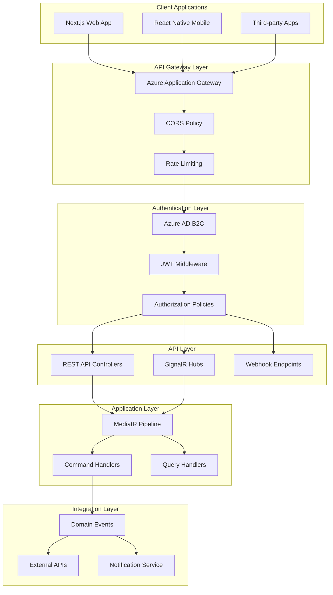

# LankaConnect - API Design & Integration Patterns

## Document Overview
**Document Type**: Technical Architecture - API Design  
**Version**: 1.0  
**Last Updated**: January 2025  
**Target Audience**: Development Team, Claude Code Agents  

## 1. Executive Summary

LankaConnect's API layer follows **RESTful principles** with **CQRS patterns**, **real-time SignalR communication**, and **comprehensive security**. The design prioritizes developer experience, mobile optimization, and scalability for the Sri Lankan diaspora community platform.

### Key API Design Decisions
- **RESTful APIs**: Resource-based URLs with standard HTTP methods
- **CQRS Implementation**: Command Query Responsibility Segregation with MediatR
- **SignalR Integration**: Real-time updates for events, forums, and notifications
- **API Versioning**: Header-based versioning for backward compatibility
- **OpenAPI Documentation**: Comprehensive Swagger documentation with examples

## 2. API Architecture Overview



## 3. RESTful API Design Standards

### 3.1 URL Structure and Naming Conventions

```csharp
// Resource-based URL patterns
[Route("api/v{version:apiVersion}/[controller]")]
[ApiController]
[ApiVersion("1.0")]
public class EventsController : ControllerBase
{
    // Collection operations
    [HttpGet]                                    // GET /api/v1/events
    [HttpPost]                                   // POST /api/v1/events
    
    // Resource operations  
    [HttpGet("{id}")]                           // GET /api/v1/events/{id}
    [HttpPut("{id}")]                           // PUT /api/v1/events/{id}
    [HttpPatch("{id}")]                         // PATCH /api/v1/events/{id}
    [HttpDelete("{id}")]                        // DELETE /api/v1/events/{id}
    
    // Sub-resource operations
    [HttpGet("{id}/registrations")]             // GET /api/v1/events/{id}/registrations
    [HttpPost("{id}/registrations")]            // POST /api/v1/events/{id}/registrations
    [HttpDelete("{id}/registrations/{userId}")] // DELETE /api/v1/events/{id}/registrations/{userId}
    
    // Resource actions
    [HttpPost("{id}/publish")]                  // POST /api/v1/events/{id}/publish
    [HttpPost("{id}/cancel")]                   // POST /api/v1/events/{id}/cancel
    [HttpPost("{id}/duplicate")]                // POST /api/v1/events/{id}/duplicate
    
    // Search and filtering
    [HttpGet("search")]                         // GET /api/v1/events/search?q=cricket&location=ohio
    [HttpGet("featured")]                       // GET /api/v1/events/featured
    [HttpGet("upcoming")]                       // GET /api/v1/events/upcoming
}
```

### 3.2 HTTP Status Code Standards

```csharp
// Standardized response patterns
namespace LankaConnect.Api.Common
{
    public static class ApiResponses
    {
        // Success responses
        public static IActionResult Ok<T>(T data) => new OkObjectResult(new ApiResponse<T>
        {
            Success = true,
            Data = data,
            Message = "Request completed successfully"
        });
        
        public static IActionResult Created<T>(T data, string location = null) => new CreatedResult(location, new ApiResponse<T>
        {
            Success = true,
            Data = data,
            Message = "Resource created successfully"
        });
        
        public static IActionResult NoContent() => new NoContentResult();
        
        // Error responses
        public static IActionResult BadRequest(string message, IEnumerable<string> errors = null) => 
            new BadRequestObjectResult(new ApiErrorResponse
            {
                Success = false,
                Message = message,
                Errors = errors?.ToList() ?? new List<string>()
            });
        
        public static IActionResult NotFound(string message = "Resource not found") =>
            new NotFoundObjectResult(new ApiErrorResponse
            {
                Success = false,
                Message = message
            });
        
        public static IActionResult Unauthorized(string message = "Authentication required") =>
            new UnauthorizedObjectResult(new ApiErrorResponse
            {
                Success = false,
                Message = message
            });
        
        public static IActionResult Forbidden(string message = "Insufficient permissions") =>
            new ObjectResult(new ApiErrorResponse
            {
                Success = false,
                Message = message
            }) { StatusCode = 403 };
        
        public static IActionResult Conflict(string message, object conflictData = null) =>
            new ConflictObjectResult(new ApiErrorResponse
            {
                Success = false,
                Message = message,
                Data = conflictData
            });
    }
    
    // Response models
    public class ApiResponse<T>
    {
        public bool Success { get; set; }
        public T Data { get; set; }
        public string Message { get; set; }
        public Dictionary<string, object> Meta { get; set; } = new();
    }
    
    public class ApiErrorResponse
    {
        public bool Success { get; set; } = false;
        public string Message { get; set; }
        public List<string> Errors { get; set; } = new();
        public object Data { get; set; }
        public string TraceId { get; set; }
    }
    
    public class PagedApiResponse<T> : ApiResponse<IEnumerable<T>>
    {
        public PaginationMeta Pagination { get; set; }
    }
    
    public class PaginationMeta
    {
        public int Page { get; set; }
        public int PageSize { get; set; }
        public int TotalCount { get; set; }
        public int TotalPages { get; set; }
        public bool HasNext { get; set; }
        public bool HasPrevious { get; set; }
    }
}
```

### 3.3 Input Validation and Model Binding

```csharp
// Request models with validation
namespace LankaConnect.Api.Models.Events
{
    public class CreateEventRequest
    {
        [Required]
        [StringLength(200, MinimumLength = 5)]
        public string Title { get; set; }
        
        [Required]
        [StringLength(5000, MinimumLength = 20)]
        public string Description { get; set; }
        
        [Required]
        public DateTime StartDate { get; set; }
        
        public DateTime? EndDate { get; set; }
        
        [Required]
        public EventLocationRequest Location { get; set; }
        
        [Required]
        [EnumDataType(typeof(EventCategory))]
        public EventCategory Category { get; set; }
        
        public EventType Type { get; set; } = EventType.InPerson;
        
        public List<CreateTicketTypeRequest> TicketTypes { get; set; } = new();
        
        [Url]
        public string BannerImageUrl { get; set; }
        
        public List<string> Tags { get; set; } = new();
        
        [Range(1, 10000)]
        public int? MaxAttendees { get; set; }
        
        public DateTime? RegistrationDeadline { get; set; }
        
        public bool IsPrivate { get; set; } = false;
    }
    
    public class EventLocationRequest
    {
        [Required]
        public EventLocationType Type { get; set; }
        
        [RequiredIf(nameof(Type), EventLocationType.Venue)]
        public string VenueName { get; set; }
        
        [RequiredIf(nameof(Type), EventLocationType.Venue)]
        public AddressRequest Address { get; set; }
        
        [RequiredIf(nameof(Type), EventLocationType.Online)]
        public OnlineEventDetailsRequest OnlineDetails { get; set; }
    }
    
    public class AddressRequest
    {
        [Required]
        public string Street { get; set; }
        
        [Required]
        public string City { get; set; }
        
        [Required]
        public string State { get; set; }
        
        [Required]
        [RegularExpression(@"^\d{5}(-\d{4})?$")]
        public string ZipCode { get; set; }
        
        public string Country { get; set; } = "USA";
    }
    
    // Custom validation attributes
    public class RequiredIfAttribute : ValidationAttribute, IClientModelValidator
    {
        private readonly string _propertyName;
        private readonly object _desiredValue;
        
        public RequiredIfAttribute(string propertyName, object desiredValue)
        {
            _propertyName = propertyName;
            _desiredValue = desiredValue;
        }
        
        protected override ValidationResult IsValid(object value, ValidationContext validationContext)
        {
            var property = validationContext.ObjectType.GetProperty(_propertyName);
            var propertyValue = property.GetValue(validationContext.ObjectInstance);
            
            if (propertyValue?.Equals(_desiredValue) == true && value == null)
            {
                return new ValidationResult($"{validationContext.DisplayName} is required when {_propertyName} is {_desiredValue}");
            }
            
            return ValidationResult.Success;
        }
        
        public void AddValidation(ClientModelValidationContext context)
        {
            context.Attributes.Add("data-val", "true");
            context.Attributes.Add("data-val-requiredif", ErrorMessage);
            context.Attributes.Add("data-val-requiredif-property", _propertyName);
            context.Attributes.Add("data-val-requiredif-value", _desiredValue.ToString());
        }
    }
}
```

## 4. CQRS Implementation with MediatR

### 4.1 Command and Query Separation

```csharp
// Command definitions (Write operations)
namespace LankaConnect.Application.Events.Commands
{
    public class CreateEventCommand : IRequest<Result<EventId>>
    {
        public string Title { get; set; }
        public string Description { get; set; }
        public DateTime StartDate { get; set; }
        public DateTime? EndDate { get; set; }
        public EventLocationDto Location { get; set; }
        public EventCategory Category { get; set; }
        public EventType Type { get; set; }
        public List<CreateTicketTypeDto> TicketTypes { get; set; } = new();
        public UserId OrganizerId { get; set; }
        public bool IsPrivate { get; set; }
        public int? MaxAttendees { get; set; }
        public DateTime? RegistrationDeadline { get; set; }
    }
    
    public class CreateEventCommandHandler : IRequestHandler<CreateEventCommand, Result<EventId>>
    {
        private readonly IEventRepository _eventRepository;
        private readonly IUserRepository _userRepository;
        private readonly IEventDomainService _eventDomainService;
        private readonly IUnitOfWork _unitOfWork;
        private readonly ILogger<CreateEventCommandHandler> _logger;
        
        public CreateEventCommandHandler(
            IEventRepository eventRepository,
            IUserRepository userRepository,
            IEventDomainService eventDomainService,
            IUnitOfWork unitOfWork,
            ILogger<CreateEventCommandHandler> logger)
        {
            _eventRepository = eventRepository;
            _userRepository = userRepository;
            _eventDomainService = eventDomainService;
            _unitOfWork = unitOfWork;
            _logger = logger;
        }
        
        public async Task<Result<EventId>> Handle(CreateEventCommand request, CancellationToken cancellationToken)
        {
            try
            {
                // 1. Validate organizer exists and can create events
                var organizer = await _userRepository.GetByIdAsync(request.OrganizerId);
                if (organizer == null)
                    return Result<EventId>.Failure("Organizer not found");
                
                if (!organizer.CanCreateEvents())
                    return Result<EventId>.Failure("User does not have permission to create events");
                
                // 2. Create event through domain service
                var eventDetails = new EventDetails(request.Title, request.Description);
                var schedule = new EventSchedule(request.StartDate, request.EndDate);
                var location = CreateEventLocation(request.Location);
                
                var newEvent = await _eventDomainService.CreateEventAsync(
                    organizer,
                    eventDetails,
                    schedule,
                    location,
                    request.Category,
                    request.Type);
                
                // 3. Configure event settings
                if (request.MaxAttendees.HasValue)
                    newEvent.SetMaxAttendees(request.MaxAttendees.Value);
                
                if (request.RegistrationDeadline.HasValue)
                    newEvent.SetRegistrationDeadline(request.RegistrationDeadline.Value);
                
                newEvent.SetPrivacy(request.IsPrivate);
                
                // 4. Add ticket types
                foreach (var ticketType in request.TicketTypes)
                {
                    newEvent.AddTicketType(ticketType.Name, ticketType.Price, ticketType.Quantity);
                }
                
                // 5. Save event
                await _eventRepository.AddAsync(newEvent);
                await _unitOfWork.SaveChangesAsync(cancellationToken);
                
                _logger.LogInformation("Event created successfully: {EventId} by {OrganizerId}", 
                    newEvent.Id, request.OrganizerId);
                
                return Result<EventId>.Success(newEvent.Id);
            }
            catch (BusinessRuleViolationException ex)
            {
                _logger.LogWarning("Business rule violation in CreateEvent: {Message}", ex.Message);
                return Result<EventId>.Failure(ex.Message);
            }
            catch (Exception ex)
            {
                _logger.LogError(ex, "Error creating event for organizer {OrganizerId}", request.OrganizerId);
                return Result<EventId>.Failure("An error occurred while creating the event");
            }
        }
        
        private EventLocation CreateEventLocation(EventLocationDto locationDto)
        {
            return locationDto.Type switch
            {
                EventLocationType.Venue => EventLocation.CreateVenueLocation(
                    locationDto.VenueName,
                    new Address(
                        locationDto.Address.Street,
                        locationDto.Address.City,
                        locationDto.Address.State,
                        locationDto.Address.ZipCode,
                        locationDto.Address.Country)),
                
                EventLocationType.Online => EventLocation.CreateOnlineLocation(
                    locationDto.OnlineDetails.Platform,
                    locationDto.OnlineDetails.MeetingUrl,
                    locationDto.OnlineDetails.MeetingId),
                
                EventLocationType.Hybrid => EventLocation.CreateHybridLocation(
                    locationDto.VenueName,
                    new Address(
                        locationDto.Address.Street,
                        locationDto.Address.City,
                        locationDto.Address.State,
                        locationDto.Address.ZipCode,
                        locationDto.Address.Country),
                    locationDto.OnlineDetails.Platform,
                    locationDto.OnlineDetails.MeetingUrl),
                
                _ => throw new ArgumentException($"Unsupported location type: {locationDto.Type}")
            };
        }
    }
}

// Query definitions (Read operations)
namespace LankaConnect.Application.Events.Queries
{
    public class GetEventsQuery : IRequest<PagedResult<EventSummaryDto>>
    {
        public int Page { get; set; } = 1;
        public int PageSize { get; set; } = 20;
        public string SearchTerm { get; set; }
        public EventCategory? Category { get; set; }
        public string Location { get; set; }
        public int? RadiusKm { get; set; }
        public DateTime? StartDate { get; set; }
        public DateTime? EndDate { get; set; }
        public EventStatus? Status { get; set; }
        public bool IncludeFeatured { get; set; } = true;
        public EventSortBy SortBy { get; set; } = EventSortBy.StartDate;
    }
    
    public class GetEventsQueryHandler : IRequestHandler<GetEventsQuery, PagedResult<EventSummaryDto>>
    {
        private readonly IEventReadService _eventReadService;
        private readonly ILocationService _locationService;
        private readonly IMemoryCache _cache;
        private readonly ILogger<GetEventsQueryHandler> _logger;
        
        public GetEventsQueryHandler(
            IEventReadService eventReadService,
            ILocationService locationService,
            IMemoryCache cache,
            ILogger<GetEventsQueryHandler> logger)
        {
            _eventReadService = eventReadService;
            _locationService = locationService;
            _cache = cache;
            _logger = logger;
        }
        
        public async Task<PagedResult<EventSummaryDto>> Handle(GetEventsQuery request, CancellationToken cancellationToken)
        {
            try
            {
                // Create cache key for this query
                var cacheKey = GenerateCacheKey(request);
                
                // Try to get from cache first
                if (_cache.TryGetValue(cacheKey, out PagedResult<EventSummaryDto> cachedResult))
                {
                    _logger.LogDebug("Returning cached events result for key: {CacheKey}", cacheKey);
                    return cachedResult;
                }
                
                // Build search criteria
                var searchCriteria = new EventSearchCriteria
                {
                    Page = request.Page,
                    PageSize = request.PageSize,
                    SearchTerm = request.SearchTerm,
                    Category = request.Category,
                    Status = request.Status ?? EventStatus.Published,
                    StartDate = request.StartDate ?? DateTime.UtcNow,
                    EndDate = request.EndDate,
                    SortBy = request.SortBy
                };
                
                // Handle location-based search
                if (!string.IsNullOrEmpty(request.Location))
                {
                    var coordinates = await _locationService.GetCoordinatesAsync(request.Location);
                    if (coordinates != null)
                    {
                        searchCriteria.Location = new GeoPoint(coordinates.Latitude, coordinates.Longitude);
                        searchCriteria.RadiusKm = request.RadiusKm ?? 50; // Default 50km radius
                    }
                }
                
                // Execute search
                var result = await _eventReadService.SearchEventsAsync(searchCriteria, cancellationToken);
                
                // Cache the result for 5 minutes
                var cacheOptions = new MemoryCacheEntryOptions
                {
                    AbsoluteExpirationRelativeToNow = TimeSpan.FromMinutes(5),
                    SlidingExpiration = TimeSpan.FromMinutes(2),
                    Priority = CacheItemPriority.Normal
                };
                
                _cache.Set(cacheKey, result, cacheOptions);
                
                _logger.LogDebug("Events query executed successfully. Found {Count} events", result.TotalCount);
                
                return result;
            }
            catch (Exception ex)
            {
                _logger.LogError(ex, "Error executing GetEventsQuery");
                throw;
            }
        }
        
        private string GenerateCacheKey(GetEventsQuery query)
        {
            var keyComponents = new[]
            {
                "events",
                query.Page.ToString(),
                query.PageSize.ToString(),
                query.SearchTerm ?? "null",
                query.Category?.ToString() ?? "null",
                query.Location ?? "null",
                query.RadiusKm?.ToString() ?? "null",
                query.StartDate?.ToString("yyyy-MM-dd") ?? "null",
                query.EndDate?.ToString("yyyy-MM-dd") ?? "null",
                query.Status?.ToString() ?? "null",
                query.SortBy.ToString()
            };
            
            return string.Join(":", keyComponents);
        }
    }
}
```

### 4.2 Pipeline Behaviors

```csharp
// Validation Pipeline Behavior
namespace LankaConnect.Application.Common.Behaviors
{
    public class ValidationBehavior<TRequest, TResponse> : IPipelineBehavior<TRequest, TResponse>
        where TRequest : IRequest<TResponse>
    {
        private readonly IEnumerable<IValidator<TRequest>> _validators;
        private readonly ILogger<ValidationBehavior<TRequest, TResponse>> _logger;
        
        public ValidationBehavior(
            IEnumerable<IValidator<TRequest>> validators,
            ILogger<ValidationBehavior<TRequest, TResponse>> logger)
        {
            _validators = validators;
            _logger = logger;
        }
        
        public async Task<TResponse> Handle(
            TRequest request,
            RequestHandlerDelegate<TResponse> next,
            CancellationToken cancellationToken)
        {
            if (_validators.Any())
            {
                var context = new ValidationContext<TRequest>(request);
                
                var validationResults = await Task.WhenAll(
                    _validators.Select(v => v.ValidateAsync(context, cancellationToken)));
                
                var failures = validationResults
                    .Where(r => r.Errors.Any())
                    .SelectMany(r => r.Errors)
                    .ToList();
                
                if (failures.Any())
                {
                    _logger.LogWarning("Validation failed for {RequestType}: {Errors}",
                        typeof(TRequest).Name,
                        string.Join(", ", failures.Select(f => f.ErrorMessage)));
                    
                    throw new ValidationException(failures);
                }
            }
            
            return await next();
        }
    }
    
    // Performance Logging Behavior
    public class PerformanceBehavior<TRequest, TResponse> : IPipelineBehavior<TRequest, TResponse>
        where TRequest : IRequest<TResponse>
    {
        private readonly ILogger<PerformanceBehavior<TRequest, TResponse>> _logger;
        private readonly Stopwatch _timer;
        
        public PerformanceBehavior(ILogger<PerformanceBehavior<TRequest, TResponse>> logger)
        {
            _logger = logger;
            _timer = new Stopwatch();
        }
        
        public async Task<TResponse> Handle(
            TRequest request,
            RequestHandlerDelegate<TResponse> next,
            CancellationToken cancellationToken)
        {
            _timer.Start();
            
            var response = await next();
            
            _timer.Stop();
            
            var elapsedMilliseconds = _timer.ElapsedMilliseconds;
            
            if (elapsedMilliseconds > 500) // Log slow requests
            {
                var requestName = typeof(TRequest).Name;
                
                _logger.LogWarning("Slow request detected: {RequestName} took {ElapsedMilliseconds}ms",
                    requestName, elapsedMilliseconds);
            }
            else
            {
                _logger.LogDebug("{RequestName} completed in {ElapsedMilliseconds}ms",
                    typeof(TRequest).Name, elapsedMilliseconds);
            }
            
            return response;
        }
    }
    
    // Authorization Behavior
    public class AuthorizationBehavior<TRequest, TResponse> : IPipelineBehavior<TRequest, TResponse>
        where TRequest : IRequest<TResponse>
    {
        private readonly ICurrentUser _currentUser;
        private readonly IAuthorizationService _authorizationService;
        private readonly ILogger<AuthorizationBehavior<TRequest, TResponse>> _logger;
        
        public AuthorizationBehavior(
            ICurrentUser currentUser,
            IAuthorizationService authorizationService,
            ILogger<AuthorizationBehavior<TRequest, TResponse>> logger)
        {
            _currentUser = currentUser;
            _authorizationService = authorizationService;
            _logger = logger;
        }
        
        public async Task<TResponse> Handle(
            TRequest request,
            RequestHandlerDelegate<TResponse> next,
            CancellationToken cancellationToken)
        {
            var requestType = typeof(TRequest);
            var authAttributes = requestType.GetCustomAttributes<AuthorizeAttribute>().ToList();
            
            if (authAttributes.Any())
            {
                // Check if user is authenticated
                if (_currentUser.UserId == null)
                {
                    _logger.LogWarning("Unauthorized access attempt to {RequestType}", requestType.Name);
                    throw new UnauthorizedAccessException("Authentication required");
                }
                
                // Check specific authorization requirements
                foreach (var authAttribute in authAttributes)
                {
                    if (!string.IsNullOrEmpty(authAttribute.Policy))
                    {
                        var authResult = await _authorizationService.AuthorizeAsync(
                            _currentUser.Principal,
                            request,
                            authAttribute.Policy);
                        
                        if (!authResult.Succeeded)
                        {
                            _logger.LogWarning("Authorization failed for user {UserId} on {RequestType} with policy {Policy}",
                                _currentUser.UserId, requestType.Name, authAttribute.Policy);
                            
                            throw new ForbiddenAccessException($"Access denied for policy: {authAttribute.Policy}");
                        }
                    }
                    
                    if (!string.IsNullOrEmpty(authAttribute.Roles))
                    {
                        var requiredRoles = authAttribute.Roles.Split(',').Select(r => r.Trim());
                        if (!requiredRoles.Any(role => _currentUser.IsInRole(role)))
                        {
                            _logger.LogWarning("Role-based authorization failed for user {UserId} on {RequestType}",
                                _currentUser.UserId, requestType.Name);
                            
                            throw new ForbiddenAccessException($"Required roles: {authAttribute.Roles}");
                        }
                    }
                }
            }
            
            return await next();
        }
    }
}
```

## 5. Controller Implementation Patterns

### 5.1 Base Controller with Common Functionality

```csharp
// Base API Controller
namespace LankaConnect.Api.Controllers
{
    [ApiController]
    [Route("api/v{version:apiVersion}/[controller]")]
    [Produces("application/json")]
    public abstract class BaseApiController : ControllerBase
    {
        protected readonly IMediator Mediator;
        protected readonly ILogger Logger;
        protected readonly ICurrentUser CurrentUser;
        
        protected BaseApiController(IMediator mediator, ILogger logger, ICurrentUser currentUser)
        {
            Mediator = mediator;
            Logger = logger;
            CurrentUser = currentUser;
        }
        
        // Helper methods for consistent responses
        protected async Task<IActionResult> HandleCommand<T>(IRequest<Result<T>> command)
        {
            try
            {
                var result = await Mediator.Send(command);
                
                if (result.IsSuccess)
                    return ApiResponses.Ok(result.Value);
                
                return ApiResponses.BadRequest(result.Error);
            }
            catch (ValidationException ex)
            {
                var errors = ex.Errors.Select(e => e.ErrorMessage);
                return ApiResponses.BadRequest("Validation failed", errors);
            }
            catch (BusinessRuleViolationException ex)
            {
                return ApiResponses.BadRequest(ex.Message);
            }
            catch (UnauthorizedAccessException ex)
            {
                return ApiResponses.Unauthorized(ex.Message);
            }
            catch (ForbiddenAccessException ex)
            {
                return ApiResponses.Forbidden(ex.Message);
            }
            catch (Exception ex)
            {
                Logger.LogError(ex, "Unhandled exception in {Controller}", GetType().Name);
                return ApiResponses.InternalServerError("An error occurred while processing your request");
            }
        }
        
        protected async Task<IActionResult> HandleQuery<T>(IRequest<T> query)
        {
            try
            {
                var result = await Mediator.Send(query);
                return ApiResponses.Ok(result);
            }
            catch (Exception ex)
            {
                Logger.LogError(ex, "Error executing query in {Controller}", GetType().Name);
                return ApiResponses.InternalServerError("An error occurred while retrieving data");
            }
        }
        
        protected async Task<IActionResult> HandlePagedQuery<T>(IRequest<PagedResult<T>> query)
        {
            try
            {
                var result = await Mediator.Send(query);
                
                // Add pagination headers
                Response.Headers.Add("X-Total-Count", result.TotalCount.ToString());
                Response.Headers.Add("X-Page", result.Page.ToString());
                Response.Headers.Add("X-Page-Size", result.PageSize.ToString());
                Response.Headers.Add("X-Total-Pages", result.TotalPages.ToString());
                
                var response = new PagedApiResponse<T>
                {
                    Success = true,
                    Data = result.Items,
                    Pagination = new PaginationMeta
                    {
                        Page = result.Page,
                        PageSize = result.PageSize,
                        TotalCount = result.TotalCount,
                        TotalPages = result.TotalPages,
                        HasNext = result.HasNext,
                        HasPrevious = result.HasPrevious
                    }
                };
                
                return Ok(response);
            }
            catch (Exception ex)
            {
                Logger.LogError(ex, "Error executing paged query in {Controller}", GetType().Name);
                return ApiResponses.InternalServerError("An error occurred while retrieving data");
            }
        }
        
        // Helper for setting created response with location
        protected IActionResult CreatedAtGetAction<T>(string actionName, object routeValues, T value)
        {
            var location = Url.Action(actionName, routeValues);
            return ApiResponses.Created(value, location);
        }
        
        // Helper for getting current user ID
        protected UserId GetCurrentUserId()
        {
            if (CurrentUser.UserId == null)
                throw new UnauthorizedAccessException("User is not authenticated");
            
            return new UserId(CurrentUser.UserId.Value);
        }
        
        // Helper for checking user permissions
        protected bool CanUserAccessResource(Guid resourceOwnerId)
        {
            return CurrentUser.UserId == resourceOwnerId || 
                   CurrentUser.IsInRole("Admin") || 
                   CurrentUser.IsInRole("Moderator");
        }
    }
}
```

### 5.2 Events Controller Implementation

```csharp
// Events Controller with comprehensive CRUD operations
namespace LankaConnect.Api.Controllers
{
    [ApiVersion("1.0")]
    [Route("api/v{version:apiVersion}/[controller]")]
    public class EventsController : BaseApiController
    {
        public EventsController(IMediator mediator, ILogger<EventsController> logger, ICurrentUser currentUser)
            : base(mediator, logger, currentUser)
        {
        }
        
        /// <summary>
        /// Get events with filtering and pagination
        /// </summary>
        [HttpGet]
        [ProducesResponseType(typeof(PagedApiResponse<EventSummaryDto>), StatusCodes.Status200OK)]
        [ProducesResponseType(typeof(ApiErrorResponse), StatusCodes.Status400BadRequest)]
        public async Task<IActionResult> GetEvents([FromQuery] GetEventsRequest request)
        {
            var query = new GetEventsQuery
            {
                Page = request.Page,
                PageSize = Math.Min(request.PageSize, 100), // Limit max page size
                SearchTerm = request.Search,
                Category = request.Category,
                Location = request.Location,
                RadiusKm = request.RadiusKm,
                StartDate = request.StartDate,
                EndDate = request.EndDate,
                SortBy = request.SortBy
            };
            
            return await HandlePagedQuery(query);
        }
        
        /// <summary>
        /// Get a specific event by ID
        /// </summary>
        [HttpGet("{id}")]
        [ProducesResponseType(typeof(ApiResponse<EventDetailDto>), StatusCodes.Status200OK)]
        [ProducesResponseType(typeof(ApiErrorResponse), StatusCodes.Status404NotFound)]
        public async Task<IActionResult> GetEvent([FromRoute] Guid id)
        {
            var query = new GetEventByIdQuery(new EventId(id));
            var result = await Mediator.Send(query);
            
            if (result == null)
                return ApiResponses.NotFound("Event not found");
            
            return ApiResponses.Ok(result);
        }
        
        /// <summary>
        /// Create a new event
        /// </summary>
        [HttpPost]
        [Authorize]
        [ProducesResponseType(typeof(ApiResponse<EventDto>), StatusCodes.Status201Created)]
        [ProducesResponseType(typeof(ApiErrorResponse), StatusCodes.Status400BadRequest)]
        [ProducesResponseType(typeof(ApiErrorResponse), StatusCodes.Status401Unauthorized)]
        public async Task<IActionResult> CreateEvent([FromBody] CreateEventRequest request)
        {
            var command = new CreateEventCommand
            {
                Title = request.Title,
                Description = request.Description,
                StartDate = request.StartDate,
                EndDate = request.EndDate,
                Location = MapToLocationDto(request.Location),
                Category = request.Category,
                Type = request.Type,
                TicketTypes = request.TicketTypes?.Select(MapToTicketTypeDto).ToList() ?? new(),
                OrganizerId = GetCurrentUserId(),
                IsPrivate = request.IsPrivate,
                MaxAttendees = request.MaxAttendees,
                RegistrationDeadline = request.RegistrationDeadline
            };
            
            var result = await Mediator.Send(command);
            
            if (result.IsSuccess)
            {
                // Get the created event details
                var createdEvent = await Mediator.Send(new GetEventByIdQuery(result.Value));
                return CreatedAtGetAction(nameof(GetEvent), new { id = result.Value.Value }, createdEvent);
            }
            
            return ApiResponses.BadRequest(result.Error);
        }
        
        /// <summary>
        /// Update an existing event
        /// </summary>
        [HttpPut("{id}")]
        [Authorize]
        [ProducesResponseType(typeof(ApiResponse<EventDto>), StatusCodes.Status200OK)]
        [ProducesResponseType(typeof(ApiErrorResponse), StatusCodes.Status400BadRequest)]
        [ProducesResponseType(typeof(ApiErrorResponse), StatusCodes.Status404NotFound)]
        [ProducesResponseType(typeof(ApiErrorResponse), StatusCodes.Status403Forbidden)]
        public async Task<IActionResult> UpdateEvent([FromRoute] Guid id, [FromBody] UpdateEventRequest request)
        {
            var command = new UpdateEventCommand
            {
                EventId = new EventId(id),
                Title = request.Title,
                Description = request.Description,
                StartDate = request.StartDate,
                EndDate = request.EndDate,
                Location = MapToLocationDto(request.Location),
                Category = request.Category,
                IsPrivate = request.IsPrivate,
                MaxAttendees = request.MaxAttendees,
                RegistrationDeadline = request.RegistrationDeadline,
                UpdatedBy = GetCurrentUserId()
            };
            
            return await HandleCommand(command);
        }
        
        /// <summary>
        /// Delete an event
        /// </summary>
        [HttpDelete("{id}")]
        [Authorize]
        [ProducesResponseType(StatusCodes.Status204NoContent)]
        [ProducesResponseType(typeof(ApiErrorResponse), StatusCodes.Status404NotFound)]
        [ProducesResponseType(typeof(ApiErrorResponse), StatusCodes.Status403Forbidden)]
        public async Task<IActionResult> DeleteEvent([FromRoute] Guid id)
        {
            var command = new DeleteEventCommand(new EventId(id), GetCurrentUserId());
            var result = await Mediator.Send(command);
            
            if (result.IsSuccess)
                return NoContent();
            
            return ApiResponses.BadRequest(result.Error);
        }
        
        /// <summary>
        /// Publish an event
        /// </summary>
        [HttpPost("{id}/publish")]
        [Authorize]
        [ProducesResponseType(typeof(ApiResponse<EventDto>), StatusCodes.Status200OK)]
        [ProducesResponseType(typeof(ApiErrorResponse), StatusCodes.Status400BadRequest)]
        public async Task<IActionResult> PublishEvent([FromRoute] Guid id)
        {
            var command = new PublishEventCommand(new EventId(id), GetCurrentUserId());
            return await HandleCommand(command);
        }
        
        /// <summary>
        /// Cancel an event
        /// </summary>
        [HttpPost("{id}/cancel")]
        [Authorize]
        [ProducesResponseType(typeof(ApiResponse<EventDto>), StatusCodes.Status200OK)]
        [ProducesResponseType(typeof(ApiErrorResponse), StatusCodes.Status400BadRequest)]
        public async Task<IActionResult> CancelEvent([FromRoute] Guid id, [FromBody] CancelEventRequest request)
        {
            var command = new CancelEventCommand(new EventId(id), request.Reason, GetCurrentUserId());
            return await HandleCommand(command);
        }
        
        /// <summary>
        /// Register for an event
        /// </summary>
        [HttpPost("{id}/register")]
        [Authorize]
        [ProducesResponseType(typeof(ApiResponse<EventRegistrationDto>), StatusCodes.Status201Created)]
        [ProducesResponseType(typeof(ApiErrorResponse), StatusCodes.Status400BadRequest)]
        [ProducesResponseType(typeof(ApiErrorResponse), StatusCodes.Status409Conflict)]
        public async Task<IActionResult> RegisterForEvent([FromRoute] Guid id, [FromBody] RegisterForEventRequest request)
        {
            var command = new RegisterForEventCommand
            {
                EventId = new EventId(id),
                UserId = GetCurrentUserId(),
                TicketTypeId = request.TicketTypeId != null ? new TicketTypeId(request.TicketTypeId.Value) : null,
                AttendeeInfo = request.AttendeeInfo,
                SpecialRequirements = request.SpecialRequirements
            };
            
            return await HandleCommand(command);
        }
        
        /// <summary>
        /// Get event registrations (for event organizers)
        /// </summary>
        [HttpGet("{id}/registrations")]
        [Authorize]
        [ProducesResponseType(typeof(PagedApiResponse<EventRegistrationDto>), StatusCodes.Status200OK)]
        [ProducesResponseType(typeof(ApiErrorResponse), StatusCodes.Status403Forbidden)]
        public async Task<IActionResult> GetEventRegistrations([FromRoute] Guid id, [FromQuery] int page = 1, [FromQuery] int pageSize = 20)
        {
            var query = new GetEventRegistrationsQuery(new EventId(id), page, pageSize, GetCurrentUserId());
            return await HandlePagedQuery(query);
        }
        
        /// <summary>
        /// Search events with advanced filters
        /// </summary>
        [HttpGet("search")]
        [ProducesResponseType(typeof(PagedApiResponse<EventSummaryDto>), StatusCodes.Status200OK)]
        public async Task<IActionResult> SearchEvents([FromQuery] EventSearchRequest request)
        {
            var query = new SearchEventsQuery
            {
                SearchTerm = request.Query,
                Category = request.Category,
                Location = request.Location,
                RadiusKm = request.RadiusKm ?? 50,
                StartDate = request.StartDate ?? DateTime.UtcNow,
                EndDate = request.EndDate,
                PriceRange = request.PriceRange,
                SortBy = request.SortBy ?? EventSortBy.Relevance,
                Page = request.Page,
                PageSize = Math.Min(request.PageSize, 50)
            };
            
            return await HandlePagedQuery(query);
        }
        
        /// <summary>
        /// Get featured events
        /// </summary>
        [HttpGet("featured")]
        [ResponseCache(Duration = 300)] // Cache for 5 minutes
        [ProducesResponseType(typeof(ApiResponse<IEnumerable<EventSummaryDto>>), StatusCodes.Status200OK)]
        public async Task<IActionResult> GetFeaturedEvents([FromQuery] int count = 6)
        {
            var query = new GetFeaturedEventsQuery(Math.Min(count, 20));
            return await HandleQuery(query);
        }
        
        /// <summary>
        /// Get upcoming events
        /// </summary>
        [HttpGet("upcoming")]
        [ResponseCache(Duration = 600)] // Cache for 10 minutes
        [ProducesResponseType(typeof(ApiResponse<IEnumerable<EventSummaryDto>>), StatusCodes.Status200OK)]
        public async Task<IActionResult> GetUpcomingEvents([FromQuery] int count = 10)
        {
            var query = new GetUpcomingEventsQuery(Math.Min(count, 50));
            return await HandleQuery(query);
        }
        
        // Helper methods for mapping
        private EventLocationDto MapToLocationDto(EventLocationRequest request)
        {
            return new EventLocationDto
            {
                Type = request.Type,
                VenueName = request.VenueName,
                Address = request.Address != null ? new AddressDto
                {
                    Street = request.Address.Street,
                    City = request.Address.City,
                    State = request.Address.State,
                    ZipCode = request.Address.ZipCode,
                    Country = request.Address.Country
                } : null,
                OnlineDetails = request.OnlineDetails != null ? new OnlineEventDetailsDto
                {
                    Platform = request.OnlineDetails.Platform,
                    MeetingUrl = request.OnlineDetails.MeetingUrl,
                    MeetingId = request.OnlineDetails.MeetingId,
                    AccessInstructions = request.OnlineDetails.AccessInstructions
                } : null
            };
        }
        
        private CreateTicketTypeDto MapToTicketTypeDto(CreateTicketTypeRequest request)
        {
            return new CreateTicketTypeDto
            {
                Name = request.Name,
                Price = request.Price,
                Quantity = request.Quantity,
                Description = request.Description,
                SaleStartDate = request.SaleStartDate,
                SaleEndDate = request.SaleEndDate
            };
        }
    }
}
```

## 6. SignalR Real-time Communication

### 6.1 Hub Implementation

```csharp
// Event Hub for real-time event updates
namespace LankaConnect.Api.Hubs
{
    [Authorize]
    public class EventHub : Hub<IEventHubClient>
    {
        private readonly ICurrentUser _currentUser;
        private readonly IEventService _eventService;
        private readonly ILogger<EventHub> _logger;
        
        public EventHub(ICurrentUser currentUser, IEventService eventService, ILogger<EventHub> logger)
        {
            _currentUser = currentUser;
            _eventService = eventService;
            _logger = logger;
        }
        
        public override async Task OnConnectedAsync()
        {
            var userId = _currentUser.UserId;
            if (userId.HasValue)
            {
                // Add user to their personal group
                await Groups.AddToGroupAsync(Context.ConnectionId, $"user_{userId}");
                
                // Add user to location-based groups if they have location preferences
                var userLocation = await GetUserLocationAsync(userId.Value);
                if (userLocation != null)
                {
                    await Groups.AddToGroupAsync(Context.ConnectionId, $"location_{userLocation.State}");
                    await Groups.AddToGroupAsync(Context.ConnectionId, $"location_{userLocation.City}");
                }
                
                _logger.LogInformation("User {UserId} connected to EventHub", userId);
            }
            
            await base.OnConnectedAsync();
        }
        
        public override async Task OnDisconnectedAsync(Exception exception)
        {
            var userId = _currentUser.UserId;
            if (userId.HasValue)
            {
                _logger.LogInformation("User {UserId} disconnected from EventHub", userId);
            }
            
            await base.OnDisconnectedAsync(exception);
        }
        
        [HubMethodName("JoinEventRoom")]
        public async Task JoinEventRoom(string eventId)
        {
            try
            {
                if (Guid.TryParse(eventId, out var eventGuid))
                {
                    // Verify user has access to this event
                    var hasAccess = await _eventService.UserHasAccessToEventAsync(
                        new EventId(eventGuid), 
                        new UserId(_currentUser.UserId.Value));
                    
                    if (hasAccess)
                    {
                        await Groups.AddToGroupAsync(Context.ConnectionId, $"event_{eventId}");
                        _logger.LogDebug("User {UserId} joined event room {EventId}", _currentUser.UserId, eventId);
                    }
                    else
                    {
                        await Clients.Caller.ReceiveError("Access denied to event room");
                    }
                }
            }
            catch (Exception ex)
            {
                _logger.LogError(ex, "Error joining event room {EventId} for user {UserId}", eventId, _currentUser.UserId);
                await Clients.Caller.ReceiveError("Failed to join event room");
            }
        }
        
        [HubMethodName("LeaveEventRoom")]
        public async Task LeaveEventRoom(string eventId)
        {
            await Groups.RemoveFromGroupAsync(Context.ConnectionId, $"event_{eventId}");
            _logger.LogDebug("User {UserId} left event room {EventId}", _currentUser.UserId, eventId);
        }
        
        [HubMethodName("JoinForumRoom")]
        public async Task JoinForumRoom(string categoryId)
        {
            await Groups.AddToGroupAsync(Context.ConnectionId, $"forum_{categoryId}");
            _logger.LogDebug("User {UserId} joined forum room {CategoryId}", _currentUser.UserId, categoryId);
        }
        
        [HubMethodName("SendEventComment")]
        public async Task SendEventComment(string eventId, string message)
        {
            try
            {
                if (Guid.TryParse(eventId, out var eventGuid) && !string.IsNullOrWhiteSpace(message))
                {
                    var comment = await _eventService.AddEventCommentAsync(
                        new EventId(eventGuid),
                        new UserId(_currentUser.UserId.Value),
                        message);
                    
                    if (comment != null)
                    {
                        // Broadcast to all users in the event room
                        await Clients.Group($"event_{eventId}").ReceiveEventComment(new EventCommentNotification
                        {
                            EventId = eventId,
                            CommentId = comment.Id.ToString(),
                            UserId = _currentUser.UserId.Value.ToString(),
                            UserName = comment.AuthorName,
                            Message = comment.Content,
                            Timestamp = comment.CreatedAt
                        });
                    }
                }
            }
            catch (Exception ex)
            {
                _logger.LogError(ex, "Error sending event comment for event {EventId}", eventId);
                await Clients.Caller.ReceiveError("Failed to send comment");
            }
        }
        
        private async Task<UserLocationDto> GetUserLocationAsync(Guid userId)
        {
            // Implementation to get user location from cache or database
            return await Task.FromResult<UserLocationDto>(null);
        }
    }
    
    // Client interface - defines what methods can be called on clients
    public interface IEventHubClient
    {
        Task ReceiveEventUpdate(EventUpdateNotification notification);
        Task ReceiveEventComment(EventCommentNotification notification);
        Task ReceiveRegistrationUpdate(RegistrationUpdateNotification notification);
        Task ReceiveForumPost(ForumPostNotification notification);
        Task ReceiveNotification(GeneralNotification notification);
        Task ReceiveError(string message);
    }
    
    // Notification models
    public class EventUpdateNotification
    {
        public string EventId { get; set; }
        public string UpdateType { get; set; } // created, updated, cancelled, published
        public object Data { get; set; }
        public DateTime Timestamp { get; set; }
    }
    
    public class EventCommentNotification
    {
        public string EventId { get; set; }
        public string CommentId { get; set; }
        public string UserId { get; set; }
        public string UserName { get; set; }
        public string Message { get; set; }
        public DateTime Timestamp { get; set; }
    }
    
    public class RegistrationUpdateNotification
    {
        public string EventId { get; set; }
        public string UserId { get; set; }
        public string Status { get; set; } // registered, cancelled, checked_in
        public int TotalRegistrations { get; set; }
        public DateTime Timestamp { get; set; }
    }
}
```

### 6.2 SignalR Service for Broadcasting

```csharp
// Service for broadcasting SignalR notifications
namespace LankaConnect.Infrastructure.SignalR
{
    public interface ISignalRNotificationService
    {
        Task NotifyEventUpdatedAsync(EventId eventId, object eventData);
        Task NotifyEventRegistrationAsync(EventId eventId, UserId userId, string status);
        Task NotifyForumPostAsync(Guid categoryId, object postData);
        Task NotifyUserAsync(UserId userId, string message, object data = null);
        Task NotifyLocationUsersAsync(string location, string message, object data = null);
    }
    
    public class SignalRNotificationService : ISignalRNotificationService
    {
        private readonly IHubContext<EventHub, IEventHubClient> _eventHubContext;
        private readonly ILogger<SignalRNotificationService> _logger;
        
        public SignalRNotificationService(
            IHubContext<EventHub, IEventHubClient> eventHubContext,
            ILogger<SignalRNotificationService> logger)
        {
            _eventHubContext = eventHubContext;
            _logger = logger;
        }
        
        public async Task NotifyEventUpdatedAsync(EventId eventId, object eventData)
        {
            try
            {
                var notification = new EventUpdateNotification
                {
                    EventId = eventId.Value.ToString(),
                    UpdateType = "updated",
                    Data = eventData,
                    Timestamp = DateTime.UtcNow
                };
                
                // Notify all users in the event room
                await _eventHubContext.Clients.Group($"event_{eventId.Value}")
                    .ReceiveEventUpdate(notification);
                
                _logger.LogDebug("Event update notification sent for event {EventId}", eventId);
            }
            catch (Exception ex)
            {
                _logger.LogError(ex, "Failed to send event update notification for event {EventId}", eventId);
            }
        }
        
        public async Task NotifyEventRegistrationAsync(EventId eventId, UserId userId, string status)
        {
            try
            {
                var notification = new RegistrationUpdateNotification
                {
                    EventId = eventId.Value.ToString(),
                    UserId = userId.Value.ToString(),
                    Status = status,
                    Timestamp = DateTime.UtcNow
                };
                
                // Notify the specific user
                await _eventHubContext.Clients.Group($"user_{userId.Value}")
                    .ReceiveRegistrationUpdate(notification);
                
                // If it's a public registration, notify event room
                if (status == "registered")
                {
                    await _eventHubContext.Clients.Group($"event_{eventId.Value}")
                        .ReceiveRegistrationUpdate(notification);
                }
                
                _logger.LogDebug("Registration notification sent for event {EventId}, user {UserId}, status {Status}", 
                    eventId, userId, status);
            }
            catch (Exception ex)
            {
                _logger.LogError(ex, "Failed to send registration notification");
            }
        }
        
        public async Task NotifyForumPostAsync(Guid categoryId, object postData)
        {
            try
            {
                var notification = new ForumPostNotification
                {
                    CategoryId = categoryId.ToString(),
                    Data = postData,
                    Timestamp = DateTime.UtcNow
                };
                
                await _eventHubContext.Clients.Group($"forum_{categoryId}")
                    .ReceiveForumPost(notification);
                
                _logger.LogDebug("Forum post notification sent for category {CategoryId}", categoryId);
            }
            catch (Exception ex)
            {
                _logger.LogError(ex, "Failed to send forum post notification for category {CategoryId}", categoryId);
            }
        }
        
        public async Task NotifyUserAsync(UserId userId, string message, object data = null)
        {
            try
            {
                var notification = new GeneralNotification
                {
                    Message = message,
                    Data = data,
                    Timestamp = DateTime.UtcNow
                };
                
                await _eventHubContext.Clients.Group($"user_{userId.Value}")
                    .ReceiveNotification(notification);
                
                _logger.LogDebug("User notification sent to {UserId}", userId);
            }
            catch (Exception ex)
            {
                _logger.LogError(ex, "Failed to send user notification to {UserId}", userId);
            }
        }
        
        public async Task NotifyLocationUsersAsync(string location, string message, object data = null)
        {
            try
            {
                var notification = new GeneralNotification
                {
                    Message = message,
                    Data = data,
                    Timestamp = DateTime.UtcNow
                };
                
                await _eventHubContext.Clients.Group($"location_{location}")
                    .ReceiveNotification(notification);
                
                _logger.LogDebug("Location notification sent to {Location}", location);
            }
            catch (Exception ex)
            {
                _logger.LogError(ex, "Failed to send location notification to {Location}", location);
            }
        }
    }
    
    // Additional notification models
    public class ForumPostNotification
    {
        public string CategoryId { get; set; }
        public object Data { get; set; }
        public DateTime Timestamp { get; set; }
    }
    
    public class GeneralNotification
    {
        public string Message { get; set; }
        public object Data { get; set; }
        public DateTime Timestamp { get; set; }
    }
}
```

## 7. API Authentication & Authorization

### 7.1 JWT Authentication Implementation

```csharp
// JWT Authentication Service
namespace LankaConnect.Infrastructure.Authentication
{
    public interface IJwtTokenService
    {
        Task<JwtTokenResult> GenerateTokenAsync(User user);
        Task<JwtTokenResult> RefreshTokenAsync(string refreshToken);
        Task<bool> RevokeTokenAsync(string refreshToken);
        ClaimsPrincipal ValidateToken(string token);
    }
    
    public class JwtTokenService : IJwtTokenService
    {
        private readonly JwtSettings _jwtSettings;
        private readonly IUserRepository _userRepository;
        private readonly IUserSessionRepository _userSessionRepository;
        private readonly ILogger<JwtTokenService> _logger;
        
        public JwtTokenService(
            IOptions<JwtSettings> jwtSettings,
            IUserRepository userRepository,
            IUserSessionRepository userSessionRepository,
            ILogger<JwtTokenService> logger)
        {
            _jwtSettings = jwtSettings.Value;
            _userRepository = userRepository;
            _userSessionRepository = userSessionRepository;
            _logger = logger;
        }
        
        public async Task<JwtTokenResult> GenerateTokenAsync(User user)
        {
            try
            {
                var claims = await BuildUserClaimsAsync(user);
                
                // Generate access token
                var accessToken = GenerateAccessToken(claims);
                
                // Generate refresh token
                var refreshToken = GenerateRefreshToken();
                
                // Store refresh token session
                await StoreUserSessionAsync(user.Id, refreshToken);
                
                return new JwtTokenResult
                {
                    AccessToken = accessToken,
                    RefreshToken = refreshToken,
                    ExpiresIn = _jwtSettings.AccessTokenExpirationMinutes * 60,
                    TokenType = "Bearer"
                };
            }
            catch (Exception ex)
            {
                _logger.LogError(ex, "Error generating JWT token for user {UserId}", user.Id);
                throw;
            }
        }
        
        public async Task<JwtTokenResult> RefreshTokenAsync(string refreshToken)
        {
            try
            {
                // Validate refresh token
                var session = await _userSessionRepository.GetByRefreshTokenAsync(refreshToken);
                if (session == null || !session.IsActive || session.ExpiresAt < DateTime.UtcNow)
                {
                    throw new SecurityTokenException("Invalid or expired refresh token");
                }
                
                // Get user
                var user = await _userRepository.GetByIdAsync(session.UserId);
                if (user == null || !user.IsActive)
                {
                    throw new SecurityTokenException("User not found or inactive");
                }
                
                // Generate new tokens
                var newTokenResult = await GenerateTokenAsync(user);
                
                // Revoke old refresh token
                await _userSessionRepository.RevokeSessionAsync(session.Id);
                
                return newTokenResult;
            }
            catch (Exception ex)
            {
                _logger.LogError(ex, "Error refreshing token");
                throw;
            }
        }
        
        public async Task<bool> RevokeTokenAsync(string refreshToken)
        {
            try
            {
                var session = await _userSessionRepository.GetByRefreshTokenAsync(refreshToken);
                if (session != null)
                {
                    await _userSessionRepository.RevokeSessionAsync(session.Id);
                    return true;
                }
                return false;
            }
            catch (Exception ex)
            {
                _logger.LogError(ex, "Error revoking token");
                return false;
            }
        }
        
        public ClaimsPrincipal ValidateToken(string token)
        {
            try
            {
                var tokenHandler = new JwtSecurityTokenHandler();
                var validationParameters = new TokenValidationParameters
                {
                    ValidateIssuerSigningKey = true,
                    IssuerSigningKey = new SymmetricSecurityKey(Encoding.UTF8.GetBytes(_jwtSettings.SecretKey)),
                    ValidateIssuer = true,
                    ValidIssuer = _jwtSettings.Issuer,
                    ValidateAudience = true,
                    ValidAudience = _jwtSettings.Audience,
                    ValidateLifetime = true,
                    ClockSkew = TimeSpan.FromMinutes(5)
                };
                
                var principal = tokenHandler.ValidateToken(token, validationParameters, out SecurityToken validatedToken);
                return principal;
            }
            catch (Exception ex)
            {
                _logger.LogDebug("Token validation failed: {Error}", ex.Message);
                return null;
            }
        }
        
        private async Task<List<Claim>> BuildUserClaimsAsync(User user)
        {
            var claims = new List<Claim>
            {
                new(ClaimTypes.NameIdentifier, user.Id.Value.ToString()),
                new(ClaimTypes.Email, user.Email),
                new(ClaimTypes.Name, user.Profile?.DisplayName ?? user.Email),
                new("membership_tier", user.MembershipTier.ToString()),
                new("email_verified", user.EmailVerified.ToString().ToLower()),
                new("is_verified", user.IsVerified.ToString().ToLower()),
                new(JwtRegisteredClaimNames.Jti, Guid.NewGuid().ToString()),
                new(JwtRegisteredClaimNames.Iat, new DateTimeOffset(DateTime.UtcNow).ToUnixTimeSeconds().ToString(), ClaimValueTypes.Integer64),
                new(JwtRegisteredClaimNames.Sub, user.Id.Value.ToString())
            };
            
            // Add user roles
            var userRoles = await _userRepository.GetUserRolesAsync(user.Id);
            foreach (var role in userRoles)
            {
                claims.Add(new Claim(ClaimTypes.Role, role.Name));
                
                // Add role permissions as claims
                if (role.Permissions?.Any() == true)
                {
                    foreach (var permission in role.Permissions)
                    {
                        claims.Add(new Claim("permission", permission));
                    }
                }
            }
            
            // Add location claims if available
            if (user.Profile?.Location != null)
            {
                claims.Add(new Claim("location_city", user.Profile.Location.City ?? ""));
                claims.Add(new Claim("location_state", user.Profile.Location.State ?? ""));
                claims.Add(new Claim("location_country", user.Profile.Location.Country ?? ""));
            }
            
            return claims;
        }
        
        private string GenerateAccessToken(List<Claim> claims)
        {
            var key = new SymmetricSecurityKey(Encoding.UTF8.GetBytes(_jwtSettings.SecretKey));
            var credentials = new SigningCredentials(key, SecurityAlgorithms.HmacSha256);
            
            var token = new JwtSecurityToken(
                issuer: _jwtSettings.Issuer,
                audience: _jwtSettings.Audience,
                claims: claims,
                expires: DateTime.UtcNow.AddMinutes(_jwtSettings.AccessTokenExpirationMinutes),
                signingCredentials: credentials);
            
            return new JwtSecurityTokenHandler().WriteToken(token);
        }
        
        private string GenerateRefreshToken()
        {
            var randomBytes = new byte[64];
            using var rng = RandomNumberGenerator.Create();
            rng.GetBytes(randomBytes);
            return Convert.ToBase64String(randomBytes);
        }
        
        private async Task StoreUserSessionAsync(UserId userId, string refreshToken)
        {
            var session = new UserSession
            {
                UserId = userId,
                RefreshTokenHash = BCrypt.Net.BCrypt.HashString(refreshToken),
                ExpiresAt = DateTime.UtcNow.AddDays(_jwtSettings.RefreshTokenExpirationDays),
                DeviceInfo = GetDeviceInfo(),
                IpAddress = GetClientIpAddress(),
                IsActive = true
            };
            
            await _userSessionRepository.AddAsync(session);
        }
        
        private object GetDeviceInfo()
        {
            // Implementation to extract device info from HTTP context
            return new { UserAgent = "Unknown", Platform = "Unknown" };
        }
        
        private string GetClientIpAddress()
        {
            // Implementation to extract IP address from HTTP context
            return "0.0.0.0";
        }
    }
    
    // JWT Settings Configuration
    public class JwtSettings
    {
        public string SecretKey { get; set; }
        public string Issuer { get; set; }
        public string Audience { get; set; }
        public int AccessTokenExpirationMinutes { get; set; } = 15;
        public int RefreshTokenExpirationDays { get; set; } = 30;
    }
    
    // JWT Token Result
    public class JwtTokenResult
    {
        public string AccessToken { get; set; }
        public string RefreshToken { get; set; }
        public int ExpiresIn { get; set; }
        public string TokenType { get; set; }
    }
}
```

### 7.2 Authorization Policies

```csharp
// Authorization Requirements and Handlers
namespace LankaConnect.Infrastructure.Authorization
{
    // Custom authorization requirements
    public class MembershipTierRequirement : IAuthorizationRequirement
    {
        public MembershipTier RequiredTier { get; }
        
        public MembershipTierRequirement(MembershipTier requiredTier)
        {
            RequiredTier = requiredTier;
        }
    }
    
    public class ResourceOwnerRequirement : IAuthorizationRequirement
    {
        public string ResourceIdParameter { get; }
        
        public ResourceOwnerRequirement(string resourceIdParameter = "id")
        {
            ResourceIdParameter = resourceIdParameter;
        }
    }
    
    public class EventAccessRequirement : IAuthorizationRequirement
    {
        public EventAccessLevel RequiredAccessLevel { get; }
        
        public EventAccessRequirement(EventAccessLevel requiredAccessLevel)
        {
            RequiredAccessLevel = requiredAccessLevel;
        }
    }
    
    // Authorization handlers
    public class MembershipTierHandler : AuthorizationHandler<MembershipTierRequirement>
    {
        protected override Task HandleRequirementAsync(
            AuthorizationHandlerContext context,
            MembershipTierRequirement requirement)
        {
            var membershipTierClaim = context.User.FindFirst("membership_tier")?.Value;
            
            if (Enum.TryParse<MembershipTier>(membershipTierClaim, out var userTier))
            {
                if (userTier >= requirement.RequiredTier)
                {
                    context.Succeed(requirement);
                }
            }
            
            return Task.CompletedTask;
        }
    }
    
    public class ResourceOwnerHandler : AuthorizationHandler<ResourceOwnerRequirement>
    {
        private readonly IHttpContextAccessor _httpContextAccessor;
        private readonly IEventRepository _eventRepository;
        private readonly IBusinessRepository _businessRepository;
        
        public ResourceOwnerHandler(
            IHttpContextAccessor httpContextAccessor,
            IEventRepository eventRepository,
            IBusinessRepository businessRepository)
        {
            _httpContextAccessor = httpContextAccessor;
            _eventRepository = eventRepository;
            _businessRepository = businessRepository;
        }
        
        protected override async Task HandleRequirementAsync(
            AuthorizationHandlerContext context,
            ResourceOwnerRequirement requirement)
        {
            var httpContext = _httpContextAccessor.HttpContext;
            var userId = context.User.FindFirst(ClaimTypes.NameIdentifier)?.Value;
            
            if (userId == null || httpContext == null)
                return;
            
            var resourceId = httpContext.Request.RouteValues[requirement.ResourceIdParameter]?.ToString();
            
            if (Guid.TryParse(resourceId, out var resourceGuid) && Guid.TryParse(userId, out var userGuid))
            {
                var isOwner = await IsResourceOwnerAsync(userGuid, resourceGuid, httpContext);
                
                if (isOwner || context.User.IsInRole("Admin") || context.User.IsInRole("Moderator"))
                {
                    context.Succeed(requirement);
                }
            }
        }
        
        private async Task<bool> IsResourceOwnerAsync(Guid userId, Guid resourceId, HttpContext httpContext)
        {
            // Determine resource type from route
            var controller = httpContext.Request.RouteValues["controller"]?.ToString()?.ToLower();
            
            return controller switch
            {
                "events" => await IsEventOwnerAsync(userId, resourceId),
                "businesses" => await IsBusinessOwnerAsync(userId, resourceId),
                _ => false
            };
        }
        
        private async Task<bool> IsEventOwnerAsync(Guid userId, Guid eventId)
        {
            var eventEntity = await _eventRepository.GetByIdAsync(new EventId(eventId));
            return eventEntity?.OrganizerId.Value == userId;
        }
        
        private async Task<bool> IsBusinessOwnerAsync(Guid userId, Guid businessId)
        {
            var business = await _businessRepository.GetByIdAsync(new BusinessId(businessId));
            return business?.OwnerId.Value == userId;
        }
    }
    
    // Authorization policy configuration
    public static class AuthorizationPolicies
    {
        public const string PremiumMember = "PremiumMember";
        public const string SuperPremiumMember = "SuperPremiumMember";
        public const string EventOwner = "EventOwner";
        public const string BusinessOwner = "BusinessOwner";
        public const string Moderator = "Moderator";
        public const string Admin = "Admin";
        public const string VerifiedUser = "VerifiedUser";
        
        public static void ConfigurePolicies(AuthorizationOptions options)
        {
            // Membership tier policies
            options.AddPolicy(PremiumMember, policy =>
                policy.Requirements.Add(new MembershipTierRequirement(MembershipTier.Premium)));
            
            options.AddPolicy(SuperPremiumMember, policy =>
                policy.Requirements.Add(new MembershipTierRequirement(MembershipTier.SuperPremium)));
            
            // Resource ownership policies
            options.AddPolicy(EventOwner, policy =>
                policy.Requirements.Add(new ResourceOwnerRequirement()));
            
            options.AddPolicy(BusinessOwner, policy =>
                policy.Requirements.Add(new ResourceOwnerRequirement()));
            
            // Role-based policies
            options.AddPolicy(Moderator, policy =>
                policy.RequireRole("Moderator", "Admin"));
            
            options.AddPolicy(Admin, policy =>
                policy.RequireRole("Admin"));
            
            // Verification policies
            options.AddPolicy(VerifiedUser, policy =>
                policy.RequireClaim("email_verified", "true"));
        }
    }
}
```

## 8. External API Integration Patterns

### 8.1 HTTP Client Service Pattern

```csharp
// Base HTTP Client Service
namespace LankaConnect.Infrastructure.ExternalServices
{
    public abstract class BaseHttpClientService
    {
        protected readonly HttpClient HttpClient;
        protected readonly ILogger Logger;
        protected readonly JsonSerializerOptions JsonOptions;
        
        protected BaseHttpClientService(HttpClient httpClient, ILogger logger)
        {
            HttpClient = httpClient;
            Logger = logger;
            JsonOptions = new JsonSerializerOptions
            {
                PropertyNamingPolicy = JsonNamingPolicy.CamelCase,
                PropertyNameCaseInsensitive = true,
                DefaultIgnoreCondition = JsonIgnoreCondition.WhenWritingNull
            };
        }
        
        protected async Task<T> GetAsync<T>(string endpoint, CancellationToken cancellationToken = default)
        {
            try
            {
                var response = await HttpClient.GetAsync(endpoint, cancellationToken);
                return await ProcessResponseAsync<T>(response);
            }
            catch (Exception ex)
            {
                Logger.LogError(ex, "Error making GET request to {Endpoint}", endpoint);
                throw;
            }
        }
        
        protected async Task<T> PostAsync<T>(string endpoint, object data, CancellationToken cancellationToken = default)
        {
            try
            {
                var json = JsonSerializer.Serialize(data, JsonOptions);
                var content = new StringContent(json, Encoding.UTF8, "application/json");
                
                var response = await HttpClient.PostAsync(endpoint, content, cancellationToken);
                return await ProcessResponseAsync<T>(response);
            }
            catch (Exception ex)
            {
                Logger.LogError(ex, "Error making POST request to {Endpoint}", endpoint);
                throw;
            }
        }
        
        protected async Task<T> PutAsync<T>(string endpoint, object data, CancellationToken cancellationToken = default)
        {
            try
            {
                var json = JsonSerializer.Serialize(data, JsonOptions);
                var content = new StringContent(json, Encoding.UTF8, "application/json");
                
                var response = await HttpClient.PutAsync(endpoint, content, cancellationToken);
                return await ProcessResponseAsync<T>(response);
            }
            catch (Exception ex)
            {
                Logger.LogError(ex, "Error making PUT request to {Endpoint}", endpoint);
                throw;
            }
        }
        
        protected async Task DeleteAsync(string endpoint, CancellationToken cancellationToken = default)
        {
            try
            {
                var response = await HttpClient.DeleteAsync(endpoint, cancellationToken);
                response.EnsureSuccessStatusCode();
            }
            catch (Exception ex)
            {
                Logger.LogError(ex, "Error making DELETE request to {Endpoint}", endpoint);
                throw;
            }
        }
        
        private async Task<T> ProcessResponseAsync<T>(HttpResponseMessage response)
        {
            var content = await response.Content.ReadAsStringAsync();
            
            if (!response.IsSuccessStatusCode)
            {
                Logger.LogWarning("HTTP request failed with status {StatusCode}: {Content}", 
                    response.StatusCode, content);
                
                throw new ExternalServiceException(
                    $"External service returned {response.StatusCode}: {response.ReasonPhrase}");
            }
            
            if (typeof(T) == typeof(string))
                return (T)(object)content;
            
            if (string.IsNullOrWhiteSpace(content))
                return default(T);
            
            return JsonSerializer.Deserialize<T>(content, JsonOptions);
        }
    }
    
    // Social Media Integration Service
    public interface ISocialMediaService
    {
        Task<bool> PostToFacebookAsync(string groupId, string message, string imageUrl = null);
        Task<bool> PostToInstagramAsync(string message, string imageUrl);
        Task<bool> SendWhatsAppMessageAsync(string phoneNumber, string message);
    }
    
    public class SocialMediaService : BaseHttpClientService, ISocialMediaService
    {
        private readonly SocialMediaSettings _settings;
        
        public SocialMediaService(
            HttpClient httpClient, 
            IOptions<SocialMediaSettings> settings,
            ILogger<SocialMediaService> logger) : base(httpClient, logger)
        {
            _settings = settings.Value;
        }
        
        public async Task<bool> PostToFacebookAsync(string groupId, string message, string imageUrl = null)
        {
            try
            {
                var endpoint = $"/{groupId}/feed";
                var postData = new
                {
                    message = message,
                    link = imageUrl,
                    access_token = _settings.FacebookAccessToken
                };
                
                var result = await PostAsync<FacebookPostResponse>(endpoint, postData);
                
                Logger.LogInformation("Successfully posted to Facebook group {GroupId}: {PostId}", 
                    groupId, result?.Id);
                
                return result?.Id != null;
            }
            catch (Exception ex)
            {
                Logger.LogError(ex, "Failed to post to Facebook group {GroupId}", groupId);
                return false;
            }
        }
        
        public async Task<bool> PostToInstagramAsync(string message, string imageUrl)
        {
            try
            {
                // Instagram Basic Display API implementation
                var endpoint = "/me/media";
                var postData = new
                {
                    image_url = imageUrl,
                    caption = message,
                    access_token = _settings.InstagramAccessToken
                };
                
                var result = await PostAsync<InstagramPostResponse>(endpoint, postData);
                
                Logger.LogInformation("Successfully posted to Instagram: {PostId}", result?.Id);
                
                return result?.Id != null;
            }
            catch (Exception ex)
            {
                Logger.LogError(ex, "Failed to post to Instagram");
                return false;
            }
        }
        
        public async Task<bool> SendWhatsAppMessageAsync(string phoneNumber, string message)
        {
            try
            {
                // WhatsApp Business API implementation
                var endpoint = "/messages";
                var messageData = new
                {
                    messaging_product = "whatsapp",
                    to = phoneNumber,
                    type = "text",
                    text = new { body = message }
                };
                
                HttpClient.DefaultRequestHeaders.Authorization = 
                    new AuthenticationHeaderValue("Bearer", _settings.WhatsAppToken);
                
                var result = await PostAsync<WhatsAppMessageResponse>(endpoint, messageData);
                
                Logger.LogInformation("Successfully sent WhatsApp message to {PhoneNumber}: {MessageId}", 
                    phoneNumber, result?.Messages?.FirstOrDefault()?.Id);
                
                return result?.Messages?.Any() == true;
            }
            catch (Exception ex)
            {
                Logger.LogError(ex, "Failed to send WhatsApp message to {PhoneNumber}", phoneNumber);
                return false;
            }
        }
    }
    
    // Location Service Integration
    public interface ILocationService
    {
        Task<GeoCoordinates> GetCoordinatesAsync(string address);
        Task<string> GetAddressFromCoordinatesAsync(double latitude, double longitude);
        Task<IEnumerable<string>> GetSuggestionsAsync(string query);
    }
    
    public class AzureMapsLocationService : BaseHttpClientService, ILocationService
    {
        private readonly AzureMapsSettings _settings;
        
        public AzureMapsLocationService(
            HttpClient httpClient, 
            IOptions<AzureMapsSettings> settings,
            ILogger<AzureMapsLocationService> logger) : base(httpClient, logger)
        {
            _settings = settings.Value;
            HttpClient.BaseAddress = new Uri("https://atlas.microsoft.com/");
        }
        
        public async Task<GeoCoordinates> GetCoordinatesAsync(string address)
        {
            try
            {
                var endpoint = $"search/address/json?api-version=1.0&subscription-key={_settings.SubscriptionKey}&query={Uri.EscapeDataString(address)}";
                
                var response = await GetAsync<AzureMapsSearchResponse>(endpoint);
                
                if (response?.Results?.Any() == true)
                {
                    var result = response.Results.First();
                    return new GeoCoordinates
                    {
                        Latitude = result.Position.Lat,
                        Longitude = result.Position.Lon,
                        FormattedAddress = result.Address.FreeformAddress
                    };
                }
                
                return null;
            }
            catch (Exception ex)
            {
                Logger.LogError(ex, "Failed to geocode address: {Address}", address);
                return null;
            }
        }
        
        public async Task<string> GetAddressFromCoordinatesAsync(double latitude, double longitude)
        {
            try
            {
                var endpoint = $"search/address/reverse/json?api-version=1.0&subscription-key={_settings.SubscriptionKey}&query={latitude},{longitude}";
                
                var response = await GetAsync<AzureMapsReverseSearchResponse>(endpoint);
                
                if (response?.Addresses?.Any() == true)
                {
                    return response.Addresses.First().Address.FreeformAddress;
                }
                
                return null;
            }
            catch (Exception ex)
            {
                Logger.LogError(ex, "Failed to reverse geocode coordinates: {Latitude}, {Longitude}", latitude, longitude);
                return null;
            }
        }
        
        public async Task<IEnumerable<string>> GetSuggestionsAsync(string query)
        {
            try
            {
                var endpoint = $"search/address/json?api-version=1.0&subscription-key={_settings.SubscriptionKey}&query={Uri.EscapeDataString(query)}&limit=5";
                
                var response = await GetAsync<AzureMapsSearchResponse>(endpoint);
                
                return response?.Results?.Select(r => r.Address.FreeformAddress) ?? Enumerable.Empty<string>();
            }
            catch (Exception ex)
            {
                Logger.LogError(ex, "Failed to get address suggestions for: {Query}", query);
                return Enumerable.Empty<string>();
            }
        }
    }
    
    // Configuration models
    public class SocialMediaSettings
    {
        public string FacebookAccessToken { get; set; }
        public string InstagramAccessToken { get; set; }
        public string WhatsAppToken { get; set; }
        public string FacebookApiVersion { get; set; } = "v18.0";
    }
    
    public class AzureMapsSettings
    {
        public string SubscriptionKey { get; set; }
    }
    
    // Response models
    public class FacebookPostResponse
    {
        public string Id { get; set; }
    }
    
    public class InstagramPostResponse
    {
        public string Id { get; set; }
    }
    
    public class WhatsAppMessageResponse
    {
        public List<WhatsAppMessage> Messages { get; set; }
    }
    
    public class WhatsAppMessage
    {
        public string Id { get; set; }
    }
}
```

## 9. API Versioning and Documentation

### 9.1 API Versioning Configuration

```csharp
// API Versioning Setup
namespace LankaConnect.Api.Configuration
{
    public static class ApiVersioningConfiguration
    {
        public static IServiceCollection AddApiVersioningConfiguration(this IServiceCollection services)
        {
            services.AddApiVersioning(options =>
            {
                options.DefaultApiVersion = ApiVersion.Default;
                options.AssumeDefaultVersionWhenUnspecified = true;
                options.ApiVersionReader = ApiVersionReader.Combine(
                    new HeaderApiVersionReader("X-API-Version"),
                    new QueryStringApiVersionReader("version"),
                    new UrlSegmentApiVersionReader()
                );
                options.ApiVersionSelector = new CurrentImplementationApiVersionSelector(options);
            });
            
            services.AddVersionedApiExplorer(options =>
            {
                options.GroupNameFormat = "'v'VVV";
                options.SubstituteApiVersionInUrl = true;
                options.AssumeDefaultVersionWhenUnspecified = true;
            });
            
            return services;
        }
    }
}
```

### 9.2 OpenAPI/Swagger Configuration

```csharp
// Swagger Documentation Configuration
namespace LankaConnect.Api.Configuration
{
    public static class SwaggerConfiguration
    {
        public static IServiceCollection AddSwaggerDocumentation(this IServiceCollection services)
        {
            services.AddEndpointsApiExplorer();
            services.AddSwaggerGen(options =>
            {
                options.SwaggerDoc("v1", new OpenApiInfo
                {
                    Title = "LankaConnect API",
                    Version = "v1",
                    Description = "API for the Sri Lankan Community Platform",
                    Contact = new OpenApiContact
                    {
                        Name = "LankaConnect Support",
                        Email = "support@lankaconnect.com",
                        Url = new Uri("https://lankaconnect.com/support")
                    },
                    License = new OpenApiLicense
                    {
                        Name = "MIT License",
                        Url = new Uri("https://opensource.org/licenses/MIT")
                    }
                });
                
                // Add JWT Authentication to Swagger
                options.AddSecurityDefinition("Bearer", new OpenApiSecurityScheme
                {
                    Description = "JWT Authorization header using the Bearer scheme. Enter 'Bearer' [space] and then your token in the text input below.",
                    Name = "Authorization",
                    In = ParameterLocation.Header,
                    Type = SecuritySchemeType.ApiKey,
                    Scheme = "Bearer",
                    BearerFormat = "JWT"
                });
                
                options.AddSecurityRequirement(new OpenApiSecurityRequirement
                {
                    {
                        new OpenApiSecurityScheme
                        {
                            Reference = new OpenApiReference
                            {
                                Type = ReferenceType.SecurityScheme,
                                Id = "Bearer"
                            },
                            Scheme = "oauth2",
                            Name = "Bearer",
                            In = ParameterLocation.Header
                        },
                        new List<string>()
                    }
                });
                
                // Include XML comments
                var xmlFile = $"{Assembly.GetExecutingAssembly().GetName().Name}.xml";
                var xmlPath = Path.Combine(AppContext.BaseDirectory, xmlFile);
                if (File.Exists(xmlPath))
                {
                    options.IncludeXmlComments(xmlPath);
                }
                
                // Add operation filters
                options.OperationFilter<SwaggerDefaultValues>();
                options.OperationFilter<SwaggerResponseExamplesFilter>();
                options.DocumentFilter<SwaggerEnumDocumentFilter>();
                
                // Configure schema generation
                options.SchemaFilter<SwaggerSchemaExampleFilter>();
                options.EnableAnnotations();
            });
            
            return services;
        }
        
        public static IApplicationBuilder UseSwaggerDocumentation(this IApplicationBuilder app, IWebHostEnvironment env)
        {
            if (env.IsDevelopment() || env.IsStaging())
            {
                app.UseSwagger(options =>
                {
                    options.RouteTemplate = "api-docs/{documentName}/swagger.json";
                });
                
                app.UseSwaggerUI(options =>
                {
                    options.SwaggerEndpoint("/api-docs/v1/swagger.json", "LankaConnect API v1");
                    options.RoutePrefix = "api-docs";
                    options.DisplayRequestDuration();
                    options.EnableDeepLinking();
                    options.EnableFilter();
                    options.ShowExtensions();
                    options.EnableValidator();
                    options.DocExpansion(DocExpansion.None);
                });
            }
            
            return app;
        }
    }
    
    // Swagger Filters
    public class SwaggerDefaultValues : IOperationFilter
    {
        public void Apply(OpenApiOperation operation, OperationFilterContext context)
        {
            var apiDescription = context.ApiDescription;
            
            operation.Deprecated |= apiDescription.IsDeprecated();
            
            if (operation.Parameters == null)
                return;
            
            foreach (var parameter in operation.Parameters)
            {
                var description = apiDescription.ParameterDescriptions.First(p => p.Name == parameter.Name);
                
                parameter.Description ??= description.ModelMetadata?.Description;
                
                if (parameter.Schema.Default == null && description.DefaultValue != null)
                {
                    parameter.Schema.Default = OpenApiAnyFactory.CreateFromJson(JsonSerializer.Serialize(description.DefaultValue));
                }
                
                parameter.Required |= description.IsRequired;
            }
        }
    }
    
    public class SwaggerResponseExamplesFilter : IOperationFilter
    {
        public void Apply(OpenApiOperation operation, OperationFilterContext context)
        {
            foreach (var response in operation.Responses)
            {
                var statusCode = response.Key;
                var responseValue = response.Value;
                
                if (responseValue.Content?.ContainsKey("application/json") == true)
                {
                    var content = responseValue.Content["application/json"];
                    
                    // Add examples based on status code
                    content.Examples = statusCode switch
                    {
                        "200" => GetSuccessExamples(),
                        "201" => GetCreatedExamples(),
                        "400" => GetBadRequestExamples(),
                        "401" => GetUnauthorizedExamples(),
                        "403" => GetForbiddenExamples(),
                        "404" => GetNotFoundExamples(),
                        "500" => GetInternalServerErrorExamples(),
                        _ => new Dictionary<string, OpenApiExample>()
                    };
                }
            }
        }
        
        private Dictionary<string, OpenApiExample> GetSuccessExamples()
        {
            return new Dictionary<string, OpenApiExample>
            {
                ["success"] = new OpenApiExample
                {
                    Summary = "Successful response",
                    Value = OpenApiAnyFactory.CreateFromJson(JsonSerializer.Serialize(new
                    {
                        success = true,
                        data = new { id = "12345", name = "Sample Event" },
                        message = "Request completed successfully"
                    }))
                }
            };
        }
        
        private Dictionary<string, OpenApiExample> GetBadRequestExamples()
        {
            return new Dictionary<string, OpenApiExample>
            {
                ["validation_error"] = new OpenApiExample
                {
                    Summary = "Validation error",
                    Value = OpenApiAnyFactory.CreateFromJson(JsonSerializer.Serialize(new
                    {
                        success = false,
                        message = "Validation failed",
                        errors = new[] { "Title is required", "Start date must be in the future" }
                    }))
                }
            };
        }
        
        // Additional example methods...
        private Dictionary<string, OpenApiExample> GetCreatedExamples() => new();
        private Dictionary<string, OpenApiExample> GetUnauthorizedExamples() => new();
        private Dictionary<string, OpenApiExample> GetForbiddenExamples() => new();
        private Dictionary<string, OpenApiExample> GetNotFoundExamples() => new();
        private Dictionary<string, OpenApiExample> GetInternalServerErrorExamples() => new();
    }
}
```

## 10. Rate Limiting and Performance

### 10.1 Rate Limiting Implementation

```csharp
// Rate Limiting Configuration
namespace LankaConnect.Api.Middleware
{
    public class RateLimitingMiddleware
    {
        private readonly RequestDelegate _next;
        private readonly IMemoryCache _cache;
        private readonly RateLimitOptions _options;
        private readonly ILogger<RateLimitingMiddleware> _logger;
        
        public RateLimitingMiddleware(
            RequestDelegate next,
            IMemoryCache cache,
            IOptions<RateLimitOptions> options,
            ILogger<RateLimitingMiddleware> logger)
        {
            _next = next;
            _cache = cache;
            _options = options.Value;
            _logger = logger;
        }
        
        public async Task InvokeAsync(HttpContext context)
        {
            var endpoint = context.GetEndpoint();
            var rateLimitPolicy = endpoint?.Metadata.GetMetadata<RateLimitAttribute>();
            
            if (rateLimitPolicy != null)
            {
                var clientId = GetClientIdentifier(context);
                var key = $"rate_limit:{rateLimitPolicy.PolicyName}:{clientId}";
                
                var allowed = await IsRequestAllowedAsync(key, rateLimitPolicy);
                
                if (!allowed)
                {
                    await HandleRateLimitExceededAsync(context, rateLimitPolicy);
                    return;
                }
            }
            
            await _next(context);
        }
        
        private string GetClientIdentifier(HttpContext context)
        {
            // Try to get user ID first
            var userId = context.User?.FindFirst(ClaimTypes.NameIdentifier)?.Value;
            if (!string.IsNullOrEmpty(userId))
                return $"user:{userId}";
            
            // Fall back to IP address
            var ipAddress = context.Connection.RemoteIpAddress?.ToString();
            return $"ip:{ipAddress}";
        }
        
        private async Task<bool> IsRequestAllowedAsync(string key, RateLimitAttribute policy)
        {
            var now = DateTimeOffset.UtcNow;
            var windowStart = now.AddSeconds(-policy.WindowSeconds);
            
            if (_cache.TryGetValue(key, out List<DateTimeOffset> requests))
            {
                // Remove old requests outside the window
                requests.RemoveAll(r => r < windowStart);
                
                if (requests.Count >= policy.MaxRequests)
                {
                    _logger.LogWarning("Rate limit exceeded for key: {Key}", key);
                    return false;
                }
                
                requests.Add(now);
            }
            else
            {
                requests = new List<DateTimeOffset> { now };
            }
            
            _cache.Set(key, requests, TimeSpan.FromSeconds(policy.WindowSeconds));
            return true;
        }
        
        private async Task HandleRateLimitExceededAsync(HttpContext context, RateLimitAttribute policy)
        {
            context.Response.StatusCode = 429; // Too Many Requests
            context.Response.Headers.Add("Retry-After", policy.WindowSeconds.ToString());
            
            var response = new ApiErrorResponse
            {
                Success = false,
                Message = "Rate limit exceeded. Please try again later.",
                TraceId = Activity.Current?.Id ?? context.TraceIdentifier
            };
            
            var json = JsonSerializer.Serialize(response);
            await context.Response.WriteAsync(json);
        }
    }
    
    // Rate Limit Attribute
    [AttributeUsage(AttributeTargets.Method | AttributeTargets.Class)]
    public class RateLimitAttribute : Attribute
    {
        public string PolicyName { get; }
        public int MaxRequests { get; }
        public int WindowSeconds { get; }
        
        public RateLimitAttribute(string policyName, int maxRequests, int windowSeconds)
        {
            PolicyName = policyName;
            MaxRequests = maxRequests;
            WindowSeconds = windowSeconds;
        }
    }
    
    // Rate Limit Options
    public class RateLimitOptions
    {
        public bool EnableRateLimiting { get; set; } = true;
        public Dictionary<string, RateLimitPolicy> Policies { get; set; } = new();
    }
    
    public class RateLimitPolicy
    {
        public int MaxRequests { get; set; }
        public int WindowSeconds { get; set; }
    }
    
    // Usage in controllers
    public class EventsController : BaseApiController
    {
        [HttpPost]
        [RateLimit("create_event", 5, 300)] // 5 requests per 5 minutes
        public async Task<IActionResult> CreateEvent([FromBody] CreateEventRequest request)
        {
            // Implementation
            return Ok();
        }
        
        [HttpGet]
        [RateLimit("search_events", 100, 60)] // 100 requests per minute
        public async Task<IActionResult> SearchEvents([FromQuery] EventSearchRequest request)
        {
            // Implementation
            return Ok();
        }
    }
}
```

### 10.2 Response Caching Strategy

```csharp
// Response Caching Configuration
namespace LankaConnect.Api.Configuration
{
    public static class CachingConfiguration
    {
        public static IServiceCollection AddResponseCaching(this IServiceCollection services, IConfiguration configuration)
        {
            services.AddMemoryCache();
            
            services.AddStackExchangeRedisCache(options =>
            {
                options.Configuration = configuration.GetConnectionString("Redis");
                options.InstanceName = "LankaConnect";
            });
            
            services.AddResponseCaching(options =>
            {
                options.MaximumBodySize = 1024 * 1024; // 1MB
                options.UseCaseSensitivePaths = false;
            });
            
            services.Configure<CacheSettings>(configuration.GetSection("Caching"));
            
            return services;
        }
    }
    
    // Cache Settings
    public class CacheSettings
    {
        public int DefaultCacheDurationMinutes { get; set; } = 5;
        public int EventsCacheDurationMinutes { get; set; } = 10;
        public int BusinessesCacheDurationMinutes { get; set; } = 30;
        public int UserProfileCacheDurationMinutes { get; set; } = 60;
    }
    
    // Custom Cache Attribute
    public class CacheResponseAttribute : Attribute, IFilterFactory
    {
        public int Duration { get; set; }
        public string VaryByQueryKeys { get; set; }
        public string VaryByHeader { get; set; }
        public bool VaryByUser { get; set; }
        
        public bool IsReusable => true;
        
        public IFilterMetadata CreateInstance(IServiceProvider serviceProvider)
        {
            return new CacheResponseFilter(Duration, VaryByQueryKeys, VaryByHeader, VaryByUser);
        }
    }
    
    public class CacheResponseFilter : IAsyncActionFilter
    {
        private readonly int _duration;
        private readonly string[] _varyByQueryKeys;
        private readonly string _varyByHeader;
        private readonly bool _varyByUser;
        
        public CacheResponseFilter(int duration, string varyByQueryKeys, string varyByHeader, bool varyByUser)
        {
            _duration = duration;
            _varyByQueryKeys = varyByQueryKeys?.Split(',').Select(k => k.Trim()).ToArray() ?? Array.Empty<string>();
            _varyByHeader = varyByHeader;
            _varyByUser = varyByUser;
        }
        
        public async Task OnActionExecutionAsync(ActionExecutingContext context, ActionExecutionDelegate next)
        {
            var cacheKey = GenerateCacheKey(context);
            var cache = context.HttpContext.RequestServices.GetRequiredService<IDistributedCache>();
            
            // Try to get from cache
            var cachedResponse = await cache.GetStringAsync(cacheKey);
            if (!string.IsNullOrEmpty(cachedResponse))
            {
                var cachedResult = JsonSerializer.Deserialize<CachedResponse>(cachedResponse);
                context.Result = new ContentResult
                {
                    Content = cachedResult.Content,
                    ContentType = cachedResult.ContentType,
                    StatusCode = cachedResult.StatusCode
                };
                
                // Add cache headers
                context.HttpContext.Response.Headers.Add("X-Cache", "HIT");
                return;
            }
            
            // Execute action
            var executedContext = await next();
            
            // Cache successful responses
            if (executedContext.Result is ObjectResult objectResult && objectResult.StatusCode < 400)
            {
                var response = new CachedResponse
                {
                    Content = JsonSerializer.Serialize(objectResult.Value),
                    ContentType = "application/json",
                    StatusCode = objectResult.StatusCode ?? 200
                };
                
                var serializedResponse = JsonSerializer.Serialize(response);
                var options = new DistributedCacheEntryOptions
                {
                    AbsoluteExpirationRelativeToNow = TimeSpan.FromSeconds(_duration)
                };
                
                await cache.SetStringAsync(cacheKey, serializedResponse, options);
                context.HttpContext.Response.Headers.Add("X-Cache", "MISS");
            }
        }
        
        private string GenerateCacheKey(ActionExecutingContext context)
        {
            var keyParts = new List<string>
            {
                context.HttpContext.Request.Path,
                context.HttpContext.Request.Method
            };
            
            // Add query parameters
            if (_varyByQueryKeys.Any())
            {
                foreach (var queryKey in _varyByQueryKeys)
                {
                    if (context.HttpContext.Request.Query.ContainsKey(queryKey))
                    {
                        keyParts.Add($"{queryKey}:{context.HttpContext.Request.Query[queryKey]}");
                    }
                }
            }
            
            // Add header value
            if (!string.IsNullOrEmpty(_varyByHeader))
            {
                var headerValue = context.HttpContext.Request.Headers[_varyByHeader].FirstOrDefault();
                if (!string.IsNullOrEmpty(headerValue))
                {
                    keyParts.Add($"{_varyByHeader}:{headerValue}");
                }
            }
            
            // Add user ID
            if (_varyByUser)
            {
                var userId = context.HttpContext.User?.FindFirst(ClaimTypes.NameIdentifier)?.Value;
                if (!string.IsNullOrEmpty(userId))
                {
                    keyParts.Add($"user:{userId}");
                }
            }
            
            return string.Join(":", keyParts);
        }
    }
    
    public class CachedResponse
    {
        public string Content { get; set; }
        public string ContentType { get; set; }
        public int StatusCode { get; set; }
    }
}
```

## 11. Webhook Implementation

### 11.1 Webhook Infrastructure

```csharp
// Webhook Controller and Management
namespace LankaConnect.Api.Controllers
{
    [ApiController]
    [Route("api/v{version:apiVersion}/webhooks")]
    public class WebhooksController : BaseApiController
    {
        private readonly IWebhookService _webhookService;
        
        public WebhooksController(
            IMediator mediator, 
            ILogger<WebhooksController> logger, 
            ICurrentUser currentUser,
            IWebhookService webhookService) : base(mediator, logger, currentUser)
        {
            _webhookService = webhookService;
        }
        
        /// <summary>
        /// Payment webhook for processing payment notifications
        /// </summary>
        [HttpPost("payments/stripe")]
        [AllowAnonymous]
        public async Task<IActionResult> StripeWebhook()
        {
            try
            {
                var json = await new StreamReader(HttpContext.Request.Body).ReadToEndAsync();
                var stripeSignature = Request.Headers["Stripe-Signature"];
                
                var webhookEvent = await _webhookService.ProcessStripeWebhookAsync(json, stripeSignature);
                
                Logger.LogInformation("Processed Stripe webhook: {EventType} - {EventId}", 
                    webhookEvent.Type, webhookEvent.Id);
                
                return Ok();
            }
            catch (Exception ex)
            {
                Logger.LogError(ex, "Error processing Stripe webhook");
                return BadRequest("Webhook processing failed");
            }
        }
        
        /// <summary>
        /// External integration webhook for third-party services
        /// </summary>
        [HttpPost("integrations/{integrationId}")]
        [AllowAnonymous]
        public async Task<IActionResult> ExternalIntegrationWebhook([FromRoute] string integrationId)
        {
            try
            {
                var json = await new StreamReader(HttpContext.Request.Body).ReadToEndAsync();
                var headers = Request.Headers.ToDictionary(h => h.Key, h => h.Value.ToString());
                
                await _webhookService.ProcessExternalWebhookAsync(integrationId, json, headers);
                
                Logger.LogInformation("Processed external webhook for integration: {IntegrationId}", integrationId);
                
                return Ok();
            }
            catch (Exception ex)
            {
                Logger.LogError(ex, "Error processing external webhook for integration: {IntegrationId}", integrationId);
                return BadRequest("Webhook processing failed");
            }
        }
    }
}

// Webhook Service Implementation
namespace LankaConnect.Infrastructure.Webhooks
{
    public interface IWebhookService
    {
        Task<StripeEvent> ProcessStripeWebhookAsync(string json, string signature);
        Task ProcessExternalWebhookAsync(string integrationId, string payload, Dictionary<string, string> headers);
        Task SendWebhookAsync(string url, object payload, string secret = null);
    }
    
    public class WebhookService : IWebhookService
    {
        private readonly ILogger<WebhookService> _logger;
        private readonly IMediator _mediator;
        private readonly HttpClient _httpClient;
        private readonly WebhookSettings _settings;
        
        public WebhookService(
            ILogger<WebhookService> logger,
            IMediator mediator,
            HttpClient httpClient,
            IOptions<WebhookSettings> settings)
        {
            _logger = logger;
            _mediator = mediator;
            _httpClient = httpClient;
            _settings = settings.Value;
        }
        
        public async Task<StripeEvent> ProcessStripeWebhookAsync(string json, string signature)
        {
            try
            {
                // Verify Stripe webhook signature
                var stripeEvent = EventUtility.ConstructEvent(json, signature, _settings.StripeWebhookSecret);
                
                // Process different event types
                await ProcessStripeEventAsync(stripeEvent);
                
                return stripeEvent;
            }
            catch (StripeException ex)
            {
                _logger.LogError(ex, "Stripe webhook signature verification failed");
                throw;
            }
        }
        
        private async Task ProcessStripeEventAsync(StripeEvent stripeEvent)
        {
            switch (stripeEvent.Type)
            {
                case "payment_intent.succeeded":
                    var paymentIntent = stripeEvent.Data.Object as PaymentIntent;
                    await _mediator.Send(new ProcessPaymentSucceededCommand(paymentIntent.Id, paymentIntent.Metadata));
                    break;
                    
                case "payment_intent.payment_failed":
                    var failedPayment = stripeEvent.Data.Object as PaymentIntent;
                    await _mediator.Send(new ProcessPaymentFailedCommand(failedPayment.Id, failedPayment.LastPaymentError?.Message));
                    break;
                    
                case "customer.subscription.created":
                case "customer.subscription.updated":
                    var subscription = stripeEvent.Data.Object as Subscription;
                    await _mediator.Send(new ProcessSubscriptionChangedCommand(subscription));
                    break;
                    
                case "customer.subscription.deleted":
                    var cancelledSubscription = stripeEvent.Data.Object as Subscription;
                    await _mediator.Send(new ProcessSubscriptionCancelledCommand(cancelledSubscription.Id));
                    break;
                    
                default:
                    _logger.LogInformation("Unhandled Stripe event type: {EventType}", stripeEvent.Type);
                    break;
            }
        }
        
        public async Task ProcessExternalWebhookAsync(string integrationId, string payload, Dictionary<string, string> headers)
        {
            // Verify webhook signature if applicable
            if (headers.ContainsKey("X-Hub-Signature") && !string.IsNullOrEmpty(_settings.ExternalWebhookSecret))
            {
                var expectedSignature = GenerateHmacSignature(payload, _settings.ExternalWebhookSecret);
                var providedSignature = headers["X-Hub-Signature"];
                
                if (!VerifySignature(expectedSignature, providedSignature))
                {
                    throw new SecurityException("Invalid webhook signature");
                }
            }
            
            // Process the webhook based on integration type
            await _mediator.Send(new ProcessExternalWebhookCommand(integrationId, payload, headers));
        }
        
        public async Task SendWebhookAsync(string url, object payload, string secret = null)
        {
            try
            {
                var json = JsonSerializer.Serialize(payload);
                var content = new StringContent(json, Encoding.UTF8, "application/json");
                
                // Add signature header if secret is provided
                if (!string.IsNullOrEmpty(secret))
                {
                    var signature = GenerateHmacSignature(json, secret);
                    content.Headers.Add("X-Hub-Signature", signature);
                }
                
                // Add timestamp header
                content.Headers.Add("X-Timestamp", DateTimeOffset.UtcNow.ToUnixTimeSeconds().ToString());
                
                var response = await _httpClient.PostAsync(url, content);
                
                if (!response.IsSuccessStatusCode)
                {
                    _logger.LogWarning("Webhook delivery failed. URL: {Url}, Status: {StatusCode}", 
                        url, response.StatusCode);
                }
                else
                {
                    _logger.LogDebug("Webhook delivered successfully to {Url}", url);
                }
            }
            catch (Exception ex)
            {
                _logger.LogError(ex, "Error sending webhook to {Url}", url);
                throw;
            }
        }
        
        private string GenerateHmacSignature(string payload, string secret)
        {
            using var hmac = new HMACSHA256(Encoding.UTF8.GetBytes(secret));
            var hash = hmac.ComputeHash(Encoding.UTF8.GetBytes(payload));
            return "sha256=" + BitConverter.ToString(hash).Replace("-", "").ToLowerInvariant();
        }
        
        private bool VerifySignature(string expected, string provided)
        {
            return string.Equals(expected, provided, StringComparison.OrdinalIgnoreCase);
        }
    }
    
    public class WebhookSettings
    {
        public string StripeWebhookSecret { get; set; }
        public string ExternalWebhookSecret { get; set; }
    }
}
```

## 12. API Health Checks and Monitoring

### 12.1 Health Check Implementation

```csharp
// Custom Health Checks
namespace LankaConnect.Infrastructure.HealthChecks
{
    public class DatabaseHealthCheck : IHealthCheck
    {
        private readonly LankaConnectDbContext _context;
        
        public DatabaseHealthCheck(LankaConnectDbContext context)
        {
            _context = context;
        }
        
        public async Task<HealthCheckResult> CheckHealthAsync(
            HealthCheckContext context, 
            CancellationToken cancellationToken = default)
        {
            try
            {
                await _context.Database.ExecuteSqlRawAsync("SELECT 1", cancellationToken);
                return HealthCheckResult.Healthy("Database is accessible");
            }
            catch (Exception ex)
            {
                return HealthCheckResult.Unhealthy("Database is not accessible", ex);
            }
        }
    }
    
    public class ExternalServiceHealthCheck : IHealthCheck
    {
        private readonly HttpClient _httpClient;
        private readonly string _serviceUrl;
        
        public ExternalServiceHealthCheck(HttpClient httpClient, string serviceUrl)
        {
            _httpClient = httpClient;
            _serviceUrl = serviceUrl;
        }
        
        public async Task<HealthCheckResult> CheckHealthAsync(
            HealthCheckContext context, 
            CancellationToken cancellationToken = default)
        {
            try
            {
                var response = await _httpClient.GetAsync(_serviceUrl, cancellationToken);
                
                if (response.IsSuccessStatusCode)
                {
                    return HealthCheckResult.Healthy($"External service {_serviceUrl} is healthy");
                }
                
                return HealthCheckResult.Degraded(
                    $"External service {_serviceUrl} returned {response.StatusCode}");
            }
            catch (Exception ex)
            {
                return HealthCheckResult.Unhealthy(
                    $"External service {_serviceUrl} is not accessible", ex);
            }
        }
    }
    
    // Health Check Configuration
    public static class HealthCheckConfiguration
    {
        public static IServiceCollection AddHealthCheckConfiguration(
            this IServiceCollection services, 
            IConfiguration configuration)
        {
            services.AddHealthChecks()
                .AddCheck<DatabaseHealthCheck>("database")
                .AddCheck<ExternalServiceHealthCheck>("azure_services")
                .AddUrlGroup(new Uri("https://api.stripe.com/healthcheck"), "stripe")
                .AddRedis(configuration.GetConnectionString("Redis"))
                .AddAzureBlobStorage(configuration.GetConnectionString("AzureStorage"));
            
            services.AddHealthChecksUI(setup =>
            {
                setup.SetEvaluationTimeInSeconds(30);
                setup.AddHealthCheckEndpoint("LankaConnect API", "/health");
            }).AddInMemoryStorage();
            
            return services;
        }
    }
}
```

This completes the comprehensive **API Design & Integration Patterns** document with all sections including authentication, external integrations, webhooks, versioning, documentation, rate limiting, and monitoring.

## Technical Architecture Progress ✅

✅ **1. System Architecture Overview** (Completed)  
✅ **2. Database Design & Data Architecture** (Completed)  
✅ **3. API Design & Integration Patterns** (Completed)

Ready for the next document: **Security Architecture** - which will cover Azure AD B2C integration, security policies, data protection, and compliance requirements. Should I proceed with that next?