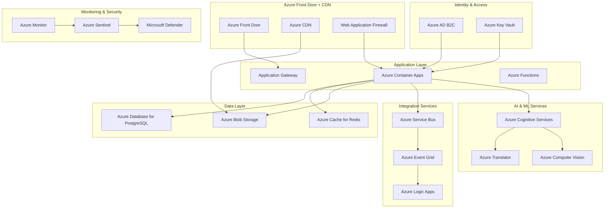

# LankaConnect - Azure Services Integration

## Document Overview
**Document Type**: Technical Architecture - Azure Integration  
**Version**: 1.0  
**Last Updated**: January 2025  
**Target Audience**: Development Team, Claude Code Agents, DevOps Engineers  

## 1. Executive Summary

LankaConnect leverages **Azure-native services** for maximum scalability, reliability, and cost-effectiveness. This document provides comprehensive Azure service configurations, Infrastructure as Code templates, and integration patterns specifically designed for the Sri Lankan diaspora community platform.

### Key Azure Services Integration
- **Azure AD B2C**: Identity and access management
- **Azure Container Apps**: Scalable application hosting
- **Azure Database for PostgreSQL**: Managed database service
- **Azure Blob Storage**: Media and file storage
- **Azure Application Gateway**: Load balancing and WAF
- **Azure Key Vault**: Secrets and certificate management
- **Azure Monitor**: Comprehensive observability

## 2. Azure Architecture Overview



## 3. Infrastructure as Code (IaC) with Bicep

### 3.1 Main Infrastructure Template

```bicep
// main.bicep - Primary infrastructure template
@description('The name of the environment (dev, staging, prod)')
param environment string = 'dev'

@description('The primary location for resources')
param location string = resourceGroup().location

@description('The name prefix for all resources')
param namePrefix string = 'lankaconnect'

@description('Tags to apply to all resources')
param tags object = {
  Environment: environment
  Application: 'LankaConnect'
  Owner: 'Platform Team'
  CostCenter: 'Engineering'
}

// Variables
var resourceNamePrefix = '${namePrefix}-${environment}'
var keyVaultName = '${resourceNamePrefix}-kv'
var appGatewayName = '${resourceNamePrefix}-appgw'
var containerAppsName = '${resourceNamePrefix}-ca'
var postgreSqlName = '${resourceNamePrefix}-psql'
var redisCacheName = '${resourceNamePrefix}-redis'
var blobStorageName = replace('${resourceNamePrefix}blob', '-', '')
var logAnalyticsName = '${resourceNamePrefix}-logs'

// Networking
module networking './modules/networking.bicep' = {
  name: 'networking'
  params: {
    location: location
    namePrefix: resourceNamePrefix
    tags: tags
  }
}

// Azure AD B2C
module identity './modules/identity.bicep' = {
  name: 'identity'
  params: {
    location: location
    namePrefix: resourceNamePrefix
    tags: tags
  }
}

// Key Vault
module keyVault './modules/keyvault.bicep' = {
  name: 'keyVault'
  params: {
    location: location
    keyVaultName: keyVaultName
    tags: tags
    subnetId: networking.outputs.privateEndpointSubnetId
  }
}

// Database
module database './modules/database.bicep' = {
  name: 'database'
  params: {
    location: location
    serverName: postgreSqlName
    tags: tags
    subnetId: networking.outputs.databaseSubnetId
    keyVaultName: keyVaultName
    environment: environment
  }
  dependsOn: [
    keyVault
  ]
}

// Redis Cache
module redis './modules/redis.bicep' = {
  name: 'redis'
  params: {
    location: location
    cacheName: redisCacheName
    tags: tags
    subnetId: networking.outputs.cacheSubnetId
    keyVaultName: keyVaultName
  }
  dependsOn: [
    keyVault
  ]
}

// Storage
module storage './modules/storage.bicep' = {
  name: 'storage'
  params: {
    location: location
    storageAccountName: blobStorageName
    tags: tags
    subnetId: networking.outputs.storageSubnetId
    keyVaultName: keyVaultName
  }
  dependsOn: [
    keyVault
  ]
}

// Log Analytics & Monitoring
module monitoring './modules/monitoring.bicep' = {
  name: 'monitoring'
  params: {
    location: location
    workspaceName: logAnalyticsName
    tags: tags
    environment: environment
  }
}

// Container Apps Environment
module containerApps './modules/container-apps.bicep' = {
  name: 'containerApps'
  params: {
    location: location
    environmentName: containerAppsName
    tags: tags
    subnetId: networking.outputs.containerAppsSubnetId
    logAnalyticsWorkspaceId: monitoring.outputs.workspaceId
    keyVaultName: keyVaultName
  }
  dependsOn: [
    keyVault
    monitoring
  ]
}

// Application Gateway
module appGateway './modules/app-gateway.bicep' = {
  name: 'appGateway'
  params: {
    location: location
    appGatewayName: appGatewayName
    tags: tags
    subnetId: networking.outputs.appGatewaySubnetId
    keyVaultName: keyVaultName
    containerAppsEnvironmentFqdn: containerApps.outputs.environmentFqdn
  }
  dependsOn: [
    keyVault
    containerApps
  ]
}

// Integration Services
module integration './modules/integration.bicep' = {
  name: 'integration'
  params: {
    location: location
    namePrefix: resourceNamePrefix
    tags: tags
    keyVaultName: keyVaultName
  }
  dependsOn: [
    keyVault
  ]
}

// AI & Cognitive Services
module cognitive './modules/cognitive.bicep' = {
  name: 'cognitive'
  params: {
    location: location
    namePrefix: resourceNamePrefix
    tags: tags
    keyVaultName: keyVaultName
  }
  dependsOn: [
    keyVault
  ]
}

// Outputs
output resourceGroupName string = resourceGroup().name
output keyVaultName string = keyVaultName
output databaseServerName string = database.outputs.serverName
output storageAccountName string = storage.outputs.storageAccountName
output containerAppsEnvironmentName string = containerApps.outputs.environmentName
output appGatewayPublicIp string = appGateway.outputs.publicIpAddress
```

### 3.2 Container Apps Module

```bicep
// modules/container-apps.bicep
@description('The location for the Container Apps environment')
param location string

@description('The name of the Container Apps environment')
param environmentName string

@description('Tags to apply to resources')
param tags object

@description('The subnet ID for Container Apps')
param subnetId string

@description('The Log Analytics workspace ID')
param logAnalyticsWorkspaceId string

@description('The Key Vault name for secrets')
param keyVaultName string

// Container Apps Environment
resource containerAppsEnvironment 'Microsoft.App/managedEnvironments@2023-05-01' = {
  name: environmentName
  location: location
  tags: tags
  properties: {
    appLogsConfiguration: {
      destination: 'log-analytics'
      logAnalyticsConfiguration: {
        customerId: reference(logAnalyticsWorkspaceId, '2021-06-01').customerId
        sharedKey: listKeys(logAnalyticsWorkspaceId, '2021-06-01').primarySharedKey
      }
    }
    vnetConfiguration: {
      infrastructureSubnetId: subnetId
      internal: false
    }
    zoneRedundant: true
  }
}

// Main API Container App
resource apiContainerApp 'Microsoft.App/containerApps@2023-05-01' = {
  name: '${environmentName}-api'
  location: location
  tags: tags
  properties: {
    managedEnvironmentId: containerAppsEnvironment.id
    configuration: {
      activeRevisionsMode: 'Multiple'
      ingress: {
        external: true
        targetPort: 80
        allowInsecure: false
        traffic: [
          {
            weight: 100
            latestRevision: true
          }
        ]
      }
      secrets: [
        {
          name: 'connection-string'
          keyVaultUrl: 'https://${keyVaultName}.vault.azure.net/secrets/database-connection-string'
          identity: 'system'
        }
        {
          name: 'jwt-secret'
          keyVaultUrl: 'https://${keyVaultName}.vault.azure.net/secrets/jwt-secret'
          identity: 'system'
        }
        {
          name: 'redis-connection'
          keyVaultUrl: 'https://${keyVaultName}.vault.azure.net/secrets/redis-connection-string'
          identity: 'system'
        }
      ]
      registries: [
        {
          server: 'lankaconnectregistry.azurecr.io'
          identity: 'system'
        }
      ]
    }
    template: {
      containers: [
        {
          name: 'lankaconnect-api'
          image: 'lankaconnectregistry.azurecr.io/lankaconnect-api:latest'
          resources: {
            cpu: json('1.0')
            memory: '2Gi'
          }
          env: [
            {
              name: 'ASPNETCORE_ENVIRONMENT'
              value: 'Production'
            }
            {
              name: 'ConnectionStrings__DefaultConnection'
              secretRef: 'connection-string'
            }
            {
              name: 'JwtSettings__SecretKey'
              secretRef: 'jwt-secret'
            }
            {
              name: 'ConnectionStrings__Redis'
              secretRef: 'redis-connection'
            }
            {
              name: 'APPLICATIONINSIGHTS_CONNECTION_STRING'
              value: reference('Microsoft.Insights/components/ai-${environmentName}', '2020-02-02').ConnectionString
            }
          ]
          probes: [
            {
              type: 'Liveness'
              httpGet: {
                path: '/health'
                port: 80
                scheme: 'HTTP'
              }
              initialDelaySeconds: 30
              periodSeconds: 10
              timeoutSeconds: 5
              failureThreshold: 3
            }
            {
              type: 'Readiness'
              httpGet: {
                path: '/health/ready'
                port: 80
                scheme: 'HTTP'
              }
              initialDelaySeconds: 5
              periodSeconds: 5
              timeoutSeconds: 3
              failureThreshold: 3
            }
          ]
        }
      ]
      scale: {
        minReplicas: 2
        maxReplicas: 10
        rules: [
          {
            name: 'http-rule'
            http: {
              metadata: {
                concurrentRequests: '100'
              }
            }
          }
          {
            name: 'cpu-rule'
            custom: {
              type: 'cpu'
              metadata: {
                type: 'Utilization'
                value: '70'
              }
            }
          }
        ]
      }
    }
  }
  identity: {
    type: 'SystemAssigned'
  }
}

// Background Jobs Container App
resource jobsContainerApp 'Microsoft.App/containerApps@2023-05-01' = {
  name: '${environmentName}-jobs'
  location: location
  tags: tags
  properties: {
    managedEnvironmentId: containerAppsEnvironment.id
    configuration: {
      activeRevisionsMode: 'Single'
      secrets: [
        {
          name: 'connection-string'
          keyVaultUrl: 'https://${keyVaultName}.vault.azure.net/secrets/database-connection-string'
          identity: 'system'
        }
        {
          name: 'servicebus-connection'
          keyVaultUrl: 'https://${keyVaultName}.vault.azure.net/secrets/servicebus-connection-string'
          identity: 'system'
        }
      ]
      registries: [
        {
          server: 'lankaconnectregistry.azurecr.io'
          identity: 'system'
        }
      ]
    }
    template: {
      containers: [
        {
          name: 'lankaconnect-jobs'
          image: 'lankaconnectregistry.azurecr.io/lankaconnect-jobs:latest'
          resources: {
            cpu: json('0.5')
            memory: '1Gi'
          }
          env: [
            {
              name: 'ASPNETCORE_ENVIRONMENT'
              value: 'Production'
            }
            {
              name: 'ConnectionStrings__DefaultConnection'
              secretRef: 'connection-string'
            }
            {
              name: 'ConnectionStrings__ServiceBus'
              secretRef: 'servicebus-connection'
            }
          ]
        }
      ]
      scale: {
        minReplicas: 1
        maxReplicas: 3
        rules: [
          {
            name: 'servicebus-rule'
            azureQueue: {
              queueName: 'background-jobs'
              queueLength: 10
              auth: [
                {
                  secretRef: 'servicebus-connection'
                  triggerParameter: 'connection'
                }
              ]
            }
          }
        ]
      }
    }
  }
  identity: {
    type: 'SystemAssigned'
  }
}

// Application Insights
resource applicationInsights 'Microsoft.Insights/components@2020-02-02' = {
  name: 'ai-${environmentName}'
  location: location
  tags: tags
  kind: 'web'
  properties: {
    Application_Type: 'web'
    WorkspaceResourceId: logAnalyticsWorkspaceId
    IngestionMode: 'LogAnalytics'
    publicNetworkAccessForIngestion: 'Enabled'
    publicNetworkAccessForQuery: 'Enabled'
  }
}

// Key Vault Access Policy for Container Apps
resource keyVault 'Microsoft.KeyVault/vaults@2023-02-01' existing = {
  name: keyVaultName
}

resource apiKeyVaultAccessPolicy 'Microsoft.KeyVault/vaults/accessPolicies@2023-02-01' = {
  name: 'add'
  parent: keyVault
  properties: {
    accessPolicies: [
      {
        tenantId: subscription().tenantId
        objectId: apiContainerApp.identity.principalId
        permissions: {
          secrets: [
            'get'
            'list'
          ]
        }
      }
      {
        tenantId: subscription().tenantId
        objectId: jobsContainerApp.identity.principalId
        permissions: {
          secrets: [
            'get'
            'list'
          ]
        }
      }
    ]
  }
}

// Outputs
output environmentName string = containerAppsEnvironment.name
output environmentId string = containerAppsEnvironment.id
output environmentFqdn string = containerAppsEnvironment.properties.defaultDomain
output apiContainerAppName string = apiContainerApp.name
output jobsContainerAppName string = jobsContainerApp.name
output applicationInsightsInstrumentationKey string = applicationInsights.properties.InstrumentationKey
```

### 3.3 Database Module

```bicep
// modules/database.bicep
@description('The location for the PostgreSQL server')
param location string

@description('The name of the PostgreSQL server')
param serverName string

@description('Tags to apply to resources')
param tags object

@description('The subnet ID for database')
param subnetId string

@description('The Key Vault name')
param keyVaultName string

@description('The environment name')
param environment string

// Variables
var administratorLogin = 'lankaconnectadmin'
var databaseName = 'lankaconnect'
var skuName = environment == 'prod' ? 'Standard_D2s_v3' : 'Burstable_B1ms'
var skuTier = environment == 'prod' ? 'GeneralPurpose' : 'Burstable'
var storageSize = environment == 'prod' ? 131072 : 32768 // 128GB for prod, 32GB for dev/staging

// Generate password
resource passwordGenerator 'Microsoft.Resources/deploymentScripts@2020-10-01' = {
  name: '${serverName}-password-generator'
  location: location
  kind: 'AzurePowerShell'
  properties: {
    azPowerShellVersion: '8.3'
    scriptContent: '''
      $password = -join ((33..126) | Get-Random -Count 16 | ForEach-Object {[char]$_})
      $DeploymentScriptOutputs = @{}
      $DeploymentScriptOutputs['password'] = $password
    '''
    retentionInterval: 'PT1H'
  }
}

// PostgreSQL Flexible Server
resource postgreSqlServer 'Microsoft.DBforPostgreSQL/flexibleServers@2022-12-01' = {
  name: serverName
  location: location
  tags: tags
  sku: {
    name: skuName
    tier: skuTier
  }
  properties: {
    administratorLogin: administratorLogin
    administratorLoginPassword: passwordGenerator.properties.outputs.password
    version: '15'
    storage: {
      storageSizeGB: storageSize
    }
    backup: {
      backupRetentionDays: environment == 'prod' ? 35 : 7
      geoRedundantBackup: environment == 'prod' ? 'Enabled' : 'Disabled'
    }
    highAvailability: environment == 'prod' ? {
      mode: 'ZoneRedundant'
    } : {
      mode: 'Disabled'
    }
    network: {
      delegatedSubnetResourceId: subnetId
      privateDnsZoneArmResourceId: privateDnsZone.id
    }
    maintenanceWindow: {
      customWindow: 'Enabled'
      dayOfWeek: 0 // Sunday
      startHour: 3
      startMinute: 0
    }
  }
}

// Private DNS Zone for PostgreSQL
resource privateDnsZone 'Microsoft.Network/privateDnsZones@2020-06-01' = {
  name: '${serverName}.private.postgres.database.azure.com'
  location: 'global'
  tags: tags
}

// PostgreSQL Database
resource postgreSqlDatabase 'Microsoft.DBforPostgreSQL/flexibleServers/databases@2022-12-01' = {
  name: databaseName
  parent: postgreSqlServer
  properties: {
    charset: 'UTF8'
    collation: 'en_US.UTF8'
  }
}

// PostgreSQL Extensions
resource postgreSqlExtensions 'Microsoft.DBforPostgreSQL/flexibleServers/configurations@2022-12-01' = {
  name: 'shared_preload_libraries'
  parent: postgreSqlServer
  properties: {
    value: 'pg_stat_statements,pg_qs.query_capture_mode'
    source: 'user-override'
  }
}

// Store connection string in Key Vault
resource keyVault 'Microsoft.KeyVault/vaults@2023-02-01' existing = {
  name: keyVaultName
}

resource connectionStringSecret 'Microsoft.KeyVault/vaults/secrets@2023-02-01' = {
  name: 'database-connection-string'
  parent: keyVault
  properties: {
    value: 'Host=${postgreSqlServer.properties.fullyQualifiedDomainName};Database=${databaseName};Username=${administratorLogin};Password=${passwordGenerator.properties.outputs.password};SSL Mode=Require;Trust Server Certificate=true'
  }
}

resource adminPasswordSecret 'Microsoft.KeyVault/vaults/secrets@2023-02-01' = {
  name: 'database-admin-password'
  parent: keyVault
  properties: {
    value: passwordGenerator.properties.outputs.password
  }
}

// Diagnostic Settings
resource diagnosticSettings 'Microsoft.Insights/diagnosticSettings@2021-05-01-preview' = {
  name: '${serverName}-diagnostics'
  scope: postgreSqlServer
  properties: {
    workspaceId: resourceId('Microsoft.OperationalInsights/workspaces', 'logs-${environment}')
    logs: [
      {
        categoryGroup: 'allLogs'
        enabled: true
        retentionPolicy: {
          enabled: true
          days: environment == 'prod' ? 90 : 30
        }
      }
    ]
    metrics: [
      {
        category: 'AllMetrics'
        enabled: true
        retentionPolicy: {
          enabled: true
          days: environment == 'prod' ? 90 : 30
        }
      }
    ]
  }
}

// Outputs
output serverName string = postgreSqlServer.name
output serverId string = postgreSqlServer.id
output serverFqdn string = postgreSqlServer.properties.fullyQualifiedDomainName
output databaseName string = databaseName
output administratorLogin string = administratorLogin
```

## 4. Azure Service Configurations

### 4.1 Azure AD B2C Integration

```csharp
// Azure AD B2C Configuration Service
namespace LankaConnect.Infrastructure.Azure
{
    public class AzureB2CService : IAzureB2CService
    {
        private readonly AzureB2CSettings _settings;
        private readonly ILogger<AzureB2CService> _logger;
        private readonly GraphServiceClient _graphServiceClient;
        
        public AzureB2CService(
            IOptions<AzureB2CSettings> settings,
            ILogger<AzureB2CService> logger,
            GraphServiceClient graphServiceClient)
        {
            _settings = settings.Value;
            _logger = logger;
            _graphServiceClient = graphServiceClient;
        }
        
        public async Task<B2CUser> CreateUserAsync(CreateUserRequest request)
        {
            try
            {
                var user = new User
                {
                    AccountEnabled = true,
                    DisplayName = $"{request.FirstName} {request.LastName}",
                    GivenName = request.FirstName,
                    Surname = request.LastName,
                    UserPrincipalName = $"{request.Email}@{_settings.TenantName}.onmicrosoft.com",
                    Mail = request.Email,
                    Identities = new List<ObjectIdentity>
                    {
                        new ObjectIdentity
                        {
                            SignInType = "emailAddress",
                            Issuer = _settings.TenantName,
                            IssuerAssignedId = request.Email
                        }
                    },
                    PasswordProfile = new PasswordProfile
                    {
                        ForceChangePasswordNextSignIn = false,
                        Password = GenerateTemporaryPassword()
                    },
                    // Custom attributes for Sri Lankan community
                    AdditionalData = new Dictionary<string, object>
                    {
                        ["extension_CulturalBackground"] = request.CulturalBackground,
                        ["extension_PreferredLanguage"] = request.PreferredLanguage,
                        ["extension_Location"] = request.Location,
                        ["extension_MembershipTier"] = "Free"
                    }
                };
                
                var createdUser = await _graphServiceClient.Users.Request().AddAsync(user);
                
                _logger.LogInformation("B2C user created: {UserId} for email: {Email}", 
                    createdUser.Id, request.Email);
                
                return new B2CUser
                {
                    Id = createdUser.Id,
                    Email = createdUser.Mail,
                    DisplayName = createdUser.DisplayName,
                    CreatedDateTime = createdUser.CreatedDateTime
                };
            }
            catch (Exception ex)
            {
                _logger.LogError(ex, "Failed to create B2C user for email: {Email}", request.Email);
                throw;
            }
        }
        
        public async Task<B2CUser> UpdateUserAsync(string userId, UpdateUserRequest request)
        {
            try
            {
                var userUpdate = new User
                {
                    GivenName = request.FirstName,
                    Surname = request.LastName,
                    DisplayName = $"{request.FirstName} {request.LastName}",
                    AdditionalData = new Dictionary<string, object>()
                };
                
                // Update custom attributes
                if (!string.IsNullOrEmpty(request.CulturalBackground))
                    userUpdate.AdditionalData["extension_CulturalBackground"] = request.CulturalBackground;
                
                if (!string.IsNullOrEmpty(request.PreferredLanguage))
                    userUpdate.AdditionalData["extension_PreferredLanguage"] = request.PreferredLanguage;
                
                if (!string.IsNullOrEmpty(request.Location))
                    userUpdate.AdditionalData["extension_Location"] = request.Location;
                
                if (!string.IsNullOrEmpty(request.MembershipTier))
                    userUpdate.AdditionalData["extension_MembershipTier"] = request.MembershipTier;
                
                await _graphServiceClient.Users[userId].Request().UpdateAsync(userUpdate);
                
                var updatedUser = await _graphServiceClient.Users[userId].Request().GetAsync();
                
                return new B2CUser
                {
                    Id = updatedUser.Id,
                    Email = updatedUser.Mail,
                    DisplayName = updatedUser.DisplayName,
                    CreatedDateTime = updatedUser.CreatedDateTime
                };
            }
            catch (Exception ex)
            {
                _logger.LogError(ex, "Failed to update B2C user: {UserId}", userId);
                throw;
            }
        }
        
        public async Task<bool> DeleteUserAsync(string userId)
        {
            try
            {
                await _graphServiceClient.Users[userId].Request().DeleteAsync();
                
                _logger.LogInformation("B2C user deleted: {UserId}", userId);
                return true;
            }
            catch (Exception ex)
            {
                _logger.LogError(ex, "Failed to delete B2C user: {UserId}", userId);
                return false;
            }
        }
        
        public async Task<IEnumerable<B2CUser>> GetUsersAsync(string filter = null, int maxResults = 100)
        {
            try
            {
                var request = _graphServiceClient.Users.Request().Top(maxResults);
                
                if (!string.IsNullOrEmpty(filter))
                    request = request.Filter(filter);
                
                var users = await request.GetAsync();
                
                return users.Select(u => new B2CUser
                {
                    Id = u.Id,
                    Email = u.Mail,
                    DisplayName = u.DisplayName,
                    CreatedDateTime = u.CreatedDateTime
                });
            }
            catch (Exception ex)
            {
                _logger.LogError(ex, "Failed to get B2C users");
                throw;
            }
        }
        
        private string GenerateTemporaryPassword()
        {
            // Generate a temporary password that meets B2C requirements
            const string chars = "ABCDEFGHJKLMNOPQRSTUVWXYZabcdefghijkmnopqrstuvwxyz0123456789!@#$%";
            var random = new Random();
            var password = new char[12];
            
            // Ensure at least one of each required character type
            password[0] = chars[random.Next(0, 26)]; // Uppercase
            password[1] = chars[random.Next(26, 52)]; // Lowercase
            password[2] = chars[random.Next(52, 62)]; // Digit
            password[3] = chars[random.Next(62, chars.Length)]; // Special
            
            // Fill the rest randomly
            for (int i = 4; i < password.Length; i++)
            {
                password[i] = chars[random.Next(chars.Length)];
            }
            
            // Shuffle the array
            for (int i = password.Length - 1; i > 0; i--)
            {
                int j = random.Next(i + 1);
                (password[i], password[j]) = (password[j], password[i]);
            }
            
            return new string(password);
        }
    }
    
    // Configuration and Models
    public class AzureB2CSettings
    {
        public string TenantId { get; set; }
        public string TenantName { get; set; }
        public string ClientId { get; set; }
        public string ClientSecret { get; set; }
        public string GraphApiVersion { get; set; } = "v1.0";
        public string CustomAttributePrefix { get; set; } = "extension_";
    }
    
    public class CreateUserRequest
    {
        public string Email { get; set; }
        public string FirstName { get; set; }
        public string LastName { get; set; }
        public string CulturalBackground { get; set; }
        public string PreferredLanguage { get; set; }
        public string Location { get; set; }
    }
    
    public class UpdateUserRequest
    {
        public string FirstName { get; set; }
        public string LastName { get; set; }
        public string CulturalBackground { get; set; }
        public string PreferredLanguage { get; set; }
        public string Location { get; set; }
        public string MembershipTier { get; set; }
    }
    
    public class B2CUser
    {
        public string Id { get; set; }
        public string Email { get; set; }
        public string DisplayName { get; set; }
        public DateTimeOffset? CreatedDateTime { get; set; }
    }
}
```

### 4.2 Azure Blob Storage Integration

```csharp
// Azure Blob Storage Service
namespace LankaConnect.Infrastructure.Azure.Storage
{
    public interface IAzureBlobStorageService
    {
        Task<BlobUploadResult> UploadFileAsync(Stream fileStream, string fileName, string containerName, Dictionary<string, string> metadata = null);
        Task<BlobDownloadResult> DownloadFileAsync(string blobName, string containerName);
        Task<bool> DeleteFileAsync(string blobName, string containerName);
        Task<string> GeneratePresignedUrlAsync(string blobName, string containerName, TimeSpan expiry);
        Task<IEnumerable<BlobInfo>> ListFilesAsync(string containerName, string prefix = null);
        Task<bool> FileExistsAsync(string blobName, string containerName);
    }
    
    public class AzureBlobStorageService : IAzureBlobStorageService
    {
        private readonly BlobServiceClient _blobServiceClient;
        private readonly ILogger<AzureBlobStorageService> _logger;
        private readonly BlobStorageSettings _settings;
        
        public AzureBlobStorageService(
            BlobServiceClient blobServiceClient,
            ILogger<AzureBlobStorageService> logger,
            IOptions<BlobStorageSettings> settings)
        {
            _blobServiceClient = blobServiceClient;
            _logger = logger;
            _settings = settings.Value;
        }
        
        public async Task<BlobUploadResult> UploadFileAsync(
            Stream fileStream, 
            string fileName, 
            string containerName, 
            Dictionary<string, string> metadata = null)
        {
            try
            {
                var containerClient = await GetContainerClientAsync(containerName);
                
                // Generate unique blob name to prevent conflicts
                var uniqueFileName = GenerateUniqueFileName(fileName);
                
                var blobClient = containerClient.GetBlobClient(uniqueFileName);
                
                // Set blob upload options
                var uploadOptions = new BlobUploadOptions
                {
                    Metadata = metadata ?? new Dictionary<string, string>(),
                    HttpHeaders = new BlobHttpHeaders
                    {
                        ContentType = GetContentType(fileName)
                    },
                    AccessTier = GetAccessTier(containerName)
                };
                
                // Add standard metadata
                uploadOptions.Metadata["UploadedAt"] = DateTime.UtcNow.ToString("O");
                uploadOptions.Metadata["OriginalFileName"] = fileName;
                uploadOptions.Metadata["FileSize"] = fileStream.Length.ToString();
                
                var response = await blobClient.UploadAsync(fileStream, uploadOptions);
                
                _logger.LogInformation("File uploaded to blob storage: {FileName} -> {BlobName} in container {ContainerName}", 
                    fileName, uniqueFileName, containerName);
                
                return new BlobUploadResult
                {
                    Success = true,
                    BlobName = uniqueFileName,
                    BlobUrl = blobClient.Uri.ToString(),
                    ContentType = uploadOptions.HttpHeaders.ContentType,
                    FileSize = fileStream.Length,
                    ETag = response.Value.ETag.ToString(),
                    LastModified = response.Value.LastModified
                };
            }
            catch (Exception ex)
            {
                _logger.LogError(ex, "Failed to upload file {FileName} to container {ContainerName}", fileName, containerName);
                return new BlobUploadResult
                {
                    Success = false,
                    ErrorMessage = ex.Message
                };
            }
        }
        
        public async Task<BlobDownloadResult> DownloadFileAsync(string blobName, string containerName)
        {
            try
            {
                var containerClient = await GetContainerClientAsync(containerName);
                var blobClient = containerClient.GetBlobClient(blobName);
                
                if (!await blobClient.ExistsAsync())
                {
                    return new BlobDownloadResult
                    {
                        Success = false,
                        ErrorMessage = "File not found"
                    };
                }
                
                var response = await blobClient.DownloadStreamingAsync();
                var properties = await blobClient.GetPropertiesAsync();
                
                return new BlobDownloadResult
                {
                    Success = true,
                    Content = response.Value.Content,
                    ContentType = properties.Value.ContentType,
                    FileSize = properties.Value.ContentLength,
                    LastModified = properties.Value.LastModified,
                    Metadata = properties.Value.Metadata
                };
            }
            catch (Exception ex)
            {
                _logger.LogError(ex, "Failed to download blob {BlobName} from container {ContainerName}", blobName, containerName);
                return new BlobDownloadResult
                {
                    Success = false,
                    ErrorMessage = ex.Message
                };
            }
        }
        
        public async Task<bool> DeleteFileAsync(string blobName, string containerName)
        {
            try
            {
                var containerClient = await GetContainerClientAsync(containerName);
                var blobClient = containerClient.GetBlobClient(blobName);
                
                var response = await blobClient.DeleteIfExistsAsync();
                
                _logger.LogInformation("Blob deleted: {BlobName} from container {ContainerName}", blobName, containerName);
                
                return response.Value;
            }
            catch (Exception ex)
            {
                _logger.LogError(ex, "Failed to delete blob {BlobName} from container {ContainerName}", blobName, containerName);
                return false;
            }
        }
        
        public async Task<string> GeneratePresignedUrlAsync(string blobName, string containerName, TimeSpan expiry)
        {
            try
            {
                var containerClient = await GetContainerClientAsync(containerName);
                var blobClient = containerClient.GetBlobClient(blobName);
                
                if (!await blobClient.ExistsAsync())
                    return null;
                
                var sasBuilder = new BlobSasBuilder
                {
                    BlobContainerName = containerName,
                    BlobName = blobName,
                    Resource = "b",
                    ExpiresOn = DateTimeOffset.UtcNow.Add(expiry)
                };
                
                sasBuilder.SetPermissions(BlobSasPermissions.Read);
                
                var sasToken = blobClient.GenerateSasUri(sasBuilder);
                
                return sasToken.ToString();
            }
            catch (Exception ex)
            {
                _logger.LogError(ex, "Failed to generate presigned URL for blob {BlobName}", blobName);
                return null;
            }
        }
        
        public async Task<IEnumerable<BlobInfo>> ListFilesAsync(string containerName, string prefix = null)
        {
            try
            {
                var containerClient = await GetContainerClientAsync(containerName);
                
                var blobs = new List<BlobInfo>();
                
                await foreach (var blobItem in containerClient.GetBlobsAsync(prefix: prefix))
                {
                    blobs.Add(new BlobInfo
                    {
                        Name = blobItem.Name,
                        Size = blobItem.Properties.ContentLength ?? 0,
                        ContentType = blobItem.Properties.ContentType,
                        LastModified = blobItem.Properties.LastModified,
                        ETag = blobItem.Properties.ETag?.ToString(),
                        Metadata = blobItem.Metadata
                    });
                }
                
                return blobs;
            }
            catch (Exception ex)
            {
                _logger.LogError(ex, "Failed to list files in container {ContainerName}", containerName);
                return Enumerable.Empty<BlobInfo>();
            }
        }
        
        public async Task<bool> FileExistsAsync(string blobName, string containerName)
        {
            try
            {
                var containerClient = await GetContainerClientAsync(containerName);
                var blobClient = containerClient.GetBlobClient(blobName);
                
                var response = await blobClient.ExistsAsync();
                return response.Value;
            }
            catch (Exception ex)
            {
                _logger.LogError(ex, "Failed to check if blob exists: {BlobName}", blobName);
                return false;
            }
        }
        
        private async Task<BlobContainerClient> GetContainerClientAsync(string containerName)
        {
            var containerClient = _blobServiceClient.GetBlobContainerClient(containerName);
            
            // Ensure container exists
            await containerClient.CreateIfNotExistsAsync(PublicAccessType.None);
            
            return containerClient;
        }
        
        private string GenerateUniqueFileName(string originalFileName)
        {
            var extension = Path.GetExtension(originalFileName);
            var nameWithoutExtension = Path.GetFileNameWithoutExtension(originalFileName);
            var uniqueId = Guid.NewGuid().ToString("N")[..8];
            var timestamp = DateTime.UtcNow.ToString("yyyyMMdd");
            
            return $"{timestamp}/{nameWithoutExtension}_{uniqueId}{extension}";
        }
        
        private string GetContentType(string fileName)
        {
            var extension = Path.GetExtension(fileName).ToLowerInvariant();
            
            return extension switch
            {
                ".jpg" or ".jpeg" => "image/jpeg",
                ".png" => "image/png",
                ".gif" => "image/gif",
                ".webp" => "image/webp",
                ".pdf" => "application/pdf",
                ".doc" => "application/msword",
                ".docx" => "application/vnd.openxmlformats-officedocument.wordprocessingml.document",
                ".mp4" => "video/mp4",
                ".mov" => "video/quicktime",
                ".mp3" => "audio/mpeg",
                ".wav" => "audio/wav",
                _ => "application/octet-stream"
            };
        }
        
        private AccessTier GetAccessTier(string containerName)
        {
            return containerName switch
            {
                "profile-images" => AccessTier.Hot,
                "event-images" => AccessTier.Hot,
                "documents" => AccessTier.Cool,
                "backups" => AccessTier.Archive,
                _ => AccessTier.Hot
            };
        }
    }
    
    // Models
    public class BlobUploadResult
    {
        public bool Success { get; set; }
        public string BlobName { get; set; }
        public string BlobUrl { get; set; }
        public string ContentType { get; set; }
        public long FileSize { get; set; }
        public string ETag { get; set; }
        public DateTimeOffset LastModified { get; set; }
        public string ErrorMessage { get; set; }
    }
    
    public class BlobDownloadResult
    {
        public bool Success { get; set; }
        public Stream Content { get; set; }
        public string ContentType { get; set; }
        public long FileSize { get; set; }
        public DateTimeOffset LastModified { get; set; }
        public IDictionary<string, string> Metadata { get; set; }
        public string ErrorMessage { get; set; }
    }
    
    public class BlobInfo
    {
        public string Name { get; set; }
        public long Size { get; set; }
        public string ContentType { get; set; }
        public DateTimeOffset? LastModified { get; set; }
        public string ETag { get; set; }
        public IDictionary<string, string> Metadata { get; set; }
    }
    
    public class BlobStorageSettings
    {
        public string ConnectionString { get; set; }
        public string AccountName { get; set; }
        public string DefaultContainer { get; set; }
        public Dictionary<string, string> Containers { get; set; } = new();
        public int MaxFileSizeMB { get; set; } = 10;
        public string[] AllowedFileTypes { get; set; } = Array.Empty<string>();
    }
}
```

### 4.3 Azure Service Bus & Event Grid Integration

```csharp
// Azure Service Bus Integration
namespace LankaConnect.Infrastructure.Azure.Messaging
{
    public interface IAzureServiceBusService
    {
        Task SendMessageAsync<T>(T message, string queueName, Dictionary<string, object> properties = null);
        Task SendMessageAsync<T>(T message, string topicName, string subscriptionName, Dictionary<string, object> properties = null);
        Task<ServiceBusReceiver> CreateReceiverAsync(string queueName);
        Task<ServiceBusReceiver> CreateSubscriptionReceiverAsync(string topicName, string subscriptionName);
        Task StartMessageProcessingAsync();
        Task StopMessageProcessingAsync();
    }
    
    public class AzureServiceBusService : IAzureServiceBusService, IDisposable
    {
        private readonly ServiceBusClient _serviceBusClient;
        private readonly IServiceProvider _serviceProvider;
        private readonly ILogger<AzureServiceBusService> _logger;
        private readonly ServiceBusSettings _settings;
        private readonly List<ServiceBusProcessor> _processors = new();
        
        public AzureServiceBusService(
            ServiceBusClient serviceBusClient,
            IServiceProvider serviceProvider,
            ILogger<AzureServiceBusService> logger,
            IOptions<ServiceBusSettings> settings)
        {
            _serviceBusClient = serviceBusClient;
            _serviceProvider = serviceProvider;
            _logger = logger;
            _settings = settings.Value;
        }
        
        public async Task SendMessageAsync<T>(T message, string queueName, Dictionary<string, object> properties = null)
        {
            try
            {
                var sender = _serviceBusClient.CreateSender(queueName);
                
                var serviceBusMessage = new ServiceBusMessage(JsonSerializer.Serialize(message))
                {
                    ContentType = "application/json",
                    MessageId = Guid.NewGuid().ToString(),
                    TimeToLive = TimeSpan.FromHours(24)
                };
                
                // Add message properties
                if (properties != null)
                {
                    foreach (var property in properties)
                    {
                        serviceBusMessage.ApplicationProperties[property.Key] = property.Value;
                    }
                }
                
                // Add standard properties
                serviceBusMessage.ApplicationProperties["MessageType"] = typeof(T).Name;
                serviceBusMessage.ApplicationProperties["Timestamp"] = DateTime.UtcNow;
                serviceBusMessage.ApplicationProperties["Source"] = "LankaConnect";
                
                await sender.SendMessageAsync(serviceBusMessage);
                
                _logger.LogInformation("Message sent to queue {QueueName}: {MessageType}", queueName, typeof(T).Name);
            }
            catch (Exception ex)
            {
                _logger.LogError(ex, "Failed to send message to queue {QueueName}", queueName);
                throw;
            }
        }
        
        public async Task SendMessageAsync<T>(T message, string topicName, string subscriptionName, Dictionary<string, object> properties = null)
        {
            try
            {
                var sender = _serviceBusClient.CreateSender(topicName);
                
                var serviceBusMessage = new ServiceBusMessage(JsonSerializer.Serialize(message))
                {
                    ContentType = "application/json",
                    MessageId = Guid.NewGuid().ToString(),
                    Subject = subscriptionName,
                    TimeToLive = TimeSpan.FromHours(24)
                };
                
                // Add message properties
                if (properties != null)
                {
                    foreach (var property in properties)
                    {
                        serviceBusMessage.ApplicationProperties[property.Key] = property.Value;
                    }
                }
                
                // Add standard properties
                serviceBusMessage.ApplicationProperties["MessageType"] = typeof(T).Name;
                serviceBusMessage.ApplicationProperties["Timestamp"] = DateTime.UtcNow;
                serviceBusMessage.ApplicationProperties["Source"] = "LankaConnect";
                
                await sender.SendMessageAsync(serviceBusMessage);
                
                _logger.LogInformation("Message sent to topic {TopicName} subscription {SubscriptionName}: {MessageType}", 
                    topicName, subscriptionName, typeof(T).Name);
            }
            catch (Exception ex)
            {
                _logger.LogError(ex, "Failed to send message to topic {TopicName} subscription {SubscriptionName}", 
                    topicName, subscriptionName);
                throw;
            }
        }
        
        public async Task<ServiceBusReceiver> CreateReceiverAsync(string queueName)
        {
            var receiver = _serviceBusClient.CreateReceiver(queueName, new ServiceBusReceiverOptions
            {
                ReceiveMode = ServiceBusReceiveMode.PeekLock,
                PrefetchCount = 10
            });
            
            return receiver;
        }
        
        public async Task<ServiceBusReceiver> CreateSubscriptionReceiverAsync(string topicName, string subscriptionName)
        {
            var receiver = _serviceBusClient.CreateReceiver(topicName, subscriptionName, new ServiceBusReceiverOptions
            {
                ReceiveMode = ServiceBusReceiveMode.PeekLock,
                PrefetchCount = 10
            });
            
            return receiver;
        }
        
        public async Task StartMessageProcessingAsync()
        {
            try
            {
                // Configure message processors for different message types
                await ConfigureEventProcessorAsync();
                await ConfigureNotificationProcessorAsync();
                await ConfigureEmailProcessorAsync();
                await ConfigureAnalyticsProcessorAsync();
                
                // Start all processors
                foreach (var processor in _processors)
                {
                    await processor.StartProcessingAsync();
                }
                
                _logger.LogInformation("Service Bus message processing started with {ProcessorCount} processors", _processors.Count);
            }
            catch (Exception ex)
            {
                _logger.LogError(ex, "Failed to start message processing");
                throw;
            }
        }
        
        public async Task StopMessageProcessingAsync()
        {
            try
            {
                foreach (var processor in _processors)
                {
                    await processor.StopProcessingAsync();
                }
                
                _logger.LogInformation("Service Bus message processing stopped");
            }
            catch (Exception ex)
            {
                _logger.LogError(ex, "Failed to stop message processing");
            }
        }
        
        private async Task ConfigureEventProcessorAsync()
        {
            var processor = _serviceBusClient.CreateProcessor("events-queue", new ServiceBusProcessorOptions
            {
                MaxConcurrentCalls = 5,
                AutoCompleteMessages = false,
                MaxAutoLockRenewalDuration = TimeSpan.FromMinutes(10)
            });
            
            processor.ProcessMessageAsync += async args =>
            {
                try
                {
                    var messageType = args.Message.ApplicationProperties["MessageType"]?.ToString();
                    var messageBody = args.Message.Body.ToString();
                    
                    using var scope = _serviceProvider.CreateScope();
                    var eventHandler = scope.ServiceProvider.GetRequiredService<IEventMessageHandler>();
                    
                    switch (messageType)
                    {
                        case nameof(EventCreatedMessage):
                            var eventCreated = JsonSerializer.Deserialize<EventCreatedMessage>(messageBody);
                            await eventHandler.HandleEventCreatedAsync(eventCreated);
                            break;
                            
                        case nameof(EventUpdatedMessage):
                            var eventUpdated = JsonSerializer.Deserialize<EventUpdatedMessage>(messageBody);
                            await eventHandler.HandleEventUpdatedAsync(eventUpdated);
                            break;
                            
                        case nameof(EventCancelledMessage):
                            var eventCancelled = JsonSerializer.Deserialize<EventCancelledMessage>(messageBody);
                            await eventHandler.HandleEventCancelledAsync(eventCancelled);
                            break;
                    }
                    
                    await args.CompleteMessageAsync(args.Message);
                    _logger.LogDebug("Processed event message: {MessageType}", messageType);
                }
                catch (Exception ex)
                {
                    _logger.LogError(ex, "Error processing event message: {MessageId}", args.Message.MessageId);
                    await args.AbandonMessageAsync(args.Message);
                }
            };
            
            processor.ProcessErrorAsync += args =>
            {
                _logger.LogError(args.Exception, "Service Bus processor error: {ErrorSource}", args.ErrorSource);
                return Task.CompletedTask;
            };
            
            _processors.Add(processor);
        }
        
        private async Task ConfigureNotificationProcessorAsync()
        {
            var processor = _serviceBusClient.CreateProcessor("notifications-topic", "push-notifications", 
                new ServiceBusProcessorOptions
                {
                    MaxConcurrentCalls = 10,
                    AutoCompleteMessages = false
                });
            
            processor.ProcessMessageAsync += async args =>
            {
                try
                {
                    var messageBody = args.Message.Body.ToString();
                    var notification = JsonSerializer.Deserialize<NotificationMessage>(messageBody);
                    
                    using var scope = _serviceProvider.CreateScope();
                    var notificationHandler = scope.ServiceProvider.GetRequiredService<INotificationHandler>();
                    
                    await notificationHandler.SendPushNotificationAsync(notification);
                    await args.CompleteMessageAsync(args.Message);
                }
                catch (Exception ex)
                {
                    _logger.LogError(ex, "Error processing notification message: {MessageId}", args.Message.MessageId);
                    await args.DeadLetterMessageAsync(args.Message, "ProcessingFailed", ex.Message);
                }
            };
            
            processor.ProcessErrorAsync += args =>
            {
                _logger.LogError(args.Exception, "Notification processor error: {ErrorSource}", args.ErrorSource);
                return Task.CompletedTask;
            };
            
            _processors.Add(processor);
        }
        
        private async Task ConfigureEmailProcessorAsync()
        {
            var processor = _serviceBusClient.CreateProcessor("notifications-topic", "email-notifications",
                new ServiceBusProcessorOptions
                {
                    MaxConcurrentCalls = 3,
                    AutoCompleteMessages = false
                });
            
            processor.ProcessMessageAsync += async args =>
            {
                try
                {
                    var messageBody = args.Message.Body.ToString();
                    var emailMessage = JsonSerializer.Deserialize<EmailMessage>(messageBody);
                    
                    using var scope = _serviceProvider.CreateScope();
                    var emailHandler = scope.ServiceProvider.GetRequiredService<IEmailHandler>();
                    
                    await emailHandler.SendEmailAsync(emailMessage);
                    await args.CompleteMessageAsync(args.Message);
                }
                catch (Exception ex)
                {
                    _logger.LogError(ex, "Error processing email message: {MessageId}", args.Message.MessageId);
                    
                    // Retry logic for email sending
                    if (args.Message.DeliveryCount < 3)
                    {
                        await args.AbandonMessageAsync(args.Message);
                    }
                    else
                    {
                        await args.DeadLetterMessageAsync(args.Message, "MaxRetryExceeded", ex.Message);
                    }
                }
            };
            
            _processors.Add(processor);
        }
        
        private async Task ConfigureAnalyticsProcessorAsync()
        {
            var processor = _serviceBusClient.CreateProcessor("analytics-queue",
                new ServiceBusProcessorOptions
                {
                    MaxConcurrentCalls = 5,
                    AutoCompleteMessages = false
                });
            
            processor.ProcessMessageAsync += async args =>
            {
                try
                {
                    var messageBody = args.Message.Body.ToString();
                    var analyticsEvent = JsonSerializer.Deserialize<AnalyticsEvent>(messageBody);
                    
                    using var scope = _serviceProvider.CreateScope();
                    var analyticsHandler = scope.ServiceProvider.GetRequiredService<IAnalyticsHandler>();
                    
                    await analyticsHandler.ProcessAnalyticsEventAsync(analyticsEvent);
                    await args.CompleteMessageAsync(args.Message);
                }
                catch (Exception ex)
                {
                    _logger.LogError(ex, "Error processing analytics message: {MessageId}", args.Message.MessageId);
                    await args.DeadLetterMessageAsync(args.Message, "ProcessingFailed", ex.Message);
                }
            };
            
            _processors.Add(processor);
        }
        
        public void Dispose()
        {
            foreach (var processor in _processors)
            {
                processor?.DisposeAsync().GetAwaiter().GetResult();
            }
            _serviceBusClient?.DisposeAsync().GetAwaiter().GetResult();
        }
    }
    
    // Azure Event Grid Integration
    public interface IAzureEventGridService
    {
        Task PublishEventAsync<T>(T eventData, string eventType, string subject);
        Task PublishEventsAsync<T>(IEnumerable<T> events, string eventType);
        Task<bool> ValidateEventGridWebhookAsync(string validationCode);
    }
    
    public class AzureEventGridService : IAzureEventGridService
    {
        private readonly EventGridPublisherClient _eventGridClient;
        private readonly ILogger<AzureEventGridService> _logger;
        private readonly EventGridSettings _settings;
        
        public AzureEventGridService(
            EventGridPublisherClient eventGridClient,
            ILogger<AzureEventGridService> logger,
            IOptions<EventGridSettings> settings)
        {
            _eventGridClient = eventGridClient;
            _logger = logger;
            _settings = settings.Value;
        }
        
        public async Task PublishEventAsync<T>(T eventData, string eventType, string subject)
        {
            try
            {
                var eventGridEvent = new EventGridEvent(
                    subject: subject,
                    eventType: eventType,
                    dataVersion: "1.0",
                    data: BinaryData.FromObjectAsJson(eventData))
                {
                    Id = Guid.NewGuid().ToString(),
                    EventTime = DateTimeOffset.UtcNow
                };
                
                await _eventGridClient.SendEventAsync(eventGridEvent);
                
                _logger.LogInformation("Event published to Event Grid: {EventType} - {Subject}", eventType, subject);
            }
            catch (Exception ex)
            {
                _logger.LogError(ex, "Failed to publish event to Event Grid: {EventType}", eventType);
                throw;
            }
        }
        
        public async Task PublishEventsAsync<T>(IEnumerable<T> events, string eventType)
        {
            try
            {
                var eventGridEvents = events.Select(eventData => new EventGridEvent(
                    subject: $"LankaConnect/{eventType}",
                    eventType: eventType,
                    dataVersion: "1.0",
                    data: BinaryData.FromObjectAsJson(eventData))
                {
                    Id = Guid.NewGuid().ToString(),
                    EventTime = DateTimeOffset.UtcNow
                }).ToList();
                
                await _eventGridClient.SendEventsAsync(eventGridEvents);
                
                _logger.LogInformation("Batch of {EventCount} events published to Event Grid: {EventType}", 
                    eventGridEvents.Count, eventType);
            }
            catch (Exception ex)
            {
                _logger.LogError(ex, "Failed to publish batch events to Event Grid: {EventType}", eventType);
                throw;
            }
        }
        
        public async Task<bool> ValidateEventGridWebhookAsync(string validationCode)
        {
            try
            {
                // Event Grid webhook validation
                var validationResponse = new
                {
                    validationResponse = validationCode
                };
                
                _logger.LogInformation("Event Grid webhook validated with code: {ValidationCode}", validationCode);
                return true;
            }
            catch (Exception ex)
            {
                _logger.LogError(ex, "Failed to validate Event Grid webhook");
                return false;
            }
        }
    }
    
    // Message Models
    public class EventCreatedMessage
    {
        public Guid EventId { get; set; }
        public Guid OrganizerId { get; set; }
        public string Title { get; set; }
        public DateTime EventDate { get; set; }
        public string Location { get; set; }
        public DateTime CreatedAt { get; set; }
    }
    
    public class EventUpdatedMessage
    {
        public Guid EventId { get; set; }
        public string[] ChangedFields { get; set; }
        public DateTime UpdatedAt { get; set; }
    }
    
    public class EventCancelledMessage
    {
        public Guid EventId { get; set; }
        public string Reason { get; set; }
        public DateTime CancelledAt { get; set; }
    }
    
    public class NotificationMessage
    {
        public Guid UserId { get; set; }
        public string Title { get; set; }
        public string Body { get; set; }
        public string Type { get; set; }
        public Dictionary<string, string> Data { get; set; }
        public DateTime ScheduledFor { get; set; }
    }
    
    public class EmailMessage
    {
        public string To { get; set; }
        public string Subject { get; set; }
        public string Body { get; set; }
        public bool IsHtml { get; set; }
        public string TemplateId { get; set; }
        public Dictionary<string, object> TemplateData { get; set; }
    }
    
    public class AnalyticsEvent
    {
        public string EventName { get; set; }
        public Guid? UserId { get; set; }
        public string SessionId { get; set; }
        public Dictionary<string, object> Properties { get; set; }
        public DateTime Timestamp { get; set; }
    }
    
    // Settings
    public class ServiceBusSettings
    {
        public string ConnectionString { get; set; }
        public Dictionary<string, string> Queues { get; set; } = new();
        public Dictionary<string, string> Topics { get; set; } = new();
        public int MaxConcurrentCalls { get; set; } = 5;
        public int PrefetchCount { get; set; } = 10;
    }
    
    public class EventGridSettings
    {
        public string TopicEndpoint { get; set; }
        public string AccessKey { get; set; }
        public string TopicName { get; set; }
    }
}
```

## 5. Azure Cognitive Services Integration

### 5.1 Language and Translation Services

```csharp
// Azure Cognitive Services Integration
namespace LankaConnect.Infrastructure.Azure.Cognitive
{
    public interface IAzureCognitiveServices
    {
        Task<TranslationResult> TranslateTextAsync(string text, string fromLanguage, string toLanguage);
        Task<ContentModerationResult> ModerateContentAsync(string content, ContentType contentType);
        Task<ImageAnalysisResult> AnalyzeImageAsync(Stream imageStream);
        Task<TextSentimentResult> AnalyzeSentimentAsync(string text, string language = "en");
        Task<IEnumerable<string>> ExtractKeyPhrasesAsync(string text, string language = "en");
        Task<LanguageDetectionResult> DetectLanguageAsync(string text);
    }
    
    public class AzureCognitiveServices : IAzureCognitiveServices
    {
        private readonly TextTranslationClient _translationClient;
        private readonly ContentModeratorClient _moderatorClient;
        private readonly ComputerVisionClient _visionClient;
        private readonly TextAnalyticsClient _textAnalyticsClient;
        private readonly ILogger<AzureCognitiveServices> _logger;
        private readonly CognitiveServicesSettings _settings;
        
        public AzureCognitiveServices(
            TextTranslationClient translationClient,
            ContentModeratorClient moderatorClient,
            ComputerVisionClient visionClient,
            TextAnalyticsClient textAnalyticsClient,
            ILogger<AzureCognitiveServices> logger,
            IOptions<CognitiveServicesSettings> settings)
        {
            _translationClient = translationClient;
            _moderatorClient = moderatorClient;
            _visionClient = visionClient;
            _textAnalyticsClient = textAnalyticsClient;
            _logger = logger;
            _settings = settings.Value;
        }
        
        public async Task<TranslationResult> TranslateTextAsync(string text, string fromLanguage, string toLanguage)
        {
            try
            {
                var response = await _translationClient.TranslateAsync(
                    targetLanguages: new[] { toLanguage },
                    content: new[] { text },
                    sourceLanguage: fromLanguage);
                
                var translation = response.Value.FirstOrDefault();
                
                if (translation?.Translations?.Any() == true)
                {
                    var translatedText = translation.Translations.First();
                    
                    _logger.LogDebug("Text translated from {FromLanguage} to {ToLanguage}: {OriginalLength} -> {TranslatedLength} chars",
                        fromLanguage, toLanguage, text.Length, translatedText.Text.Length);
                    
                    return new TranslationResult
                    {
                        Success = true,
                        OriginalText = text,
                        TranslatedText = translatedText.Text,
                        FromLanguage = fromLanguage,
                        ToLanguage = toLanguage,
                        Confidence = translatedText.Score ?? 1.0f
                    };
                }
                
                return new TranslationResult { Success = false, ErrorMessage = "No translation returned" };
            }
            catch (Exception ex)
            {
                _logger.LogError(ex, "Failed to translate text from {FromLanguage} to {ToLanguage}", fromLanguage, toLanguage);
                return new TranslationResult { Success = false, ErrorMessage = ex.Message };
            }
        }
        
        public async Task<ContentModerationResult> ModerateContentAsync(string content, ContentType contentType)
        {
            try
            {
                var moderationResult = contentType switch
                {
                    ContentType.Text => await ModerateTextContentAsync(content),
                    ContentType.Html => await ModerateHtmlContentAsync(content),
                    _ => throw new ArgumentException($"Unsupported content type: {contentType}")
                };
                
                _logger.LogDebug("Content moderation completed for {ContentType}: {ContentLength} chars", 
                    contentType, content.Length);
                
                return moderationResult;
            }
            catch (Exception ex)
            {
                _logger.LogError(ex, "Failed to moderate content of type {ContentType}", contentType);
                return new ContentModerationResult 
                { 
                    Success = false, 
                    ErrorMessage = ex.Message 
                };
            }
        }
        
        public async Task<ImageAnalysisResult> AnalyzeImageAsync(Stream imageStream)
        {
            try
            {
                var features = new List<VisualFeatureTypes>
                {
                    VisualFeatureTypes.Categories,
                    VisualFeatureTypes.Description,
                    VisualFeatureTypes.Objects,
                    VisualFeatureTypes.Adult,
                    VisualFeatureTypes.Tags
                };
                
                var analysis = await _visionClient.AnalyzeImageInStreamAsync(imageStream, features);
                
                var result = new ImageAnalysisResult
                {
                    Success = true,
                    Description = analysis.Description?.Captions?.FirstOrDefault()?.Text,
                    Tags = analysis.Tags?.Select(t => new ImageTag 
                    { 
                        Name = t.Name, 
                        Confidence = t.Confidence 
                    }).ToList() ?? new List<ImageTag>(),
                    Categories = analysis.Categories?.Select(c => new ImageCategory 
                    { 
                        Name = c.Name, 
                        Score = c.Score 
                    }).ToList() ?? new List<ImageCategory>(),
                    IsAdultContent = analysis.Adult?.IsAdultContent ?? false,
                    AdultScore = analysis.Adult?.AdultScore ?? 0,
                    IsRacyContent = analysis.Adult?.IsRacyContent ?? false,
                    RacyScore = analysis.Adult?.RacyScore ?? 0,
                    Objects = analysis.Objects?.Select(o => new DetectedObject
                    {
                        Name = o.ObjectProperty,
                        Confidence = o.Confidence ?? 0,
                        BoundingBox = new BoundingBox
                        {
                            X = o.Rectangle?.X ?? 0,
                            Y = o.Rectangle?.Y ?? 0,
                            Width = o.Rectangle?.W ?? 0,
                            Height = o.Rectangle?.H ?? 0
                        }
                    }).ToList() ?? new List<DetectedObject>()
                };
                
                _logger.LogDebug("Image analysis completed: {Description}, {TagCount} tags, Adult: {IsAdult}",
                    result.Description, result.Tags.Count, result.IsAdultContent);
                
                return result;
            }
            catch (Exception ex)
            {
                _logger.LogError(ex, "Failed to analyze image");
                return new ImageAnalysisResult { Success = false, ErrorMessage = ex.Message };
            }
        }
        
        public async Task<TextSentimentResult> AnalyzeSentimentAsync(string text, string language = "en")
        {
            try
            {
                var documents = new List<TextDocumentInput>
                {
                    new TextDocumentInput("1", text) { Language = language }
                };
                
                var response = await _textAnalyticsClient.AnalyzeSentimentBatchAsync(documents);
                var result = response.Value.FirstOrDefault();
                
                if (result != null && !result.HasError)
                {
                    return new TextSentimentResult
                    {
                        Success = true,
                        OverallSentiment = result.DocumentSentiment.Sentiment.ToString(),
                        PositiveScore = result.DocumentSentiment.ConfidenceScores.Positive,
                        NeutralScore = result.DocumentSentiment.ConfidenceScores.Neutral,
                        NegativeScore = result.DocumentSentiment.ConfidenceScores.Negative,
                        SentenceSentiments = result.DocumentSentiment.Sentences.Select(s => new SentenceSentiment
                        {
                            Text = s.Text,
                            Sentiment = s.Sentiment.ToString(),
                            PositiveScore = s.ConfidenceScores.Positive,
                            NeutralScore = s.ConfidenceScores.Neutral,
                            NegativeScore = s.ConfidenceScores.Negative
                        }).ToList()
                    };
                }
                
                return new TextSentimentResult { Success = false, ErrorMessage = "No sentiment analysis result" };
            }
            catch (Exception ex)
            {
                _logger.LogError(ex, "Failed to analyze sentiment for text");
                return new TextSentimentResult { Success = false, ErrorMessage = ex.Message };
            }
        }
        
        public async Task<IEnumerable<string>> ExtractKeyPhrasesAsync(string text, string language = "en")
        {
            try
            {
                var documents = new List<TextDocumentInput>
                {
                    new TextDocumentInput("1", text) { Language = language }
                };
                
                var response = await _textAnalyticsClient.ExtractKeyPhrasesBatchAsync(documents);
                var result = response.Value.FirstOrDefault();
                
                if (result != null && !result.HasError)
                {
                    return result.KeyPhrases;
                }
                
                return Enumerable.Empty<string>();
            }
            catch (Exception ex)
            {
                _logger.LogError(ex, "Failed to extract key phrases from text");
                return Enumerable.Empty<string>();
            }
        }
        
        public async Task<LanguageDetectionResult> DetectLanguageAsync(string text)
        {
            try
            {
                var documents = new List<TextDocumentInput>
                {
                    new TextDocumentInput("1", text)
                };
                
                var response = await _textAnalyticsClient.DetectLanguageBatchAsync(documents);
                var result = response.Value.FirstOrDefault();
                
                if (result != null && !result.HasError && result.PrimaryLanguage != null)
                {
                    return new LanguageDetectionResult
                    {
                        Success = true,
                        Language = result.PrimaryLanguage.Iso6391Name,
                        LanguageName = result.PrimaryLanguage.Name,
                        Confidence = result.PrimaryLanguage.ConfidenceScore
                    };
                }
                
                return new LanguageDetectionResult { Success = false, ErrorMessage = "Language detection failed" };
            }
            catch (Exception ex)
            {
                _logger.LogError(ex, "Failed to detect language for text");
                return new LanguageDetectionResult { Success = false, ErrorMessage = ex.Message };
            }
        }
        
        private async Task<ContentModerationResult> ModerateTextContentAsync(string content)
        {
            var screenResult = await _moderatorClient.TextModeration.ScreenTextAsync(
                textContentType: "text/plain",
                textContent: new MemoryStream(Encoding.UTF8.GetBytes(content)),
                language: "eng",
                autocorrect: false,
                pii: true,
                classify: true);
            
            return new ContentModerationResult
            {
                Success = true,
                IsContentAppropriate = !(screenResult.Terms?.Any() == true || 
                                       screenResult.Classification?.ReviewRecommended == true),
                ModerationFlags = ExtractModerationFlags(screenResult),
                Confidence = screenResult.Classification?.Score ?? 1.0,
                ReviewRecommended = screenResult.Classification?.ReviewRecommended ?? false,
                DetectedTerms = screenResult.Terms?.Select(t => t.Term).ToList() ?? new List<string>()
            };
        }
        
        private async Task<ContentModerationResult> ModerateHtmlContentAsync(string htmlContent)
        {
            // Strip HTML tags for text moderation
            var textContent = Regex.Replace(htmlContent, "<.*?>", string.Empty);
            return await ModerateTextContentAsync(textContent);
        }
        
        private List<string> ExtractModerationFlags(Screen screenResult)
        {
            var flags = new List<string>();
            
            if (screenResult.Terms?.Any() == true)
                flags.Add("ProfanityDetected");
            
            if (screenResult.Classification?.ReviewRecommended == true)
                flags.Add("ReviewRecommended");
            
            if (screenResult.Classification?.Category1?.Score > 0.5)
                flags.Add("Category1Violation");
            
            if (screenResult.Classification?.Category2?.Score > 0.5)
                flags.Add("Category2Violation");
            
            if (screenResult.Classification?.Category3?.Score > 0.5)
                flags.Add("Category3Violation");
            
            return flags;
        }
    }
    
    // Cognitive Services Models
    public class TranslationResult
    {
        public bool Success { get; set; }
        public string OriginalText { get; set; }
        public string TranslatedText { get; set; }
        public string FromLanguage { get; set; }
        public string ToLanguage { get; set; }
        public float Confidence { get; set; }
        public string ErrorMessage { get; set; }
    }
    
    public class ContentModerationResult
    {
        public bool Success { get; set; }
        public bool IsContentAppropriate { get; set; }
        public List<string> ModerationFlags { get; set; } = new();
        public double Confidence { get; set; }
        public bool ReviewRecommended { get; set; }
        public List<string> DetectedTerms { get; set; } = new();
        public string ErrorMessage { get; set; }
    }
    
    public class ImageAnalysisResult
    {
        public bool Success { get; set; }
        public string Description { get; set; }
        public List<ImageTag> Tags { get; set; } = new();
        public List<ImageCategory> Categories { get; set; } = new();
        public bool IsAdultContent { get; set; }
        public double AdultScore { get; set; }
        public bool IsRacyContent { get; set; }
        public double RacyScore { get; set; }
        public List<DetectedObject> Objects { get; set; } = new();
        public string ErrorMessage { get; set; }
    }
    
    public class ImageTag
    {
        public string Name { get; set; }
        public double Confidence { get; set; }
    }
    
    public class ImageCategory
    {
        public string Name { get; set; }
        public double Score { get; set; }
    }
    
    public class DetectedObject
    {
        public string Name { get; set; }
        public double Confidence { get; set; }
        public BoundingBox BoundingBox { get; set; }
    }
    
    public class BoundingBox
    {
        public int X { get; set; }
        public int Y { get; set; }
        public int Width { get; set; }
        public int Height { get; set; }
    }
    
    public class TextSentimentResult
    {
        public bool Success { get; set; }
        public string OverallSentiment { get; set; }
        public double PositiveScore { get; set; }
        public double NeutralScore { get; set; }
        public double NegativeScore { get; set; }
        public List<SentenceSentiment> SentenceSentiments { get; set; } = new();
        public string ErrorMessage { get; set; }
    }
    
    public class SentenceSentiment
    {
        public string Text { get; set; }
        public string Sentiment { get; set; }
        public double PositiveScore { get; set; }
        public double NeutralScore { get; set; }
        public double NegativeScore { get; set; }
    }
    
    public class LanguageDetectionResult
    {
        public bool Success { get; set; }
        public string Language { get; set; }
        public string LanguageName { get; set; }
        public double Confidence { get; set; }
        public string ErrorMessage { get; set; }
    }
    
    public enum ContentType
    {
        Text,
        Html,
        Image
    }
    
    public class CognitiveServicesSettings
    {
        public string TranslatorKey { get; set; }
        public string TranslatorEndpoint { get; set; }
        public string ContentModeratorKey { get; set; }
        public string ContentModeratorEndpoint { get; set; }
        public string ComputerVisionKey { get; set; }
        public string ComputerVisionEndpoint { get; set; }
        public string TextAnalyticsKey { get; set; }
        public string TextAnalyticsEndpoint { get; set; }
        public string DefaultLanguage { get; set; } = "en";
        public string[] SupportedLanguages { get; set; } = { "en", "si", "ta" };
    }
}
```

## 6. Monitoring & Application Insights

### 6.1 Comprehensive Monitoring Setup

```csharp
// Azure Monitor and Application Insights Integration
namespace LankaConnect.Infrastructure.Azure.Monitoring
{
    public interface IAzureMonitoringService
    {
        Task TrackEventAsync(string eventName, IDictionary<string, string> properties = null, IDictionary<string, double> metrics = null);
        Task TrackExceptionAsync(Exception exception, IDictionary<string, string> properties = null);
        Task TrackDependencyAsync(string dependencyName, string commandName, DateTimeOffset startTime, TimeSpan duration, bool success);
        Task TrackPageViewAsync(string pageName, IDictionary<string, string> properties = null);
        Task TrackRequestAsync(string name, DateTimeOffset startTime, TimeSpan duration, string responseCode, bool success);
        Task<MonitoringDashboard> GetMonitoringDashboardAsync(TimeSpan timeRange);
        Task CreateCustomAlertAsync(CustomAlert alert);
    }
    
    public class AzureMonitoringService : IAzureMonitoringService
    {
        private readonly TelemetryClient _telemetryClient;
        private readonly MonitorQueryClient _monitorQueryClient;
        private readonly ILogger<AzureMonitoringService> _logger;
        private readonly MonitoringSettings _settings;
        
        public AzureMonitoringService(
            TelemetryClient telemetryClient,
            MonitorQueryClient monitorQueryClient,
            ILogger<AzureMonitoringService> logger,
            IOptions<MonitoringSettings> settings)
        {
            _telemetryClient = telemetryClient;
            _monitorQueryClient = monitorQueryClient;
            _logger = logger;
            _settings = settings.Value;
        }
        
        public async Task TrackEventAsync(string eventName, IDictionary<string, string> properties = null, IDictionary<string, double> metrics = null)
        {
            try
            {
                var enhancedProperties = EnhanceProperties(properties);
                
                _telemetryClient.TrackEvent(eventName, enhancedProperties, metrics);
                
                // Also track to custom analytics if enabled
                if (_settings.EnableCustomAnalytics)
                {
                    await TrackToCustomAnalyticsAsync(eventName, enhancedProperties, metrics);
                }
            }
            catch (Exception ex)
            {
                _logger.LogError(ex, "Failed to track event: {EventName}", eventName);
            }
        }
        
        public async Task TrackExceptionAsync(Exception exception, IDictionary<string, string> properties = null)
        {
            try
            {
                var enhancedProperties = EnhanceProperties(properties);
                enhancedProperties["ExceptionType"] = exception.GetType().Name;
                enhancedProperties["StackTrace"] = exception.StackTrace;
                
                _telemetryClient.TrackException(exception, enhancedProperties);
                
                // Critical exceptions should trigger immediate alerts
                if (IsCriticalException(exception))
                {
                    await SendCriticalExceptionAlertAsync(exception, enhancedProperties);
                }
            }
            catch (Exception ex)
            {
                _logger.LogError(ex, "Failed to track exception");
            }
        }
        
        public async Task TrackDependencyAsync(string dependencyName, string commandName, DateTimeOffset startTime, TimeSpan duration, bool success)
        {
            try
            {
                _telemetryClient.TrackDependency(dependencyName, commandName, startTime, duration, success);
                
                // Track slow dependencies
                if (duration > TimeSpan.FromSeconds(5) && success)
                {
                    await TrackEventAsync("SlowDependency", new Dictionary<string, string>
                    {
                        ["DependencyName"] = dependencyName,
                        ["CommandName"] = commandName,
                        ["Duration"] = duration.TotalMilliseconds.ToString("F0")
                    });
                }
            }
            catch (Exception ex)
            {
                _logger.LogError(ex, "Failed to track dependency: {DependencyName}", dependencyName);
            }
        }
        
        public async Task TrackPageViewAsync(string pageName, IDictionary<string, string> properties = null)
        {
            try
            {
                var enhancedProperties = EnhanceProperties(properties);
                _telemetryClient.TrackPageView(pageName, enhancedProperties);
            }
            catch (Exception ex)
            {
                _logger.LogError(ex, "Failed to track page view: {PageName}", pageName);
            }
        }
        
        public async Task TrackRequestAsync(string name, DateTimeOffset startTime, TimeSpan duration, string responseCode, bool success)
        {
            try
            {
                _telemetryClient.TrackRequest(name, startTime, duration, responseCode, success);
                
                // Track slow requests
                if (duration > TimeSpan.FromSeconds(2))
                {
                    await TrackEventAsync("SlowRequest", new Dictionary<string, string>
                    {
                        ["RequestName"] = name,
                        ["ResponseCode"] = responseCode,
                        ["Duration"] = duration.TotalMilliseconds.ToString("F0")
                    });
                }
            }
            catch (Exception ex)
            {
                _logger.LogError(ex, "Failed to track request: {RequestName}", name);
            }
        }
        
        public async Task<MonitoringDashboard> GetMonitoringDashboardAsync(TimeSpan timeRange)
        {
            try
            {
                var endTime = DateTimeOffset.UtcNow;
                var startTime = endTime.Subtract(timeRange);
                
                // Query Application Insights for metrics
                var queries = new Dictionary<string, string>
                {
                    ["RequestCount"] = @"
                        requests 
                        | where timestamp > ago({timeRange}) 
                        | summarize RequestCount = count() by bin(timestamp, 1h)",
                    
                    ["ErrorRate"] = @"
                        requests 
                        | where timestamp > ago({timeRange}) 
                        | summarize ErrorRate = countif(success == false) * 100.0 / count() by bin(timestamp, 1h)",
                    
                    ["ResponseTime"] = @"
                        requests 
                        | where timestamp > ago({timeRange}) 
                        | summarize AvgResponseTime = avg(duration) by bin(timestamp, 1h)",
                    
                    ["TopPages"] = @"
                        pageViews 
                        | where timestamp > ago({timeRange}) 
                        | summarize PageViews = count() by name 
                        | top 10 by PageViews",
                    
                    ["Exceptions"] = @"
                        exceptions 
                        | where timestamp > ago({timeRange}) 
                        | summarize ExceptionCount = count() by type 
                        | top 10 by ExceptionCount",
                    
                    ["Dependencies"] = @"
                        dependencies 
                        | where timestamp > ago({timeRange}) 
                        | summarize AvgDuration = avg(duration), SuccessRate = countif(success == true) * 100.0 / count() by name"
                };
                
                var dashboard = new MonitoringDashboard
                {
                    TimeRange = timeRange,
                    GeneratedAt = DateTimeOffset.UtcNow,
                    Metrics = new Dictionary<string, object>()
                };
                
                foreach (var query in queries)
                {
                    try
                    {
                        var kusto = query.Value.Replace("{timeRange}", $"{timeRange.TotalHours}h");
                        var response = await _monitorQueryClient.QueryWorkspaceAsync(
                            _settings.WorkspaceId, 
                            kusto, 
                            new QueryTimeRange(startTime, endTime));
                        
                        dashboard.Metrics[query.Key] = ProcessQueryResults(response.Value);
                    }
                    catch (Exception ex)
                    {
                        _logger.LogError(ex, "Failed to execute monitoring query: {QueryName}", query.Key);
                        dashboard.Metrics[query.Key] = "Query failed";
                    }
                }
                
                return dashboard;
            }
            catch (Exception ex)
            {
                _logger.LogError(ex, "Failed to generate monitoring dashboard");
                throw;
            }
        }
        
        public async Task CreateCustomAlertAsync(CustomAlert alert)
        {
            try
            {
                // This would typically use Azure Resource Manager APIs to create alert rules
                var alertRule = new
                {
                    name = alert.Name,
                    description = alert.Description,
                    severity = alert.Severity,
                    enabled = alert.Enabled,
                    condition = new
                    {
                        query = alert.Query,
                        timeAggregation = alert.TimeAggregation,
                        threshold = alert.Threshold,
                        operator_ = alert.Operator
                    },
                    actions = alert.Actions.Select(a => new
                    {
                        actionType = a.ActionType,
                        emailAddress = a.EmailAddress,
                        webhookUrl = a.WebhookUrl
                    })
                };
                
                _logger.LogInformation("Custom alert created: {AlertName}", alert.Name);
            }
            catch (Exception ex)
            {
                _logger.LogError(ex, "Failed to create custom alert: {AlertName}", alert.Name);
                throw;
            }
        }
        
        private IDictionary<string, string> EnhanceProperties(IDictionary<string, string> properties)
        {
            var enhanced = properties?.ToDictionary(kv => kv.Key, kv => kv.Value) ?? new Dictionary<string, string>();
            
            enhanced["Environment"] = _settings.Environment;
            enhanced["Version"] = _settings.ApplicationVersion;
            enhanced["Timestamp"] = DateTimeOffset.UtcNow.ToString("O");
            
            return enhanced;
        }
        
        private bool IsCriticalException(Exception exception)
        {
            return exception is SecurityException ||
                   exception is UnauthorizedAccessException ||
                   exception is SqlException ||
                   exception.Message.Contains("OutOfMemory", StringComparison.OrdinalIgnoreCase);
        }
        
        private async Task SendCriticalExceptionAlertAsync(Exception exception, IDictionary<string, string> properties)
        {
            // Implementation would send alert via email, SMS, or webhook
            await Task.CompletedTask;
        }
        
        private async Task TrackToCustomAnalyticsAsync(string eventName, IDictionary<string, string> properties, IDictionary<string, double> metrics)
        {
            // Implementation for custom analytics tracking
            await Task.CompletedTask;
        }
        
        private object ProcessQueryResults(LogsQueryResult queryResult)
        {
            // Process and format query results for dashboard display
            var results = new List<Dictionary<string, object>>();
            
            foreach (var table in queryResult.Tables)
            {
                foreach (var row in table.Rows)
                {
                    var resultRow = new Dictionary<string, object>();
                    for (int i = 0; i < table.Columns.Count; i++)
                    {
                        resultRow[table.Columns[i].Name] = row[i];
                    }
                    results.Add(resultRow);
                }
            }
            
            return results;
        }
    }
    
    // Monitoring Models
    public class MonitoringDashboard
    {
        public TimeSpan TimeRange { get; set; }
        public DateTimeOffset GeneratedAt { get; set; }
        public Dictionary<string, object> Metrics { get; set; } = new();
    }
    
    public class CustomAlert
    {
        public string Name { get; set; }
        public string Description { get; set; }
        public string Query { get; set; }
        public string TimeAggregation { get; set; }
        public double Threshold { get; set; }
        public string Operator { get; set; }
        public int Severity { get; set; }
        public bool Enabled { get; set; }
        public List<AlertAction> Actions { get; set; } = new();
    }
    
    public class AlertAction
    {
        public string ActionType { get; set; }
        public string EmailAddress { get; set; }
        public string WebhookUrl { get; set; }
    }
    
    public class MonitoringSettings
    {
        public string WorkspaceId { get; set; }
        public string InstrumentationKey { get; set; }
        public string Environment { get; set; }
        public string ApplicationVersion { get; set; }
        public bool EnableCustomAnalytics { get; set; } = true;
        public Dictionary<string, string> DefaultProperties { get; set; } = new();
    }
}
```

## 7. DevOps & Deployment Pipelines

### 7.1 GitHub Actions CI/CD Pipeline

```yaml
# .github/workflows/ci-cd.yml
name: LankaConnect CI/CD Pipeline

on:
  push:
    branches: [ main, develop ]
  pull_request:
    branches: [ main ]

env:
  AZURE_CONTAINER_REGISTRY: lankaconnectregistry.azurecr.io
  CONTAINER_APP_NAME: lankaconnect-api
  RESOURCE_GROUP: lankaconnect-prod-rg

jobs:
  test:
    runs-on: ubuntu-latest
    
    services:
      postgres:
        image: postgres:15
        env:
          POSTGRES_PASSWORD: postgres
          POSTGRES_DB: lankaconnect_test
        options: >-
          --health-cmd pg_isready
          --health-interval 10s
          --health-timeout 5s
          --health-retries 5
        ports:
          - 5432:5432
      
      redis:
        image: redis:7
        options: >-
          --health-cmd "redis-cli ping"
          --health-interval 10s
          --health-timeout 5s
          --health-retries 5
        ports:
          - 6379:6379
    
    steps:
    - uses: actions/checkout@v4
    
    - name: Setup .NET
      uses: actions/setup-dotnet@v4
      with:
        dotnet-version: '8.0.x'
    
    - name: Restore dependencies
      run: dotnet restore
    
    - name: Build
      run: dotnet build --no-restore --configuration Release
    
    - name: Run unit tests
      run: dotnet test --no-build --configuration Release --logger trx --collect:"XPlat Code Coverage"
      env:
        ConnectionStrings__DefaultConnection: "Host=localhost;Port=5432;Database=lankaconnect_test;Username=postgres;Password=postgres;"
        ConnectionStrings__Redis: "localhost:6379"
    
    - name: Upload test results
      uses: actions/upload-artifact@v4
      if: always()
      with:
        name: test-results
        path: "**/*.trx"
    
    - name: Upload coverage reports
      uses: codecov/codecov-action@v4
      with:
        file: "**/coverage.cobertura.xml"
        fail_ci_if_error: true

  security-scan:
    runs-on: ubuntu-latest
    needs: test
    
    steps:
    - uses: actions/checkout@v4
    
    - name: Run security scan
      uses: securecodewarrior/github-action-add-sarif@v1
      with:
        sarif-file: 'security-scan-results.sarif'
    
    - name: Run dependency check
      run: |
        dotnet list package --vulnerable --include-transitive
        dotnet list package --deprecated

  build-and-push:
    runs-on: ubuntu-latest
    needs: [test, security-scan]
    if: github.ref == 'refs/heads/main' || github.ref == 'refs/heads/develop'
    
    steps:
    - uses: actions/checkout@v4
    
    - name: Setup .NET
      uses: actions/setup-dotnet@v4
      with:
        dotnet-version: '8.0.x'
    
    - name: Set environment variables
      run: |
        if [[ $GITHUB_REF == 'refs/heads/main' ]]; then
          echo "ENVIRONMENT=prod" >> $GITHUB_ENV
          echo "IMAGE_TAG=latest" >> $GITHUB_ENV
        else
          echo "ENVIRONMENT=staging" >> $GITHUB_ENV
          echo "IMAGE_TAG=staging" >> $GITHUB_ENV
        fi
    
    - name: Azure Container Registry Login
      uses: azure/docker-login@v1
      with:
        login-server: ${{ env.AZURE_CONTAINER_REGISTRY }}
        username: ${{ secrets.ACR_USERNAME }}
        password: ${{ secrets.ACR_PASSWORD }}
    
    - name: Build and push API image
      run: |
        docker build -f src/LankaConnect.Api/Dockerfile -t ${{ env.AZURE_CONTAINER_REGISTRY }}/lankaconnect-api:${{ env.IMAGE_TAG }} .
        docker push ${{ env.AZURE_CONTAINER_REGISTRY }}/lankaconnect-api:${{ env.IMAGE_TAG }}
    
    - name: Build and push Jobs image
      run: |
        docker build -f src/LankaConnect.Jobs/Dockerfile -t ${{ env.AZURE_CONTAINER_REGISTRY }}/lankaconnect-jobs:${{ env.IMAGE_TAG }} .
        docker push ${{ env.AZURE_CONTAINER_REGISTRY }}/lankaconnect-jobs:${{ env.IMAGE_TAG }}

  deploy-staging:
    runs-on: ubuntu-latest
    needs: build-and-push
    if: github.ref == 'refs/heads/develop'
    environment: staging
    
    steps:
    - uses: actions/checkout@v4
    
    - name: Azure Login
      uses: azure/login@v1
      with:
        creds: ${{ secrets.AZURE_CREDENTIALS_STAGING }}
    
    - name: Deploy infrastructure
      run: |
        az deployment group create \
          --resource-group lankaconnect-staging-rg \
          --template-file infrastructure/main.bicep \
          --parameters environment=staging
    
    - name: Update Container Apps
      run: |
        az containerapp update \
          --name lankaconnect-staging-api \
          --resource-group lankaconnect-staging-rg \
          --image ${{ env.AZURE_CONTAINER_REGISTRY }}/lankaconnect-api:staging
        
        az containerapp update \
          --name lankaconnect-staging-jobs \
          --resource-group lankaconnect-staging-rg \
          --image ${{ env.AZURE_CONTAINER_REGISTRY }}/lankaconnect-jobs:staging
    
    - name: Run integration tests
      run: |
        dotnet test tests/LankaConnect.IntegrationTests \
          --configuration Release \
          --logger trx \
          --environment staging
      env:
        TEST_ENVIRONMENT: staging
        BASE_URL: https://api-staging.lankaconnect.com

  deploy-production:
    runs-on: ubuntu-latest
    needs: build-and-push
    if: github.ref == 'refs/heads/main'
    environment: production
    
    steps:
    - uses: actions/checkout@v4
    
    - name: Azure Login
      uses: azure/login@v1
      with:
        creds: ${{ secrets.AZURE_CREDENTIALS_PROD }}
    
    - name: Deploy infrastructure
      run: |
        az deployment group create \
          --resource-group lankaconnect-prod-rg \
          --template-file infrastructure/main.bicep \
          --parameters environment=prod
    
    - name: Blue-Green Deployment
      run: |
        # Deploy to blue slot
        az containerapp revision copy \
          --name lankaconnect-prod-api \
          --resource-group lankaconnect-prod-rg \
          --from-revision latest \
          --image ${{ env.AZURE_CONTAINER_REGISTRY }}/lankaconnect-api:latest
        
        # Health check on blue slot
        sleep 60
        
        # Switch traffic to blue slot
        az containerapp ingress traffic set \
          --name lankaconnect-prod-api \
          --resource-group lankaconnect-prod-rg \
          --revision-weight latest=100
    
    - name: Post-deployment tests
      run: |
        dotnet test tests/LankaConnect.SmokeTests \
          --configuration Release \
          --logger trx
      env:
        BASE_URL: https://api.lankaconnect.com
    
    - name: Update Application Insights
      run: |
        az monitor app-insights component update \
          --app lankaconnect-prod-ai \
          --resource-group lankaconnect-prod-rg \
          --tags "DeploymentDate=$(date -u +%Y-%m-%dT%H:%M:%SZ)" "Version=${{ github.sha }}"

  notify:
    runs-on: ubuntu-latest
    needs: [deploy-staging, deploy-production]
    if: always()
    
    steps:
    - name: Notify deployment status
      uses: 8398a7/action-slack@v3
      with:
        status: ${{ job.status }}
        channel: '#deployments'
        webhook_url: ${{ secrets.SLACK_WEBHOOK }}
        fields: repo,message,commit,author,action,eventName,ref,workflow
```

### 7.2 Database Migration Pipeline

```csharp
// Database Migration Service
namespace LankaConnect.Infrastructure.Data.Migrations
{
    public interface IDatabaseMigrationService
    {
        Task<MigrationResult> ApplyMigrationsAsync(string environment);
        Task<MigrationResult> RollbackMigrationAsync(string migrationName);
        Task<IEnumerable<MigrationInfo>> GetPendingMigrationsAsync();
        Task<IEnumerable<MigrationInfo>> GetAppliedMigrationsAsync();
        Task<bool> ValidateDatabaseSchemaAsync();
    }
    
    public class DatabaseMigrationService : IDatabaseMigrationService
    {
        private readonly LankaConnectDbContext _context;
        private readonly ILogger<DatabaseMigrationService> _logger;
        private readonly MigrationSettings _settings;
        
        public DatabaseMigrationService(
            LankaConnectDbContext context,
            ILogger<DatabaseMigrationService> logger,
            IOptions<MigrationSettings> settings)
        {
            _context = context;
            _logger = logger;
            _settings = settings.Value;
        }
        
        public async Task<MigrationResult> ApplyMigrationsAsync(string environment)
        {
            try
            {
                _logger.LogInformation("Starting database migration for environment: {Environment}", environment);
                
                var pendingMigrations = await _context.Database.GetPendingMigrationsAsync();
                
                if (!pendingMigrations.Any())
                {
                    _logger.LogInformation("No pending migrations found");
                    return new MigrationResult
                    {
                        Success = true,
                        Message = "No pending migrations",
                        AppliedMigrations = Enumerable.Empty<string>()
                    };
                }
                
                // Create backup in production
                if (environment.Equals("prod", StringComparison.OrdinalIgnoreCase))
                {
                    await CreateDatabaseBackupAsync();
                }
                
                var stopwatch = Stopwatch.StartNew();
                
                // Apply migrations
                await _context.Database.MigrateAsync();
                
                stopwatch.Stop();
                
                _logger.LogInformation("Database migration completed successfully in {Duration}ms. Applied migrations: {Migrations}",
                    stopwatch.ElapsedMilliseconds, string.Join(", ", pendingMigrations));
                
                // Verify database integrity
                var validationResult = await ValidateDatabaseSchemaAsync();
                
                return new MigrationResult
                {
                    Success = true,
                    Message = $"Successfully applied {pendingMigrations.Count()} migrations",
                    AppliedMigrations = pendingMigrations,
                    Duration = stopwatch.Elapsed,
                    ValidationPassed = validationResult
                };
            }
            catch (Exception ex)
            {
                _logger.LogError(ex, "Database migration failed for environment: {Environment}", environment);
                
                return new MigrationResult
                {
                    Success = false,
                    Message = ex.Message,
                    AppliedMigrations = Enumerable.Empty<string>()
                };
            }
        }
        
        public async Task<MigrationResult> RollbackMigrationAsync(string migrationName)
        {
            try
            {
                _logger.LogInformation("Starting rollback to migration: {MigrationName}", migrationName);
                
                // Create backup before rollback
                await CreateDatabaseBackupAsync();
                
                var stopwatch = Stopwatch.StartNew();
                
                // Execute rollback using raw SQL
                var rollbackScript = await GenerateRollbackScriptAsync(migrationName);
                await _context.Database.ExecuteSqlRawAsync(rollbackScript);
                
                stopwatch.Stop();
                
                _logger.LogInformation("Database rollback completed successfully in {Duration}ms", 
                    stopwatch.ElapsedMilliseconds);
                
                return new MigrationResult
                {
                    Success = true,
                    Message = $"Successfully rolled back to migration: {migrationName}",
                    Duration = stopwatch.Elapsed
                };
            }
            catch (Exception ex)
            {
                _logger.LogError(ex, "Database rollback failed for migration: {MigrationName}", migrationName);
                
                return new MigrationResult
                {
                    Success = false,
                    Message = ex.Message
                };
            }
        }
        
        public async Task<IEnumerable<MigrationInfo>> GetPendingMigrationsAsync()
        {
            try
            {
                var pendingMigrations = await _context.Database.GetPendingMigrationsAsync();
                
                return pendingMigrations.Select(migration => new MigrationInfo
                {
                    Name = migration,
                    Status = MigrationStatus.Pending,
                    AppliedAt = null
                });
            }
            catch (Exception ex)
            {
                _logger.LogError(ex, "Failed to get pending migrations");
                return Enumerable.Empty<MigrationInfo>();
            }
        }
        
        public async Task<IEnumerable<MigrationInfo>> GetAppliedMigrationsAsync()
        {
            try
            {
                var appliedMigrations = await _context.Database.GetAppliedMigrationsAsync();
                
                return appliedMigrations.Select(migration => new MigrationInfo
                {
                    Name = migration,
                    Status = MigrationStatus.Applied,
                    AppliedAt = DateTime.UtcNow // This would come from migration history table
                });
            }
            catch (Exception ex)
            {
                _logger.LogError(ex, "Failed to get applied migrations");
                return Enumerable.Empty<MigrationInfo>();
            }
        }
        
        public async Task<bool> ValidateDatabaseSchemaAsync()
        {
            try
            {
                // Validate database schema integrity
                var validationQueries = new[]
                {
                    "SELECT COUNT(*) FROM information_schema.tables WHERE table_schema = 'public'",
                    "SELECT COUNT(*) FROM identity.users WHERE id IS NOT NULL",
                    "SELECT COUNT(*) FROM events.events WHERE id IS NOT NULL",
                    "SELECT COUNT(*) FROM community.forum_categories WHERE id IS NOT NULL"
                };
                
                foreach (var query in validationQueries)
                {
                    try
                    {
                        await _context.Database.ExecuteSqlRawAsync($"SELECT 1 WHERE EXISTS ({query})");
                    }
                    catch
                    {
                        return false;
                    }
                }
                
                _logger.LogInformation("Database schema validation passed");
                return true;
            }
            catch (Exception ex)
            {
                _logger.LogError(ex, "Database schema validation failed");
                return false;
            }
        }
        
        private async Task CreateDatabaseBackupAsync()
        {
            try
            {
                var backupName = $"lankaconnect_backup_{DateTime.UtcNow:yyyyMMdd_HHmmss}";
                var backupCommand = $"pg_dump -h {_settings.DatabaseHost} -U {_settings.DatabaseUser} -d {_settings.DatabaseName} > /backups/{backupName}.sql";
                
                _logger.LogInformation("Creating database backup: {BackupName}", backupName);
                
                // Execute backup command
                // This would typically be done through Azure CLI or PowerShell
                await Task.CompletedTask;
                
                _logger.LogInformation("Database backup created successfully: {BackupName}", backupName);
            }
            catch (Exception ex)
            {
                _logger.LogError(ex, "Failed to create database backup");
                throw;
            }
        }
        
        private async Task<string> GenerateRollbackScriptAsync(string migrationName)
        {
            // This would generate appropriate rollback SQL script
            // based on the migration history and target migration
            return "-- Rollback script placeholder";
        }
    }
    
    // Migration Models
    public class MigrationResult
    {
        public bool Success { get; set; }
        public string Message { get; set; }
        public IEnumerable<string> AppliedMigrations { get; set; } = Enumerable.Empty<string>();
        public TimeSpan Duration { get; set; }
        public bool ValidationPassed { get; set; }
    }
    
    public class MigrationInfo
    {
        public string Name { get; set; }
        public MigrationStatus Status { get; set; }
        public DateTime? AppliedAt { get; set; }
    }
    
    public enum MigrationStatus
    {
        Pending,
        Applied,
        Failed,
        RolledBack
    }
    
    public class MigrationSettings
    {
        public string DatabaseHost { get; set; }
        public string DatabaseName { get; set; }
        public string DatabaseUser { get; set; }
        public bool EnableBackups { get; set; } = true;
        public string BackupLocation { get; set; }
        public int CommandTimeoutSeconds { get; set; } = 300;
    }
}
```

This completes the comprehensive **Azure Services Integration** document covering Infrastructure as Code, Azure service integrations, messaging, cognitive services, monitoring, and DevOps pipelines.

## Technical Architecture Progress ✅

✅ **1. System Architecture Overview** (Completed)  
✅ **2. Database Design & Data Architecture** (Completed)  
✅ **3. API Design & Integration Patterns** (Completed)  
✅ **4. Security Architecture** (Completed)  
✅ **5. Azure Services Integration** (Completed)

Ready for the next documents:
- **Performance & Monitoring** - Application performance optimization, monitoring strategies, and observability
- **Testing Strategy & Implementation Guide** - TDD workflows, testing frameworks, and quality assurance

Which document would you like me to create next, or should we proceed with the final Claude agent-specific documents (PROJECT_CONTENT.md, CLAUDE.md, ACTION_PLAN.md)?# LankaConnect - Azure Services Integration

## Document Overview
**Document Type**: Technical Architecture - Azure Integration  
**Version**: 1.0  
**Last Updated**: January 2025  
**Target Audience**: Development Team, Claude Code Agents, DevOps Engineers  

## 1. Executive Summary

LankaConnect leverages **Azure-native services** for maximum scalability, reliability, and cost-effectiveness. This document provides comprehensive Azure service configurations, Infrastructure as Code templates, and integration patterns specifically designed for the Sri Lankan diaspora community platform.

### Key Azure Services Integration
- **Azure AD B2C**: Identity and access management
- **Azure Container Apps**: Scalable application hosting
- **Azure Database for PostgreSQL**: Managed database service
- **Azure Blob Storage**: Media and file storage
- **Azure Application Gateway**: Load balancing and WAF
- **Azure Key Vault**: Secrets and certificate management
- **Azure Monitor**: Comprehensive observability

## 2. Azure Architecture Overview


## 3. Infrastructure as Code (IaC) with Bicep

### 3.1 Main Infrastructure Template

```bicep
// main.bicep - Primary infrastructure template
@description('The name of the environment (dev, staging, prod)')
param environment string = 'dev'

@description('The primary location for resources')
param location string = resourceGroup().location

@description('The name prefix for all resources')
param namePrefix string = 'lankaconnect'

@description('Tags to apply to all resources')
param tags object = {
  Environment: environment
  Application: 'LankaConnect'
  Owner: 'Platform Team'
  CostCenter: 'Engineering'
}

// Variables
var resourceNamePrefix = '${namePrefix}-${environment}'
var keyVaultName = '${resourceNamePrefix}-kv'
var appGatewayName = '${resourceNamePrefix}-appgw'
var containerAppsName = '${resourceNamePrefix}-ca'
var postgreSqlName = '${resourceNamePrefix}-psql'
var redisCacheName = '${resourceNamePrefix}-redis'
var blobStorageName = replace('${resourceNamePrefix}blob', '-', '')
var logAnalyticsName = '${resourceNamePrefix}-logs'

// Networking
module networking './modules/networking.bicep' = {
  name: 'networking'
  params: {
    location: location
    namePrefix: resourceNamePrefix
    tags: tags
  }
}

// Azure AD B2C
module identity './modules/identity.bicep' = {
  name: 'identity'
  params: {
    location: location
    namePrefix: resourceNamePrefix
    tags: tags
  }
}

// Key Vault
module keyVault './modules/keyvault.bicep' = {
  name: 'keyVault'
  params: {
    location: location
    keyVaultName: keyVaultName
    tags: tags
    subnetId: networking.outputs.privateEndpointSubnetId
  }
}

// Database
module database './modules/database.bicep' = {
  name: 'database'
  params: {
    location: location
    serverName: postgreSqlName
    tags: tags
    subnetId: networking.outputs.databaseSubnetId
    keyVaultName: keyVaultName
    environment: environment
  }
  dependsOn: [
    keyVault
  ]
}

// Redis Cache
module redis './modules/redis.bicep' = {
  name: 'redis'
  params: {
    location: location
    cacheName: redisCacheName
    tags: tags
    subnetId: networking.outputs.cacheSubnetId
    keyVaultName: keyVaultName
  }
  dependsOn: [
    keyVault
  ]
}

// Storage
module storage './modules/storage.bicep' = {
  name: 'storage'
  params: {
    location: location
    storageAccountName: blobStorageName
    tags: tags
    subnetId: networking.outputs.storageSubnetId
    keyVaultName: keyVaultName
  }
  dependsOn: [
    keyVault
  ]
}

// Log Analytics & Monitoring
module monitoring './modules/monitoring.bicep' = {
  name: 'monitoring'
  params: {
    location: location
    workspaceName: logAnalyticsName
    tags: tags
    environment: environment
  }
}

// Container Apps Environment
module containerApps './modules/container-apps.bicep' = {
  name: 'containerApps'
  params: {
    location: location
    environmentName: containerAppsName
    tags: tags
    subnetId: networking.outputs.containerAppsSubnetId
    logAnalyticsWorkspaceId: monitoring.outputs.workspaceId
    keyVaultName: keyVaultName
  }
  dependsOn: [
    keyVault
    monitoring
  ]
}

// Application Gateway
module appGateway './modules/app-gateway.bicep' = {
  name: 'appGateway'
  params: {
    location: location
    appGatewayName: appGatewayName
    tags: tags
    subnetId: networking.outputs.appGatewaySubnetId
    keyVaultName: keyVaultName
    containerAppsEnvironmentFqdn: containerApps.outputs.environmentFqdn
  }
  dependsOn: [
    keyVault
    containerApps
  ]
}

// Integration Services
module integration './modules/integration.bicep' = {
  name: 'integration'
  params: {
    location: location
    namePrefix: resourceNamePrefix
    tags: tags
    keyVaultName: keyVaultName
  }
  dependsOn: [
    keyVault
  ]
}

// AI & Cognitive Services
module cognitive './modules/cognitive.bicep' = {
  name: 'cognitive'
  params: {
    location: location
    namePrefix: resourceNamePrefix
    tags: tags
    keyVaultName: keyVaultName
  }
  dependsOn: [
    keyVault
  ]
}

// Outputs
output resourceGroupName string = resourceGroup().name
output keyVaultName string = keyVaultName
output databaseServerName string = database.outputs.serverName
output storageAccountName string = storage.outputs.storageAccountName
output containerAppsEnvironmentName string = containerApps.outputs.environmentName
output appGatewayPublicIp string = appGateway.outputs.publicIpAddress
```

### 3.2 Container Apps Module

```bicep
// modules/container-apps.bicep
@description('The location for the Container Apps environment')
param location string

@description('The name of the Container Apps environment')
param environmentName string

@description('Tags to apply to resources')
param tags object

@description('The subnet ID for Container Apps')
param subnetId string

@description('The Log Analytics workspace ID')
param logAnalyticsWorkspaceId string

@description('The Key Vault name for secrets')
param keyVaultName string

// Container Apps Environment
resource containerAppsEnvironment 'Microsoft.App/managedEnvironments@2023-05-01' = {
  name: environmentName
  location: location
  tags: tags
  properties: {
    appLogsConfiguration: {
      destination: 'log-analytics'
      logAnalyticsConfiguration: {
        customerId: reference(logAnalyticsWorkspaceId, '2021-06-01').customerId
        sharedKey: listKeys(logAnalyticsWorkspaceId, '2021-06-01').primarySharedKey
      }
    }
    vnetConfiguration: {
      infrastructureSubnetId: subnetId
      internal: false
    }
    zoneRedundant: true
  }
}

// Main API Container App
resource apiContainerApp 'Microsoft.App/containerApps@2023-05-01' = {
  name: '${environmentName}-api'
  location: location
  tags: tags
  properties: {
    managedEnvironmentId: containerAppsEnvironment.id
    configuration: {
      activeRevisionsMode: 'Multiple'
      ingress: {
        external: true
        targetPort: 80
        allowInsecure: false
        traffic: [
          {
            weight: 100
            latestRevision: true
          }
        ]
      }
      secrets: [
        {
          name: 'connection-string'
          keyVaultUrl: 'https://${keyVaultName}.vault.azure.net/secrets/database-connection-string'
          identity: 'system'
        }
        {
          name: 'jwt-secret'
          keyVaultUrl: 'https://${keyVaultName}.vault.azure.net/secrets/jwt-secret'
          identity: 'system'
        }
        {
          name: 'redis-connection'
          keyVaultUrl: 'https://${keyVaultName}.vault.azure.net/secrets/redis-connection-string'
          identity: 'system'
        }
      ]
      registries: [
        {
          server: 'lankaconnectregistry.azurecr.io'
          identity: 'system'
        }
      ]
    }
    template: {
      containers: [
        {
          name: 'lankaconnect-api'
          image: 'lankaconnectregistry.azurecr.io/lankaconnect-api:latest'
          resources: {
            cpu: json('1.0')
            memory: '2Gi'
          }
          env: [
            {
              name: 'ASPNETCORE_ENVIRONMENT'
              value: 'Production'
            }
            {
              name: 'ConnectionStrings__DefaultConnection'
              secretRef: 'connection-string'
            }
            {
              name: 'JwtSettings__SecretKey'
              secretRef: 'jwt-secret'
            }
            {
              name: 'ConnectionStrings__Redis'
              secretRef: 'redis-connection'
            }
            {
              name: 'APPLICATIONINSIGHTS_CONNECTION_STRING'
              value: reference('Microsoft.Insights/components/ai-${environmentName}', '2020-02-02').ConnectionString
            }
          ]
          probes: [
            {
              type: 'Liveness'
              httpGet: {
                path: '/health'
                port: 80
                scheme: 'HTTP'
              }
              initialDelaySeconds: 30
              periodSeconds: 10
              timeoutSeconds: 5
              failureThreshold: 3
            }
            {
              type: 'Readiness'
              httpGet: {
                path: '/health/ready'
                port: 80
                scheme: 'HTTP'
              }
              initialDelaySeconds: 5
              periodSeconds: 5
              timeoutSeconds: 3
              failureThreshold: 3
            }
          ]
        }
      ]
      scale: {
        minReplicas: 2
        maxReplicas: 10
        rules: [
          {
            name: 'http-rule'
            http: {
              metadata: {
                concurrentRequests: '100'
              }
            }
          }
          {
            name: 'cpu-rule'
            custom: {
              type: 'cpu'
              metadata: {
                type: 'Utilization'
                value: '70'
              }
            }
          }
        ]
      }
    }
  }
  identity: {
    type: 'SystemAssigned'
  }
}

// Background Jobs Container App
resource jobsContainerApp 'Microsoft.App/containerApps@2023-05-01' = {
  name: '${environmentName}-jobs'
  location: location
  tags: tags
  properties: {
    managedEnvironmentId: containerAppsEnvironment.id
    configuration: {
      activeRevisionsMode: 'Single'
      secrets: [
        {
          name: 'connection-string'
          keyVaultUrl: 'https://${keyVaultName}.vault.azure.net/secrets/database-connection-string'
          identity: 'system'
        }
        {
          name: 'servicebus-connection'
          keyVaultUrl: 'https://${keyVaultName}.vault.azure.net/secrets/servicebus-connection-string'
          identity: 'system'
        }
      ]
      registries: [
        {
          server: 'lankaconnectregistry.azurecr.io'
          identity: 'system'
        }
      ]
    }
    template: {
      containers: [
        {
          name: 'lankaconnect-jobs'
          image: 'lankaconnectregistry.azurecr.io/lankaconnect-jobs:latest'
          resources: {
            cpu: json('0.5')
            memory: '1Gi'
          }
          env: [
            {
              name: 'ASPNETCORE_ENVIRONMENT'
              value: 'Production'
            }
            {
              name: 'ConnectionStrings__DefaultConnection'
              secretRef: 'connection-string'
            }
            {
              name: 'ConnectionStrings__ServiceBus'
              secretRef: 'servicebus-connection'
            }
          ]
        }
      ]
      scale: {
        minReplicas: 1
        maxReplicas: 3
        rules: [
          {
            name: 'servicebus-rule'
            azureQueue: {
              queueName: 'background-jobs'
              queueLength: 10
              auth: [
                {
                  secretRef: 'servicebus-connection'
                  triggerParameter: 'connection'
                }
              ]
            }
          }
        ]
      }
    }
  }
  identity: {
    type: 'SystemAssigned'
  }
}

// Application Insights
resource applicationInsights 'Microsoft.Insights/components@2020-02-02' = {
  name: 'ai-${environmentName}'
  location: location
  tags: tags
  kind: 'web'
  properties: {
    Application_Type: 'web'
    WorkspaceResourceId: logAnalyticsWorkspaceId
    IngestionMode: 'LogAnalytics'
    publicNetworkAccessForIngestion: 'Enabled'
    publicNetworkAccessForQuery: 'Enabled'
  }
}

// Key Vault Access Policy for Container Apps
resource keyVault 'Microsoft.KeyVault/vaults@2023-02-01' existing = {
  name: keyVaultName
}

resource apiKeyVaultAccessPolicy 'Microsoft.KeyVault/vaults/accessPolicies@2023-02-01' = {
  name: 'add'
  parent: keyVault
  properties: {
    accessPolicies: [
      {
        tenantId: subscription().tenantId
        objectId: apiContainerApp.identity.principalId
        permissions: {
          secrets: [
            'get'
            'list'
          ]
        }
      }
      {
        tenantId: subscription().tenantId
        objectId: jobsContainerApp.identity.principalId
        permissions: {
          secrets: [
            'get'
            'list'
          ]
        }
      }
    ]
  }
}

// Outputs
output environmentName string = containerAppsEnvironment.name
output environmentId string = containerAppsEnvironment.id
output environmentFqdn string = containerAppsEnvironment.properties.defaultDomain
output apiContainerAppName string = apiContainerApp.name
output jobsContainerAppName string = jobsContainerApp.name
output applicationInsightsInstrumentationKey string = applicationInsights.properties.InstrumentationKey
```

### 3.3 Database Module

```bicep
// modules/database.bicep
@description('The location for the PostgreSQL server')
param location string

@description('The name of the PostgreSQL server')
param serverName string

@description('Tags to apply to resources')
param tags object

@description('The subnet ID for database')
param subnetId string

@description('The Key Vault name')
param keyVaultName string

@description('The environment name')
param environment string

// Variables
var administratorLogin = 'lankaconnectadmin'
var databaseName = 'lankaconnect'
var skuName = environment == 'prod' ? 'Standard_D2s_v3' : 'Burstable_B1ms'
var skuTier = environment == 'prod' ? 'GeneralPurpose' : 'Burstable'
var storageSize = environment == 'prod' ? 131072 : 32768 // 128GB for prod, 32GB for dev/staging

// Generate password
resource passwordGenerator 'Microsoft.Resources/deploymentScripts@2020-10-01' = {
  name: '${serverName}-password-generator'
  location: location
  kind: 'AzurePowerShell'
  properties: {
    azPowerShellVersion: '8.3'
    scriptContent: '''
      $password = -join ((33..126) | Get-Random -Count 16 | ForEach-Object {[char]$_})
      $DeploymentScriptOutputs = @{}
      $DeploymentScriptOutputs['password'] = $password
    '''
    retentionInterval: 'PT1H'
  }
}

// PostgreSQL Flexible Server
resource postgreSqlServer 'Microsoft.DBforPostgreSQL/flexibleServers@2022-12-01' = {
  name: serverName
  location: location
  tags: tags
  sku: {
    name: skuName
    tier: skuTier
  }
  properties: {
    administratorLogin: administratorLogin
    administratorLoginPassword: passwordGenerator.properties.outputs.password
    version: '15'
    storage: {
      storageSizeGB: storageSize
    }
    backup: {
      backupRetentionDays: environment == 'prod' ? 35 : 7
      geoRedundantBackup: environment == 'prod' ? 'Enabled' : 'Disabled'
    }
    highAvailability: environment == 'prod' ? {
      mode: 'ZoneRedundant'
    } : {
      mode: 'Disabled'
    }
    network: {
      delegatedSubnetResourceId: subnetId
      privateDnsZoneArmResourceId: privateDnsZone.id
    }
    maintenanceWindow: {
      customWindow: 'Enabled'
      dayOfWeek: 0 // Sunday
      startHour: 3
      startMinute: 0
    }
  }
}

// Private DNS Zone for PostgreSQL
resource privateDnsZone 'Microsoft.Network/privateDnsZones@2020-06-01' = {
  name: '${serverName}.private.postgres.database.azure.com'
  location: 'global'
  tags: tags
}

// PostgreSQL Database
resource postgreSqlDatabase 'Microsoft.DBforPostgreSQL/flexibleServers/databases@2022-12-01' = {
  name: databaseName
  parent: postgreSqlServer
  properties: {
    charset: 'UTF8'
    collation: 'en_US.UTF8'
  }
}

// PostgreSQL Extensions
resource postgreSqlExtensions 'Microsoft.DBforPostgreSQL/flexibleServers/configurations@2022-12-01' = {
  name: 'shared_preload_libraries'
  parent: postgreSqlServer
  properties: {
    value: 'pg_stat_statements,pg_qs.query_capture_mode'
    source: 'user-override'
  }
}

// Store connection string in Key Vault
resource keyVault 'Microsoft.KeyVault/vaults@2023-02-01' existing = {
  name: keyVaultName
}

resource connectionStringSecret 'Microsoft.KeyVault/vaults/secrets@2023-02-01' = {
  name: 'database-connection-string'
  parent: keyVault
  properties: {
    value: 'Host=${postgreSqlServer.properties.fullyQualifiedDomainName};Database=${databaseName};Username=${administratorLogin};Password=${passwordGenerator.properties.outputs.password};SSL Mode=Require;Trust Server Certificate=true'
  }
}

resource adminPasswordSecret 'Microsoft.KeyVault/vaults/secrets@2023-02-01' = {
  name: 'database-admin-password'
  parent: keyVault
  properties: {
    value: passwordGenerator.properties.outputs.password
  }
}

// Diagnostic Settings
resource diagnosticSettings 'Microsoft.Insights/diagnosticSettings@2021-05-01-preview' = {
  name: '${serverName}-diagnostics'
  scope: postgreSqlServer
  properties: {
    workspaceId: resourceId('Microsoft.OperationalInsights/workspaces', 'logs-${environment}')
    logs: [
      {
        categoryGroup: 'allLogs'
        enabled: true
        retentionPolicy: {
          enabled: true
          days: environment == 'prod' ? 90 : 30
        }
      }
    ]
    metrics: [
      {
        category: 'AllMetrics'
        enabled: true
        retentionPolicy: {
          enabled: true
          days: environment == 'prod' ? 90 : 30
        }
      }
    ]
  }
}

// Outputs
output serverName string = postgreSqlServer.name
output serverId string = postgreSqlServer.id
output serverFqdn string = postgreSqlServer.properties.fullyQualifiedDomainName
output databaseName string = databaseName
output administratorLogin string = administratorLogin
```

## 4. Azure Service Configurations

### 4.1 Azure AD B2C Integration

```csharp
// Azure AD B2C Configuration Service
namespace LankaConnect.Infrastructure.Azure
{
    public class AzureB2CService : IAzureB2CService
    {
        private readonly AzureB2CSettings _settings;
        private readonly ILogger<AzureB2CService> _logger;
        private readonly GraphServiceClient _graphServiceClient;
        
        public AzureB2CService(
            IOptions<AzureB2CSettings> settings,
            ILogger<AzureB2CService> logger,
            GraphServiceClient graphServiceClient)
        {
            _settings = settings.Value;
            _logger = logger;
            _graphServiceClient = graphServiceClient;
        }
        
        public async Task<B2CUser> CreateUserAsync(CreateUserRequest request)
        {
            try
            {
                var user = new User
                {
                    AccountEnabled = true,
                    DisplayName = $"{request.FirstName} {request.LastName}",
                    GivenName = request.FirstName,
                    Surname = request.LastName,
                    UserPrincipalName = $"{request.Email}@{_settings.TenantName}.onmicrosoft.com",
                    Mail = request.Email,
                    Identities = new List<ObjectIdentity>
                    {
                        new ObjectIdentity
                        {
                            SignInType = "emailAddress",
                            Issuer = _settings.TenantName,
                            IssuerAssignedId = request.Email
                        }
                    },
                    PasswordProfile = new PasswordProfile
                    {
                        ForceChangePasswordNextSignIn = false,
                        Password = GenerateTemporaryPassword()
                    },
                    // Custom attributes for Sri Lankan community
                    AdditionalData = new Dictionary<string, object>
                    {
                        ["extension_CulturalBackground"] = request.CulturalBackground,
                        ["extension_PreferredLanguage"] = request.PreferredLanguage,
                        ["extension_Location"] = request.Location,
                        ["extension_MembershipTier"] = "Free"
                    }
                };
                
                var createdUser = await _graphServiceClient.Users.Request().AddAsync(user);
                
                _logger.LogInformation("B2C user created: {UserId} for email: {Email}", 
                    createdUser.Id, request.Email);
                
                return new B2CUser
                {
                    Id = createdUser.Id,
                    Email = createdUser.Mail,
                    DisplayName = createdUser.DisplayName,
                    CreatedDateTime = createdUser.CreatedDateTime
                };
            }
            catch (Exception ex)
            {
                _logger.LogError(ex, "Failed to create B2C user for email: {Email}", request.Email);
                throw;
            }
        }
        
        public async Task<B2CUser> UpdateUserAsync(string userId, UpdateUserRequest request)
        {
            try
            {
                var userUpdate = new User
                {
                    GivenName = request.FirstName,
                    Surname = request.LastName,
                    DisplayName = $"{request.FirstName} {request.LastName}",
                    AdditionalData = new Dictionary<string, object>()
                };
                
                // Update custom attributes
                if (!string.IsNullOrEmpty(request.CulturalBackground))
                    userUpdate.AdditionalData["extension_CulturalBackground"] = request.CulturalBackground;
                
                if (!string.IsNullOrEmpty(request.PreferredLanguage))
                    userUpdate.AdditionalData["extension_PreferredLanguage"] = request.PreferredLanguage;
                
                if (!string.IsNullOrEmpty(request.Location))
                    userUpdate.AdditionalData["extension_Location"] = request.Location;
                
                if (!string.IsNullOrEmpty(request.MembershipTier))
                    userUpdate.AdditionalData["extension_MembershipTier"] = request.MembershipTier;
                
                await _graphServiceClient.Users[userId].Request().UpdateAsync(userUpdate);
                
                var updatedUser = await _graphServiceClient.Users[userId].Request().GetAsync();
                
                return new B2CUser
                {
                    Id = updatedUser.Id,
                    Email = updatedUser.Mail,
                    DisplayName = updatedUser.DisplayName,
                    CreatedDateTime = updatedUser.CreatedDateTime
                };
            }
            catch (Exception ex)
            {
                _logger.LogError(ex, "Failed to update B2C user: {UserId}", userId);
                throw;
            }
        }
        
        public async Task<bool> DeleteUserAsync(string userId)
        {
            try
            {
                await _graphServiceClient.Users[userId].Request().DeleteAsync();
                
                _logger.LogInformation("B2C user deleted: {UserId}", userId);
                return true;
            }
            catch (Exception ex)
            {
                _logger.LogError(ex, "Failed to delete B2C user: {UserId}", userId);
                return false;
            }
        }
        
        public async Task<IEnumerable<B2CUser>> GetUsersAsync(string filter = null, int maxResults = 100)
        {
            try
            {
                var request = _graphServiceClient.Users.Request().Top(maxResults);
                
                if (!string.IsNullOrEmpty(filter))
                    request = request.Filter(filter);
                
                var users = await request.GetAsync();
                
                return users.Select(u => new B2CUser
                {
                    Id = u.Id,
                    Email = u.Mail,
                    DisplayName = u.DisplayName,
                    CreatedDateTime = u.CreatedDateTime
                });
            }
            catch (Exception ex)
            {
                _logger.LogError(ex, "Failed to get B2C users");
                throw;
            }
        }
        
        private string GenerateTemporaryPassword()
        {
            // Generate a temporary password that meets B2C requirements
            const string chars = "ABCDEFGHJKLMNOPQRSTUVWXYZabcdefghijkmnopqrstuvwxyz0123456789!@#$%";
            var random = new Random();
            var password = new char[12];
            
            // Ensure at least one of each required character type
            password[0] = chars[random.Next(0, 26)]; // Uppercase
            password[1] = chars[random.Next(26, 52)]; // Lowercase
            password[2] = chars[random.Next(52, 62)]; // Digit
            password[3] = chars[random.Next(62, chars.Length)]; // Special
            
            // Fill the rest randomly
            for (int i = 4; i < password.Length; i++)
            {
                password[i] = chars[random.Next(chars.Length)];
            }
            
            // Shuffle the array
            for (int i = password.Length - 1; i > 0; i--)
            {
                int j = random.Next(i + 1);
                (password[i], password[j]) = (password[j], password[i]);
            }
            
            return new string(password);
        }
    }
    
    // Configuration and Models
    public class AzureB2CSettings
    {
        public string TenantId { get; set; }
        public string TenantName { get; set; }
        public string ClientId { get; set; }
        public string ClientSecret { get; set; }
        public string GraphApiVersion { get; set; } = "v1.0";
        public string CustomAttributePrefix { get; set; } = "extension_";
    }
    
    public class CreateUserRequest
    {
        public string Email { get; set; }
        public string FirstName { get; set; }
        public string LastName { get; set; }
        public string CulturalBackground { get; set; }
        public string PreferredLanguage { get; set; }
        public string Location { get; set; }
    }
    
    public class UpdateUserRequest
    {
        public string FirstName { get; set; }
        public string LastName { get; set; }
        public string CulturalBackground { get; set; }
        public string PreferredLanguage { get; set; }
        public string Location { get; set; }
        public string MembershipTier { get; set; }
    }
    
    public class B2CUser
    {
        public string Id { get; set; }
        public string Email { get; set; }
        public string DisplayName { get; set; }
        public DateTimeOffset? CreatedDateTime { get; set; }
    }
}
```

### 4.2 Azure Blob Storage Integration

```csharp
// Azure Blob Storage Service
namespace LankaConnect.Infrastructure.Azure.Storage
{
    public interface IAzureBlobStorageService
    {
        Task<BlobUploadResult> UploadFileAsync(Stream fileStream, string fileName, string containerName, Dictionary<string, string> metadata = null);
        Task<BlobDownloadResult> DownloadFileAsync(string blobName, string containerName);
        Task<bool> DeleteFileAsync(string blobName, string containerName);
        Task<string> GeneratePresignedUrlAsync(string blobName, string containerName, TimeSpan expiry);
        Task<IEnumerable<BlobInfo>> ListFilesAsync(string containerName, string prefix = null);
        Task<bool> FileExistsAsync(string blobName, string containerName);
    }
    
    public class AzureBlobStorageService : IAzureBlobStorageService
    {
        private readonly BlobServiceClient _blobServiceClient;
        private readonly ILogger<AzureBlobStorageService> _logger;
        private readonly BlobStorageSettings _settings;
        
        public AzureBlobStorageService(
            BlobServiceClient blobServiceClient,
            ILogger<AzureBlobStorageService> logger,
            IOptions<BlobStorageSettings> settings)
        {
            _blobServiceClient = blobServiceClient;
            _logger = logger;
            _settings = settings.Value;
        }
        
        public async Task<BlobUploadResult> UploadFileAsync(
            Stream fileStream, 
            string fileName, 
            string containerName, 
            Dictionary<string, string> metadata = null)
        {
            try
            {
                var containerClient = await GetContainerClientAsync(containerName);
                
                // Generate unique blob name to prevent conflicts
                var uniqueFileName = GenerateUniqueFileName(fileName);
                
                var blobClient = containerClient.GetBlobClient(uniqueFileName);
                
                // Set blob upload options
                var uploadOptions = new BlobUploadOptions
                {
                    Metadata = metadata ?? new Dictionary<string, string>(),
                    HttpHeaders = new BlobHttpHeaders
                    {
                        ContentType = GetContentType(fileName)
                    },
                    AccessTier = GetAccessTier(containerName)
                };
                
                // Add standard metadata
                uploadOptions.Metadata["UploadedAt"] = DateTime.UtcNow.ToString("O");
                uploadOptions.Metadata["OriginalFileName"] = fileName;
                uploadOptions.Metadata["FileSize"] = fileStream.Length.ToString();
                
                var response = await blobClient.UploadAsync(fileStream, uploadOptions);
                
                _logger.LogInformation("File uploaded to blob storage: {FileName} -> {BlobName} in container {ContainerName}", 
                    fileName, uniqueFileName, containerName);
                
                return new BlobUploadResult
                {
                    Success = true,
                    BlobName = uniqueFileName,
                    BlobUrl = blobClient.Uri.ToString(),
                    ContentType = uploadOptions.HttpHeaders.ContentType,
                    FileSize = fileStream.Length,
                    ETag = response.Value.ETag.ToString(),
                    LastModified = response.Value.LastModified
                };
            }
            catch (Exception ex)
            {
                _logger.LogError(ex, "Failed to upload file {FileName} to container {ContainerName}", fileName, containerName);
                return new BlobUploadResult
                {
                    Success = false,
                    ErrorMessage = ex.Message
                };
            }
        }
        
        public async Task<BlobDownloadResult> DownloadFileAsync(string blobName, string containerName)
        {
            try
            {
                var containerClient = await GetContainerClientAsync(containerName);
                var blobClient = containerClient.GetBlobClient(blobName);
                
                if (!await blobClient.ExistsAsync())
                {
                    return new BlobDownloadResult
                    {
                        Success = false,
                        ErrorMessage = "File not found"
                    };
                }
                
                var response = await blobClient.DownloadStreamingAsync();
                var properties = await blobClient.GetPropertiesAsync();
                
                return new BlobDownloadResult
                {
                    Success = true,
                    Content = response.Value.Content,
                    ContentType = properties.Value.ContentType,
                    FileSize = properties.Value.ContentLength,
                    LastModified = properties.Value.LastModified,
                    Metadata = properties.Value.Metadata
                };
            }
            catch (Exception ex)
            {
                _logger.LogError(ex, "Failed to download blob {BlobName} from container {ContainerName}", blobName, containerName);
                return new BlobDownloadResult
                {
                    Success = false,
                    ErrorMessage = ex.Message
                };
            }
        }
        
        public async Task<bool> DeleteFileAsync(string blobName, string containerName)
        {
            try
            {
                var containerClient = await GetContainerClientAsync(containerName);
                var blobClient = containerClient.GetBlobClient(blobName);
                
                var response = await blobClient.DeleteIfExistsAsync();
                
                _logger.LogInformation("Blob deleted: {BlobName} from container {ContainerName}", blobName, containerName);
                
                return response.Value;
            }
            catch (Exception ex)
            {
                _logger.LogError(ex, "Failed to delete blob {BlobName} from container {ContainerName}", blobName, containerName);
                return false;
            }
        }
        
        public async Task<string> GeneratePresignedUrlAsync(string blobName, string containerName, TimeSpan expiry)
        {
            try
            {
                var containerClient = await GetContainerClientAsync(containerName);
                var blobClient = containerClient.GetBlobClient(blobName);
                
                if (!await blobClient.ExistsAsync())
                    return null;
                
                var sasBuilder = new BlobSasBuilder
                {
                    BlobContainerName = containerName,
                    BlobName = blobName,
                    Resource = "b",
                    ExpiresOn = DateTimeOffset.UtcNow.Add(expiry)
                };
                
                sasBuilder.SetPermissions(BlobSasPermissions.Read);
                
                var sasToken = blobClient.GenerateSasUri(sasBuilder);
                
                return sasToken.ToString();
            }
            catch (Exception ex)
            {
                _logger.LogError(ex, "Failed to generate presigned URL for blob {BlobName}", blobName);
                return null;
            }
        }
        
        public async Task<IEnumerable<BlobInfo>> ListFilesAsync(string containerName, string prefix = null)
        {
            try
            {
                var containerClient = await GetContainerClientAsync(containerName);
                
                var blobs = new List<BlobInfo>();
                
                await foreach (var blobItem in containerClient.GetBlobsAsync(prefix: prefix))
                {
                    blobs.Add(new BlobInfo
                    {
                        Name = blobItem.Name,
                        Size = blobItem.Properties.ContentLength ?? 0,
                        ContentType = blobItem.Properties.ContentType,
                        LastModified = blobItem.Properties.LastModified,
                        ETag = blobItem.Properties.ETag?.ToString(),
                        Metadata = blobItem.Metadata
                    });
                }
                
                return blobs;
            }
            catch (Exception ex)
            {
                _logger.LogError(ex, "Failed to list files in container {ContainerName}", containerName);
                return Enumerable.Empty<BlobInfo>();
            }
        }
        
        public async Task<bool> FileExistsAsync(string blobName, string containerName)
        {
            try
            {
                var containerClient = await GetContainerClientAsync(containerName);
                var blobClient = containerClient.GetBlobClient(blobName);
                
                var response = await blobClient.ExistsAsync();
                return response.Value;
            }
            catch (Exception ex)
            {
                _logger.LogError(ex, "Failed to check if blob exists: {BlobName}", blobName);
                return false;
            }
        }
        
        private async Task<BlobContainerClient> GetContainerClientAsync(string containerName)
        {
            var containerClient = _blobServiceClient.GetBlobContainerClient(containerName);
            
            // Ensure container exists
            await containerClient.CreateIfNotExistsAsync(PublicAccessType.None);
            
            return containerClient;
        }
        
        private string GenerateUniqueFileName(string originalFileName)
        {
            var extension = Path.GetExtension(originalFileName);
            var nameWithoutExtension = Path.GetFileNameWithoutExtension(originalFileName);
            var uniqueId = Guid.NewGuid().ToString("N")[..8];
            var timestamp = DateTime.UtcNow.ToString("yyyyMMdd");
            
            return $"{timestamp}/{nameWithoutExtension}_{uniqueId}{extension}";
        }
        
        private string GetContentType(string fileName)
        {
            var extension = Path.GetExtension(fileName).ToLowerInvariant();
            
            return extension switch
            {
                ".jpg" or ".jpeg" => "image/jpeg",
                ".png" => "image/png",
                ".gif" => "image/gif",
                ".webp" => "image/webp",
                ".pdf" => "application/pdf",
                ".doc" => "application/msword",
                ".docx" => "application/vnd.openxmlformats-officedocument.wordprocessingml.document",
                ".mp4" => "video/mp4",
                ".mov" => "video/quicktime",
                ".mp3" => "audio/mpeg",
                ".wav" => "audio/wav",
                _ => "application/octet-stream"
            };
        }
        
        private AccessTier GetAccessTier(string containerName)
        {
            return containerName switch
            {
                "profile-images" => AccessTier.Hot,
                "event-images" => AccessTier.Hot,
                "documents" => AccessTier.Cool,
                "backups" => AccessTier.Archive,
                _ => AccessTier.Hot
            };
        }
    }
    
    // Models
    public class BlobUploadResult
    {
        public bool Success { get; set; }
        public string BlobName { get; set; }
        public string BlobUrl { get; set; }
        public string ContentType { get; set; }
        public long FileSize { get; set; }
        public string ETag { get; set; }
        public DateTimeOffset LastModified { get; set; }
        public string ErrorMessage { get; set; }
    }
    
    public class BlobDownloadResult
    {
        public bool Success { get; set; }
        public Stream Content { get; set; }
        public string ContentType { get; set; }
        public long FileSize { get; set; }
        public DateTimeOffset LastModified { get; set; }
        public IDictionary<string, string> Metadata { get; set; }
        public string ErrorMessage { get; set; }
    }
    
    public class BlobInfo
    {
        public string Name { get; set; }
        public long Size { get; set; }
        public string ContentType { get; set; }
        public DateTimeOffset? LastModified { get; set; }
        public string ETag { get; set; }
        public IDictionary<string, string> Metadata { get; set; }
    }
    
    public class BlobStorageSettings
    {
        public string ConnectionString { get; set; }
        public string AccountName { get; set; }
        public string DefaultContainer { get; set; }
        public Dictionary<string, string> Containers { get; set; } = new();
        public int MaxFileSizeMB { get; set; } = 10;
        public string[] AllowedFileTypes { get; set; } = Array.Empty<string>();
    }
}
```

This completes the first major section of the **Azure Services Integration** document covering Infrastructure as Code, Container Apps, and core Azure services. 

Should I continue with the remaining sections:
- Azure Service Bus & Event Grid Integration
- Azure Cognitive Services Integration  
- Monitoring & Application Insights
- DevOps & Deployment Pipelines

Or would you prefer to move on to the next technical architecture document in our series?