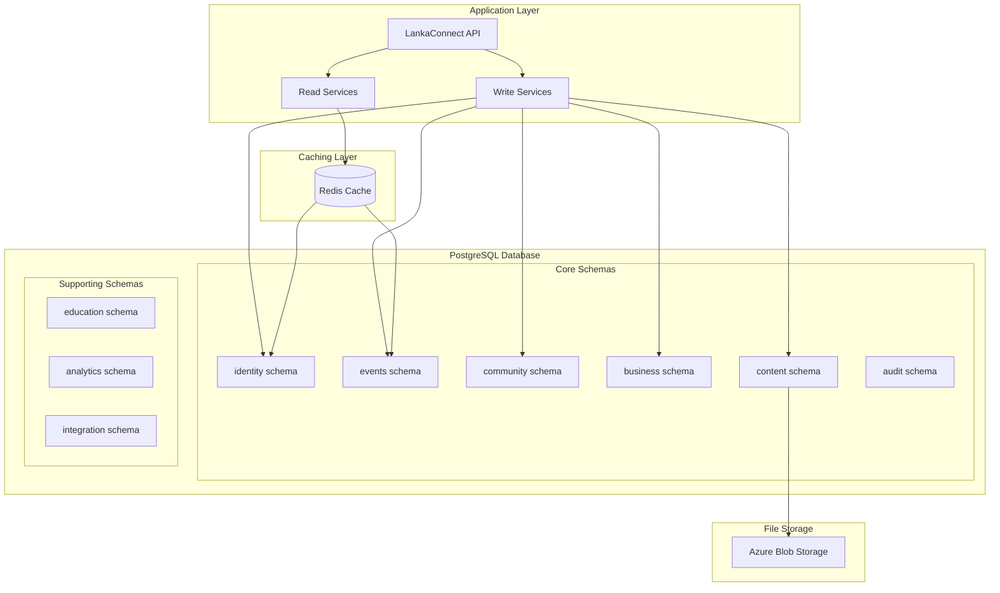

# LankaConnect - Database Design & Data Architecture

## Document Overview
**Document Type**: Technical Architecture - Database Design  
**Version**: 1.0  
**Last Updated**: January 2025  
**Target Audience**: Development Team, Claude Code Agents  

## 1. Executive Summary

LankaConnect uses **PostgreSQL** as the primary database with **Entity Framework Core** for data access. The design follows DDD principles with aggregate boundaries, supports both transactional and analytical workloads, and is optimized for the Sri Lankan diaspora community platform requirements.

### Key Database Design Decisions
- **Single Database, Multiple Schemas**: Logical separation by bounded context
- **PostgreSQL with JSONB**: Flexible schema for cultural content and user preferences
- **Entity Framework Core**: Code-first approach with migrations
- **Read/Write Separation**: CQRS pattern with optimized read models
- **Audit Trail**: Comprehensive tracking for community moderation

## 2. Database Architecture Overview



## 3. Schema Design by Bounded Context

### 3.1 Identity Schema

```sql
-- Identity Schema - User Management and Authentication
CREATE SCHEMA IF NOT EXISTS identity;

-- Users table (Aggregate Root)
CREATE TABLE identity.users (
    id UUID PRIMARY KEY DEFAULT gen_random_uuid(),
    email VARCHAR(255) NOT NULL UNIQUE,
    email_verified BOOLEAN DEFAULT FALSE,
    password_hash VARCHAR(500), -- Nullable for social login users
    auth_provider VARCHAR(50) NOT NULL DEFAULT 'local', -- local, google, facebook, apple
    external_id VARCHAR(255), -- Provider-specific user ID
    membership_tier VARCHAR(20) NOT NULL DEFAULT 'free', -- free, premium, super_premium, family
    membership_expires_at TIMESTAMP WITH TIME ZONE,
    is_active BOOLEAN DEFAULT TRUE,
    is_verified BOOLEAN DEFAULT FALSE,
    created_at TIMESTAMP WITH TIME ZONE DEFAULT NOW(),
    updated_at TIMESTAMP WITH TIME ZONE DEFAULT NOW(),
    version INTEGER DEFAULT 1 -- Optimistic concurrency
);

-- User Profiles (Value Object)
CREATE TABLE identity.user_profiles (
    user_id UUID PRIMARY KEY REFERENCES identity.users(id) ON DELETE CASCADE,
    first_name VARCHAR(100) NOT NULL,
    last_name VARCHAR(100) NOT NULL,
    display_name VARCHAR(150),
    phone_number VARCHAR(20),
    date_of_birth DATE,
    gender VARCHAR(20),
    bio TEXT,
    profile_image_url TEXT,
    location JSONB, -- { "address": "", "city": "", "state": "", "country": "", "coordinates": [lat, lng] }
    cultural_preferences JSONB, -- { "languages": [], "interests": [], "dietary": [] }
    privacy_settings JSONB, -- { "profile_visibility": "public", "contact_visibility": "members" }
    social_links JSONB, -- { "facebook": "", "instagram": "", "linkedin": "" }
    created_at TIMESTAMP WITH TIME ZONE DEFAULT NOW(),
    updated_at TIMESTAMP WITH TIME ZONE DEFAULT NOW()
);

-- User Roles and Permissions
CREATE TABLE identity.roles (
    id UUID PRIMARY KEY DEFAULT gen_random_uuid(),
    name VARCHAR(50) NOT NULL UNIQUE,
    description TEXT,
    permissions JSONB, -- Array of permission strings
    is_active BOOLEAN DEFAULT TRUE,
    created_at TIMESTAMP WITH TIME ZONE DEFAULT NOW()
);

CREATE TABLE identity.user_roles (
    user_id UUID REFERENCES identity.users(id) ON DELETE CASCADE,
    role_id UUID REFERENCES identity.roles(id) ON DELETE CASCADE,
    assigned_at TIMESTAMP WITH TIME ZONE DEFAULT NOW(),
    assigned_by UUID REFERENCES identity.users(id),
    expires_at TIMESTAMP WITH TIME ZONE,
    PRIMARY KEY (user_id, role_id)
);

-- Membership Tiers Configuration
CREATE TABLE identity.membership_tiers (
    id UUID PRIMARY KEY DEFAULT gen_random_uuid(),
    name VARCHAR(50) NOT NULL UNIQUE,
    display_name VARCHAR(100) NOT NULL,
    description TEXT,
    price_monthly DECIMAL(10,2),
    price_annual DECIMAL(10,2),
    features JSONB, -- Array of feature flags
    limits JSONB, -- { "events_per_month": 3, "business_listings": 1 }
    is_active BOOLEAN DEFAULT TRUE,
    sort_order INTEGER DEFAULT 0,
    created_at TIMESTAMP WITH TIME ZONE DEFAULT NOW()
);

-- User Sessions and Tokens
CREATE TABLE identity.user_sessions (
    id UUID PRIMARY KEY DEFAULT gen_random_uuid(),
    user_id UUID NOT NULL REFERENCES identity.users(id) ON DELETE CASCADE,
    refresh_token_hash VARCHAR(500) NOT NULL,
    device_info JSONB, -- Browser, OS, etc.
    ip_address INET,
    location JSONB, -- Geo location if available
    created_at TIMESTAMP WITH TIME ZONE DEFAULT NOW(),
    expires_at TIMESTAMP WITH TIME ZONE NOT NULL,
    last_accessed_at TIMESTAMP WITH TIME ZONE DEFAULT NOW(),
    is_active BOOLEAN DEFAULT TRUE
);
```

### 3.2 Events Schema

```sql
-- Events Schema - Event Management and Ticketing
CREATE SCHEMA IF NOT EXISTS events;

-- Events table (Aggregate Root)
CREATE TABLE events.events (
    id UUID PRIMARY KEY DEFAULT gen_random_uuid(),
    organizer_id UUID NOT NULL REFERENCES identity.users(id),
    title VARCHAR(200) NOT NULL,
    description TEXT,
    short_description VARCHAR(500),
    category VARCHAR(50) NOT NULL, -- cultural, religious, professional, social, sports
    subcategory VARCHAR(50),
    event_type VARCHAR(30) NOT NULL, -- in_person, virtual, hybrid
    status VARCHAR(20) NOT NULL DEFAULT 'draft', -- draft, published, cancelled, completed
    
    -- Scheduling
    start_date TIMESTAMP WITH TIME ZONE NOT NULL,
    end_date TIMESTAMP WITH TIME ZONE,
    timezone VARCHAR(50) NOT NULL DEFAULT 'America/New_York',
    is_recurring BOOLEAN DEFAULT FALSE,
    recurrence_pattern JSONB, -- { "frequency": "weekly", "interval": 1, "end_date": "" }
    
    -- Location
    location_type VARCHAR(20) NOT NULL, -- venue, online, tbd
    venue_name VARCHAR(200),
    address JSONB, -- { "street": "", "city": "", "state": "", "zip": "", "country": "" }
    coordinates POINT, -- PostGIS point for geospatial queries
    online_details JSONB, -- { "platform": "zoom", "meeting_url": "", "meeting_id": "" }
    
    -- Media and Content
    banner_image_url TEXT,
    gallery_images JSONB, -- Array of image URLs
    tags JSONB, -- Array of tags for search
    
    -- Settings
    is_featured BOOLEAN DEFAULT FALSE,
    is_private BOOLEAN DEFAULT FALSE,
    requires_approval BOOLEAN DEFAULT FALSE,
    max_attendees INTEGER,
    registration_deadline TIMESTAMP WITH TIME ZONE,
    
    -- SEO and Social
    slug VARCHAR(300) UNIQUE,
    meta_description TEXT,
    social_image_url TEXT,
    
    -- Tracking
    view_count INTEGER DEFAULT 0,
    share_count INTEGER DEFAULT 0,
    
    created_at TIMESTAMP WITH TIME ZONE DEFAULT NOW(),
    updated_at TIMESTAMP WITH TIME ZONE DEFAULT NOW(),
    published_at TIMESTAMP WITH TIME ZONE,
    version INTEGER DEFAULT 1
);

-- Event Ticketing
CREATE TABLE events.ticket_types (
    id UUID PRIMARY KEY DEFAULT gen_random_uuid(),
    event_id UUID NOT NULL REFERENCES events.events(id) ON DELETE CASCADE,
    name VARCHAR(100) NOT NULL,
    description TEXT,
    price DECIMAL(10,2) NOT NULL DEFAULT 0,
    currency VARCHAR(3) DEFAULT 'USD',
    quantity_available INTEGER,
    quantity_sold INTEGER DEFAULT 0,
    sale_start_date TIMESTAMP WITH TIME ZONE,
    sale_end_date TIMESTAMP WITH TIME ZONE,
    is_active BOOLEAN DEFAULT TRUE,
    sort_order INTEGER DEFAULT 0,
    created_at TIMESTAMP WITH TIME ZONE DEFAULT NOW()
);

-- Event Registrations/Attendees
CREATE TABLE events.event_registrations (
    id UUID PRIMARY KEY DEFAULT gen_random_uuid(),
    event_id UUID NOT NULL REFERENCES events.events(id) ON DELETE CASCADE,
    user_id UUID NOT NULL REFERENCES identity.users(id) ON DELETE CASCADE,
    ticket_type_id UUID REFERENCES events.ticket_types(id),
    
    -- Registration Details
    status VARCHAR(20) NOT NULL DEFAULT 'registered', -- registered, checked_in, no_show, cancelled
    registration_date TIMESTAMP WITH TIME ZONE DEFAULT NOW(),
    check_in_date TIMESTAMP WITH TIME ZONE,
    
    -- Ticket Information
    ticket_number VARCHAR(50) UNIQUE,
    qr_code_data TEXT,
    total_amount DECIMAL(10,2) DEFAULT 0,
    payment_status VARCHAR(20) DEFAULT 'pending', -- pending, completed, failed, refunded
    payment_reference VARCHAR(100),
    
    -- Additional Data
    attendee_info JSONB, -- Additional fields organizer might collect
    special_requirements TEXT,
    
    created_at TIMESTAMP WITH TIME ZONE DEFAULT NOW(),
    updated_at TIMESTAMP WITH TIME ZONE DEFAULT NOW(),
    
    UNIQUE(event_id, user_id) -- One registration per user per event
);

-- Event Comments and Interactions
CREATE TABLE events.event_comments (
    id UUID PRIMARY KEY DEFAULT gen_random_uuid(),
    event_id UUID NOT NULL REFERENCES events.events(id) ON DELETE CASCADE,
    user_id UUID NOT NULL REFERENCES identity.users(id) ON DELETE CASCADE,
    parent_comment_id UUID REFERENCES events.event_comments(id), -- For replies
    content TEXT NOT NULL,
    is_approved BOOLEAN DEFAULT TRUE,
    is_deleted BOOLEAN DEFAULT FALSE,
    like_count INTEGER DEFAULT 0,
    created_at TIMESTAMP WITH TIME ZONE DEFAULT NOW(),
    updated_at TIMESTAMP WITH TIME ZONE DEFAULT NOW()
);

-- Event Analytics
CREATE TABLE events.event_analytics (
    id UUID PRIMARY KEY DEFAULT gen_random_uuid(),
    event_id UUID NOT NULL REFERENCES events.events(id) ON DELETE CASCADE,
    date DATE NOT NULL,
    metric_name VARCHAR(50) NOT NULL,
    metric_value INTEGER NOT NULL,
    metadata JSONB,
    PRIMARY KEY (event_id, date, metric_name)
);
```

### 3.3 Community Schema

```sql
-- Community Schema - Forums and Discussions
CREATE SCHEMA IF NOT EXISTS community;

-- Forum Categories
CREATE TABLE community.forum_categories (
    id UUID PRIMARY KEY DEFAULT gen_random_uuid(),
    name VARCHAR(100) NOT NULL,
    description TEXT,
    slug VARCHAR(150) NOT NULL UNIQUE,
    icon VARCHAR(50), -- CSS class or icon name
    color VARCHAR(7), -- Hex color code
    sort_order INTEGER DEFAULT 0,
    is_active BOOLEAN DEFAULT TRUE,
    parent_category_id UUID REFERENCES community.forum_categories(id),
    
    -- Permissions
    view_permission VARCHAR(20) DEFAULT 'all', -- all, members, premium, admin
    post_permission VARCHAR(20) DEFAULT 'members',
    moderate_permission VARCHAR(20) DEFAULT 'moderators',
    
    -- Statistics
    total_posts INTEGER DEFAULT 0,
    total_topics INTEGER DEFAULT 0,
    last_post_at TIMESTAMP WITH TIME ZONE,
    
    created_at TIMESTAMP WITH TIME ZONE DEFAULT NOW(),
    updated_at TIMESTAMP WITH TIME ZONE DEFAULT NOW()
);

-- Forum Topics (Discussion Threads)
CREATE TABLE community.forum_topics (
    id UUID PRIMARY KEY DEFAULT gen_random_uuid(),
    category_id UUID NOT NULL REFERENCES community.forum_categories(id),
    user_id UUID NOT NULL REFERENCES identity.users(id),
    title VARCHAR(300) NOT NULL,
    slug VARCHAR(350) NOT NULL,
    content TEXT NOT NULL,
    
    -- Topic Settings
    is_pinned BOOLEAN DEFAULT FALSE,
    is_locked BOOLEAN DEFAULT FALSE,
    is_approved BOOLEAN DEFAULT TRUE,
    is_deleted BOOLEAN DEFAULT FALSE,
    
    -- Topic Type
    topic_type VARCHAR(20) DEFAULT 'discussion', -- discussion, question, announcement, poll
    
    -- Statistics
    view_count INTEGER DEFAULT 0,
    reply_count INTEGER DEFAULT 0,
    like_count INTEGER DEFAULT 0,
    
    -- Timestamps
    last_reply_at TIMESTAMP WITH TIME ZONE,
    last_reply_by UUID REFERENCES identity.users(id),
    created_at TIMESTAMP WITH TIME ZONE DEFAULT NOW(),
    updated_at TIMESTAMP WITH TIME ZONE DEFAULT NOW(),
    
    -- SEO
    meta_description TEXT,
    
    UNIQUE(category_id, slug)
);

-- Forum Posts (Replies to Topics)
CREATE TABLE community.forum_posts (
    id UUID PRIMARY KEY DEFAULT gen_random_uuid(),
    topic_id UUID NOT NULL REFERENCES community.forum_topics(id) ON DELETE CASCADE,
    user_id UUID NOT NULL REFERENCES identity.users(id),
    parent_post_id UUID REFERENCES community.forum_posts(id), -- For nested replies
    content TEXT NOT NULL,
    
    -- Post Status
    is_approved BOOLEAN DEFAULT TRUE,
    is_deleted BOOLEAN DEFAULT FALSE,
    is_edited BOOLEAN DEFAULT FALSE,
    edited_at TIMESTAMP WITH TIME ZONE,
    edited_by UUID REFERENCES identity.users(id),
    edit_reason TEXT,
    
    -- Engagement
    like_count INTEGER DEFAULT 0,
    report_count INTEGER DEFAULT 0,
    
    -- Metadata
    ip_address INET,
    user_agent TEXT,
    
    created_at TIMESTAMP WITH TIME ZONE DEFAULT NOW(),
    updated_at TIMESTAMP WITH TIME ZONE DEFAULT NOW()
);

-- Post Reactions (Likes, etc.)
CREATE TABLE community.post_reactions (
    id UUID PRIMARY KEY DEFAULT gen_random_uuid(),
    post_id UUID REFERENCES community.forum_posts(id) ON DELETE CASCADE,
    topic_id UUID REFERENCES community.forum_topics(id) ON DELETE CASCADE,
    user_id UUID NOT NULL REFERENCES identity.users(id) ON DELETE CASCADE,
    reaction_type VARCHAR(20) NOT NULL DEFAULT 'like', -- like, love, laugh, angry, sad
    created_at TIMESTAMP WITH TIME ZONE DEFAULT NOW(),
    
    UNIQUE(post_id, user_id),
    UNIQUE(topic_id, user_id),
    CHECK ((post_id IS NULL) != (topic_id IS NULL)) -- Either post_id or topic_id, not both
);

-- User Subscriptions to Topics
CREATE TABLE community.topic_subscriptions (
    topic_id UUID NOT NULL REFERENCES community.forum_topics(id) ON DELETE CASCADE,
    user_id UUID NOT NULL REFERENCES identity.users(id) ON DELETE CASCADE,
    notification_type VARCHAR(20) DEFAULT 'all', -- all, replies_only, mentions_only
    subscribed_at TIMESTAMP WITH TIME ZONE DEFAULT NOW(),
    PRIMARY KEY (topic_id, user_id)
);

-- Moderation Actions
CREATE TABLE community.moderation_actions (
    id UUID PRIMARY KEY DEFAULT gen_random_uuid(),
    moderator_id UUID NOT NULL REFERENCES identity.users(id),
    target_type VARCHAR(20) NOT NULL, -- topic, post, user
    target_id UUID NOT NULL,
    action_type VARCHAR(30) NOT NULL, -- approve, delete, lock, pin, ban, warn
    reason TEXT,
    notes TEXT,
    expires_at TIMESTAMP WITH TIME ZONE,
    created_at TIMESTAMP WITH TIME ZONE DEFAULT NOW()
);
```

### 3.4 Business Schema

```sql
-- Business Schema - Business Directory and Marketplace
CREATE SCHEMA IF NOT EXISTS business;

-- Business Categories
CREATE TABLE business.categories (
    id UUID PRIMARY KEY DEFAULT gen_random_uuid(),
    name VARCHAR(100) NOT NULL,
    description TEXT,
    slug VARCHAR(150) NOT NULL UNIQUE,
    icon VARCHAR(50),
    parent_category_id UUID REFERENCES business.categories(id),
    sort_order INTEGER DEFAULT 0,
    is_active BOOLEAN DEFAULT TRUE,
    created_at TIMESTAMP WITH TIME ZONE DEFAULT NOW()
);

-- Business Listings (Aggregate Root)
CREATE TABLE business.businesses (
    id UUID PRIMARY KEY DEFAULT gen_random_uuid(),
    owner_id UUID NOT NULL REFERENCES identity.users(id),
    category_id UUID NOT NULL REFERENCES business.categories(id),
    
    -- Basic Information
    name VARCHAR(200) NOT NULL,
    description TEXT,
    short_description VARCHAR(500),
    slug VARCHAR(250) NOT NULL UNIQUE,
    
    -- Contact Information
    email VARCHAR(255),
    phone VARCHAR(20),
    website VARCHAR(300),
    
    -- Location
    address JSONB NOT NULL, -- { "street": "", "city": "", "state": "", "zip": "", "country": "" }
    coordinates POINT, -- PostGIS point
    service_areas JSONB, -- Array of service area objects
    
    -- Business Details
    business_type VARCHAR(30) NOT NULL, -- restaurant, service, retail, professional, online
    established_year INTEGER,
    employee_count_range VARCHAR(20), -- 1-5, 6-20, 21-50, 51-200, 200+
    
    -- Operating Hours
    operating_hours JSONB, -- { "monday": { "open": "09:00", "close": "17:00" }, ... }
    special_hours JSONB, -- Holiday hours, temporary changes
    
    -- Media
    logo_url TEXT,
    cover_image_url TEXT,
    gallery_images JSONB, -- Array of image URLs
    
    -- Features and Services
    services JSONB, -- Array of services offered
    features JSONB, -- Array of features (parking, wifi, etc.)
    languages JSONB, -- Languages spoken
    payment_methods JSONB, -- Accepted payment methods
    
    -- Social Media
    social_links JSONB, -- { "facebook": "", "instagram": "", "yelp": "" }
    
    -- Business Status
    status VARCHAR(20) NOT NULL DEFAULT 'pending', -- pending, approved, rejected, suspended
    is_verified BOOLEAN DEFAULT FALSE,
    is_featured BOOLEAN DEFAULT FALSE,
    is_sri_lankan_owned BOOLEAN DEFAULT TRUE,
    
    -- Listing Type
    listing_type VARCHAR(20) DEFAULT 'basic', -- basic, premium, featured
    listing_expires_at TIMESTAMP WITH TIME ZONE,
    
    -- Statistics
    view_count INTEGER DEFAULT 0,
    contact_count INTEGER DEFAULT 0,
    average_rating DECIMAL(3,2) DEFAULT 0,
    review_count INTEGER DEFAULT 0,
    
    -- SEO
    meta_description TEXT,
    meta_keywords JSONB,
    
    created_at TIMESTAMP WITH TIME ZONE DEFAULT NOW(),
    updated_at TIMESTAMP WITH TIME ZONE DEFAULT NOW(),
    approved_at TIMESTAMP WITH TIME ZONE,
    approved_by UUID REFERENCES identity.users(id)
);

-- Business Reviews
CREATE TABLE business.reviews (
    id UUID PRIMARY KEY DEFAULT gen_random_uuid(),
    business_id UUID NOT NULL REFERENCES business.businesses(id) ON DELETE CASCADE,
    user_id UUID NOT NULL REFERENCES identity.users(id),
    
    -- Review Content
    rating INTEGER NOT NULL CHECK (rating >= 1 AND rating <= 5),
    title VARCHAR(200),
    content TEXT,
    
    -- Review Metadata
    visit_date DATE,
    is_verified_visit BOOLEAN DEFAULT FALSE,
    
    -- Status
    status VARCHAR(20) DEFAULT 'published', -- published, pending, flagged, deleted
    is_anonymous BOOLEAN DEFAULT FALSE,
    
    -- Engagement
    helpful_count INTEGER DEFAULT 0,
    
    created_at TIMESTAMP WITH TIME ZONE DEFAULT NOW(),
    updated_at TIMESTAMP WITH TIME ZONE DEFAULT NOW(),
    
    UNIQUE(business_id, user_id) -- One review per user per business
);

-- Review Helpful Votes
CREATE TABLE business.review_helpful_votes (
    review_id UUID NOT NULL REFERENCES business.reviews(id) ON DELETE CASCADE,
    user_id UUID NOT NULL REFERENCES identity.users(id) ON DELETE CASCADE,
    is_helpful BOOLEAN NOT NULL,
    created_at TIMESTAMP WITH TIME ZONE DEFAULT NOW(),
    PRIMARY KEY (review_id, user_id)
);

-- Business Claims (For business owners to claim their listing)
CREATE TABLE business.business_claims (
    id UUID PRIMARY KEY DEFAULT gen_random_uuid(),
    business_id UUID NOT NULL REFERENCES business.businesses(id) ON DELETE CASCADE,
    user_id UUID NOT NULL REFERENCES identity.users(id),
    claim_status VARCHAR(20) DEFAULT 'pending', -- pending, approved, rejected
    verification_method VARCHAR(30), -- phone, email, document, postcard
    verification_data JSONB,
    notes TEXT,
    processed_by UUID REFERENCES identity.users(id),
    processed_at TIMESTAMP WITH TIME ZONE,
    created_at TIMESTAMP WITH TIME ZONE DEFAULT NOW()
);

-- Marketplace Listings
CREATE TABLE business.marketplace_listings (
    id UUID PRIMARY KEY DEFAULT gen_random_uuid(),
    business_id UUID REFERENCES business.businesses(id),
    user_id UUID NOT NULL REFERENCES identity.users(id), -- Individual sellers
    
    -- Listing Details
    title VARCHAR(200) NOT NULL,
    description TEXT NOT NULL,
    category VARCHAR(50) NOT NULL, -- housing, jobs, services, items_for_sale, items_wanted
    subcategory VARCHAR(50),
    
    -- Pricing
    price DECIMAL(10,2),
    currency VARCHAR(3) DEFAULT 'USD',
    price_type VARCHAR(20) DEFAULT 'fixed', -- fixed, negotiable, auction, free
    
    -- Location
    location JSONB, -- Can be different from business location
    is_shipping_available BOOLEAN DEFAULT FALSE,
    shipping_details TEXT,
    
    -- Media
    images JSONB, -- Array of image URLs
    
    -- Listing Settings
    status VARCHAR(20) DEFAULT 'active', -- active, sold, expired, deleted
    is_featured BOOLEAN DEFAULT FALSE,
    expires_at TIMESTAMP WITH TIME ZONE,
    
    -- Contact
    contact_method VARCHAR(20) DEFAULT 'platform', -- platform, phone, email
    contact_details JSONB,
    
    -- Statistics
    view_count INTEGER DEFAULT 0,
    contact_count INTEGER DEFAULT 0,
    
    created_at TIMESTAMP WITH TIME ZONE DEFAULT NOW(),
    updated_at TIMESTAMP WITH TIME ZONE DEFAULT NOW()
);
```

### 3.5 Content Schema

```sql
-- Content Schema - Cultural Content and Media Management
CREATE SCHEMA IF NOT EXISTS content;

-- Content Categories
CREATE TABLE content.categories (
    id UUID PRIMARY KEY DEFAULT gen_random_uuid(),
    name VARCHAR(100) NOT NULL,
    description TEXT,
    slug VARCHAR(150) NOT NULL UNIQUE,
    icon VARCHAR(50),
    parent_category_id UUID REFERENCES content.categories(id),
    sort_order INTEGER DEFAULT 0,
    is_active BOOLEAN DEFAULT TRUE,
    created_at TIMESTAMP WITH TIME ZONE DEFAULT NOW()
);

-- Cultural Content (Aggregate Root)
CREATE TABLE content.articles (
    id UUID PRIMARY KEY DEFAULT gen_random_uuid(),
    author_id UUID NOT NULL REFERENCES identity.users(id),
    category_id UUID NOT NULL REFERENCES content.categories(id),
    
    -- Content Details
    title VARCHAR(300) NOT NULL,
    slug VARCHAR(350) NOT NULL UNIQUE,
    excerpt VARCHAR(500),
    content TEXT NOT NULL,
    content_type VARCHAR(20) DEFAULT 'article', -- article, recipe, story, tutorial, guide
    
    -- Content Metadata
    language VARCHAR(5) DEFAULT 'en', -- en, si, ta
    difficulty_level VARCHAR(20), -- beginner, intermediate, advanced
    estimated_read_time INTEGER, -- in minutes
    
    -- Media
    featured_image_url TEXT,
    gallery_images JSONB,
    video_url TEXT,
    audio_url TEXT,
    
    -- Recipe-specific fields (when content_type = 'recipe')
    ingredients JSONB, -- Array of ingredient objects
    instructions JSONB, -- Array of instruction steps
    prep_time INTEGER, -- in minutes
    cook_time INTEGER, -- in minutes
    servings INTEGER,
    cuisine_type VARCHAR(50),
    dietary_tags JSONB, -- vegetarian, vegan, gluten-free, etc.
    
    -- Tutorial-specific fields
    steps JSONB, -- Array of tutorial steps
    tools_required JSONB, -- Array of tools/materials needed
    
    -- Status and Publishing
    status VARCHAR(20) DEFAULT 'draft', -- draft, published, archived, deleted
    is_featured BOOLEAN DEFAULT FALSE,
    is_community_contributed BOOLEAN DEFAULT FALSE,
    
    -- Engagement
    view_count INTEGER DEFAULT 0,
    like_count INTEGER DEFAULT 0,
    bookmark_count INTEGER DEFAULT 0,
    share_count INTEGER DEFAULT 0,
    
    -- SEO
    meta_description TEXT,
    meta_keywords JSONB,
    
    -- Publishing
    published_at TIMESTAMP WITH TIME ZONE,
    created_at TIMESTAMP WITH TIME ZONE DEFAULT NOW(),
    updated_at TIMESTAMP WITH TIME ZONE DEFAULT NOW()
);

-- Content Tags
CREATE TABLE content.tags (
    id UUID PRIMARY KEY DEFAULT gen_random_uuid(),
    name VARCHAR(50) NOT NULL UNIQUE,
    slug VARCHAR(60) NOT NULL UNIQUE,
    color VARCHAR(7), -- Hex color
    description TEXT,
    usage_count INTEGER DEFAULT 0,
    created_at TIMESTAMP WITH TIME ZONE DEFAULT NOW()
);

-- Article-Tag Relationships
CREATE TABLE content.article_tags (
    article_id UUID NOT NULL REFERENCES content.articles(id) ON DELETE CASCADE,
    tag_id UUID NOT NULL REFERENCES content.tags(id) ON DELETE CASCADE,
    PRIMARY KEY (article_id, tag_id)
);

-- Content Comments
CREATE TABLE content.comments (
    id UUID PRIMARY KEY DEFAULT gen_random_uuid(),
    article_id UUID NOT NULL REFERENCES content.articles(id) ON DELETE CASCADE,
    user_id UUID NOT NULL REFERENCES identity.users(id),
    parent_comment_id UUID REFERENCES content.comments(id),
    content TEXT NOT NULL,
    is_approved BOOLEAN DEFAULT TRUE,
    is_deleted BOOLEAN DEFAULT FALSE,
    like_count INTEGER DEFAULT 0,
    created_at TIMESTAMP WITH TIME ZONE DEFAULT NOW(),
    updated_at TIMESTAMP WITH TIME ZONE DEFAULT NOW()
);

-- User Content Interactions
CREATE TABLE content.user_interactions (
    id UUID PRIMARY KEY DEFAULT gen_random_uuid(),
    user_id UUID NOT NULL REFERENCES identity.users(id) ON DELETE CASCADE,
    article_id UUID NOT NULL REFERENCES content.articles(id) ON DELETE CASCADE,
    interaction_type VARCHAR(20) NOT NULL, -- view, like, bookmark, share
    metadata JSONB, -- Additional data about the interaction
    created_at TIMESTAMP WITH TIME ZONE DEFAULT NOW(),
    
    UNIQUE(user_id, article_id, interaction_type)
);

-- Media Files
CREATE TABLE content.media_files (
    id UUID PRIMARY KEY DEFAULT gen_random_uuid(),
    user_id UUID NOT NULL REFERENCES identity.users(id),
    filename VARCHAR(255) NOT NULL,
    original_filename VARCHAR(255) NOT NULL,
    mime_type VARCHAR(100) NOT NULL,
    file_size BIGINT NOT NULL,
    storage_provider VARCHAR(20) DEFAULT 'azure_blob',
    storage_path TEXT NOT NULL,
    public_url TEXT,
    
    -- Image-specific metadata
    width INTEGER,
    height INTEGER,
    alt_text TEXT,
    
    -- Processing status
    processing_status VARCHAR(20) DEFAULT 'completed', -- pending, processing, completed, failed
    
    -- Usage tracking
    usage_count INTEGER DEFAULT 0,
    
    created_at TIMESTAMP WITH TIME ZONE DEFAULT NOW(),
    updated_at TIMESTAMP WITH TIME ZONE DEFAULT NOW()
);
```

### 3.6 Audit Schema

```sql
-- Audit Schema - System Auditing and Logging
CREATE SCHEMA IF NOT EXISTS audit;

-- Audit Trail for all entities
CREATE TABLE audit.entity_audit (
    id UUID PRIMARY KEY DEFAULT gen_random_uuid(),
    
    -- Entity Information
    entity_type VARCHAR(100) NOT NULL, -- Table name
    entity_id UUID NOT NULL, -- Primary key of the entity
    
    -- Change Information
    action VARCHAR(20) NOT NULL, -- INSERT, UPDATE, DELETE
    old_values JSONB, -- Previous state (for UPDATE/DELETE)
    new_values JSONB, -- New state (for INSERT/UPDATE)
    changed_fields JSONB, -- Array of changed field names
    
    -- User and Context
    user_id UUID REFERENCES identity.users(id),
    session_id UUID,
    ip_address INET,
    user_agent TEXT,
    
    -- Metadata
    source VARCHAR(50) DEFAULT 'web_api', -- web_api, background_job, migration, etc.
    correlation_id UUID, -- For tracking related operations
    
    created_at TIMESTAMP WITH TIME ZONE DEFAULT NOW()
);

-- User Activity Log
CREATE TABLE audit.user_activity (
    id UUID PRIMARY KEY DEFAULT gen_random_uuid(),
    user_id UUID NOT NULL REFERENCES identity.users(id),
    
    -- Activity Details
    activity_type VARCHAR(50) NOT NULL, -- login, logout, profile_update, event_create, etc.
    description TEXT,
    metadata JSONB, -- Additional context
    
    -- Request Context
    ip_address INET,
    user_agent TEXT,
    request_path TEXT,
    request_method VARCHAR(10),
    
    -- Result
    status VARCHAR(20) DEFAULT 'success', -- success, failure, error
    error_message TEXT,
    
    created_at TIMESTAMP WITH TIME ZONE DEFAULT NOW()
);

-- System Events
CREATE TABLE audit.system_events (
    id UUID PRIMARY KEY DEFAULT gen_random_uuid(),
    
    -- Event Details
    event_type VARCHAR(50) NOT NULL, -- deployment, migration, backup, etc.
    event_name VARCHAR(100) NOT NULL,
    description TEXT,
    
    -- Event Data
    severity VARCHAR(20) DEFAULT 'info', -- debug, info, warning, error, critical
    metadata JSONB,
    
    -- Context
    source VARCHAR(50), -- deployment_pipeline, scheduled_job, manual, etc.
    environment VARCHAR(20), -- development, staging, production
    version VARCHAR(50), -- Application version
    
    -- Timing
    started_at TIMESTAMP WITH TIME ZONE DEFAULT NOW(),
    completed_at TIMESTAMP WITH TIME ZONE,
    duration_ms INTEGER,
    
    -- Result
    status VARCHAR(20) DEFAULT 'in_progress', -- in_progress, completed, failed
    error_message TEXT
);

-- Performance Metrics
CREATE TABLE audit.performance_metrics (
    id UUID PRIMARY KEY DEFAULT gen_random_uuid(),
    
    -- Metric Details
    metric_name VARCHAR(100) NOT NULL,
    metric_value DECIMAL(15,6) NOT NULL,
    metric_unit VARCHAR(20), -- ms, count, percentage, bytes, etc.
    
    -- Context
    operation VARCHAR(100), -- API endpoint, background job, etc.
    category VARCHAR(50), -- api_response_time, database_query, cache_hit_rate, etc.
    
    -- Dimensions
    environment VARCHAR(20),
    version VARCHAR(50),
    instance_id VARCHAR(100),
    
    -- Metadata
    tags JSONB, -- Additional dimensions
    metadata JSONB, -- Extra context
    
    recorded_at TIMESTAMP WITH TIME ZONE DEFAULT NOW()
);
```

## 4. Entity Framework Core Configuration

### 4.1 DbContext Setup

```csharp
// Main DbContext
namespace LankaConnect.Infrastructure.Data
{
    public class LankaConnectDbContext : DbContext, IUnitOfWork
    {
        private readonly IDomainEventDispatcher _domainEventDispatcher;
        
        public LankaConnectDbContext(
            DbContextOptions<LankaConnectDbContext> options,
            IDomainEventDispatcher domainEventDispatcher) : base(options)
        {
            _domainEventDispatcher = domainEventDispatcher;
        }
        
        // Identity Context
        public DbSet<User> Users { get; set; }
        public DbSet<UserProfile> UserProfiles { get; set; }
        public DbSet<Role> Roles { get; set; }
        public DbSet<MembershipTier> MembershipTiers { get; set; }
        
        // Events Context
        public DbSet<Event> Events { get; set; }
        public DbSet<TicketType> TicketTypes { get; set; }
        public DbSet<EventRegistration> EventRegistrations { get; set; }
        public DbSet<EventComment> EventComments { get; set; }
        
        // Community Context
        public DbSet<ForumCategory> ForumCategories { get; set; }
        public DbSet<ForumTopic> ForumTopics { get; set; }
        public DbSet<ForumPost> ForumPosts { get; set; }
        
        // Business Context
        public DbSet<Business> Businesses { get; set; }
        public DbSet<BusinessCategory> BusinessCategories { get; set; }
        public DbSet<BusinessReview> BusinessReviews { get; set; }
        public DbSet<MarketplaceListing> MarketplaceListings { get; set; }
        
        // Content Context
        public DbSet<Article> Articles { get; set; }
        public DbSet<ContentCategory> ContentCategories { get; set; }
        public DbSet<Tag> Tags { get; set; }
        public DbSet<MediaFile> MediaFiles { get; set; }
        
        protected override void OnModelCreating(ModelBuilder modelBuilder)
        {
            // Apply all entity configurations
            modelBuilder.ApplyConfigurationsFromAssembly(typeof(LankaConnectDbContext).Assembly);
            
            // Configure schemas
            modelBuilder.HasDefaultSchema("public");
            
            // Configure PostGIS extension
            modelBuilder.HasPostgresExtension("postgis");
            
            base.OnModelCreating(modelBuilder);
        }
        
        public async Task<int> SaveChangesAsync(CancellationToken cancellationToken = default)
        {
            // Update timestamps
            UpdateTimestamps();
            
            // Collect domain events
            var domainEvents = ChangeTracker.Entries<IAggregateRoot>()
                .SelectMany(x => x.Entity.DomainEvents)
                .ToList();
            
            // Save changes
            var result = await base.SaveChangesAsync(cancellationToken);
            
            // Dispatch domain events after successful save
            foreach (var domainEvent in domainEvents)
            {
                await _domainEventDispatcher.DispatchAsync(domainEvent, cancellationToken);
            }
            
            // Clear domain events
            foreach (var entry in ChangeTracker.Entries<IAggregateRoot>())
            {
                entry.Entity.ClearDomainEvents();
            }
            
            return result;
        }
        
        private void UpdateTimestamps()
        {
            var entries = ChangeTracker.Entries()
                .Where(e => e.Entity is ITimestamped && 
                           (e.State == EntityState.Added || e.State == EntityState.Modified));
            
            foreach (var entry in entries)
            {
                var entity = (ITimestamped)entry.Entity;
                
                if (entry.State == EntityState.Added)
                {
                    entity.CreatedAt = DateTime.UtcNow;
                }
                
                entity.UpdatedAt = DateTime.UtcNow;
            }
        }
    }
}
```

### 4.2 Entity Configurations

```csharp
// User Entity Configuration
namespace LankaConnect.Infrastructure.Data.Configurations
{
    public class UserConfiguration : IEntityTypeConfiguration<User>
    {
        public void Configure(EntityTypeBuilder<User> builder)
        {
            builder.ToTable("users", "identity");
            
            builder.HasKey(u => u.Id);
            builder.Property(u => u.Id)
                .HasConversion(id => id.Value, value => new UserId(value));
            
            builder.Property(u => u.Email)
                .IsRequired()
                .HasMaxLength(255);
            
            builder.HasIndex(u => u.Email)
                .IsUnique();
            
            builder.Property(u => u.MembershipTier)
                .HasConversion<string>()
                .HasMaxLength(20);
            
            builder.Property(u => u.AuthProvider)
                .HasConversion<string>()
                .HasMaxLength(50);
            
            // Optimistic concurrency
            builder.Property(u => u.Version)
                .IsConcurrencyToken();
            
            // Owned entity for profile
            builder.OwnsOne(u => u.Profile, profile =>
            {
                profile.ToTable("user_profiles", "identity");
                profile.WithOwner().HasForeignKey("UserId");
                
                profile.Property(p => p.FirstName)
                    .IsRequired()
                    .HasMaxLength(100);
                
                profile.Property(p => p.LastName)
                    .IsRequired()
                    .HasMaxLength(100);
                
                profile.OwnsOne(p => p.Location, location =>
                {
                    location.Property(l => l.Address).HasColumnName("address");
                    location.Property(l => l.City).HasColumnName("city");
                    location.Property(l => l.State).HasColumnName("state");
                    location.Property(l => l.Country).HasColumnName("country");
                    location.Property(l => l.Coordinates)
                        .HasColumnName("coordinates")
                        .HasColumnType("geography(point)");
                });
                
                profile.Property(p => p.CulturalPreferences)
                    .HasColumnName("cultural_preferences")
                    .HasColumnType("jsonb");
                
                profile.Property(p => p.PrivacySettings)
                    .HasColumnName("privacy_settings")
                    .HasColumnType("jsonb");
            });
            
            // Many-to-many relationship with roles
            builder.HasMany(u => u.Roles)
                .WithMany(r => r.Users)
                .UsingEntity<Dictionary<string, object>>(
                    "user_roles",
                    ur => ur.HasOne<Role>().WithMany().HasForeignKey("role_id"),
                    ur => ur.HasOne<User>().WithMany().HasForeignKey("user_id"),
                    ur =>
                    {
                        ur.ToTable("user_roles", "identity");
                        ur.Property<DateTime>("assigned_at").HasDefaultValueSql("NOW()");
                        ur.Property<Guid?>("assigned_by");
                        ur.Property<DateTime?>("expires_at");
                    });
        }
    }
    
    // Event Entity Configuration
    public class EventConfiguration : IEntityTypeConfiguration<Event>
    {
        public void Configure(EntityTypeBuilder<Event> builder)
        {
            builder.ToTable("events", "events");
            
            builder.HasKey(e => e.Id);
            builder.Property(e => e.Id)
                .HasConversion(id => id.Value, value => new EventId(value));
            
            builder.Property(e => e.OrganizerId)
                .HasConversion(id => id.Value, value => new UserId(value));
            
            builder.Property(e => e.Title)
                .IsRequired()
                .HasMaxLength(200);
            
            builder.Property(e => e.Description)
                .HasColumnType("text");
            
            builder.Property(e => e.Status)
                .HasConversion<string>()
                .HasMaxLength(20);
            
            builder.Property(e => e.Category)
                .HasConversion<string>()
                .HasMaxLength(50);
            
            // Value objects
            builder.OwnsOne(e => e.Schedule, schedule =>
            {
                schedule.Property(s => s.StartDate)
                    .HasColumnName("start_date")
                    .IsRequired();
                
                schedule.Property(s => s.EndDate)
                    .HasColumnName("end_date");
                
                schedule.Property(s => s.TimeZone)
                    .HasColumnName("timezone")
                    .HasMaxLength(50)
                    .HasDefaultValue("America/New_York");
                
                schedule.Property(s => s.IsRecurring)
                    .HasColumnName("is_recurring")
                    .HasDefaultValue(false);
                
                schedule.Property(s => s.RecurrencePattern)
                    .HasColumnName("recurrence_pattern")
                    .HasColumnType("jsonb");
            });
            
            builder.OwnsOne(e => e.Location, location =>
            {
                location.Property(l => l.VenueName)
                    .HasColumnName("venue_name")
                    .HasMaxLength(200);
                
                location.Property(l => l.Address)
                    .HasColumnName("address")
                    .HasColumnType("jsonb");
                
                location.Property(l => l.Coordinates)
                    .HasColumnName("coordinates")
                    .HasColumnType("geography(point)");
                
                location.Property(l => l.OnlineDetails)
                    .HasColumnName("online_details")
                    .HasColumnType("jsonb");
            });
            
            // Collections
            builder.HasMany(e => e.TicketTypes)
                .WithOne()
                .HasForeignKey("EventId")
                .OnDelete(DeleteBehavior.Cascade);
            
            builder.HasMany(e => e.Registrations)
                .WithOne()
                .HasForeignKey("EventId")
                .OnDelete(DeleteBehavior.Cascade);
            
            // Indexes
            builder.HasIndex(e => e.StartDate);
            builder.HasIndex(e => e.Status);
            builder.HasIndex(e => e.Category);
            builder.HasIndex(e => new { e.Status, e.StartDate });
            
            // Full-text search
            builder.HasIndex(e => e.Title)
                .HasMethod("gin")
                .HasOperators("gin_trgm_ops");
        }
    }
}
```

### 4.3 Repository Implementations

```csharp
// Generic Repository Implementation
namespace LankaConnect.Infrastructure.Data.Repositories
{
    public abstract class Repository<T, TId> : IRepository<T, TId> 
        where T : AggregateRoot<TId> 
        where TId : struct
    {
        protected readonly LankaConnectDbContext Context;
        protected readonly DbSet<T> DbSet;
        
        protected Repository(LankaConnectDbContext context)
        {
            Context = context;
            DbSet = context.Set<T>();
        }
        
        public virtual async Task<T> GetByIdAsync(TId id)
        {
            return await DbSet.FindAsync(id);
        }
        
        public virtual async Task<T> GetByIdWithIncludesAsync(TId id, params Expression<Func<T, object>>[] includes)
        {
            IQueryable<T> query = DbSet;
            
            foreach (var include in includes)
            {
                query = query.Include(include);
            }
            
            return await query.FirstOrDefaultAsync(entity => entity.Id.Equals(id));
        }
        
        public virtual async Task<IEnumerable<T>> GetAllAsync()
        {
            return await DbSet.ToListAsync();
        }
        
        public virtual async Task<PagedResult<T>> GetPagedAsync(
            int page, 
            int pageSize, 
            Expression<Func<T, bool>> predicate = null,
            Expression<Func<T, object>> orderBy = null)
        {
            IQueryable<T> query = DbSet;
            
            if (predicate != null)
                query = query.Where(predicate);
            
            var totalCount = await query.CountAsync();
            
            if (orderBy != null)
                query = query.OrderBy(orderBy);
            
            var items = await query
                .Skip((page - 1) * pageSize)
                .Take(pageSize)
                .ToListAsync();
            
            return new PagedResult<T>(items, totalCount, page, pageSize);
        }
        
        public virtual async Task<T> AddAsync(T entity)
        {
            var entry = await DbSet.AddAsync(entity);
            return entry.Entity;
        }
        
        public virtual Task UpdateAsync(T entity)
        {
            DbSet.Update(entity);
            return Task.CompletedTask;
        }
        
        public virtual async Task DeleteAsync(TId id)
        {
            var entity = await GetByIdAsync(id);
            if (entity != null)
            {
                DbSet.Remove(entity);
            }
        }
        
        public virtual async Task<bool> ExistsAsync(TId id)
        {
            return await DbSet.AnyAsync(entity => entity.Id.Equals(id));
        }
    }
    
    // Event Repository Implementation
    public class EventRepository : Repository<Event, EventId>, IEventRepository
    {
        public EventRepository(LankaConnectDbContext context) : base(context)
        {
        }
        
        public async Task<IEnumerable<Event>> GetEventsByLocationAsync(Location location)
        {
            // Use PostGIS for geospatial queries
            return await DbSet
                .Where(e => e.Location.Coordinates.Distance(location.Coordinates) <= 50000) // 50km radius
                .Where(e => e.Status == EventStatus.Published)
                .OrderBy(e => e.Schedule.StartDate)
                .ToListAsync();
        }
        
        public async Task<IEnumerable<Event>> GetUpcomingEventsAsync()
        {
            var now = DateTime.UtcNow;
            return await DbSet
                .Where(e => e.Schedule.StartDate > now)
                .Where(e => e.Status == EventStatus.Published)
                .OrderBy(e => e.Schedule.StartDate)
                .Take(50)
                .ToListAsync();
        }
        
        public async Task<IEnumerable<Event>> GetEventsByOrganizerAsync(UserId organizerId)
        {
            return await DbSet
                .Where(e => e.OrganizerId == organizerId)
                .OrderByDescending(e => e.CreatedAt)
                .ToListAsync();
        }
        
        public async Task<PagedResult<Event>> SearchEventsAsync(EventSearchCriteria criteria)
        {
            IQueryable<Event> query = DbSet
                .Where(e => e.Status == EventStatus.Published);
            
            // Text search
            if (!string.IsNullOrWhiteSpace(criteria.SearchTerm))
            {
                query = query.Where(e => 
                    EF.Functions.ToTsVector("english", e.Title + " " + e.Description)
                        .Matches(EF.Functions.PlainToTsQuery("english", criteria.SearchTerm)));
            }
            
            // Category filter
            if (criteria.Category.HasValue)
            {
                query = query.Where(e => e.Category == criteria.Category);
            }
            
            // Date range filter
            if (criteria.StartDate.HasValue)
            {
                query = query.Where(e => e.Schedule.StartDate >= criteria.StartDate);
            }
            
            if (criteria.EndDate.HasValue)
            {
                query = query.Where(e => e.Schedule.StartDate <= criteria.EndDate);
            }
            
            // Location filter
            if (criteria.Location != null && criteria.RadiusKm.HasValue)
            {
                query = query.Where(e => 
                    e.Location.Coordinates.Distance(criteria.Location.Coordinates) <= criteria.RadiusKm * 1000);
            }
            
            // Order by relevance or date
            if (!string.IsNullOrWhiteSpace(criteria.SearchTerm))
            {
                query = query.OrderByDescending(e => 
                    EF.Functions.ToTsVector("english", e.Title + " " + e.Description)
                        .Rank(EF.Functions.PlainToTsQuery("english", criteria.SearchTerm)));
            }
            else
            {
                query = query.OrderBy(e => e.Schedule.StartDate);
            }
            
            var totalCount = await query.CountAsync();
            var items = await query
                .Skip((criteria.Page - 1) * criteria.PageSize)
                .Take(criteria.PageSize)
                .ToListAsync();
            
            return new PagedResult<Event>(items, totalCount, criteria.Page, criteria.PageSize);
        }
    }
}
```

## 5. Database Performance Optimization

### 5.1 Indexes Strategy

```sql
-- Performance-critical indexes
-- Events
CREATE INDEX CONCURRENTLY idx_events_status_start_date 
ON events.events(status, start_date) 
WHERE status = 'published';

CREATE INDEX CONCURRENTLY idx_events_location_radius 
ON events.events USING GIST(coordinates) 
WHERE status = 'published';

CREATE INDEX CONCURRENTLY idx_events_organizer_created 
ON events.events(organizer_id, created_at DESC);

-- Full-text search indexes
CREATE INDEX CONCURRENTLY idx_events_search_vector 
ON events.events USING GIN(to_tsvector('english', title || ' ' || COALESCE(description, '')));

-- Community Forums
CREATE INDEX CONCURRENTLY idx_forum_topics_category_updated 
ON community.forum_topics(category_id, updated_at DESC) 
WHERE is_deleted = false;

CREATE INDEX CONCURRENTLY idx_forum_posts_topic_created 
ON community.forum_posts(topic_id, created_at) 
WHERE is_deleted = false;

-- Business Directory
CREATE INDEX CONCURRENTLY idx_businesses_category_rating 
ON business.businesses(category_id, average_rating DESC) 
WHERE status = 'approved';

CREATE INDEX CONCURRENTLY idx_businesses_location_search 
ON business.businesses USING GIST(coordinates) 
WHERE status = 'approved';

-- User Activity
CREATE INDEX CONCURRENTLY idx_users_membership_active 
ON identity.users(membership_tier, is_active) 
WHERE is_active = true;

-- Audit and Analytics
CREATE INDEX CONCURRENTLY idx_entity_audit_entity_type_date 
ON audit.entity_audit(entity_type, created_at DESC);

CREATE INDEX CONCURRENTLY idx_user_activity_user_date 
ON audit.user_activity(user_id, created_at DESC);

-- Composite indexes for common queries
CREATE INDEX CONCURRENTLY idx_event_registrations_user_event 
ON events.event_registrations(user_id, event_id, status);

CREATE INDEX CONCURRENTLY idx_business_reviews_business_rating 
ON business.reviews(business_id, rating DESC) 
WHERE status = 'published';
```

### 5.2 Query Optimization Examples

```csharp
// Optimized queries using EF Core
namespace LankaConnect.Infrastructure.Data.QueryOptimizations
{
    public static class QueryOptimizations
    {
        // Efficient event search with pagination and filtering
        public static async Task<PagedResult<EventSummaryDto>> GetEventsOptimizedAsync(
            this LankaConnectDbContext context,
            EventSearchRequest request)
        {
            var query = context.Events
                .AsNoTracking() // Read-only, no change tracking
                .Where(e => e.Status == EventStatus.Published)
                .Where(e => e.Schedule.StartDate >= DateTime.UtcNow);
            
            // Apply filters efficiently
            if (request.CategoryId.HasValue)
                query = query.Where(e => e.CategoryId == request.CategoryId);
            
            if (!string.IsNullOrEmpty(request.Location))
            {
                // Use spatial query for location-based search
                var location = await GetLocationCoordinatesAsync(request.Location);
                if (location != null)
                {
                    query = query.Where(e => 
                        e.Location.Coordinates.Distance(location) <= request.RadiusMeters);
                }
            }
            
            // Project to DTO to reduce data transfer
            var projectedQuery = query.Select(e => new EventSummaryDto
            {
                Id = e.Id.Value,
                Title = e.Title,
                StartDate = e.Schedule.StartDate,
                VenueName = e.Location.VenueName,
                OrganizerName = e.Organizer.Profile.DisplayName,
                TicketPriceRange = e.TicketTypes.Any() 
                    ? $"${e.TicketTypes.Min(t => t.Price)} - ${e.TicketTypes.Max(t => t.Price)}"
                    : "Free",
                AttendeeCount = e.Registrations.Count(r => r.Status == RegistrationStatus.Confirmed),
                ImageUrl = e.BannerImageUrl
            });
            
            // Get total count efficiently
            var totalCount = await query.CountAsync();
            
            // Apply pagination and ordering
            var items = await projectedQuery
                .OrderBy(e => e.StartDate)
                .Skip((request.Page - 1) * request.PageSize)
                .Take(request.PageSize)
                .ToListAsync();
            
            return new PagedResult<EventSummaryDto>(items, totalCount, request.Page, request.PageSize);
        }
        
        // Optimized user dashboard query
        public static async Task<UserDashboardDto> GetUserDashboardAsync(
            this LankaConnectDbContext context,
            UserId userId)
        {
            // Use compiled queries for frequently executed queries
            var userQuery = EF.CompileAsyncQuery(
                (LankaConnectDbContext ctx, Guid uid) =>
                    ctx.Users
                        .Include(u => u.Profile)
                        .FirstOrDefault(u => u.Id.Value == uid));
            
            var user = await userQuery(context, userId.Value);
            
            // Parallel execution of independent queries
            var tasks = new[]
            {
                // Upcoming events user is attending
                context.EventRegistrations
                    .AsNoTracking()
                    .Where(r => r.UserId == userId && r.Status == RegistrationStatus.Confirmed)
                    .Include(r => r.Event)
                    .Where(r => r.Event.Schedule.StartDate >= DateTime.UtcNow)
                    .OrderBy(r => r.Event.Schedule.StartDate)
                    .Take(5)
                    .Select(r => new EventSummaryDto { /* mapping */ })
                    .ToListAsync(),
                
                // Recent forum activity
                context.ForumPosts
                    .AsNoTracking()
                    .Where(p => p.UserId == userId && !p.IsDeleted)
                    .OrderByDescending(p => p.CreatedAt)
                    .Take(5)
                    .Select(p => new ForumActivityDto { /* mapping */ })
                    .ToListAsync(),
                
                // Business listings
                context.Businesses
                    .AsNoTracking()
                    .Where(b => b.OwnerId == userId)
                    .Select(b => new BusinessSummaryDto { /* mapping */ })
                    .ToListAsync()
            };
            
            await Task.WhenAll(tasks);
            
            return new UserDashboardDto
            {
                User = user,
                UpcomingEvents = (List<EventSummaryDto>)tasks[0].Result,
                RecentForumActivity = (List<ForumActivityDto>)tasks[1].Result,
                BusinessListings = (List<BusinessSummaryDto>)tasks[2].Result
            };
        }
    }
}
```

## 6. Database Migration Strategy

### 6.1 Migration Management

```csharp
// Migration management and versioning
namespace LankaConnect.Infrastructure.Data.Migrations
{
    public static class MigrationManager
    {
        public static async Task EnsureDatabaseCreatedAsync(
            IServiceProvider serviceProvider,
            ILogger logger)
        {
            using var scope = serviceProvider.CreateScope();
            var context = scope.ServiceProvider.GetRequiredService<LankaConnectDbContext>();
            
            try
            {
                // Ensure database exists
                await context.Database.EnsureCreatedAsync();
                
                // Apply any pending migrations
                var pendingMigrations = await context.Database.GetPendingMigrationsAsync();
                if (pendingMigrations.Any())
                {
                    logger.LogInformation("Applying {Count} pending migrations", pendingMigrations.Count());
                    await context.Database.MigrateAsync();
                }
                
                // Seed initial data
                await SeedInitialDataAsync(context, logger);
                
                logger.LogInformation("Database setup completed successfully");
            }
            catch (Exception ex)
            {
                logger.LogError(ex, "Database setup failed");
                throw;
            }
        }
        
        private static async Task SeedInitialDataAsync(LankaConnectDbContext context, ILogger logger)
        {
            // Seed membership tiers
            if (!await context.MembershipTiers.AnyAsync())
            {
                var tiers = new[]
                {
                    new MembershipTier("free", "Free", "Basic community access", 0, 0),
                    new MembershipTier("premium", "Premium", "Enhanced features", 12.00m, 120.00m),
                    new MembershipTier("super_premium", "Super Premium", "Full access", 25.00m, 250.00m),
                    new MembershipTier("family", "Family Plan", "Family access", 45.00m, 450.00m)
                };
                
                context.MembershipTiers.AddRange(tiers);
            }
            
            // Seed forum categories
            if (!await context.ForumCategories.AnyAsync())
            {
                var categories = new[]
                {
                    new ForumCategory("jobs-careers", "Jobs & Careers", "Job postings and career discussions"),
                    new ForumCategory("immigration-visa", "Immigration & Visa", "Immigration help and visa discussions"),
                    new ForumCategory("housing-roommates", "Housing & Roommates", "Housing and roommate searches"),
                    new ForumCategory("cultural-discussions", "Cultural Discussions", "Sri Lankan culture and traditions"),
                    new ForumCategory("business-network", "Business Network", "Professional networking and business discussions"),
                    new ForumCategory("local-recommendations", "Local Recommendations", "Local business and service recommendations"),
                    new ForumCategory("general-community", "General Community", "General community discussions")
                };
                
                context.ForumCategories.AddRange(categories);
            }
            
            // Seed business categories
            if (!await context.BusinessCategories.AnyAsync())
            {
                var businessCategories = new[]
                {
                    new BusinessCategory("restaurants", "Restaurants & Food", "Sri Lankan restaurants and food services"),
                    new BusinessCategory("grocery-stores", "Grocery Stores", "Sri Lankan grocery stores and markets"),
                    new BusinessCategory("professional-services", "Professional Services", "Legal, medical, and other professional services"),
                    new BusinessCategory("education", "Education & Tutoring", "Educational services and tutoring"),
                    new BusinessCategory("cultural-services", "Cultural Services", "Cultural and religious services"),
                    new BusinessCategory("beauty-wellness", "Beauty & Wellness", "Beauty salons, spas, and wellness services"),
                    new BusinessCategory("retail-shopping", "Retail & Shopping", "Retail stores and shopping"),
                    new BusinessCategory("real-estate", "Real Estate", "Real estate agents and services"),
                    new BusinessCategory("automotive", "Automotive", "Car dealerships and automotive services"),
                    new BusinessCategory("home-services", "Home Services", "Home improvement and maintenance services")
                };
                
                context.BusinessCategories.AddRange(businessCategories);
            }
            
            await context.SaveChangesAsync();
            logger.LogInformation("Initial data seeded successfully");
        }
    }
}
```

### 6.2 Backup and Recovery Strategy

```sql
-- Backup strategy SQL scripts
-- Daily automated backup
CREATE OR REPLACE FUNCTION perform_daily_backup()
RETURNS void AS $$
BEGIN
    -- Full database backup
    PERFORM pg_dump('lankaconnect_prod') TO '/backups/daily/lankaconnect_' || 
            to_char(current_date, 'YYYY_MM_DD') || '.sql';
    
    -- Cleanup old backups (keep 30 days)
    PERFORM delete_old_files('/backups/daily/', 30);
    
    -- Log backup completion
    INSERT INTO audit.system_events (event_type, event_name, description, status)
    VALUES ('backup', 'daily_backup', 'Daily database backup completed', 'completed');
END;
$$ LANGUAGE plpgsql;

-- Weekly backup with compression
CREATE OR REPLACE FUNCTION perform_weekly_backup()
RETURNS void AS $$
BEGIN
    -- Compressed backup
    PERFORM pg_dump('lankaconnect_prod') 
    | gzip > '/backups/weekly/lankaconnect_' || 
              to_char(current_date, 'YYYY_MM_DD') || '.sql.gz';
    
    -- Keep 12 weeks of backups
    PERFORM delete_old_files('/backups/weekly/', 84);
END;
$$ LANGUAGE plpgsql;

-- Point-in-time recovery setup
ALTER SYSTEM SET wal_level = 'replica';
ALTER SYSTEM SET archive_mode = 'on';
ALTER SYSTEM SET archive_command = 'cp %p /var/lib/postgresql/wal_archive/%f';
```

This completes the **Database Design & Data Architecture** document. 

## Next Document Ready:
Should I proceed with **API Design & Integration Patterns** next? This will cover:
- REST API specifications and conventions
- SignalR real-time communication setup
- CQRS implementation with MediatR
- API versioning and documentation
- Authentication and authorization middleware

Or would you prefer a different document from the remaining list?