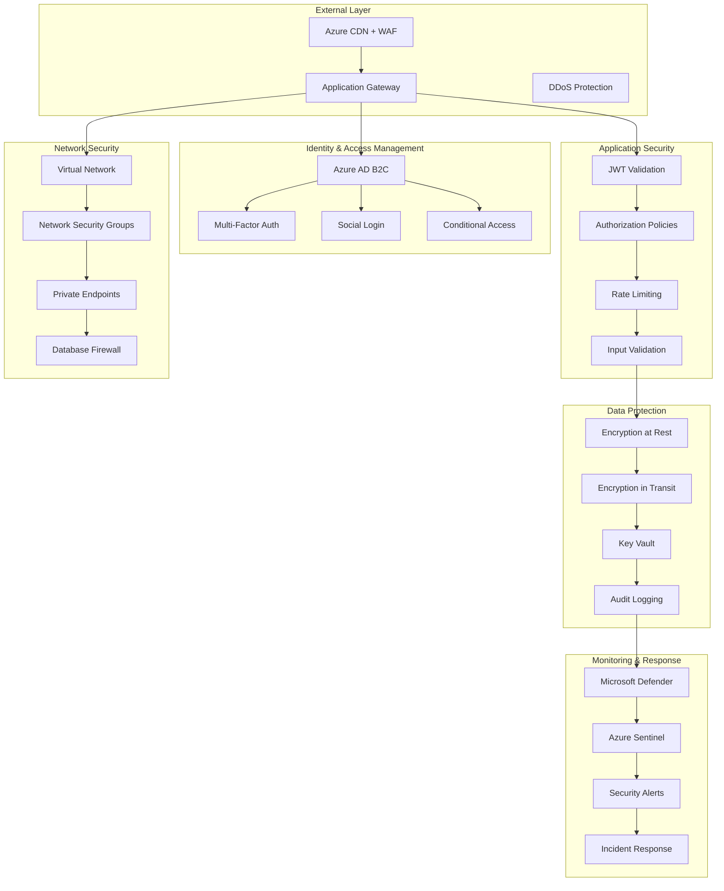

# LankaConnect - Security Architecture

## Document Overview
**Document Type**: Technical Architecture - Security  
**Version**: 1.0  
**Last Updated**: January 2025  
**Target Audience**: Development Team, Claude Code Agents, Security Team  

## 1. Executive Summary

LankaConnect's security architecture implements **defense-in-depth** principles with **Azure AD B2C** for identity management, **comprehensive data protection**, and **industry-standard security practices**. The design prioritizes user privacy, community safety, and regulatory compliance for the Sri Lankan diaspora platform.

### Key Security Principles
- **Zero Trust Architecture**: Never trust, always verify
- **Data Privacy by Design**: Minimal data collection with user consent
- **Defense in Depth**: Multiple security layers and controls
- **Incident Response Ready**: Comprehensive logging and monitoring
- **Compliance First**: GDPR, CCPA, and industry standards alignment

## 2. Security Architecture Overview



## 3. Identity and Access Management (IAM)

### 3.1 Azure AD B2C Configuration

```csharp
// Azure AD B2C Integration Setup
namespace LankaConnect.Infrastructure.Identity
{
    public class AzureB2CConfiguration
    {
        public static IServiceCollection AddAzureB2CAuthentication(
            this IServiceCollection services, 
            IConfiguration configuration)
        {
            var b2cSettings = configuration.GetSection("AzureB2C").Get<AzureB2CSettings>();
            
            services.AddAuthentication(JwtBearerDefaults.AuthenticationScheme)
                .AddMicrosoftIdentityWebApi(options =>
                {
                    configuration.Bind("AzureB2C", options);
                    
                    // Custom token validation
                    options.TokenValidationParameters = new TokenValidationParameters
                    {
                        ValidateIssuer = true,
                        ValidateAudience = true,
                        ValidateLifetime = true,
                        ValidateIssuerSigningKey = true,
                        ClockSkew = TimeSpan.FromMinutes(5),
                        
                        // Custom validation for Sri Lankan community
                        IssuerValidator = (issuer, token, parameters) =>
                        {
                            var validIssuers = new[]
                            {
                                $"https://{b2cSettings.Domain}/{b2cSettings.TenantId}/v2.0/",
                                $"https://login.microsoftonline.com/{b2cSettings.TenantId}/v2.0/"
                            };
                            
                            if (validIssuers.Contains(issuer))
                                return issuer;
                            
                            throw new SecurityTokenInvalidIssuerException($"Invalid issuer: {issuer}");
                        }
                    };
                    
                    // Handle authentication events
                    options.Events = new JwtBearerEvents
                    {
                        OnAuthenticationFailed = async context =>
                        {
                            var logger = context.HttpContext.RequestServices.GetRequiredService<ILogger<AzureB2CConfiguration>>();
                            logger.LogWarning("Authentication failed: {Error}", context.Exception.Message);
                            
                            // Track failed authentication attempts
                            await TrackAuthenticationEventAsync(context.HttpContext, "authentication_failed", context.Exception.Message);
                        },
                        
                        OnTokenValidated = async context =>
                        {
                            var logger = context.HttpContext.RequestServices.GetRequiredService<ILogger<AzureB2CConfiguration>>();
                            var userId = context.Principal.FindFirst(ClaimTypes.NameIdentifier)?.Value;
                            
                            logger.LogDebug("Token validated for user: {UserId}", userId);
                            
                            // Enhance claims with application-specific data
                            await EnhanceUserClaimsAsync(context);
                            
                            // Track successful authentication
                            await TrackAuthenticationEventAsync(context.HttpContext, "authentication_success", userId);
                        },
                        
                        OnChallenge = async context =>
                        {
                            // Custom challenge response for mobile clients
                            if (context.Request.Headers.ContainsKey("X-Mobile-Client"))
                            {
                                context.HandleResponse();
                                context.Response.StatusCode = 401;
                                context.Response.ContentType = "application/json";
                                
                                var response = new
                                {
                                    error = "unauthorized",
                                    message = "Authentication required",
                                    auth_url = GetAuthenticationUrl(b2cSettings)
                                };
                                
                                await context.Response.WriteAsync(JsonSerializer.Serialize(response));
                            }
                        }
                    };
                }, options =>
                {
                    configuration.Bind("AzureB2C", options);
                });
            
            // Add role-based authorization
            services.AddAuthorization(options =>
            {
                // Define authorization policies
                AuthorizationPolicies.ConfigurePolicies(options);
                
                // Add custom policy providers
                options.AddPolicy("SriLankanCommunityMember", policy =>
                {
                    policy.RequireAuthenticatedUser();
                    policy.Requirements.Add(new CommunityMembershipRequirement());
                });
                
                options.AddPolicy("EventOrganizer", policy =>
                {
                    policy.RequireAuthenticatedUser();
                    policy.Requirements.Add(new EventOrganizerRequirement());
                });
                
                options.AddPolicy("ContentModerator", policy =>
                {
                    policy.RequireRole("Moderator", "Admin");
                    policy.Requirements.Add(new ContentModerationRequirement());
                });
            });
            
            return services;
        }
        
        private static async Task EnhanceUserClaimsAsync(TokenValidatedContext context)
        {
            var userService = context.HttpContext.RequestServices.GetRequiredService<IUserService>();
            var userId = context.Principal.FindFirst(ClaimTypes.NameIdentifier)?.Value;
            
            if (Guid.TryParse(userId, out var userGuid))
            {
                var userProfile = await userService.GetUserProfileAsync(new UserId(userGuid));
                
                if (userProfile != null)
                {
                    var claims = new List<Claim>();
                    
                    // Add membership tier
                    claims.Add(new Claim("membership_tier", userProfile.MembershipTier.ToString()));
                    
                    // Add location-based claims
                    if (userProfile.Location != null)
                    {
                        claims.Add(new Claim("location_state", userProfile.Location.State ?? ""));
                        claims.Add(new Claim("location_city", userProfile.Location.City ?? ""));
                    }
                    
                    // Add cultural preferences
                    if (userProfile.CulturalPreferences?.Languages?.Any() == true)
                    {
                        foreach (var language in userProfile.CulturalPreferences.Languages)
                        {
                            claims.Add(new Claim("language", language));
                        }
                    }
                    
                    // Add verification status
                    claims.Add(new Claim("is_verified", userProfile.IsVerified.ToString().ToLower()));
                    
                    // Add community roles
                    var userRoles = await userService.GetUserRolesAsync(new UserId(userGuid));
                    foreach (var role in userRoles)
                    {
                        claims.Add(new Claim(ClaimTypes.Role, role.Name));
                        
                        // Add role permissions
                        if (role.Permissions?.Any() == true)
                        {
                            foreach (var permission in role.Permissions)
                            {
                                claims.Add(new Claim("permission", permission));
                            }
                        }
                    }
                    
                    var identity = (ClaimsIdentity)context.Principal.Identity;
                    identity.AddClaims(claims);
                }
            }
        }
        
        private static async Task TrackAuthenticationEventAsync(HttpContext context, string eventType, string details)
        {
            var auditService = context.RequestServices.GetRequiredService<IAuditService>();
            
            await auditService.LogUserActivityAsync(new UserActivityEvent
            {
                ActivityType = eventType,
                Description = details,
                IpAddress = context.Connection.RemoteIpAddress?.ToString(),
                UserAgent = context.Request.Headers["User-Agent"].FirstOrDefault(),
                RequestPath = context.Request.Path,
                Timestamp = DateTime.UtcNow
            });
        }
        
        private static string GetAuthenticationUrl(AzureB2CSettings settings)
        {
            return $"https://{settings.Domain}/{settings.TenantId}/oauth2/v2.0/authorize" +
                   $"?client_id={settings.ClientId}" +
                   $"&response_type=token" +
                   $"&redirect_uri={Uri.EscapeDataString(settings.RedirectUri)}" +
                   $"&scope={Uri.EscapeDataString(settings.Scopes)}" +
                   $"&p={settings.SignUpSignInPolicyId}";
        }
    }
    
    // Azure B2C Settings
    public class AzureB2CSettings
    {
        public string Instance { get; set; }
        public string Domain { get; set; }
        public string TenantId { get; set; }
        public string ClientId { get; set; }
        public string ClientSecret { get; set; }
        public string SignUpSignInPolicyId { get; set; }
        public string ResetPasswordPolicyId { get; set; }
        public string EditProfilePolicyId { get; set; }
        public string Scopes { get; set; }
        public string RedirectUri { get; set; }
        public bool ValidateAuthority { get; set; } = true;
        public bool ValidateIssuer { get; set; } = true;
    }
}
```

### 3.2 Multi-Factor Authentication (MFA)

```csharp
// MFA Implementation for High-Risk Operations
namespace LankaConnect.Infrastructure.Security
{
    public interface IMfaService
    {
        Task<MfaChallenge> InitiateMfaChallengeAsync(UserId userId, MfaMethod method);
        Task<bool> ValidateMfaChallengeAsync(string challengeId, string code);
        Task<IEnumerable<MfaMethod>> GetUserMfaMethodsAsync(UserId userId);
        Task<bool> EnableMfaMethodAsync(UserId userId, MfaMethod method, string verificationCode);
        Task<bool> DisableMfaMethodAsync(UserId userId, MfaMethod method);
    }
    
    public class MfaService : IMfaService
    {
        private readonly IDistributedCache _cache;
        private readonly ISmsService _smsService;
        private readonly IEmailService _emailService;
        private readonly ITotpService _totpService;
        private readonly IUserRepository _userRepository;
        private readonly ILogger<MfaService> _logger;
        
        public MfaService(
            IDistributedCache cache,
            ISmsService smsService,
            IEmailService emailService,
            ITotpService totpService,
            IUserRepository userRepository,
            ILogger<MfaService> logger)
        {
            _cache = cache;
            _smsService = smsService;
            _emailService = emailService;
            _totpService = totpService;
            _userRepository = userRepository;
            _logger = logger;
        }
        
        public async Task<MfaChallenge> InitiateMfaChallengeAsync(UserId userId, MfaMethod method)
        {
            var user = await _userRepository.GetByIdAsync(userId);
            if (user == null)
                throw new SecurityException("User not found");
            
            var challengeId = Guid.NewGuid().ToString();
            var code = GenerateSecureCode();
            
            var challenge = new MfaChallenge
            {
                ChallengeId = challengeId,
                UserId = userId,
                Method = method,
                CreatedAt = DateTime.UtcNow,
                ExpiresAt = DateTime.UtcNow.AddMinutes(5),
                AttemptsRemaining = 3
            };
            
            // Store challenge in cache
            var cacheKey = $"mfa_challenge:{challengeId}";
            var cacheOptions = new DistributedCacheEntryOptions
            {
                AbsoluteExpirationRelativeToNow = TimeSpan.FromMinutes(5)
            };
            
            await _cache.SetStringAsync(cacheKey, JsonSerializer.Serialize(new
            {
                challenge.UserId,
                challenge.Method,
                Code = code,
                challenge.CreatedAt,
                challenge.ExpiresAt,
                challenge.AttemptsRemaining
            }), cacheOptions);
            
            // Send code based on method
            switch (method)
            {
                case MfaMethod.Sms:
                    await _smsService.SendSmsAsync(user.Profile.PhoneNumber, 
                        $"Your LankaConnect verification code is: {code}. Valid for 5 minutes.");
                    break;
                    
                case MfaMethod.Email:
                    await _emailService.SendEmailAsync(user.Email, "LankaConnect Verification Code",
                        $"Your verification code is: {code}. This code will expire in 5 minutes.");
                    break;
                    
                case MfaMethod.Totp:
                    // TOTP doesn't require sending code
                    break;
                    
                default:
                    throw new NotSupportedException($"MFA method {method} is not supported");
            }
            
            _logger.LogInformation("MFA challenge initiated for user {UserId} using method {Method}", 
                userId, method);
            
            return challenge;
        }
        
        public async Task<bool> ValidateMfaChallengeAsync(string challengeId, string code)
        {
            var cacheKey = $"mfa_challenge:{challengeId}";
            var challengeData = await _cache.GetStringAsync(cacheKey);
            
            if (string.IsNullOrEmpty(challengeData))
            {
                _logger.LogWarning("MFA challenge not found or expired: {ChallengeId}", challengeId);
                return false;
            }
            
            var challenge = JsonSerializer.Deserialize<MfaChallengeData>(challengeData);
            
            // Check if challenge is expired
            if (DateTime.UtcNow > challenge.ExpiresAt)
            {
                await _cache.RemoveAsync(cacheKey);
                _logger.LogWarning("MFA challenge expired: {ChallengeId}", challengeId);
                return false;
            }
            
            // Check attempts remaining
            if (challenge.AttemptsRemaining <= 0)
            {
                await _cache.RemoveAsync(cacheKey);
                _logger.LogWarning("MFA challenge max attempts exceeded: {ChallengeId}", challengeId);
                return false;
            }
            
            bool isValid = false;
            
            // Validate code based on method
            switch (challenge.Method)
            {
                case MfaMethod.Sms:
                case MfaMethod.Email:
                    isValid = string.Equals(challenge.Code, code, StringComparison.Ordinal);
                    break;
                    
                case MfaMethod.Totp:
                    var user = await _userRepository.GetByIdAsync(challenge.UserId);
                    isValid = _totpService.ValidateTotp(user.TotpSecret, code);
                    break;
            }
            
            if (isValid)
            {
                // Remove challenge from cache
                await _cache.RemoveAsync(cacheKey);
                
                _logger.LogInformation("MFA challenge validated successfully: {ChallengeId}", challengeId);
                return true;
            }
            else
            {
                // Decrement attempts and update cache
                challenge.AttemptsRemaining--;
                await _cache.SetStringAsync(cacheKey, JsonSerializer.Serialize(challenge), 
                    new DistributedCacheEntryOptions
                    {
                        AbsoluteExpirationRelativeToNow = TimeSpan.FromMinutes(5)
                    });
                
                _logger.LogWarning("MFA challenge validation failed: {ChallengeId}, attempts remaining: {Attempts}", 
                    challengeId, challenge.AttemptsRemaining);
                
                return false;
            }
        }
        
        private string GenerateSecureCode()
        {
            // Generate 6-digit numeric code
            using var rng = RandomNumberGenerator.Create();
            var bytes = new byte[4];
            rng.GetBytes(bytes);
            var code = Math.Abs(BitConverter.ToInt32(bytes, 0)) % 1000000;
            return code.ToString("D6");
        }
    }
    
    // MFA Models
    public class MfaChallenge
    {
        public string ChallengeId { get; set; }
        public UserId UserId { get; set; }
        public MfaMethod Method { get; set; }
        public DateTime CreatedAt { get; set; }
        public DateTime ExpiresAt { get; set; }
        public int AttemptsRemaining { get; set; }
    }
    
    public class MfaChallengeData
    {
        public UserId UserId { get; set; }
        public MfaMethod Method { get; set; }
        public string Code { get; set; }
        public DateTime CreatedAt { get; set; }
        public DateTime ExpiresAt { get; set; }
        public int AttemptsRemaining { get; set; }
    }
    
    public enum MfaMethod
    {
        Sms,
        Email,
        Totp,
        AuthenticatorApp
    }
}
```

## 4. Authorization and Access Control

### 4.1 Role-Based Access Control (RBAC)

```csharp
// Comprehensive Authorization System
namespace LankaConnect.Infrastructure.Authorization
{
    public class RoleBasedAuthorizationService : IAuthorizationService
    {
        private readonly IUserRepository _userRepository;
        private readonly IRoleRepository _roleRepository;
        private readonly IMemoryCache _cache;
        private readonly ILogger<RoleBasedAuthorizationService> _logger;
        
        public RoleBasedAuthorizationService(
            IUserRepository userRepository,
            IRoleRepository roleRepository,
            IMemoryCache cache,
            ILogger<RoleBasedAuthorizationService> logger)
        {
            _userRepository = userRepository;
            _roleRepository = roleRepository;
            _cache = cache;
            _logger = logger;
        }
        
        public async Task<AuthorizationResult> AuthorizeAsync(
            ClaimsPrincipal user, 
            object resource, 
            string policyName)
        {
            var userId = GetUserId(user);
            if (userId == null)
                return AuthorizationResult.Failed();
            
            // Get user permissions from cache or database
            var permissions = await GetUserPermissionsAsync(userId.Value);
            
            // Evaluate policy
            var result = await EvaluatePolicyAsync(policyName, user, resource, permissions);
            
            // Log authorization result
            _logger.LogDebug("Authorization {Result} for user {UserId} on policy {Policy}", 
                result.Succeeded ? "succeeded" : "failed", userId, policyName);
            
            return result;
        }
        
        private async Task<HashSet<string>> GetUserPermissionsAsync(UserId userId)
        {
            var cacheKey = $"user_permissions:{userId.Value}";
            
            if (_cache.TryGetValue(cacheKey, out HashSet<string> cachedPermissions))
                return cachedPermissions;
            
            var permissions = new HashSet<string>();
            
            // Get user roles
            var userRoles = await _userRepository.GetUserRolesAsync(userId);
            
            foreach (var role in userRoles)
            {
                // Add role-based permissions
                if (role.Permissions?.Any() == true)
                {
                    foreach (var permission in role.Permissions)
                    {
                        permissions.Add(permission);
                    }
                }
                
                // Add hierarchical permissions based on role level
                switch (role.Name.ToLower())
                {
                    case "admin":
                        permissions.UnionWith(AdminPermissions);
                        goto case "moderator"; // Fall through
                    case "moderator":
                        permissions.UnionWith(ModeratorPermissions);
                        goto case "verified_user"; // Fall through
                    case "verified_user":
                        permissions.UnionWith(VerifiedUserPermissions);
                        goto case "user"; // Fall through
                    case "user":
                        permissions.UnionWith(UserPermissions);
                        break;
                }
            }
            
            // Get user membership tier permissions
            var user = await _userRepository.GetByIdAsync(userId);
            if (user != null)
            {
                permissions.UnionWith(GetMembershipTierPermissions(user.MembershipTier));
            }
            
            // Cache permissions for 15 minutes
            _cache.Set(cacheKey, permissions, TimeSpan.FromMinutes(15));
            
            return permissions;
        }
        
        private async Task<AuthorizationResult> EvaluatePolicyAsync(
            string policyName, 
            ClaimsPrincipal user, 
            object resource, 
            HashSet<string> permissions)
        {
            switch (policyName.ToLower())
            {
                case "create_event":
                    return EvaluateCreateEventPolicy(user, permissions);
                    
                case "moderate_content":
                    return EvaluateModerateContentPolicy(user, permissions);
                    
                case "access_admin_panel":
                    return EvaluateAdminAccessPolicy(user, permissions);
                    
                case "resource_owner":
                    return await EvaluateResourceOwnerPolicy(user, resource, permissions);
                    
                case "premium_member":
                    return EvaluatePremiumMemberPolicy(user, permissions);
                    
                case "verified_user":
                    return EvaluateVerifiedUserPolicy(user, permissions);
                    
                default:
                    return AuthorizationResult.Failed(
                        AuthorizationFailure.Failed(new[] { $"Unknown policy: {policyName}" }));
            }
        }
        
        private AuthorizationResult EvaluateCreateEventPolicy(ClaimsPrincipal user, HashSet<string> permissions)
        {
            // Check if user has create event permission
            if (!permissions.Contains("events.create"))
                return AuthorizationResult.Failed();
            
            // Check membership tier requirements
            var membershipTier = user.FindFirst("membership_tier")?.Value;
            if (string.IsNullOrEmpty(membershipTier))
                return AuthorizationResult.Failed();
            
            // Free users have limited event creation
            if (membershipTier == "Free")
            {
                // Additional checks can be added here (e.g., event limit per month)
                return AuthorizationResult.Succeeded();
            }
            
            return AuthorizationResult.Succeeded();
        }
        
        private AuthorizationResult EvaluateModerateContentPolicy(ClaimsPrincipal user, HashSet<string> permissions)
        {
            return permissions.Contains("content.moderate") 
                ? AuthorizationResult.Succeeded() 
                : AuthorizationResult.Failed();
        }
        
        private AuthorizationResult EvaluateAdminAccessPolicy(ClaimsPrincipal user, HashSet<string> permissions)
        {
            return permissions.Contains("admin.access") 
                ? AuthorizationResult.Succeeded() 
                : AuthorizationResult.Failed();
        }
        
        private async Task<AuthorizationResult> EvaluateResourceOwnerPolicy(
            ClaimsPrincipal user, 
            object resource, 
            HashSet<string> permissions)
        {
            var userId = GetUserId(user);
            if (userId == null)
                return AuthorizationResult.Failed();
            
            // Check if user owns the resource
            var isOwner = resource switch
            {
                Event evt => evt.OrganizerId == userId,
                Business business => business.OwnerId == userId,
                ForumPost post => post.AuthorId == userId,
                _ => false
            };
            
            if (isOwner)
                return AuthorizationResult.Succeeded();
            
            // Check if user has admin/moderator permissions
            if (permissions.Contains("admin.access") || permissions.Contains("content.moderate"))
                return AuthorizationResult.Succeeded();
            
            return AuthorizationResult.Failed();
        }
        
        private AuthorizationResult EvaluatePremiumMemberPolicy(ClaimsPrincipal user, HashSet<string> permissions)
        {
            var membershipTier = user.FindFirst("membership_tier")?.Value;
            
            return membershipTier switch
            {
                "Premium" or "SuperPremium" or "Family" => AuthorizationResult.Succeeded(),
                _ => AuthorizationResult.Failed()
            };
        }
        
        private AuthorizationResult EvaluateVerifiedUserPolicy(ClaimsPrincipal user, HashSet<string> permissions)
        {
            var isVerified = user.FindFirst("is_verified")?.Value == "true";
            return isVerified ? AuthorizationResult.Succeeded() : AuthorizationResult.Failed();
        }
        
        private UserId? GetUserId(ClaimsPrincipal user)
        {
            var userIdClaim = user.FindFirst(ClaimTypes.NameIdentifier)?.Value;
            return Guid.TryParse(userIdClaim, out var userId) ? new UserId(userId) : null;
        }
        
        private HashSet<string> GetMembershipTierPermissions(MembershipTier tier)
        {
            return tier switch
            {
                MembershipTier.Free => FreeUserPermissions,
                MembershipTier.Premium => PremiumUserPermissions,
                MembershipTier.SuperPremium => SuperPremiumUserPermissions,
                MembershipTier.Family => FamilyUserPermissions,
                _ => new HashSet<string>()
            };
        }
        
        // Permission sets
        private static readonly HashSet<string> UserPermissions = new()
        {
            "profile.read", "profile.update",
            "events.read", "events.register",
            "forum.read", "forum.post",
            "business.read"
        };
        
        private static readonly HashSet<string> VerifiedUserPermissions = new()
        {
            "events.create_basic",
            "business.claim",
            "forum.create_topic"
        };
        
        private static readonly HashSet<string> ModeratorPermissions = new()
        {
            "content.moderate",
            "forum.moderate",
            "events.moderate",
            "users.warn"
        };
        
        private static readonly HashSet<string> AdminPermissions = new()
        {
            "admin.access",
            "users.manage",
            "system.configure",
            "analytics.view"
        };
        
        private static readonly HashSet<string> FreeUserPermissions = new()
        {
            "events.create_limited" // 1 event per month
        };
        
        private static readonly HashSet<string> PremiumUserPermissions = new()
        {
            "events.create_enhanced", // 3 events per month
            "business.list_basic",
            "analytics.basic"
        };
        
        private static readonly HashSet<string> SuperPremiumUserPermissions = new()
        {
            "events.create_unlimited",
            "business.list_premium",
            "analytics.advanced",
            "education.access"
        };
        
        private static readonly HashSet<string> FamilyUserPermissions = new()
        {
            "events.create_unlimited",
            "business.list_premium",
            "analytics.advanced",
            "education.access_family"
        };
    }
}
```

## 5. Data Protection and Encryption

### 5.1 Data Encryption Implementation

```csharp
// Data Encryption Service
namespace LankaConnect.Infrastructure.Security
{
    public interface IDataEncryptionService
    {
        string EncryptSensitiveData(string plainText);
        string DecryptSensitiveData(string encryptedText);
        string HashPassword(string password);
        bool VerifyPassword(string password, string hash);
        string EncryptPersonalData(string data, string userKey);
        string DecryptPersonalData(string encryptedData, string userKey);
    }
    
    public class DataEncryptionService : IDataEncryptionService
    {
        private readonly IKeyVaultService _keyVaultService;
        private readonly ILogger<DataEncryptionService> _logger;
        private readonly EncryptionSettings _settings;
        
        public DataEncryptionService(
            IKeyVaultService keyVaultService,
            IOptions<EncryptionSettings> settings,
            ILogger<DataEncryptionService> logger)
        {
            _keyVaultService = keyVaultService;
            _settings = settings.Value;
            _logger = logger;
        }
        
        public string EncryptSensitiveData(string plainText)
        {
            if (string.IsNullOrEmpty(plainText))
                return plainText;
            
            try
            {
                var key = _keyVaultService.GetEncryptionKey("sensitive-data-key");
                return EncryptAes(plainText, key);
            }
            catch (Exception ex)
            {
                _logger.LogError(ex, "Failed to encrypt sensitive data");
                throw new SecurityException("Data encryption failed", ex);
            }
        }
        
        public string DecryptSensitiveData(string encryptedText)
        {
            if (string.IsNullOrEmpty(encryptedText))
                return encryptedText;
            
            try
            {
                var key = _keyVaultService.GetEncryptionKey("sensitive-data-key");
                return DecryptAes(encryptedText, key);
            }
            catch (Exception ex)
            {
                _logger.LogError(ex, "Failed to decrypt sensitive data");
                throw new SecurityException("Data decryption failed", ex);
            }
        }
        
        public string HashPassword(string password)
        {
            try
            {
                return BCrypt.Net.BCrypt.HashPassword(password, _settings.PasswordHashWorkFactor);
            }
            catch (Exception ex)
            {
                _logger.LogError(ex, "Failed to hash password");
                throw new SecurityException("Password hashing failed", ex);
            }
        }
        
        public bool VerifyPassword(string password, string hash)
        {
            try
            {
                return BCrypt.Net.BCrypt.Verify(password, hash);
            }
            catch (Exception ex)
            {
                _logger.LogError(ex, "Failed to verify password");
                return false;
            }
        }
        
        public string EncryptPersonalData(string data, string userKey)
        {
            if (string.IsNullOrEmpty(data))
                return data;
            
            try
            {
                // Use user-specific key for personal data encryption
                var derivedKey = DeriveUserKey(userKey);
                return EncryptAes(data, derivedKey);
            }
            catch (Exception ex)
            {
                _logger.LogError(ex, "Failed to encrypt personal data");
                throw new SecurityException("Personal data encryption failed", ex);
            }
        }
        
        public string DecryptPersonalData(string encryptedData, string userKey)
        {
            if (string.IsNullOrEmpty(encryptedData))
                return encryptedData;
            
            try
            {
                var derivedKey = DeriveUserKey(userKey);
                return DecryptAes(encryptedData, derivedKey);
            }
            catch (Exception ex)
            {
                _logger.LogError(ex, "Failed to decrypt personal data");
                throw new SecurityException("Personal data decryption failed", ex);
            }
        }
        
        private string EncryptAes(string plainText, byte[] key)
        {
            using var aes = Aes.Create();
            aes.Key = key;
            aes.GenerateIV();
            
            using var encryptor = aes.CreateEncryptor();
            var plainBytes = Encoding.UTF8.GetBytes(plainText);
            var encryptedBytes = encryptor.TransformFinalBlock(plainBytes, 0, plainBytes.Length);
            
            // Combine IV and encrypted data
            var result = new byte[aes.IV.Length + encryptedBytes.Length];
            Array.Copy(aes.IV, 0, result, 0, aes.IV.Length);
            Array.Copy(encryptedBytes, 0, result, aes.IV.Length, encryptedBytes.Length);
            
            return Convert.ToBase64String(result);
        }
        
        private string DecryptAes(string encryptedText, byte[] key)
        {
            var encryptedBytes = Convert.FromBase64String(encryptedText);
            
            using var aes = Aes.Create();
            aes.Key = key;
            
            // Extract IV from the beginning
            var iv = new byte[aes.BlockSize / 8];
            var cipherBytes = new byte[encryptedBytes.Length - iv.Length];
            
            Array.Copy(encryptedBytes, 0, iv, 0, iv.Length);
            Array.Copy(encryptedBytes, iv.Length, cipherBytes, 0, cipherBytes.Length);
            
            aes.IV = iv;
            
            using var decryptor = aes.CreateDecryptor();
            var decryptedBytes = decryptor.TransformFinalBlock(cipherBytes, 0, cipherBytes.Length);
            
            return Encoding.UTF8.GetString(decryptedBytes);
        }
        
        private byte[] DeriveUserKey(string userKey)
        {
            // Use PBKDF2 to derive encryption key from user-specific data
            var salt = Encoding.UTF8.GetBytes(_settings.UserKeySalt);
            
            using var pbkdf2 = new Rfc2898DeriveBytes(userKey, salt, 100000, HashAlgorithmName.SHA256);
            return pbkdf2.GetBytes(32); // 256-bit key
        }
    }
    
    // Encryption Settings
    public class EncryptionSettings
    {
        public int PasswordHashWorkFactor { get; set; } = 12;
        public string UserKeySalt { get; set; }
        public string DefaultEncryptionAlgorithm { get; set; } = "AES256";
    }
    
    // Azure Key Vault Integration
    public interface IKeyVaultService
    {
        byte[] GetEncryptionKey(string keyName);
        string GetSecret(string secretName);
        Task<string> GetSecretAsync(string secretName);
        void CacheKey(string keyName, byte[] key, TimeSpan? expiry = null);
    }
    
    public class AzureKeyVaultService : IKeyVaultService
    {
        private readonly SecretClient _secretClient;
        private readonly IMemoryCache _cache;
        private readonly ILogger<AzureKeyVaultService> _logger;
        
        public AzureKeyVaultService(
            SecretClient secretClient,
            IMemoryCache cache,
            ILogger<AzureKeyVaultService> logger)
        {
            _secretClient = secretClient;
            _cache = cache;
            _logger = logger;
        }
        
        public byte[] GetEncryptionKey(string keyName)
        {
            var cacheKey = $"encryption_key:{keyName}";
            
            if (_cache.TryGetValue(cacheKey, out byte[] cachedKey))
                return cachedKey;
            
            try
            {
                var secret = _secretClient.GetSecret(keyName);
                var key = Convert.FromBase64String(secret.Value.Value);
                
                // Cache key for 1 hour
                _cache.Set(cacheKey, key, TimeSpan.FromHours(1));
                
                return key;
            }
            catch (Exception ex)
            {
                _logger.LogError(ex, "Failed to retrieve encryption key: {KeyName}", keyName);
                throw new SecurityException($"Failed to retrieve encryption key: {keyName}", ex);
            }
        }
        
        public string GetSecret(string secretName)
        {
            try
            {
                var secret = _secretClient.GetSecret(secretName);
                return secret.Value.Value;
            }
            catch (Exception ex)
            {
                _logger.LogError(ex, "Failed to retrieve secret: {SecretName}", secretName);
                throw new SecurityException($"Failed to retrieve secret: {secretName}", ex);
            }
        }
        
        public async Task<string> GetSecretAsync(string secretName)
        {
            try
            {
                var secret = await _secretClient.GetSecretAsync(secretName);
                return secret.Value.Value;
            }
            catch (Exception ex)
            {
                _logger.LogError(ex, "Failed to retrieve secret: {SecretName}", secretName);
                throw new SecurityException($"Failed to retrieve secret: {secretName}", ex);
            }
        }
        
        public void CacheKey(string keyName, byte[] key, TimeSpan? expiry = null)
        {
            var cacheKey = $"encryption_key:{keyName}";
            var options = new MemoryCacheEntryOptions
            {
                AbsoluteExpirationRelativeToNow = expiry ?? TimeSpan.FromHours(1),
                Priority = CacheItemPriority.High
            };
            
            _cache.Set(cacheKey, key, options);
        }
    }
}
```

## 6. Input Validation and Sanitization

### 6.1 Comprehensive Input Validation

```csharp
// Input Validation and Sanitization Service
namespace LankaConnect.Infrastructure.Security
{
    public interface IInputValidationService
    {
        ValidationResult ValidateUserInput(string input, InputValidationType type);
        string SanitizeHtmlContent(string htmlContent);
        string SanitizeUserGeneratedContent(string content);
        bool IsValidEmail(string email);
        bool IsValidPhoneNumber(string phoneNumber);
        bool IsValidUrl(string url);
        bool ContainsProfanity(string text);
        bool ContainsSuspiciousContent(string text);
    }
    
    public class InputValidationService : IInputValidationService
    {
        private readonly ILogger<InputValidationService> _logger;
        private readonly ValidationSettings _settings;
        private readonly HashSet<string> _profanityWords;
        private readonly HashSet<string> _suspiciousPatterns;
        
        public InputValidationService(
            IOptions<ValidationSettings> settings,
            ILogger<InputValidationService> logger)
        {
            _settings = settings.Value;
            _logger = logger;
            _profanityWords = LoadProfanityWords();
            _suspiciousPatterns = LoadSuspiciousPatterns();
        }
        
        public ValidationResult ValidateUserInput(string input, InputValidationType type)
        {
            if (string.IsNullOrEmpty(input))
                return ValidationResult.Success();
            
            var errors = new List<string>();
            
            // Length validation
            if (input.Length > GetMaxLength(type))
            {
                errors.Add($"Input exceeds maximum length of {GetMaxLength(type)} characters");
            }
            
            // Content validation based on type
            switch (type)
            {
                case InputValidationType.PlainText:
                    ValidatePlainText(input, errors);
                    break;
                    
                case InputValidationType.Html:
                    ValidateHtmlContent(input, errors);
                    break;
                    
                case InputValidationType.Email:
                    ValidateEmail(input, errors);
                    break;
                    
                case InputValidationType.PhoneNumber:
                    ValidatePhoneNumber(input, errors);
                    break;
                    
                case InputValidationType.Url:
                    ValidateUrl(input, errors);
                    break;
                    
                case InputValidationType.UserGeneratedContent:
                    ValidateUserGeneratedContent(input, errors);
                    break;
            }
            
            // Common security validations
            ValidateForSecurityThreats(input, errors);
            
            return errors.Any() 
                ? ValidationResult.Failed(errors) 
                : ValidationResult.Success();
        }
        
        public string SanitizeHtmlContent(string htmlContent)
        {
            if (string.IsNullOrEmpty(htmlContent))
                return htmlContent;
            
            try
            {
                // Use HtmlSanitizer to clean HTML content
                var sanitizer = new HtmlSanitizer();
                
                // Configure allowed tags and attributes for community content
                sanitizer.AllowedTags.Clear();
                sanitizer.AllowedTags.UnionWith(new[]
                {
                    "p", "br", "strong", "em", "u", "ol", "ul", "li",
                    "h1", "h2", "h3", "h4", "h5", "h6",
                    "blockquote", "code", "pre"
                });
                
                sanitizer.AllowedAttributes.Clear();
                sanitizer.AllowedAttributes.Add("class");
                
                // Remove dangerous protocols
                sanitizer.AllowedSchemes.Clear();
                sanitizer.AllowedSchemes.UnionWith(new[] { "http", "https", "mailto" });
                
                var sanitized = sanitizer.Sanitize(htmlContent);
                
                _logger.LogDebug("HTML content sanitized. Original length: {Original}, Sanitized length: {Sanitized}",
                    htmlContent.Length, sanitized.Length);
                
                return sanitized;
            }
            catch (Exception ex)
            {
                _logger.LogError(ex, "Failed to sanitize HTML content");
                return string.Empty; // Return empty string if sanitization fails
            }
        }
        
        public string SanitizeUserGeneratedContent(string content)
        {
            if (string.IsNullOrEmpty(content))
                return content;
            
            // Remove potentially dangerous content
            var sanitized = content;
            
            // Remove script tags and their content
            sanitized = Regex.Replace(sanitized, @"<script\b[^<]*(?:(?!<\/script>)<[^<]*)*<\/script>", 
                "", RegexOptions.IgnoreCase);
            
            // Remove event handlers
            sanitized = Regex.Replace(sanitized, @"on\w+\s*=\s*[""'][^""']*[""']", 
                "", RegexOptions.IgnoreCase);
            
            // Remove javascript: URLs
            sanitized = Regex.Replace(sanitized, @"javascript\s*:", "", RegexOptions.IgnoreCase);
            
            // Remove data: URLs (except images)
            sanitized = Regex.Replace(sanitized, @"data:(?!image/)[^;]*;[^""']*", 
                "", RegexOptions.IgnoreCase);
            
            // Encode special characters
            sanitized = WebUtility.HtmlEncode(sanitized);
            
            return sanitized;
        }
        
        public bool IsValidEmail(string email)
        {
            if (string.IsNullOrWhiteSpace(email))
                return false;
            
            try
            {
                var emailRegex = new Regex(
                    @"^[a-zA-Z0-9._%+-]+@[a-zA-Z0-9.-]+\.[a-zA-Z]{2,}$",
                    RegexOptions.IgnoreCase | RegexOptions.Compiled);
                
                return emailRegex.IsMatch(email) && email.Length <= 254;
            }
            catch
            {
                return false;
            }
        }
        
        public bool IsValidPhoneNumber(string phoneNumber)
        {
            if (string.IsNullOrWhiteSpace(phoneNumber))
                return false;
            
            // Remove common formatting characters
            var cleaned = Regex.Replace(phoneNumber, @"[\s\-\(\)\+\.]", "");
            
            // Check for valid phone number pattern (US format)
            var phoneRegex = new Regex(@"^1?[2-9]\d{2}[2-9]\d{2}\d{4}$");
            return phoneRegex.IsMatch(cleaned);
        }
        
        public bool IsValidUrl(string url)
        {
            if (string.IsNullOrWhiteSpace(url))
                return false;
            
            return Uri.TryCreate(url, UriKind.Absolute, out var uriResult)
                   && (uriResult.Scheme == Uri.UriSchemeHttp || uriResult.Scheme == Uri.UriSchemeHttps);
        }
        
        public bool ContainsProfanity(string text)
        {
            if (string.IsNullOrWhiteSpace(text))
                return false;
            
            var lowerText = text.ToLowerInvariant();
            
            return _profanityWords.Any(word => lowerText.Contains(word));
        }
        
        public bool ContainsSuspiciousContent(string text)
        {
            if (string.IsNullOrWhiteSpace(text))
                return false;
            
            var lowerText = text.ToLowerInvariant();
            
            // Check for suspicious patterns
            return _suspiciousPatterns.Any(pattern => 
                Regex.IsMatch(lowerText, pattern, RegexOptions.IgnoreCase));
        }
        
        private void ValidatePlainText(string input, List<string> errors)
        {
            // Check for HTML tags in plain text
            if (Regex.IsMatch(input, @"<[^>]+>"))
            {
                errors.Add("HTML tags are not allowed in plain text fields");
            }
            
            // Check for script injection attempts
            if (Regex.IsMatch(input, @"<script|javascript:|vbscript:|onload=|onerror=", RegexOptions.IgnoreCase))
            {
                errors.Add("Potentially malicious content detected");
            }
        }
        
        private void ValidateHtmlContent(string input, List<string> errors)
        {
            // Check for dangerous tags
            var dangerousTags = new[] { "script", "iframe", "object", "embed", "form", "input" };
            
            foreach (var tag in dangerousTags)
            {
                if (Regex.IsMatch(input, $@"<{tag}\b", RegexOptions.IgnoreCase))
                {
                    errors.Add($"The <{tag}> tag is not allowed");
                }
            }
            
            // Check for event handlers
            if (Regex.IsMatch(input, @"on\w+\s*=", RegexOptions.IgnoreCase))
            {
                errors.Add("Event handlers are not allowed");
            }
        }
        
        private void ValidateEmail(string input, List<string> errors)
        {
            if (!IsValidEmail(input))
            {
                errors.Add("Invalid email format");
            }
        }
        
        private void ValidatePhoneNumber(string input, List<string> errors)
        {
            if (!IsValidPhoneNumber(input))
            {
                errors.Add("Invalid phone number format");
            }
        }
        
        private void ValidateUrl(string input, List<string> errors)
        {
            if (!IsValidUrl(input))
            {
                errors.Add("Invalid URL format");
            }
        }
        
        private void ValidateUserGeneratedContent(string input, List<string> errors)
        {
            // Check for profanity
            if (ContainsProfanity(input))
            {
                errors.Add("Content contains inappropriate language");
            }
            
            // Check for suspicious content
            if (ContainsSuspiciousContent(input))
            {
                errors.Add("Content contains suspicious patterns");
            }
            
            // Check for excessive special characters (possible spam)
            var specialCharCount = input.Count(c => !char.IsLetterOrDigit(c) && !char.IsWhiteSpace(c));
            if (specialCharCount > input.Length * 0.3)
            {
                errors.Add("Content contains too many special characters");
            }
        }
        
        private void ValidateForSecurityThreats(string input, List<string> errors)
        {
            // SQL injection patterns
            var sqlInjectionPatterns = new[]
            {
                @"('|(\')|(--)|(;)|(\||(\|)|(\*)|(%27)|(%2D%2D)|(%7C)|(%2A))",
                @"((\%3D)|(=))[^\n]*((\%27)|(\')|(\-\-)|(%3B)|(;))",
                @"\w*((\%27)|(\'))((\%6F)|o|(\%4F))((\%72)|r|(\%52))",
                @"((\%27)|(\'))union"
            };
            
            foreach (var pattern in sqlInjectionPatterns)
            {
                if (Regex.IsMatch(input, pattern, RegexOptions.IgnoreCase))
                {
                    errors.Add("Potential SQL injection attempt detected");
                    break;
                }
            }
            
            // XSS patterns
            var xssPatterns = new[]
            {
                @"<script[^>]*>.*?</script>",
                @"javascript:",
                @"vbscript:",
                @"onload\s*=",
                @"onerror\s*=",
                @"onclick\s*="
            };
            
            foreach (var pattern in xssPatterns)
            {
                if (Regex.IsMatch(input, pattern, RegexOptions.IgnoreCase))
                {
                    errors.Add("Potential XSS attempt detected");
                    break;
                }
            }
        }
        
        private int GetMaxLength(InputValidationType type)
        {
            return type switch
            {
                InputValidationType.PlainText => 1000,
                InputValidationType.Html => 10000,
                InputValidationType.Email => 254,
                InputValidationType.PhoneNumber => 15,
                InputValidationType.Url => 2048,
                InputValidationType.UserGeneratedContent => 5000,
                _ => 500
            };
        }
        
        private HashSet<string> LoadProfanityWords()
        {
            // Load from configuration or external file
            return new HashSet<string>(StringComparer.OrdinalIgnoreCase)
            {
                // Add profanity words here or load from external source
            };
        }
        
        private HashSet<string> LoadSuspiciousPatterns()
        {
            return new HashSet<string>
            {
                @"(?:viagra|cialis|pharmacy)",
                @"(?:money|cash|prize|winner|lottery)",
                @"(?:click here|act now|limited time)",
                @"(?:\$\d+|\d+%\s*off|free\s*trial)",
                @"(?:bitcoin|cryptocurrency|investment)"
            };
        }
    }
    
    // Validation models
    public enum InputValidationType
    {
        PlainText,
        Html,
        Email,
        PhoneNumber,
        Url,
        UserGeneratedContent
    }
    
    public class ValidationResult
    {
        public bool IsValid { get; private set; }
        public List<string> Errors { get; private set; }
        
        private ValidationResult(bool isValid, List<string> errors)
        {
            IsValid = isValid;
            Errors = errors ?? new List<string>();
        }
        
        public static ValidationResult Success() => new(true, null);
        public static ValidationResult Failed(IEnumerable<string> errors) => new(false, errors.ToList());
    }
    
    public class ValidationSettings
    {
        public bool EnableProfanityFilter { get; set; } = true;
        public bool EnableSuspiciousContentDetection { get; set; } = true;
        public int MaxInputLength { get; set; } = 10000;
        public bool StrictHtmlValidation { get; set; } = true;
    }
}
```

## 7. Network Security & Infrastructure Protection

### 7.1 Azure Network Security Configuration

```csharp
// Network Security Infrastructure as Code
namespace LankaConnect.Infrastructure.Security.Network
{
    public class NetworkSecurityConfiguration
    {
        public static void ConfigureNetworkSecurity(IServiceCollection services, IConfiguration configuration)
        {
            // Configure network security services
            services.Configure<NetworkSecuritySettings>(configuration.GetSection("NetworkSecurity"));
            services.AddScoped<INetworkSecurityService, NetworkSecurityService>();
            services.AddScoped<IIpWhitelistService, IpWhitelistService>();
            services.AddScoped<IFirewallService, AzureFirewallService>();
        }
    }
    
    public interface INetworkSecurityService
    {
        Task<bool> IsIpAddressAllowedAsync(string ipAddress, string context);
        Task<SecurityRiskLevel> AssessIpRiskLevelAsync(string ipAddress);
        Task BlockIpAddressAsync(string ipAddress, TimeSpan duration, string reason);
        Task<IEnumerable<BlockedIpAddress>> GetBlockedIpAddressesAsync();
    }
    
    public class NetworkSecurityService : INetworkSecurityService
    {
        private readonly IDistributedCache _cache;
        private readonly ILogger<NetworkSecurityService> _logger;
        private readonly HttpClient _httpClient;
        private readonly NetworkSecuritySettings _settings;
        
        public NetworkSecurityService(
            IDistributedCache cache,
            ILogger<NetworkSecurityService> logger,
            HttpClient httpClient,
            IOptions<NetworkSecuritySettings> settings)
        {
            _cache = cache;
            _logger = logger;
            _httpClient = httpClient;
            _settings = settings.Value;
        }
        
        public async Task<bool> IsIpAddressAllowedAsync(string ipAddress, string context)
        {
            // Check if IP is in blocked list
            var blockedKey = $"blocked_ip:{ipAddress}";
            var isBlocked = await _cache.GetStringAsync(blockedKey);
            
            if (!string.IsNullOrEmpty(isBlocked))
            {
                _logger.LogWarning("Blocked IP address attempted access: {IpAddress} in context: {Context}", 
                    ipAddress, context);
                return false;
            }
            
            // Check rate limiting for this IP
            var rateLimitKey = $"rate_limit_ip:{ipAddress}:{context}";
            var currentRequests = await _cache.GetStringAsync(rateLimitKey);
            
            if (int.TryParse(currentRequests, out var requestCount))
            {
                if (requestCount >= _settings.MaxRequestsPerMinute)
                {
                    _logger.LogWarning("IP address exceeded rate limit: {IpAddress}, requests: {RequestCount}", 
                        ipAddress, requestCount);
                    
                    // Temporary block for rate limit violation
                    await BlockIpAddressAsync(ipAddress, TimeSpan.FromMinutes(15), "Rate limit exceeded");
                    return false;
                }
                
                await _cache.SetStringAsync(rateLimitKey, (requestCount + 1).ToString(),
                    new DistributedCacheEntryOptions
                    {
                        AbsoluteExpirationRelativeToNow = TimeSpan.FromMinutes(1)
                    });
            }
            else
            {
                await _cache.SetStringAsync(rateLimitKey, "1",
                    new DistributedCacheEntryOptions
                    {
                        AbsoluteExpirationRelativeToNow = TimeSpan.FromMinutes(1)
                    });
            }
            
            // Check IP reputation
            var riskLevel = await AssessIpRiskLevelAsync(ipAddress);
            if (riskLevel == SecurityRiskLevel.High)
            {
                _logger.LogWarning("High-risk IP address detected: {IpAddress}", ipAddress);
                return false;
            }
            
            return true;
        }
        
        public async Task<SecurityRiskLevel> AssessIpRiskLevelAsync(string ipAddress)
        {
            try
            {
                // Check cache first
                var cacheKey = $"ip_risk:{ipAddress}";
                var cachedRisk = await _cache.GetStringAsync(cacheKey);
                
                if (Enum.TryParse<SecurityRiskLevel>(cachedRisk, out var cachedLevel))
                    return cachedLevel;
                
                // Check against threat intelligence APIs
                var riskLevel = await CheckThreatIntelligenceAsync(ipAddress);
                
                // Cache the result for 1 hour
                await _cache.SetStringAsync(cacheKey, riskLevel.ToString(),
                    new DistributedCacheEntryOptions
                    {
                        AbsoluteExpirationRelativeToNow = TimeSpan.FromHours(1)
                    });
                
                return riskLevel;
            }
            catch (Exception ex)
            {
                _logger.LogError(ex, "Failed to assess IP risk level for: {IpAddress}", ipAddress);
                return SecurityRiskLevel.Unknown;
            }
        }
        
        public async Task BlockIpAddressAsync(string ipAddress, TimeSpan duration, string reason)
        {
            try
            {
                var blockData = new BlockedIpAddress
                {
                    IpAddress = ipAddress,
                    BlockedAt = DateTime.UtcNow,
                    ExpiresAt = DateTime.UtcNow.Add(duration),
                    Reason = reason,
                    IsActive = true
                };
                
                var blockedKey = $"blocked_ip:{ipAddress}";
                await _cache.SetStringAsync(blockedKey, JsonSerializer.Serialize(blockData),
                    new DistributedCacheEntryOptions
                    {
                        AbsoluteExpirationRelativeToNow = duration
                    });
                
                _logger.LogWarning("IP address blocked: {IpAddress} for {Duration} minutes. Reason: {Reason}",
                    ipAddress, duration.TotalMinutes, reason);
                
                // Also add to Azure Firewall if configured
                if (_settings.EnableAzureFirewallIntegration)
                {
                    await UpdateAzureFirewallRulesAsync(ipAddress, true);
                }
            }
            catch (Exception ex)
            {
                _logger.LogError(ex, "Failed to block IP address: {IpAddress}", ipAddress);
            }
        }
        
        public async Task<IEnumerable<BlockedIpAddress>> GetBlockedIpAddressesAsync()
        {
            // This would typically query a database or external service
            // For demonstration, returning empty list
            return Enumerable.Empty<BlockedIpAddress>();
        }
        
        private async Task<SecurityRiskLevel> CheckThreatIntelligenceAsync(string ipAddress)
        {
            if (!_settings.EnableThreatIntelligence)
                return SecurityRiskLevel.Unknown;
            
            try
            {
                // Example integration with threat intelligence service
                var url = $"{_settings.ThreatIntelligenceApiUrl}/check?ip={ipAddress}";
                _httpClient.DefaultRequestHeaders.Add("X-API-Key", _settings.ThreatIntelligenceApiKey);
                
                var response = await _httpClient.GetAsync(url);
                if (response.IsSuccessStatusCode)
                {
                    var content = await response.Content.ReadAsStringAsync();
                    var result = JsonSerializer.Deserialize<ThreatIntelligenceResponse>(content);
                    
                    return result.RiskScore switch
                    {
                        >= 80 => SecurityRiskLevel.High,
                        >= 50 => SecurityRiskLevel.Medium,
                        >= 20 => SecurityRiskLevel.Low,
                        _ => SecurityRiskLevel.None
                    };
                }
            }
            catch (Exception ex)
            {
                _logger.LogError(ex, "Threat intelligence check failed for IP: {IpAddress}", ipAddress);
            }
            
            return SecurityRiskLevel.Unknown;
        }
        
        private async Task UpdateAzureFirewallRulesAsync(string ipAddress, bool block)
        {
            // Implementation would use Azure Management SDK to update firewall rules
            // This is a placeholder for the actual implementation
            await Task.CompletedTask;
        }
    }
    
    // Security models
    public class BlockedIpAddress
    {
        public string IpAddress { get; set; }
        public DateTime BlockedAt { get; set; }
        public DateTime ExpiresAt { get; set; }
        public string Reason { get; set; }
        public bool IsActive { get; set; }
    }
    
    public enum SecurityRiskLevel
    {
        None = 0,
        Low = 1,
        Medium = 2,
        High = 3,
        Critical = 4,
        Unknown = 99
    }
    
    public class ThreatIntelligenceResponse
    {
        public int RiskScore { get; set; }
        public string[] ThreatTypes { get; set; }
        public string Country { get; set; }
        public bool IsVpn { get; set; }
        public bool IsProxy { get; set; }
    }
    
    public class NetworkSecuritySettings
    {
        public int MaxRequestsPerMinute { get; set; } = 100;
        public bool EnableThreatIntelligence { get; set; } = true;
        public string ThreatIntelligenceApiUrl { get; set; }
        public string ThreatIntelligenceApiKey { get; set; }
        public bool EnableAzureFirewallIntegration { get; set; } = false;
        public List<string> WhitelistedIpRanges { get; set; } = new();
        public List<string> BlockedCountries { get; set; } = new();
    }
}
```

### 7.2 DDoS Protection and Rate Limiting

```csharp
// Advanced DDoS Protection Middleware
namespace LankaConnect.Infrastructure.Security.Middleware
{
    public class DDoSProtectionMiddleware
    {
        private readonly RequestDelegate _next;
        private readonly IDistributedCache _cache;
        private readonly ILogger<DDoSProtectionMiddleware> _logger;
        private readonly DDoSProtectionSettings _settings;
        
        public DDoSProtectionMiddleware(
            RequestDelegate next,
            IDistributedCache cache,
            ILogger<DDoSProtectionMiddleware> logger,
            IOptions<DDoSProtectionSettings> settings)
        {
            _next = next;
            _cache = cache;
            _logger = logger;
            _settings = settings.Value;
        }
        
        public async Task InvokeAsync(HttpContext context)
        {
            if (!_settings.EnableDDoSProtection)
            {
                await _next(context);
                return;
            }
            
            var clientIp = GetClientIpAddress(context);
            var userAgent = context.Request.Headers["User-Agent"].FirstOrDefault() ?? "Unknown";
            
            // Check if this is a potential DDoS attack
            var threatLevel = await AssessThreatLevelAsync(clientIp, userAgent, context.Request.Path);
            
            if (threatLevel >= ThreatLevel.High)
            {
                await HandleHighThreatRequestAsync(context, clientIp, threatLevel);
                return;
            }
            
            if (threatLevel >= ThreatLevel.Medium)
            {
                await ApplyRateLimitingAsync(context, clientIp);
            }
            
            await _next(context);
        }
        
        private async Task<ThreatLevel> AssessThreatLevelAsync(string clientIp, string userAgent, string path)
        {
            var threatScore = 0;
            
            // Check request frequency
            var requestCount = await GetRequestCountAsync(clientIp, TimeSpan.FromMinutes(1));
            if (requestCount > _settings.SuspiciousRequestThreshold)
                threatScore += 30;
            
            if (requestCount > _settings.HighRiskRequestThreshold)
                threatScore += 50;
            
            // Check user agent patterns
            if (IsSuspiciousUserAgent(userAgent))
                threatScore += 20;
            
            // Check request patterns
            if (IsSuspiciousPath(path))
                threatScore += 15;
            
            // Check if IP is from a known bot network
            if (await IsKnownBotNetworkAsync(clientIp))
                threatScore += 60;
            
            return threatScore switch
            {
                >= 80 => ThreatLevel.Critical,
                >= 60 => ThreatLevel.High,
                >= 40 => ThreatLevel.Medium,
                >= 20 => ThreatLevel.Low,
                _ => ThreatLevel.None
            };
        }
        
        private async Task HandleHighThreatRequestAsync(HttpContext context, string clientIp, ThreatLevel threatLevel)
        {
            _logger.LogWarning("High threat request detected from IP: {ClientIp}, Threat Level: {ThreatLevel}", 
                clientIp, threatLevel);
            
            // Implement CAPTCHA challenge for high-risk requests
            if (threatLevel == ThreatLevel.High && _settings.EnableCaptchaChallenge)
            {
                await ServeCaptchaChallengeAsync(context);
                return;
            }
            
            // Block critical threats immediately
            if (threatLevel == ThreatLevel.Critical)
            {
                context.Response.StatusCode = 429; // Too Many Requests
                context.Response.Headers.Add("Retry-After", "3600"); // 1 hour
                
                var response = new
                {
                    error = "Too many requests",
                    message = "Your IP has been temporarily blocked due to suspicious activity",
                    blocked_until = DateTime.UtcNow.AddHours(1).ToString("yyyy-MM-ddTHH:mm:ssZ")
                };
                
                await context.Response.WriteAsync(JsonSerializer.Serialize(response));
                
                // Add to blocked IP list
                await BlockIpTemporarilyAsync(clientIp, TimeSpan.FromHours(1), "DDoS protection triggered");
            }
        }
        
        private async Task ApplyRateLimitingAsync(HttpContext context, string clientIp)
        {
            // Apply progressive delays for medium threat requests
            var delay = await CalculateThrottleDelayAsync(clientIp);
            
            if (delay > TimeSpan.Zero)
            {
                _logger.LogDebug("Applying throttle delay of {Delay}ms for IP: {ClientIp}", 
                    delay.TotalMilliseconds, clientIp);
                
                await Task.Delay(delay);
            }
        }
        
        private async Task<int> GetRequestCountAsync(string clientIp, TimeSpan timeWindow)
        {
            var key = $"request_count:{clientIp}:{DateTime.UtcNow:yyyyMMddHHmm}";
            var countStr = await _cache.GetStringAsync(key);
            
            if (int.TryParse(countStr, out var count))
            {
                await _cache.SetStringAsync(key, (count + 1).ToString(),
                    new DistributedCacheEntryOptions
                    {
                        AbsoluteExpirationRelativeToNow = timeWindow
                    });
                return count + 1;
            }
            
            await _cache.SetStringAsync(key, "1",
                new DistributedCacheEntryOptions
                {
                    AbsoluteExpirationRelativeToNow = timeWindow
                });
            return 1;
        }
        
        private bool IsSuspiciousUserAgent(string userAgent)
        {
            if (string.IsNullOrWhiteSpace(userAgent))
                return true;
            
            var suspiciousPatterns = new[]
            {
                "bot", "crawler", "spider", "scraper", "python", "curl", "wget",
                "automated", "script", "tool", "scanner"
            };
            
            return suspiciousPatterns.Any(pattern => 
                userAgent.Contains(pattern, StringComparison.OrdinalIgnoreCase));
        }
        
        private bool IsSuspiciousPath(string path)
        {
            var suspiciousPaths = new[]
            {
                "/admin", "/wp-admin", "/.env", "/config", "/phpmyadmin",
                "/xmlrpc.php", "/wp-login.php", "/.git", "/backup"
            };
            
            return suspiciousPaths.Any(suspiciousPath => 
                path.StartsWith(suspiciousPath, StringComparison.OrdinalIgnoreCase));
        }
        
        private async Task<bool> IsKnownBotNetworkAsync(string clientIp)
        {
            // Check against known botnet IP ranges
            // This would typically integrate with threat intelligence services
            return false;
        }
        
        private async Task ServeCaptchaChallengeAsync(HttpContext context)
        {
            context.Response.StatusCode = 429;
            context.Response.ContentType = "application/json";
            
            var captchaToken = Guid.NewGuid().ToString();
            var response = new
            {
                error = "captcha_required",
                message = "Please complete the CAPTCHA to continue",
                captcha_token = captchaToken,
                captcha_url = $"/api/captcha/{captchaToken}"
            };
            
            await context.Response.WriteAsync(JsonSerializer.Serialize(response));
        }
        
        private async Task<TimeSpan> CalculateThrottleDelayAsync(string clientIp)
        {
            var requestCount = await GetRequestCountAsync(clientIp, TimeSpan.FromMinutes(5));
            
            return requestCount switch
            {
                > 200 => TimeSpan.FromSeconds(5),
                > 100 => TimeSpan.FromSeconds(2),
                > 50 => TimeSpan.FromSeconds(1),
                _ => TimeSpan.Zero
            };
        }
        
        private async Task BlockIpTemporarilyAsync(string clientIp, TimeSpan duration, string reason)
        {
            var blockKey = $"blocked_ip:{clientIp}";
            await _cache.SetStringAsync(blockKey, reason,
                new DistributedCacheEntryOptions
                {
                    AbsoluteExpirationRelativeToNow = duration
                });
        }
        
        private string GetClientIpAddress(HttpContext context)
        {
            // Check for forwarded IP addresses
            var forwardedFor = context.Request.Headers["X-Forwarded-For"].FirstOrDefault();
            if (!string.IsNullOrEmpty(forwardedFor))
            {
                var ips = forwardedFor.Split(',', StringSplitOptions.RemoveEmptyEntries);
                if (ips.Length > 0)
                    return ips[0].Trim();
            }
            
            var realIp = context.Request.Headers["X-Real-IP"].FirstOrDefault();
            if (!string.IsNullOrEmpty(realIp))
                return realIp;
            
            return context.Connection.RemoteIpAddress?.ToString() ?? "Unknown";
        }
    }
    
    public enum ThreatLevel
    {
        None = 0,
        Low = 1,
        Medium = 2,
        High = 3,
        Critical = 4
    }
    
    public class DDoSProtectionSettings
    {
        public bool EnableDDoSProtection { get; set; } = true;
        public int SuspiciousRequestThreshold { get; set; } = 100;
        public int HighRiskRequestThreshold { get; set; } = 200;
        public bool EnableCaptchaChallenge { get; set; } = true;
        public TimeSpan BlockDuration { get; set; } = TimeSpan.FromHours(1);
        public int MaxRequestsPerMinute { get; set; } = 60;
    }
}
```

## 8. Security Monitoring & Incident Response

### 8.1 Security Event Monitoring

```csharp
// Security Event Monitoring System
namespace LankaConnect.Infrastructure.Security.Monitoring
{
    public interface ISecurityMonitoringService
    {
        Task LogSecurityEventAsync(SecurityEvent securityEvent);
        Task<SecurityIncident> DetectIncidentAsync(IEnumerable<SecurityEvent> events);
        Task HandleSecurityIncidentAsync(SecurityIncident incident);
        Task<SecurityDashboard> GetSecurityDashboardAsync(DateTime from, DateTime to);
    }
    
    public class SecurityMonitoringService : ISecurityMonitoringService
    {
        private readonly ILogger<SecurityMonitoringService> _logger;
        private readonly ISecurityEventRepository _eventRepository;
        private readonly IIncidentResponseService _incidentResponseService;
        private readonly INotificationService _notificationService;
        private readonly SecurityMonitoringSettings _settings;
        
        public SecurityMonitoringService(
            ILogger<SecurityMonitoringService> logger,
            ISecurityEventRepository eventRepository,
            IIncidentResponseService incidentResponseService,
            INotificationService notificationService,
            IOptions<SecurityMonitoringSettings> settings)
        {
            _logger = logger;
            _eventRepository = eventRepository;
            _incidentResponseService = incidentResponseService;
            _notificationService = notificationService;
            _settings = settings.Value;
        }
        
        public async Task LogSecurityEventAsync(SecurityEvent securityEvent)
        {
            try
            {
                // Enrich event with additional context
                securityEvent.Timestamp = DateTime.UtcNow;
                securityEvent.ServerInstance = Environment.MachineName;
                securityEvent.ApplicationVersion = GetApplicationVersion();
                
                // Store the event
                await _eventRepository.AddAsync(securityEvent);
                
                // Check for immediate threats
                await CheckForImmediateThreatsAsync(securityEvent);
                
                _logger.LogDebug("Security event logged: {EventType} - {Severity}", 
                    securityEvent.EventType, securityEvent.Severity);
            }
            catch (Exception ex)
            {
                _logger.LogError(ex, "Failed to log security event: {EventType}", securityEvent.EventType);
            }
        }
        
        public async Task<SecurityIncident> DetectIncidentAsync(IEnumerable<SecurityEvent> events)
        {
            var eventList = events.ToList();
            
            // Pattern detection algorithms
            var incident = await DetectBruteForceAttackAsync(eventList) ??
                          await DetectAccountTakeoverAsync(eventList) ??
                          await DetectDataBreachAttemptAsync(eventList) ??
                          await DetectSqlInjectionAttackAsync(eventList) ??
                          await DetectXssAttackAsync(eventList);
            
            return incident;
        }
        
        public async Task HandleSecurityIncidentAsync(SecurityIncident incident)
        {
            try
            {
                _logger.LogWarning("Security incident detected: {IncidentType} - {Severity}", 
                    incident.IncidentType, incident.Severity);
                
                // Automatic response based on severity
                switch (incident.Severity)
                {
                    case SecuritySeverity.Critical:
                        await HandleCriticalIncidentAsync(incident);
                        break;
                        
                    case SecuritySeverity.High:
                        await HandleHighSeverityIncidentAsync(incident);
                        break;
                        
                    case SecuritySeverity.Medium:
                        await HandleMediumSeverityIncidentAsync(incident);
                        break;
                        
                    case SecuritySeverity.Low:
                        await HandleLowSeverityIncidentAsync(incident);
                        break;
                }
                
                // Store incident for tracking
                await _eventRepository.AddIncidentAsync(incident);
                
                // Notify security team
                await NotifySecurityTeamAsync(incident);
            }
            catch (Exception ex)
            {
                _logger.LogError(ex, "Failed to handle security incident: {IncidentId}", incident.Id);
            }
        }
        
        public async Task<SecurityDashboard> GetSecurityDashboardAsync(DateTime from, DateTime to)
        {
            var events = await _eventRepository.GetEventsAsync(from, to);
            var incidents = await _eventRepository.GetIncidentsAsync(from, to);
            
            return new SecurityDashboard
            {
                Period = new { From = from, To = to },
                TotalEvents = events.Count(),
                EventsByType = events.GroupBy(e => e.EventType)
                    .ToDictionary(g => g.Key, g => g.Count()),
                EventsBySeverity = events.GroupBy(e => e.Severity)
                    .ToDictionary(g => g.Key, g => g.Count()),
                TotalIncidents = incidents.Count(),
                IncidentsByType = incidents.GroupBy(i => i.IncidentType)
                    .ToDictionary(g => g.Key, g => g.Count()),
                TopAttackerIps = events
                    .Where(e => !string.IsNullOrEmpty(e.SourceIp))
                    .GroupBy(e => e.SourceIp)
                    .OrderByDescending(g => g.Count())
                    .Take(10)
                    .ToDictionary(g => g.Key, g => g.Count()),
                RecentCriticalEvents = events
                    .Where(e => e.Severity == SecuritySeverity.Critical)
                    .OrderByDescending(e => e.Timestamp)
                    .Take(20)
                    .ToList()
            };
        }
        
        private async Task CheckForImmediateThreatsAsync(SecurityEvent securityEvent)
        {
            // Check for critical security events that require immediate action
            if (securityEvent.Severity == SecuritySeverity.Critical)
            {
                var incident = new SecurityIncident
                {
                    Id = Guid.NewGuid(),
                    IncidentType = DetermineIncidentType(securityEvent),
                    Severity = securityEvent.Severity,
                    Description = $"Critical security event detected: {securityEvent.Description}",
                    DetectedAt = DateTime.UtcNow,
                    SourceEvents = new[] { securityEvent },
                    Status = IncidentStatus.Open
                };
                
                await HandleSecurityIncidentAsync(incident);
            }
        }
        
        private async Task<SecurityIncident> DetectBruteForceAttackAsync(List<SecurityEvent> events)
        {
            // Look for multiple failed login attempts from same IP
            var failedLogins = events
                .Where(e => e.EventType == SecurityEventType.AuthenticationFailed)
                .GroupBy(e => e.SourceIp)
                .Where(g => g.Count() >= _settings.BruteForceThreshold)
                .FirstOrDefault();
            
            if (failedLogins != null)
            {
                return new SecurityIncident
                {
                    Id = Guid.NewGuid(),
                    IncidentType = IncidentType.BruteForceAttack,
                    Severity = SecuritySeverity.High,
                    Description = $"Brute force attack detected from IP: {failedLogins.Key}",
                    DetectedAt = DateTime.UtcNow,
                    SourceEvents = failedLogins.ToArray(),
                    Status = IncidentStatus.Open,
                    AffectedAssets = new[] { $"Authentication system - IP: {failedLogins.Key}" }
                };
            }
            
            return null;
        }
        
        private async Task<SecurityIncident> DetectAccountTakeoverAsync(List<SecurityEvent> events)
        {
            // Look for suspicious login patterns (different locations, unusual times, etc.)
            var loginEvents = events
                .Where(e => e.EventType == SecurityEventType.AuthenticationSucceeded)
                .GroupBy(e => e.UserId)
                .ToList();
            
            foreach (var userLogins in loginEvents)
            {
                var locations = userLogins
                    .Select(e => e.Location)
                    .Distinct()
                    .Where(l => !string.IsNullOrEmpty(l))
                    .ToList();
                
                // Check for logins from multiple distant locations within short time
                if (locations.Count > 2)
                {
                    var timeSpan = userLogins.Max(e => e.Timestamp) - userLogins.Min(e => e.Timestamp);
                    if (timeSpan < TimeSpan.FromHours(2))
                    {
                        return new SecurityIncident
                        {
                            Id = Guid.NewGuid(),
                            IncidentType = IncidentType.AccountTakeover,
                            Severity = SecuritySeverity.High,
                            Description = $"Potential account takeover for user: {userLogins.Key}",
                            DetectedAt = DateTime.UtcNow,
                            SourceEvents = userLogins.ToArray(),
                            Status = IncidentStatus.Open,
                            AffectedAssets = new[] { $"User account: {userLogins.Key}" }
                        };
                    }
                }
            }
            
            return null;
        }
        
        private async Task<SecurityIncident> DetectDataBreachAttemptAsync(List<SecurityEvent> events)
        {
            // Look for unusual data access patterns
            var dataAccessEvents = events
                .Where(e => e.EventType == SecurityEventType.UnauthorizedDataAccess ||
                           e.EventType == SecurityEventType.SuspiciousDataQuery)
                .ToList();
            
            if (dataAccessEvents.Count >= _settings.DataBreachThreshold)
            {
                return new SecurityIncident
                {
                    Id = Guid.NewGuid(),
                    IncidentType = IncidentType.DataBreachAttempt,
                    Severity = SecuritySeverity.Critical,
                    Description = "Potential data breach attempt detected",
                    DetectedAt = DateTime.UtcNow,
                    SourceEvents = dataAccessEvents.ToArray(),
                    Status = IncidentStatus.Open,
                    AffectedAssets = new[] { "User database", "Business database" }
                };
            }
            
            return null;
        }
        
        private async Task<SecurityIncident> DetectSqlInjectionAttackAsync(List<SecurityEvent> events)
        {
            var sqlInjectionEvents = events
                .Where(e => e.EventType == SecurityEventType.SqlInjectionAttempt)
                .ToList();
            
            if (sqlInjectionEvents.Any())
            {
                return new SecurityIncident
                {
                    Id = Guid.NewGuid(),
                    IncidentType = IncidentType.SqlInjectionAttack,
                    Severity = SecuritySeverity.High,
                    Description = "SQL injection attack detected",
                    DetectedAt = DateTime.UtcNow,
                    SourceEvents = sqlInjectionEvents.ToArray(),
                    Status = IncidentStatus.Open
                };
            }
            
            return null;
        }
        
        private async Task<SecurityIncident> DetectXssAttackAsync(List<SecurityEvent> events)
        {
            var xssEvents = events
                .Where(e => e.EventType == SecurityEventType.XssAttempt)
                .ToList();
            
            if (xssEvents.Any())
            {
                return new SecurityIncident
                {
                    Id = Guid.NewGuid(),
                    IncidentType = IncidentType.XssAttack,
                    Severity = SecuritySeverity.Medium,
                    Description = "XSS attack detected",
                    DetectedAt = DateTime.UtcNow,
                    SourceEvents = xssEvents.ToArray(),
                    Status = IncidentStatus.Open
                };
            }
            
            return null;
        }
        
        private async Task HandleCriticalIncidentAsync(SecurityIncident incident)
        {
            // Immediate lockdown procedures
            if (incident.IncidentType == IncidentType.DataBreachAttempt)
            {
                // Temporarily restrict data access
                await _incidentResponseService.EnableEmergencyModeAsync();
            }
            
            // Alert security team immediately
            await _notificationService.SendCriticalAlertAsync(
                "CRITICAL SECURITY INCIDENT",
                $"Incident: {incident.IncidentType}\nDescription: {incident.Description}\nTime: {incident.DetectedAt}");
        }
        
        private async Task HandleHighSeverityIncidentAsync(SecurityIncident incident)
        {
            // Block suspicious IPs
            if (incident.SourceEvents.Any())
            {
                var suspiciousIps = incident.SourceEvents
                    .Where(e => !string.IsNullOrEmpty(e.SourceIp))
                    .Select(e => e.SourceIp)
                    .Distinct();
                
                foreach (var ip in suspiciousIps)
                {
                    await _incidentResponseService.BlockIpAddressAsync(ip, TimeSpan.FromHours(24));
                }
            }
        }
        
        private async Task HandleMediumSeverityIncidentAsync(SecurityIncident incident)
        {
            // Increase monitoring and apply rate limiting
            await _incidentResponseService.IncreaseMonitoringAsync(incident.IncidentType);
        }
        
        private async Task HandleLowSeverityIncidentAsync(SecurityIncident incident)
        {
            // Log and monitor - no immediate action required
            _logger.LogInformation("Low severity incident logged: {IncidentType}", incident.IncidentType);
        }
        
        private async Task NotifySecurityTeamAsync(SecurityIncident incident)
        {
            var message = $@"
Security Incident Detected

Type: {incident.IncidentType}
Severity: {incident.Severity}
Description: {incident.Description}
Detected At: {incident.DetectedAt}
Affected Assets: {string.Join(", ", incident.AffectedAssets ?? new string[0])}
Source Events: {incident.SourceEvents?.Length ?? 0}

Please review and take appropriate action.
";
            
            await _notificationService.SendSecurityAlertAsync("Security Incident Alert", message);
        }
        
        private IncidentType DetermineIncidentType(SecurityEvent securityEvent)
        {
            return securityEvent.EventType switch
            {
                SecurityEventType.AuthenticationFailed => IncidentType.BruteForceAttack,
                SecurityEventType.UnauthorizedDataAccess => IncidentType.DataBreachAttempt,
                SecurityEventType.SqlInjectionAttempt => IncidentType.SqlInjectionAttack,
                SecurityEventType.XssAttempt => IncidentType.XssAttack,
                SecurityEventType.SuspiciousFileUpload => IncidentType.MalwareUpload,
                _ => IncidentType.Unknown
            };
        }
        
        private string GetApplicationVersion()
        {
            return Assembly.GetExecutingAssembly().GetName().Version?.ToString() ?? "Unknown";
        }
    }
    
    // Security monitoring models
    public class SecurityEvent
    {
        public Guid Id { get; set; } = Guid.NewGuid();
        public SecurityEventType EventType { get; set; }
        public SecuritySeverity Severity { get; set; }
        public string Description { get; set; }
        public DateTime Timestamp { get; set; }
        public string UserId { get; set; }
        public string SourceIp { get; set; }
        public string UserAgent { get; set; }
        public string Location { get; set; }
        public string ServerInstance { get; set; }
        public string ApplicationVersion { get; set; }
        public Dictionary<string, object> AdditionalData { get; set; } = new();
    }
    
    public class SecurityIncident
    {
        public Guid Id { get; set; }
        public IncidentType IncidentType { get; set; }
        public SecuritySeverity Severity { get; set; }
        public string Description { get; set; }
        public DateTime DetectedAt { get; set; }
        public SecurityEvent[] SourceEvents { get; set; }
        public IncidentStatus Status { get; set; }
        public string[] AffectedAssets { get; set; }
        public string AssignedTo { get; set; }
        public DateTime? ResolvedAt { get; set; }
        public string Resolution { get; set; }
    }
    
    public class SecurityDashboard
    {
        public object Period { get; set; }
        public int TotalEvents { get; set; }
        public Dictionary<SecurityEventType, int> EventsByType { get; set; }
        public Dictionary<SecuritySeverity, int> EventsBySeverity { get; set; }
        public int TotalIncidents { get; set; }
        public Dictionary<IncidentType, int> IncidentsByType { get; set; }
        public Dictionary<string, int> TopAttackerIps { get; set; }
        public List<SecurityEvent> RecentCriticalEvents { get; set; }
    }
    
    public enum SecurityEventType
    {
        AuthenticationSucceeded,
        AuthenticationFailed,
        AuthenticationLocked,
        PasswordChanged,
        PermissionElevated,
        UnauthorizedDataAccess,
        SuspiciousDataQuery,
        SqlInjectionAttempt,
        XssAttempt,
        SuspiciousFileUpload,
        RateLimitExceeded,
        IpBlocked,
        AccountSuspended,
        DataExported,
        SystemConfigurationChanged
    }
    
    public enum SecuritySeverity
    {
        Low = 1,
        Medium = 2,
        High = 3,
        Critical = 4
    }
    
    public enum IncidentType
    {
        Unknown,
        BruteForceAttack,
        AccountTakeover,
        DataBreachAttempt,
        SqlInjectionAttack,
        XssAttack,
        MalwareUpload,
        DdosAttack,
        InsiderThreat,
        SystemIntrusion
    }
    
    public enum IncidentStatus
    {
        Open,
        InProgress,
        Resolved,
        Closed,
        False Positive
    }
    
    public class SecurityMonitoringSettings
    {
        public int BruteForceThreshold { get; set; } = 5;
        public int DataBreachThreshold { get; set; } = 10;
        public TimeSpan IncidentDetectionWindow { get; set; } = TimeSpan.FromMinutes(15);
        public bool EnableRealTimeAlerts { get; set; } = true;
        public string SecurityTeamEmail { get; set; }
        public string AlertWebhookUrl { get; set; }
    }
}
```

## 9. Privacy & Compliance (GDPR, CCPA)

### 9.1 Data Privacy Implementation

```csharp
// Privacy and Data Protection Service
namespace LankaConnect.Infrastructure.Privacy
{
    public interface IPrivacyService
    {
        Task<ConsentRecord> RecordConsentAsync(UserId userId, ConsentType consentType, bool granted);
        Task<bool> HasValidConsentAsync(UserId userId, ConsentType consentType);
        Task<DataExportResult> ExportUserDataAsync(UserId userId);
        Task<DataDeletionResult> DeleteUserDataAsync(UserId userId, DataDeletionScope scope);
        Task<DataProcessingRecord> LogDataProcessingAsync(UserId userId, DataProcessingActivity activity);
        Task<PrivacyDashboard> GetPrivacyDashboardAsync(UserId userId);
    }
    
    public class PrivacyService : IPrivacyService
    {
        private readonly IUserRepository _userRepository;
        private readonly IConsentRepository _consentRepository;
        private readonly IDataExportService _dataExportService;
        private readonly IDataDeletionService _dataDeletionService;
        private readonly ILogger<PrivacyService> _logger;
        private readonly PrivacySettings _settings;
        
        public PrivacyService(
            IUserRepository userRepository,
            IConsentRepository consentRepository,
            IDataExportService dataExportService,
            IDataDeletionService dataDeletionService,
            ILogger<PrivacyService> logger,
            IOptions<PrivacySettings> settings)
        {
            _userRepository = userRepository;
            _consentRepository = consentRepository;
            _dataExportService = dataExportService;
            _dataDeletionService = dataDeletionService;
            _logger = logger;
            _settings = settings.Value;
        }
        
        public async Task<ConsentRecord> RecordConsentAsync(UserId userId, ConsentType consentType, bool granted)
        {
            try
            {
                var consent = new ConsentRecord
                {
                    Id = Guid.NewGuid(),
                    UserId = userId,
                    ConsentType = consentType,
                    Granted = granted,
                    RecordedAt = DateTime.UtcNow,
                    ExpiresAt = CalculateConsentExpiry(consentType),
                    IpAddress = GetCurrentUserIpAddress(),
                    UserAgent = GetCurrentUserAgent()
                };
                
                await _consentRepository.AddAsync(consent);
                
                _logger.LogInformation("Consent recorded for user {UserId}: {ConsentType} = {Granted}", 
                    userId, consentType, granted);
                
                // If consent is withdrawn, trigger data processing review
                if (!granted)
                {
                    await ReviewDataProcessingAsync(userId, consentType);
                }
                
                return consent;
            }
            catch (Exception ex)
            {
                _logger.LogError(ex, "Failed to record consent for user {UserId}", userId);
                throw;
            }
        }
        
        public async Task<bool> HasValidConsentAsync(UserId userId, ConsentType consentType)
        {
            try
            {
                var latestConsent = await _consentRepository.GetLatestConsentAsync(userId, consentType);
                
                if (latestConsent == null)
                    return false;
                
                // Check if consent is still valid
                if (latestConsent.ExpiresAt.HasValue && latestConsent.ExpiresAt < DateTime.UtcNow)
                    return false;
                
                return latestConsent.Granted;
            }
            catch (Exception ex)
            {
                _logger.LogError(ex, "Failed to check consent for user {UserId}", userId);
                return false; // Fail closed for privacy
            }
        }
        
        public async Task<DataExportResult> ExportUserDataAsync(UserId userId)
        {
            try
            {
                _logger.LogInformation("Starting data export for user {UserId}", userId);
                
                var exportRequest = new DataExportRequest
                {
                    Id = Guid.NewGuid(),
                    UserId = userId,
                    RequestedAt = DateTime.UtcNow,
                    Status = ExportStatus.InProgress
                };
                
                // Export data from all systems
                var userData = await _dataExportService.ExportUserDataAsync(userId);
                var eventData = await _dataExportService.ExportUserEventsAsync(userId);
                var forumData = await _dataExportService.ExportUserForumDataAsync(userId);
                var businessData = await _dataExportService.ExportUserBusinessDataAsync(userId);
                
                var exportPackage = new DataExportPackage
                {
                    ExportId = exportRequest.Id,
                    UserId = userId,
                    ExportedAt = DateTime.UtcNow,
                    UserProfile = userData,
                    Events = eventData,
                    ForumActivity = forumData,
                    BusinessListings = businessData,
                    Metadata = new ExportMetadata
                    {
                        ExportVersion = "1.0",
                        DataRetentionPolicy = "User data is retained according to our privacy policy",
                        ContactInfo = "privacy@lankaconnect.com"
                    }
                };
                
                // Create downloadable file
                var exportFile = await CreateExportFileAsync(exportPackage);
                
                var result = new DataExportResult
                {
                    Success = true,
                    ExportId = exportRequest.Id,
                    DownloadUrl = exportFile.DownloadUrl,
                    ExpiresAt = DateTime.UtcNow.AddDays(30), // GDPR requirement: make available for 30 days
                    FileSize = exportFile.FileSize,
                    RecordCount = CountTotalRecords(exportPackage)
                };
                
                _logger.LogInformation("Data export completed for user {UserId}: {RecordCount} records", 
                    userId, result.RecordCount);
                
                return result;
            }
            catch (Exception ex)
            {
                _logger.LogError(ex, "Failed to export data for user {UserId}", userId);
                return new DataExportResult
                {
                    Success = false,
                    ErrorMessage = "Data export failed. Please contact support."
                };
            }
        }
        
        public async Task<DataDeletionResult> DeleteUserDataAsync(UserId userId, DataDeletionScope scope)
        {
            try
            {
                _logger.LogInformation("Starting data deletion for user {UserId} with scope {Scope}", 
                    userId, scope);
                
                var deletionRequest = new DataDeletionRequest
                {
                    Id = Guid.NewGuid(),
                    UserId = userId,
                    Scope = scope,
                    RequestedAt = DateTime.UtcNow,
                    Status = DeletionStatus.InProgress
                };
                
                var deletionResult = await _dataDeletionService.DeleteUserDataAsync(userId, scope);
                
                // Log the deletion for audit purposes
                await LogDataDeletionAsync(userId, deletionRequest, deletionResult);
                
                var result = new DataDeletionResult
                {
                    Success = deletionResult.Success,
                    DeletionId = deletionRequest.Id,
                    DeletedRecords = deletionResult.DeletedRecords,
                    RetainedRecords = deletionResult.RetainedRecords,
                    RetentionReasons = deletionResult.RetentionReasons,
                    CompletedAt = DateTime.UtcNow
                };
                
                _logger.LogInformation("Data deletion completed for user {UserId}: {DeletedRecords} deleted, {RetainedRecords} retained", 
                    userId, result.DeletedRecords, result.RetainedRecords);
                
                return result;
            }
            catch (Exception ex)
            {
                _logger.LogError(ex, "Failed to delete data for user {UserId}", userId);
                return new DataDeletionResult
                {
                    Success = false,
                    ErrorMessage = "Data deletion failed. Please contact support."
                };
            }
        }
        
        public async Task<DataProcessingRecord> LogDataProcessingAsync(UserId userId, DataProcessingActivity activity)
        {
            try
            {
                var record = new DataProcessingRecord
                {
                    Id = Guid.NewGuid(),
                    UserId = userId,
                    Activity = activity,
                    ProcessedAt = DateTime.UtcNow,
                    LegalBasis = DetermineLegalBasis(activity),
                    DataCategories = DetermineDataCategories(activity),
                    Purpose = DetermineProcessingPurpose(activity),
                    RetentionPeriod = DetermineRetentionPeriod(activity)
                };
                
                await _consentRepository.AddProcessingRecordAsync(record);
                
                return record;
            }
            catch (Exception ex)
            {
                _logger.LogError(ex, "Failed to log data processing for user {UserId}", userId);
                throw;
            }
        }
        
        public async Task<PrivacyDashboard> GetPrivacyDashboardAsync(UserId userId)
        {
            try
            {
                var user = await _userRepository.GetByIdAsync(userId);
                var consents = await _consentRepository.GetUserConsentsAsync(userId);
                var processingRecords = await _consentRepository.GetProcessingRecordsAsync(userId);
                
                return new PrivacyDashboard
                {
                    UserId = userId,
                    DataCollected = new DataSummary
                    {
                        ProfileData = user?.Profile != null,
                        EventData = await HasEventDataAsync(userId),
                        ForumData = await HasForumDataAsync(userId),
                        BusinessData = await HasBusinessDataAsync(userId)
                    },
                    Consents = consents.Select(c => new ConsentSummary
                    {
                        Type = c.ConsentType,
                        Granted = c.Granted,
                        RecordedAt = c.RecordedAt,
                        ExpiresAt = c.ExpiresAt
                    }).ToList(),
                    DataProcessingActivities = processingRecords.GroupBy(r => r.Activity)
                        .Select(g => new ProcessingActivitySummary
                        {
                            Activity = g.Key,
                            LastProcessed = g.Max(r => r.ProcessedAt),
                            ProcessingCount = g.Count(),
                            LegalBasis = g.First().LegalBasis
                        }).ToList(),
                    Rights = new UserRights
                    {
                        CanExportData = true,
                        CanDeleteData = await CanDeleteUserDataAsync(userId),
                        CanWithdrawConsent = true,
                        CanObjectToProcessing = true
                    }
                };
            }
            catch (Exception ex)
            {
                _logger.LogError(ex, "Failed to get privacy dashboard for user {UserId}", userId);
                throw;
            }
        }
        
        private DateTime? CalculateConsentExpiry(ConsentType consentType)
        {
            return consentType switch
            {
                ConsentType.Marketing => DateTime.UtcNow.AddYears(2),
                ConsentType.Analytics => DateTime.UtcNow.AddYears(2),
                ConsentType.Personalization => DateTime.UtcNow.AddYears(1),
                ConsentType.DataProcessing => null, // No expiry for essential processing
                _ => DateTime.UtcNow.AddYears(1)
            };
        }
        
        private string DetermineLegalBasis(DataProcessingActivity activity)
        {
            return activity switch
            {
                DataProcessingActivity.UserRegistration => "Contractual necessity",
                DataProcessingActivity.EventParticipation => "Contractual necessity",
                DataProcessingActivity.MarketingCommunication => "Consent",
                DataProcessingActivity.AnalyticsProcessing => "Legitimate interest",
                DataProcessingActivity.SecurityMonitoring => "Legitimate interest",
                _ => "Legitimate interest"
            };
        }
        
        private string[] DetermineDataCategories(DataProcessingActivity activity)
        {
            return activity switch
            {
                DataProcessingActivity.UserRegistration => new[] { "Identity data", "Contact data" },
                DataProcessingActivity.EventParticipation => new[] { "Identity data", "Participation data" },
                DataProcessingActivity.MarketingCommunication => new[] { "Contact data", "Preference data" },
                DataProcessingActivity.AnalyticsProcessing => new[] { "Usage data", "Technical data" },
                DataProcessingActivity.SecurityMonitoring => new[] { "Technical data", "Usage data" },
                _ => new[] { "Usage data" }
            };
        }
        
        private string DetermineProcessingPurpose(DataProcessingActivity activity)
        {
            return activity switch
            {
                DataProcessingActivity.UserRegistration => "Account creation and management",
                DataProcessingActivity.EventParticipation => "Event registration and management",
                DataProcessingActivity.MarketingCommunication => "Marketing and promotional communications",
                DataProcessingActivity.AnalyticsProcessing => "Service improvement and analytics",
                DataProcessingActivity.SecurityMonitoring => "Security and fraud prevention",
                _ => "Service provision"
            };
        }
        
        private TimeSpan DetermineRetentionPeriod(DataProcessingActivity activity)
        {
            return activity switch
            {
                DataProcessingActivity.UserRegistration => TimeSpan.FromDays(2555), // 7 years
                DataProcessingActivity.EventParticipation => TimeSpan.FromDays(1095), // 3 years
                DataProcessingActivity.MarketingCommunication => TimeSpan.FromDays(730), // 2 years
                DataProcessingActivity.AnalyticsProcessing => TimeSpan.FromDays(365), // 1 year
                DataProcessingActivity.SecurityMonitoring => TimeSpan.FromDays(2555), // 7 years
                _ => TimeSpan.FromDays(365)
            };
        }
        
        // Helper methods
        private async Task ReviewDataProcessingAsync(UserId userId, ConsentType consentType)
        {
            // Implementation to review and potentially stop data processing
            // when consent is withdrawn
        }
        
        private string GetCurrentUserIpAddress() => "127.0.0.1"; // Implement actual IP detection
        private string GetCurrentUserAgent() => "Unknown"; // Implement actual user agent detection
        
        private async Task<ExportFile> CreateExportFileAsync(DataExportPackage package)
        {
            // Implementation to create downloadable export file
            return new ExportFile { DownloadUrl = "/exports/temp", FileSize = 1024 };
        }
        
        private int CountTotalRecords(DataExportPackage package)
        {
            // Implementation to count total records in export
            return 100;
        }
        
        private async Task LogDataDeletionAsync(UserId userId, DataDeletionRequest request, DataDeletionOperationResult result) { }
        private async Task<bool> HasEventDataAsync(UserId userId) => false;
        private async Task<bool> HasForumDataAsync(UserId userId) => false;
        private async Task<bool> HasBusinessDataAsync(UserId userId) => false;
        private async Task<bool> CanDeleteUserDataAsync(UserId userId) => true;
    }
    
    // Privacy models
    public enum ConsentType
    {
        DataProcessing,
        Marketing,
        Analytics,
        Personalization,
        ThirdPartySharing,
        LocationTracking
    }
    
    public enum DataProcessingActivity
    {
        UserRegistration,
        EventParticipation,
        MarketingCommunication,
        AnalyticsProcessing,
        SecurityMonitoring,
        DataExport,
        DataDeletion
    }
    
    public enum DataDeletionScope
    {
        ProfileOnly,
        AllData,
        Anonymize
    }
    
    public class ConsentRecord
    {
        public Guid Id { get; set; }
        public UserId UserId { get; set; }
        public ConsentType ConsentType { get; set; }
        public bool Granted { get; set; }
        public DateTime RecordedAt { get; set; }
        public DateTime? ExpiresAt { get; set; }
        public string IpAddress { get; set; }
        public string UserAgent { get; set; }
    }
    
    public class DataExportResult
    {
        public bool Success { get; set; }
        public Guid ExportId { get; set; }
        public string DownloadUrl { get; set; }
        public DateTime ExpiresAt { get; set; }
        public long FileSize { get; set; }
        public int RecordCount { get; set; }
        public string ErrorMessage { get; set; }
    }
    
    public class DataDeletionResult
    {
        public bool Success { get; set; }
        public Guid DeletionId { get; set; }
        public int DeletedRecords { get; set; }
        public int RetainedRecords { get; set; }
        public string[] RetentionReasons { get; set; }
        public DateTime CompletedAt { get; set; }
        public string ErrorMessage { get; set; }
    }
    
    public class PrivacyDashboard
    {
        public UserId UserId { get; set; }
        public DataSummary DataCollected { get; set; }
        public List<ConsentSummary> Consents { get; set; }
        public List<ProcessingActivitySummary> DataProcessingActivities { get; set; }
        public UserRights Rights { get; set; }
    }
}
```

This completes the comprehensive **Security Architecture** document covering all major security aspects: Identity & Access Management, Authorization, Data Protection, Network Security, Monitoring & Incident Response, and Privacy & Compliance.

## Technical Architecture Progress ✅

✅ **1. System Architecture Overview** (Completed)  
✅ **2. Database Design & Data Architecture** (Completed)  
✅ **3. API Design & Integration Patterns** (Completed)  
✅ **4. Security Architecture** (Completed)

Ready for the next document: **Azure Services Integration** - which will cover detailed Azure service configurations, Infrastructure as Code, deployment strategies, and service integration patterns. Should I proceed with that next?