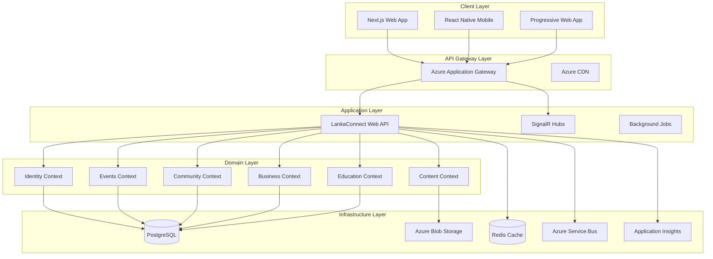
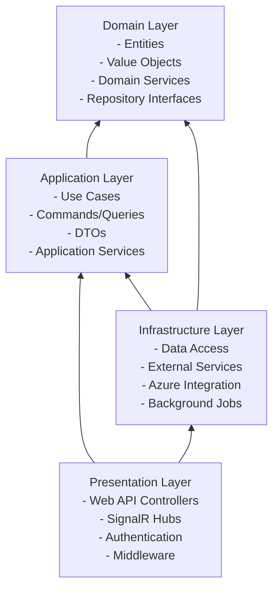

# LankaConnect - System Architecture Overview

## Document Overview
**Document Type**: Technical Architecture - System Design  
**Version**: 1.0  
**Last Updated**: January 2025  
**Target Audience**: Development Team, Claude Code Agents  

## 1. Executive Summary

LankaConnect employs a **Modular Monolith architecture** with **Domain-Driven Design (DDD)** and **Clean Architecture** principles. This approach balances solo developer efficiency with enterprise-grade scalability and maintainability.

### Key Architectural Decisions
- **Modular Monolith**: Single deployment with clear domain boundaries
- **Azure-Native**: Leveraging Azure services for scalability and reliability
- **Clean Architecture**: Dependency inversion and separation of concerns
- **CQRS Pattern**: Command Query Responsibility Segregation for complex operations
- **Event-Driven**: Domain events for loose coupling between bounded contexts

## 2. High-Level System Architecture



## 3. Bounded Contexts Design

### 3.1 Domain Boundaries

```csharp
// Solution Structure
LankaConnect/
├── src/
│   ├── LankaConnect.Api/                    # Presentation Layer
│   ├── LankaConnect.Application/            # Application Layer
│   ├── LankaConnect.Domain/                 # Domain Layer
│   │   ├── Identity/                        # Identity Bounded Context
│   │   ├── Events/                          # Events Bounded Context
│   │   ├── Community/                       # Community Bounded Context
│   │   ├── Business/                        # Business Bounded Context
│   │   ├── Education/                       # Education Bounded Context (Phase 2)
│   │   ├── Content/                         # Content Bounded Context
│   │   └── Shared/                          # Shared Kernel
│   ├── LankaConnect.Infrastructure/         # Infrastructure Layer
│   └── LankaConnect.Tests/                  # Test Projects
├── docs/                                    # Documentation
├── scripts/                                 # Deployment Scripts
└── docker-compose.yml                       # Local Development
```

### 3.2 Bounded Context Responsibilities

#### Identity Context
```csharp
namespace LankaConnect.Domain.Identity
{
    // Core Entities
    public class User : AggregateRoot<UserId>
    {
        public UserProfile Profile { get; private set; }
        public IReadOnlyList<UserRole> Roles { get; private set; }
        public MembershipTier MembershipTier { get; private set; }
        
        // Domain Methods
        public void UpdateProfile(UserProfile profile);
        public void UpgradeMembership(MembershipTier tier);
        public void AssignRole(UserRole role);
    }
    
    // Value Objects
    public class UserProfile : ValueObject
    {
        public string FirstName { get; }
        public string LastName { get; }
        public Location Location { get; }
        public CulturalPreferences Preferences { get; }
    }
    
    // Domain Services
    public class UserRegistrationService
    {
        public async Task<User> RegisterUserAsync(
            string email, 
            UserProfile profile, 
            AuthProvider authProvider);
    }
}
```

#### Events Context
```csharp
namespace LankaConnect.Domain.Events
{
    public class Event : AggregateRoot<EventId>
    {
        public EventDetails Details { get; private set; }
        public EventSchedule Schedule { get; private set; }
        public Location Location { get; private set; }
        public TicketingInfo TicketingInfo { get; private set; }
        public IReadOnlyList<EventAttendee> Attendees { get; private set; }
        
        // Domain Methods
        public void UpdateDetails(EventDetails details);
        public void RescheduleEvent(DateTime newDateTime, string reason);
        public void AddAttendee(UserId userId, TicketType ticketType);
        public void CancelEvent(string reason);
    }
    
    // Domain Events
    public class EventCreated : DomainEvent
    {
        public EventId EventId { get; }
        public UserId OrganizerId { get; }
        public EventDetails Details { get; }
    }
    
    public class AttendeeRegistered : DomainEvent
    {
        public EventId EventId { get; }
        public UserId AttendeeId { get; }
        public TicketType TicketType { get; }
    }
}
```

#### Community Context
```csharp
namespace LankaConnect.Domain.Community
{
    public class ForumPost : AggregateRoot<PostId>
    {
        public ForumCategory Category { get; private set; }
        public PostContent Content { get; private set; }
        public UserId AuthorId { get; private set; }
        public IReadOnlyList<PostReply> Replies { get; private set; }
        public PostModeration Moderation { get; private set; }
        
        // Domain Methods
        public void AddReply(UserId userId, string content);
        public void UpdateContent(string newContent);
        public void ModeratePost(ModerationAction action, string reason);
    }
    
    public class Discussion : AggregateRoot<DiscussionId>
    {
        public DiscussionTopic Topic { get; private set; }
        public IReadOnlyList<ForumPost> Posts { get; private set; }
        
        public void StartDiscussion(UserId userId, DiscussionTopic topic);
        public void AddPost(ForumPost post);
    }
}
```

## 4. Clean Architecture Implementation

### 4.1 Layer Dependencies



### 4.2 Domain Layer Structure

```csharp
// Domain Layer - No external dependencies
namespace LankaConnect.Domain.Shared
{
    public abstract class Entity<TId> where TId : struct
    {
        public TId Id { get; protected set; }
        public DateTime CreatedAt { get; protected set; }
        public DateTime? UpdatedAt { get; protected set; }
        
        protected Entity(TId id)
        {
            Id = id;
            CreatedAt = DateTime.UtcNow;
        }
    }
    
    public abstract class AggregateRoot<TId> : Entity<TId>, IAggregateRoot 
        where TId : struct
    {
        private readonly List<DomainEvent> _domainEvents = new();
        
        public IReadOnlyList<DomainEvent> DomainEvents => _domainEvents.AsReadOnly();
        
        protected void AddDomainEvent(DomainEvent domainEvent)
        {
            _domainEvents.Add(domainEvent);
        }
        
        public void ClearDomainEvents()
        {
            _domainEvents.Clear();
        }
    }
    
    public abstract class ValueObject : IEquatable<ValueObject>
    {
        protected abstract IEnumerable<object> GetEqualityComponents();
        
        public bool Equals(ValueObject other)
        {
            return other != null && GetEqualityComponents().SequenceEqual(other.GetEqualityComponents());
        }
    }
}
```

### 4.3 Application Layer Structure

```csharp
// Application Layer - Orchestrates domain operations
namespace LankaConnect.Application.Events.Commands
{
    public class CreateEventCommand : IRequest<EventId>
    {
        public string Title { get; set; }
        public string Description { get; set; }
        public DateTime EventDate { get; set; }
        public LocationDto Location { get; set; }
        public TicketingInfoDto TicketingInfo { get; set; }
        public UserId OrganizerId { get; set; }
    }
    
    public class CreateEventCommandHandler : IRequestHandler<CreateEventCommand, EventId>
    {
        private readonly IEventRepository _eventRepository;
        private readonly IUserRepository _userRepository;
        private readonly IUnitOfWork _unitOfWork;
        private readonly IEventDomainService _eventDomainService;
        
        public async Task<EventId> Handle(CreateEventCommand request, CancellationToken cancellationToken)
        {
            // 1. Validate user can create events
            var organizer = await _userRepository.GetByIdAsync(request.OrganizerId);
            if (!organizer.CanCreateEvents())
                throw new BusinessRuleViolationException("User cannot create events");
            
            // 2. Create event through domain service
            var eventDetails = new EventDetails(request.Title, request.Description);
            var schedule = new EventSchedule(request.EventDate);
            var location = new Location(request.Location.Address, request.Location.City, request.Location.State);
            
            var newEvent = _eventDomainService.CreateEvent(
                organizer, 
                eventDetails, 
                schedule, 
                location);
            
            // 3. Save and publish domain events
            await _eventRepository.AddAsync(newEvent);
            await _unitOfWork.SaveChangesAsync(cancellationToken);
            
            return newEvent.Id;
        }
    }
}
```

## 5. CQRS Implementation

### 5.1 Command Query Separation

```csharp
// Commands - Write operations
namespace LankaConnect.Application.Commands
{
    public interface ICommand : IRequest<Result>
    {
    }
    
    public interface ICommand<TResponse> : IRequest<Result<TResponse>>
    {
    }
    
    // Command Handlers
    public abstract class CommandHandler<TCommand> : IRequestHandler<TCommand, Result>
        where TCommand : ICommand
    {
        protected readonly IUnitOfWork UnitOfWork;
        
        protected CommandHandler(IUnitOfWork unitOfWork)
        {
            UnitOfWork = unitOfWork;
        }
        
        public abstract Task<Result> Handle(TCommand command, CancellationToken cancellationToken);
    }
}

// Queries - Read operations
namespace LankaConnect.Application.Queries
{
    public interface IQuery<TResponse> : IRequest<TResponse>
    {
    }
    
    // Query Handlers
    public abstract class QueryHandler<TQuery, TResponse> : IRequestHandler<TQuery, TResponse>
        where TQuery : IQuery<TResponse>
    {
        protected readonly IReadOnlyDbContext ReadContext;
        
        protected QueryHandler(IReadOnlyDbContext readContext)
        {
            ReadContext = readContext;
        }
        
        public abstract Task<TResponse> Handle(TQuery query, CancellationToken cancellationToken);
    }
}
```

### 5.2 MediatR Pipeline Configuration

```csharp
// Pipeline Behaviors
public class ValidationBehavior<TRequest, TResponse> : IPipelineBehavior<TRequest, TResponse>
    where TRequest : IRequest<TResponse>
{
    private readonly IEnumerable<IValidator<TRequest>> _validators;
    
    public async Task<TResponse> Handle(
        TRequest request, 
        RequestHandlerDelegate<TResponse> next, 
        CancellationToken cancellationToken)
    {
        if (_validators.Any())
        {
            var context = new ValidationContext<TRequest>(request);
            var validationResults = await Task.WhenAll(
                _validators.Select(v => v.ValidateAsync(context, cancellationToken)));
            
            var failures = validationResults
                .SelectMany(r => r.Errors)
                .Where(f => f != null)
                .ToList();
                
            if (failures.Any())
                throw new ValidationException(failures);
        }
        
        return await next();
    }
}

public class LoggingBehavior<TRequest, TResponse> : IPipelineBehavior<TRequest, TResponse>
    where TRequest : IRequest<TResponse>
{
    private readonly ILogger<LoggingBehavior<TRequest, TResponse>> _logger;
    
    public async Task<TResponse> Handle(
        TRequest request, 
        RequestHandlerDelegate<TResponse> next, 
        CancellationToken cancellationToken)
    {
        _logger.LogInformation("Handling {RequestName}", typeof(TRequest).Name);
        
        var stopwatch = Stopwatch.StartNew();
        var response = await next();
        stopwatch.Stop();
        
        _logger.LogInformation("Handled {RequestName} in {ElapsedMilliseconds}ms", 
            typeof(TRequest).Name, stopwatch.ElapsedMilliseconds);
            
        return response;
    }
}
```

## 6. Domain Events and Integration

### 6.1 Domain Event System

```csharp
// Domain Event Base
namespace LankaConnect.Domain.Shared
{
    public abstract class DomainEvent
    {
        public Guid Id { get; } = Guid.NewGuid();
        public DateTime OccurredOn { get; } = DateTime.UtcNow;
    }
    
    public interface IDomainEventHandler<in TDomainEvent> where TDomainEvent : DomainEvent
    {
        Task Handle(TDomainEvent domainEvent, CancellationToken cancellationToken);
    }
}

// Event Publishing
namespace LankaConnect.Infrastructure.Events
{
    public class DomainEventDispatcher : IDomainEventDispatcher
    {
        private readonly IServiceProvider _serviceProvider;
        
        public async Task DispatchAsync(DomainEvent domainEvent, CancellationToken cancellationToken = default)
        {
            var handlerType = typeof(IDomainEventHandler<>).MakeGenericType(domainEvent.GetType());
            var handlers = _serviceProvider.GetServices(handlerType);
            
            var tasks = handlers.Select(handler => 
                (Task)handlerType.GetMethod("Handle")
                    .Invoke(handler, new object[] { domainEvent, cancellationToken }));
                    
            await Task.WhenAll(tasks);
        }
    }
}
```

### 6.2 Cross-Context Integration

```csharp
// Integration Events for cross-context communication
namespace LankaConnect.Application.IntegrationEvents
{
    public class UserRegisteredIntegrationEvent : IntegrationEvent
    {
        public Guid UserId { get; }
        public string Email { get; }
        public UserProfile Profile { get; }
        
        public UserRegisteredIntegrationEvent(Guid userId, string email, UserProfile profile)
        {
            UserId = userId;
            Email = email;
            Profile = profile;
        }
    }
    
    // Handler in different context
    public class UserRegisteredHandler : IIntegrationEventHandler<UserRegisteredIntegrationEvent>
    {
        private readonly ICommunityService _communityService;
        
        public async Task Handle(UserRegisteredIntegrationEvent @event)
        {
            // Create default community preferences for new user
            await _communityService.InitializeUserPreferencesAsync(@event.UserId, @event.Profile);
        }
    }
}
```

## 7. API Design Principles

### 7.1 RESTful API Structure

```csharp
// Resource-based URL design
[Route("api/v1/[controller]")]
[ApiController]
public class EventsController : ControllerBase
{
    private readonly IMediator _mediator;
    
    [HttpGet]
    public async Task<ActionResult<PagedResult<EventSummaryDto>>> GetEvents(
        [FromQuery] GetEventsQuery query)
    {
        var result = await _mediator.Send(query);
        return Ok(result);
    }
    
    [HttpGet("{id}")]
    public async Task<ActionResult<EventDetailDto>> GetEvent(Guid id)
    {
        var query = new GetEventByIdQuery(id);
        var result = await _mediator.Send(query);
        return result != null ? Ok(result) : NotFound();
    }
    
    [HttpPost]
    [Authorize]
    public async Task<ActionResult<EventDto>> CreateEvent([FromBody] CreateEventCommand command)
    {
        var eventId = await _mediator.Send(command);
        var createdEvent = await _mediator.Send(new GetEventByIdQuery(eventId));
        return CreatedAtAction(nameof(GetEvent), new { id = eventId }, createdEvent);
    }
}
```

### 7.2 API Versioning Strategy

```csharp
// Version-aware controllers
[ApiVersion("1.0")]
[Route("api/v{version:apiVersion}/[controller]")]
public class EventsV1Controller : ControllerBase
{
    // V1 implementation
}

[ApiVersion("2.0")]
[Route("api/v{version:apiVersion}/[controller]")]
public class EventsV2Controller : ControllerBase
{
    // V2 implementation with breaking changes
}
```

## 8. Development Patterns and Standards

### 8.1 Repository Pattern

```csharp
// Generic Repository Interface
namespace LankaConnect.Domain.Shared
{
    public interface IRepository<T, TId> where T : AggregateRoot<TId> where TId : struct
    {
        Task<T> GetByIdAsync(TId id);
        Task<IEnumerable<T>> GetAllAsync();
        Task<T> AddAsync(T entity);
        Task UpdateAsync(T entity);
        Task DeleteAsync(TId id);
    }
}

// Specific Repository
namespace LankaConnect.Domain.Events
{
    public interface IEventRepository : IRepository<Event, EventId>
    {
        Task<IEnumerable<Event>> GetEventsByLocationAsync(Location location);
        Task<IEnumerable<Event>> GetUpcomingEventsAsync();
        Task<IEnumerable<Event>> GetEventsByOrganizerAsync(UserId organizerId);
    }
}
```

### 8.2 Unit of Work Pattern

```csharp
namespace LankaConnect.Application.Common
{
    public interface IUnitOfWork : IDisposable
    {
        Task<int> SaveChangesAsync(CancellationToken cancellationToken = default);
        Task BeginTransactionAsync();
        Task CommitTransactionAsync();
        Task RollbackTransactionAsync();
    }
    
    public class UnitOfWork : IUnitOfWork
    {
        private readonly LankaConnectDbContext _context;
        private readonly IDomainEventDispatcher _domainEventDispatcher;
        
        public async Task<int> SaveChangesAsync(CancellationToken cancellationToken = default)
        {
            // Collect domain events before saving
            var domainEvents = _context.ChangeTracker.Entries<IAggregateRoot>()
                .SelectMany(x => x.Entity.DomainEvents)
                .ToList();
            
            // Save changes
            var result = await _context.SaveChangesAsync(cancellationToken);
            
            // Dispatch domain events after successful save
            foreach (var domainEvent in domainEvents)
            {
                await _domainEventDispatcher.DispatchAsync(domainEvent, cancellationToken);
            }
            
            return result;
        }
    }
}
```

## 9. Configuration and Dependency Injection

### 9.1 Service Registration

```csharp
// Program.cs - Service configuration
public static class ServiceCollectionExtensions
{
    public static IServiceCollection AddLankaConnectServices(
        this IServiceCollection services, 
        IConfiguration configuration)
    {
        // Core services
        services.AddMediatR(typeof(CreateEventCommand).Assembly);
        services.AddAutoMapper(typeof(EventMappingProfile).Assembly);
        services.AddValidatorsFromAssembly(typeof(CreateEventCommandValidator).Assembly);
        
        // Domain services
        services.AddScoped<IEventDomainService, EventDomainService>();
        services.AddScoped<IUserDomainService, UserDomainService>();
        
        // Application services
        services.AddScoped<IEventApplicationService, EventApplicationService>();
        services.AddScoped<ICommunityApplicationService, CommunityApplicationService>();
        
        // Infrastructure services
        services.AddScoped<IUnitOfWork, UnitOfWork>();
        services.AddScoped<IDomainEventDispatcher, DomainEventDispatcher>();
        
        // Pipeline behaviors
        services.AddTransient(typeof(IPipelineBehavior<,>), typeof(ValidationBehavior<,>));
        services.AddTransient(typeof(IPipelineBehavior<,>), typeof(LoggingBehavior<,>));
        
        return services;
    }
}
```

## 10. Next Steps

This System Architecture Overview provides the foundation for LankaConnect's development. The next documents in the series will dive deeper into:

1. **Database Design & Data Architecture** - Detailed schema design and EF Core configuration
2. **API Design & Integration Patterns** - REST API specifications and SignalR implementation
3. **Security Architecture** - Authentication, authorization, and security policies
4. **Azure Services Integration** - Detailed Azure service configurations
5. **Performance & Monitoring** - Optimization strategies and observability

Each document builds upon this architectural foundation while providing specific implementation guidance for Claude Code agents.