# Event Media Architecture - Visual Diagrams

## 1. System Context Diagram (C4 Level 1)

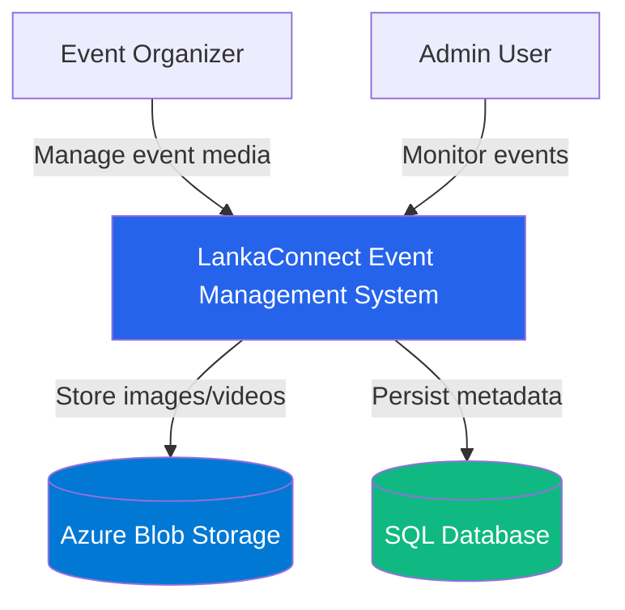

---

## 2. Container Diagram (C4 Level 2)

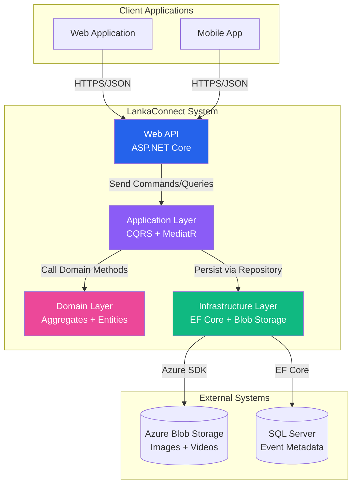

---

## 3. Component Diagram - Image Replace Flow (C4 Level 3)

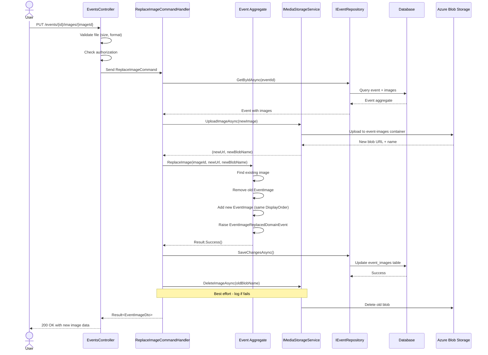

---

## 4. Component Diagram - Video Upload Flow (C4 Level 3)

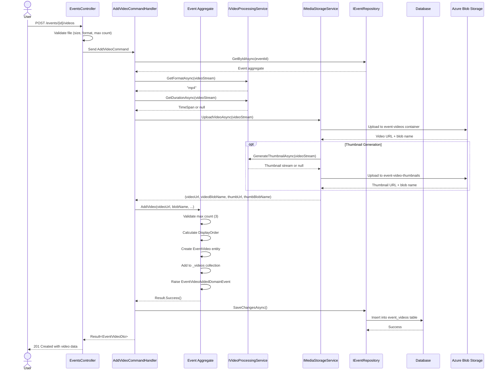

---

## 5. Domain Model Diagram

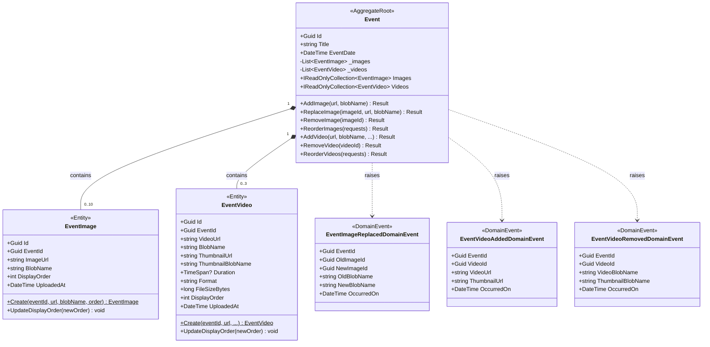

---

## 6. Infrastructure Layer - Storage Architecture

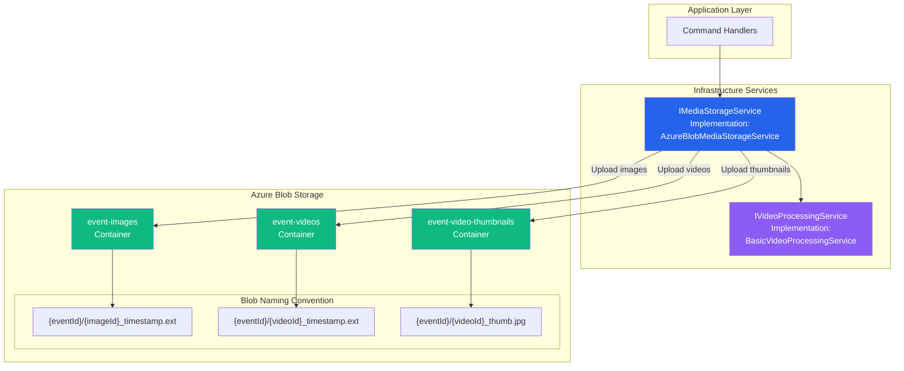

---

## 7. Database Schema Diagram

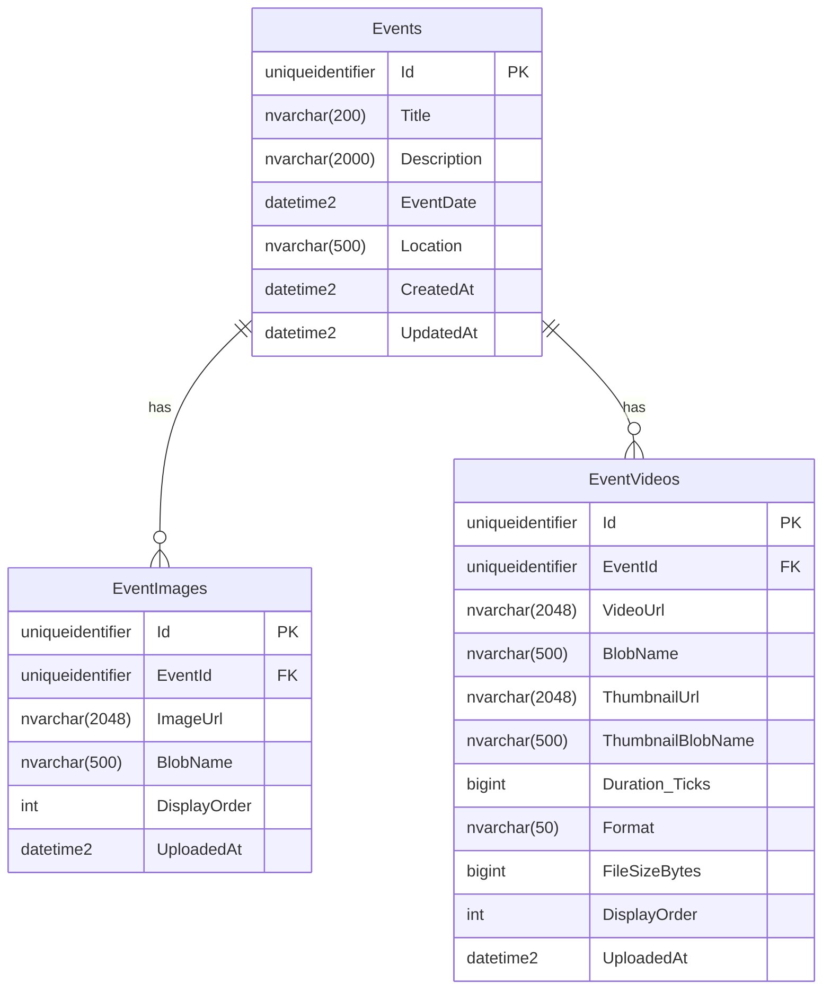

**Indexes:**
- `EventImages`: `IX_EventImages_EventId_DisplayOrder` (Unique)
- `EventVideos`: `IX_EventVideos_EventId_DisplayOrder` (Unique)
- `EventVideos`: `IX_EventVideos_EventId`

**Constraints:**
- Both tables: `ON DELETE CASCADE` from Events table
- DisplayOrder: Must be >= 0
- FileSizeBytes: Must be > 0

---

## 8. API Endpoint Architecture

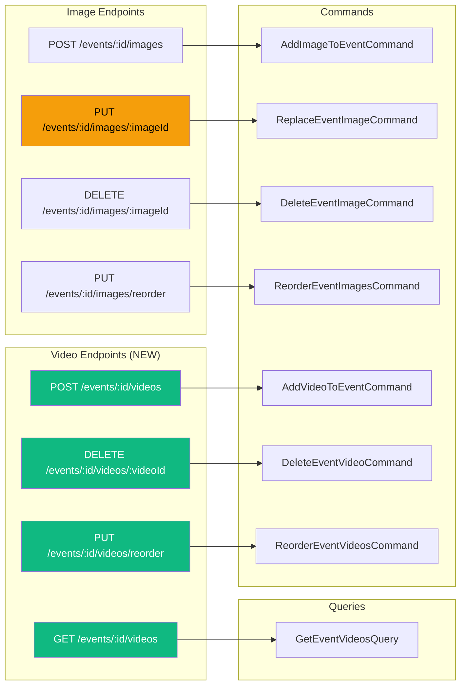

---

## 9. Error Handling Flow - Compensating Transactions

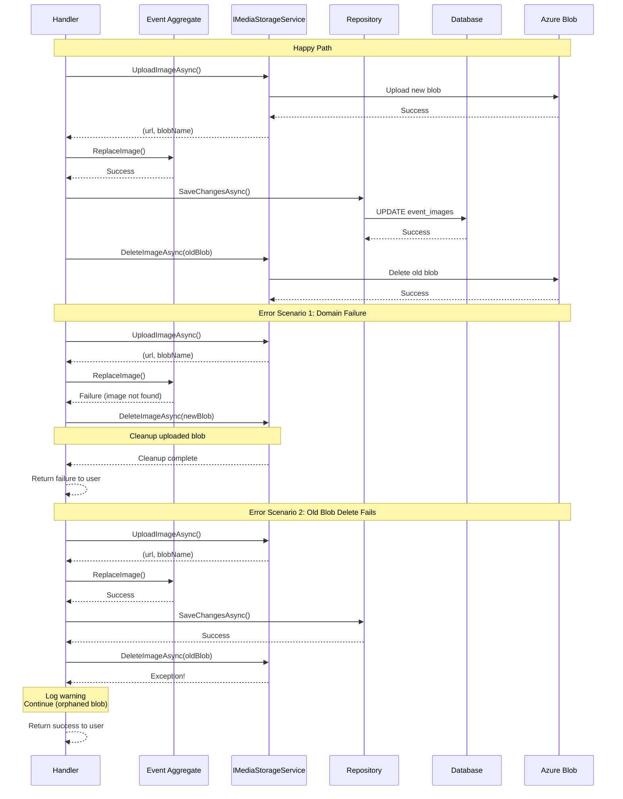

---

## 10. Deployment Architecture

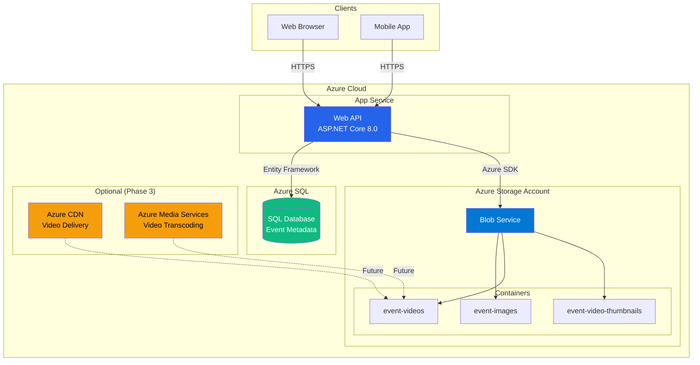

---

## 11. State Transition Diagram - Event Media Lifecycle

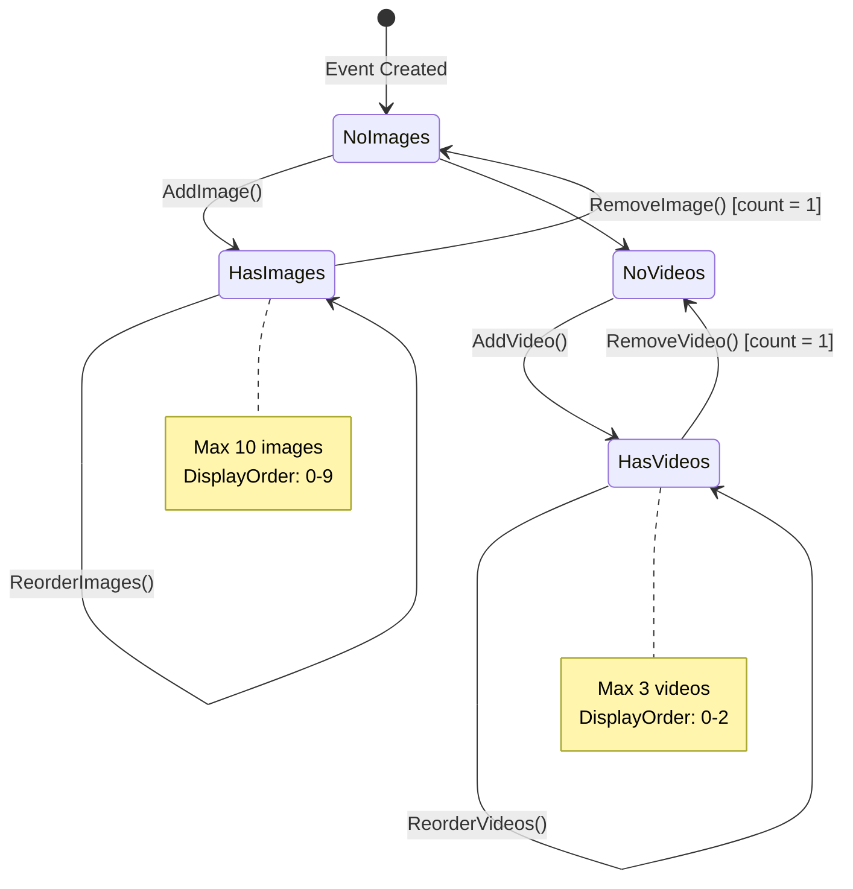

---

## 12. Testing Strategy Pyramid

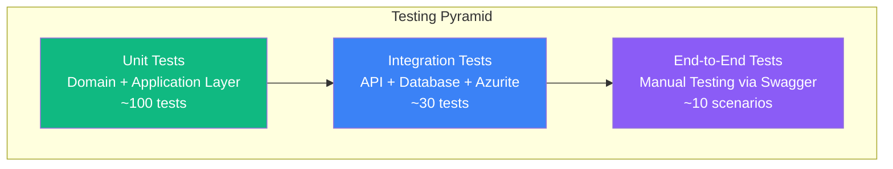

**Test Coverage Goals:**
- **Domain Layer:** 95%+ (critical business logic)
- **Application Layer:** 90%+ (command handlers, validators)
- **Infrastructure Layer:** 80%+ (blob storage, EF Core)
- **API Layer:** 85%+ (endpoints, validation)
- **Overall:** 90%+

---

## 13. Continuous Integration/Deployment Pipeline

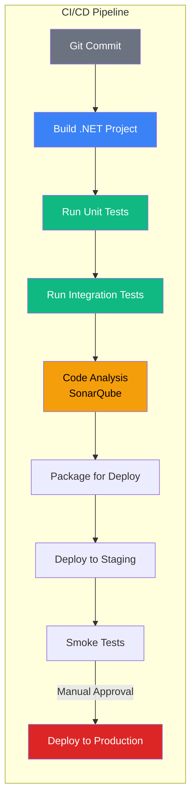

---

## 14. Monitoring and Observability

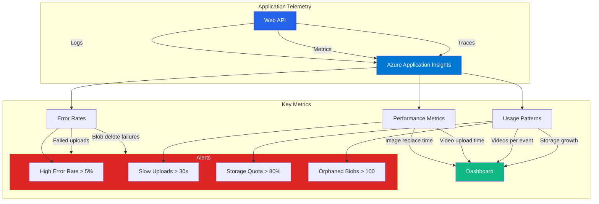

**Key Performance Indicators (KPIs):**
1. Image replace latency (target: < 2s)
2. Video upload latency for 50 MB (target: < 10s)
3. Failed upload rate (target: < 1%)
4. Orphaned blob count (target: < 50)
5. Storage cost per event (target: < $0.10/month)

---

## 15. Security Architecture

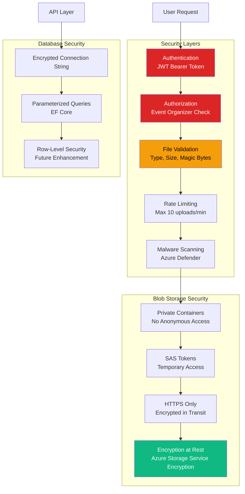

---

## Legend

**Color Coding:**
- 🔵 Blue: Core system components
- 🟣 Purple: Application logic
- 🔴 Pink: Domain layer
- 🟢 Green: Infrastructure/Data
- 🟠 Orange: External services/Future enhancements
- 🔴 Red: Security/Critical operations

**Symbols:**
- Solid lines: Direct dependencies
- Dashed lines: Future/Optional dependencies
- Arrows: Data flow direction

---

## How to Use These Diagrams

1. **For Developers:** Use the sequence diagrams to understand implementation flow
2. **For Architects:** Use C4 diagrams to understand system structure
3. **For QA:** Use state diagrams to design test scenarios
4. **For DevOps:** Use deployment diagram for infrastructure setup
5. **For Stakeholders:** Use context diagram for high-level understanding

---

## Related Documents

- [EventMedia-Architecture.md](./EventMedia-Architecture.md) - Detailed architecture guide
- [EventMedia-Implementation-Plan.md](./EventMedia-Implementation-Plan.md) - Step-by-step implementation
- [EventMedia-Decision-Matrix.md](./EventMedia-Decision-Matrix.md) - Architecture decisions and rationale
