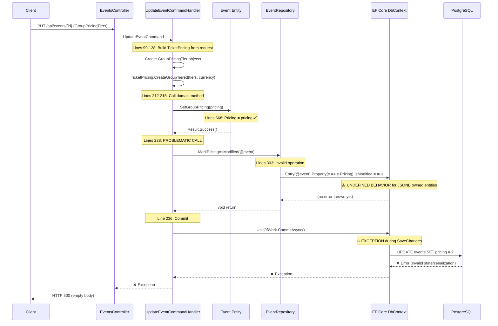
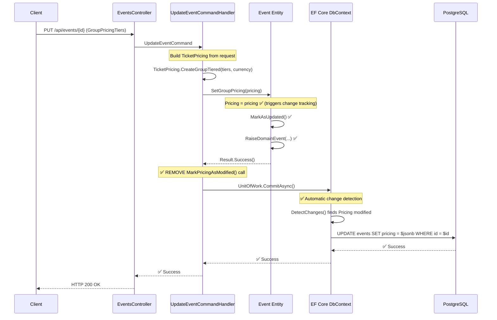

# Group Pricing Update Flow - Issue Diagnosis

## Current Implementation Flow (BROKEN)



## Root Cause: JSONB Change Tracking

```
┌─────────────────────────────────────────────────────────────┐
│ JSONB Owned Entity Configuration                           │
├─────────────────────────────────────────────────────────────┤
│                                                             │
│  EventConfiguration.cs (Lines 75-90):                      │
│                                                             │
│  builder.OwnsOne(e => e.Pricing, pricing =>               │
│  {                                                         │
│      pricing.ToJson("pricing"); // ← JSONB column         │
│                                                            │
│      pricing.OwnsOne(p => p.AdultPrice);                  │
│      pricing.OwnsOne(p => p.ChildPrice);                  │
│                                                            │
│      pricing.OwnsMany(p => p.GroupTiers, tier =>          │
│      {                                                     │
│          tier.OwnsOne(t => t.PricePerPerson);            │
│      });                                                   │
│  });                                                       │
│                                                            │
└─────────────────────────────────────────────────────────────┘
                        │
                        ▼
┌─────────────────────────────────────────────────────────────┐
│ Database Structure                                          │
├─────────────────────────────────────────────────────────────┤
│                                                             │
│  CREATE TABLE events (                                     │
│      id uuid PRIMARY KEY,                                  │
│      title varchar(200),                                   │
│      pricing jsonb,  -- ← Entire TicketPricing as JSONB   │
│      ...                                                   │
│  );                                                        │
│                                                             │
└─────────────────────────────────────────────────────────────┘
                        │
                        ▼
┌─────────────────────────────────────────────────────────────┐
│ JSONB Serialization Example                                │
├─────────────────────────────────────────────────────────────┤
│                                                             │
│  {                                                         │
│    "Type": "GroupTiered",                                  │
│    "Currency": "USD",                                      │
│    "AdultPrice": { "Amount": 0, "Currency": "USD" },      │
│    "ChildPrice": null,                                     │
│    "ChildAgeLimit": null,                                  │
│    "GroupTiers": [                                         │
│      {                                                     │
│        "MinAttendees": 1,                                  │
│        "MaxAttendees": 5,                                  │
│        "PricePerPerson": { "Amount": 100, "Currency": ... }│
│      },                                                    │
│      { "MinAttendees": 6, "MaxAttendees": 10, ... }       │
│    ]                                                       │
│  }                                                         │
│                                                             │
└─────────────────────────────────────────────────────────────┘
```

## The Problem: Invalid Change Tracking Pattern

```
┌───────────────────────────────────────────────────────────────┐
│ ❌ INCORRECT (Current Implementation)                        │
├───────────────────────────────────────────────────────────────┤
│                                                               │
│  EventRepository.MarkPricingAsModified():                    │
│                                                               │
│    _context.Entry(@event)                                    │
│        .Property(e => e.Pricing)  // ← JSONB is NOT a       │
│        .IsModified = true;        //    trackable property!  │
│                                                               │
│  Why This Fails:                                             │
│  • Pricing is serialized as whole JSONB document            │
│  • EF Core doesn't track "properties" within JSONB          │
│  • .Property() accessor expects scalar/nav properties        │
│  • Result: Undefined behavior, potential null reference     │
│                                                               │
└───────────────────────────────────────────────────────────────┘
                          │
                          ▼
┌───────────────────────────────────────────────────────────────┐
│ ✅ CORRECT (Microsoft Pattern)                               │
├───────────────────────────────────────────────────────────────┤
│                                                               │
│  Event.SetGroupPricing(TicketPricing pricing):               │
│                                                               │
│    Pricing = pricing;  // ← Object reference change         │
│                        //    triggers EF Core change tracking│
│                                                               │
│  Why This Works:                                             │
│  • EF Core compares object references for owned entities    │
│  • Detects Pricing != previousPricing                       │
│  • Marks entity for JSONB update automatically              │
│  • No manual tracking needed                                 │
│                                                               │
└───────────────────────────────────────────────────────────────┘
```

## Corrected Implementation Flow



## EF Core JSONB Change Detection

```
┌─────────────────────────────────────────────────────────────┐
│ How EF Core Tracks JSONB Owned Entities                    │
├─────────────────────────────────────────────────────────────┤
│                                                             │
│  Step 1: Entity Loaded from Database                       │
│  ┌─────────────────────────────────────┐                  │
│  │ Event entity: { Id, Title, ... }    │                  │
│  │   Pricing: <reference A>             │                  │
│  └─────────────────────────────────────┘                  │
│            │                                               │
│            ▼                                               │
│  Step 2: Domain Method Assigns New Instance              │
│  ┌─────────────────────────────────────┐                 │
│  │ @event.Pricing = <reference B>      │                  │
│  └─────────────────────────────────────┘                  │
│            │                                               │
│            ▼                                               │
│  Step 3: SaveChanges Detects Change                       │
│  ┌─────────────────────────────────────┐                  │
│  │ EF Core: reference A != reference B  │                  │
│  │ Action: Serialize B to JSONB         │                  │
│  │ SQL: UPDATE events SET pricing = ?   │                  │
│  └─────────────────────────────────────┘                  │
│                                                             │
│  KEY INSIGHT:                                               │
│  • Change detection is based on OBJECT REFERENCE            │
│  • Not on property-by-property comparison                   │
│  • JSONB is updated as a WHOLE DOCUMENT                     │
│                                                             │
└─────────────────────────────────────────────────────────────┘
```

## Comparison: Property Tracking vs JSONB Tracking

```
┌────────────────────────────────────────────────────────────────┐
│ Traditional Owned Entity (Without .ToJson())                  │
├────────────────────────────────────────────────────────────────┤
│                                                                │
│  Configuration:                                                │
│    builder.OwnsOne(e => e.Address, address => {              │
│        address.Property(a => a.Street).HasColumnName(...);   │
│        address.Property(a => a.City).HasColumnName(...);     │
│    });                                                        │
│                                                                │
│  Database:                                                     │
│    CREATE TABLE events (                                      │
│        id uuid,                                               │
│        address_street varchar(200),  -- Separate columns     │
│        address_city varchar(100),    -- Property-level       │
│        ...                                                    │
│    );                                                         │
│                                                                │
│  Change Tracking:                                              │
│    Entry(@event).Property(e => e.Address.Street).IsModified  │
│    ✅ VALID: Can track individual properties                  │
│                                                                │
└────────────────────────────────────────────────────────────────┘
                            VS
┌────────────────────────────────────────────────────────────────┐
│ JSONB Owned Entity (With .ToJson())                           │
├────────────────────────────────────────────────────────────────┤
│                                                                │
│  Configuration:                                                │
│    builder.OwnsOne(e => e.Pricing, pricing => {              │
│        pricing.ToJson("pricing");  // ← JSONB serialization  │
│    });                                                        │
│                                                                │
│  Database:                                                     │
│    CREATE TABLE events (                                      │
│        id uuid,                                               │
│        pricing jsonb  -- Single JSONB column                 │
│    );                                                         │
│                                                                │
│  Change Tracking:                                              │
│    Entry(@event).Property(e => e.Pricing).IsModified         │
│    ❌ INVALID: Pricing is a JSONB document, not a property    │
│                                                                │
│  Correct Pattern:                                              │
│    @event.Pricing = newPricingInstance;                       │
│    ✅ VALID: Object reference change detected automatically   │
│                                                                │
└────────────────────────────────────────────────────────────────┘
```

## Data Flow: Request to Database

```
┌──────────────────────────────────────────────────────────────┐
│ 1. HTTP Request (JSON)                                       │
├──────────────────────────────────────────────────────────────┤
│                                                              │
│  PUT /api/events/123-456                                    │
│  {                                                          │
│    "groupPricingTiers": [                                   │
│      {                                                      │
│        "minAttendees": 1,                                   │
│        "maxAttendees": 5,                                   │
│        "pricePerPerson": 100.00,                           │
│        "currency": "USD"                                    │
│      },                                                     │
│      { "minAttendees": 6, "maxAttendees": 10, ... }        │
│    ]                                                        │
│  }                                                          │
│                                                              │
└──────────────────────────────────────────────────────────────┘
                        │
                        ▼
┌──────────────────────────────────────────────────────────────┐
│ 2. Command Object (C#)                                       │
├──────────────────────────────────────────────────────────────┤
│                                                              │
│  UpdateEventCommand {                                        │
│    EventId = Guid("123-456"),                               │
│    GroupPricingTiers = List<GroupPricingTierRequest> {      │
│      new(1, 5, 100.00, USD),                               │
│      new(6, 10, 80.00, USD)                                │
│    }                                                        │
│  }                                                          │
│                                                              │
└──────────────────────────────────────────────────────────────┘
                        │
                        ▼
┌──────────────────────────────────────────────────────────────┐
│ 3. Domain Value Objects (C#)                                │
├──────────────────────────────────────────────────────────────┤
│                                                              │
│  List<GroupPricingTier> tiers = [                           │
│    GroupPricingTier {                                       │
│      MinAttendees = 1,                                      │
│      MaxAttendees = 5,                                      │
│      PricePerPerson = Money(100, USD)                      │
│    },                                                       │
│    GroupPricingTier { 6, 10, Money(80, USD) }             │
│  ]                                                          │
│                                                              │
│  TicketPricing pricing = TicketPricing.CreateGroupTiered(  │
│    tiers,                                                   │
│    Currency.USD                                             │
│  )                                                          │
│                                                              │
└──────────────────────────────────────────────────────────────┘
                        │
                        ▼
┌──────────────────────────────────────────────────────────────┐
│ 4. Domain Entity Update (C#)                                │
├──────────────────────────────────────────────────────────────┤
│                                                              │
│  Event @event = await _repository.GetByIdAsync(eventId);   │
│  @event.SetGroupPricing(pricing); ← Assigns to Pricing     │
│                                                              │
└──────────────────────────────────────────────────────────────┘
                        │
                        ▼
┌──────────────────────────────────────────────────────────────┐
│ 5. EF Core Change Detection                                 │
├──────────────────────────────────────────────────────────────┤
│                                                              │
│  await _unitOfWork.CommitAsync();                           │
│                                                              │
│  EF Core DetectChanges():                                   │
│    • Compares @event.Pricing reference (old vs new)        │
│    • Detects change: reference changed                      │
│    • Serializes TicketPricing to JSONB string               │
│                                                              │
└──────────────────────────────────────────────────────────────┘
                        │
                        ▼
┌──────────────────────────────────────────────────────────────┐
│ 6. PostgreSQL JSONB Update                                  │
├──────────────────────────────────────────────────────────────┤
│                                                              │
│  UPDATE events                                               │
│  SET pricing = '{                                            │
│    "Type": "GroupTiered",                                   │
│    "Currency": "USD",                                       │
│    "AdultPrice": {"Amount": 0, "Currency": "USD"},         │
│    "ChildPrice": null,                                      │
│    "ChildAgeLimit": null,                                   │
│    "GroupTiers": [                                          │
│      {                                                      │
│        "MinAttendees": 1,                                   │
│        "MaxAttendees": 5,                                   │
│        "PricePerPerson": {"Amount": 100, "Currency": "USD"}│
│      },                                                     │
│      {"MinAttendees": 6, "MaxAttendees": 10, ...}          │
│    ]                                                        │
│  }'::jsonb                                                  │
│  WHERE id = '123-456'::uuid;                                │
│                                                              │
└──────────────────────────────────────────────────────────────┘
```

## Decision Matrix: Change Tracking Approaches

| Approach | Pros | Cons | Verdict |
|----------|------|------|---------|
| **Manual `IsModified = true`** | - Explicit control | - ❌ Undefined behavior for JSONB<br>- ❌ Not supported by EF Core<br>- ❌ Causes HTTP 500 | ❌ **REJECT** |
| **Automatic via object assignment** | - ✅ Microsoft-recommended<br>- ✅ Works with JSONB<br>- ✅ Simpler code | - Requires understanding of reference tracking | ✅ **ACCEPT** |
| **Detach/Attach workaround** | - Forces refresh | - ❌ Hacky solution<br>- ❌ Performance overhead<br>- ❌ Masks real issue | ❌ **REJECT** |
| **Raw SQL JSONB update** | - Guaranteed to work | - ❌ Bypasses domain model<br>- ❌ Violates Clean Architecture<br>- ❌ No validation | ❌ **REJECT** |

## Recommended Fix Summary

```diff
# EventRepository.cs
- public void MarkPricingAsModified(Event @event)
- {
-     _context.Entry(@event).Property(e => e.Pricing).IsModified = true;
- }

# UpdateEventCommandHandler.cs (lines 208-229)
  if (pricing != null)
  {
      Result setPricingResult;
      if (isGroupPricing)
      {
          setPricingResult = @event.SetGroupPricing(pricing);
      }
      else
      {
          setPricingResult = @event.SetDualPricing(pricing);
      }

      if (setPricingResult.IsFailure)
          return setPricingResult;

-     // CRITICAL FIX: Explicitly mark Pricing as modified
-     _eventRepository.MarkPricingAsModified(@event);
  }
```

**Result**: EF Core will automatically detect the Pricing object reference change and update the JSONB column correctly.

---

**Created**: 2025-12-14
**Session**: 33
**Related**: ADR-005-Group-Pricing-JSONB-Update-Failure-Analysis.md
