# C4 Architecture Diagrams: Event API Failure Analysis

## C4 Level 1: System Context Diagram

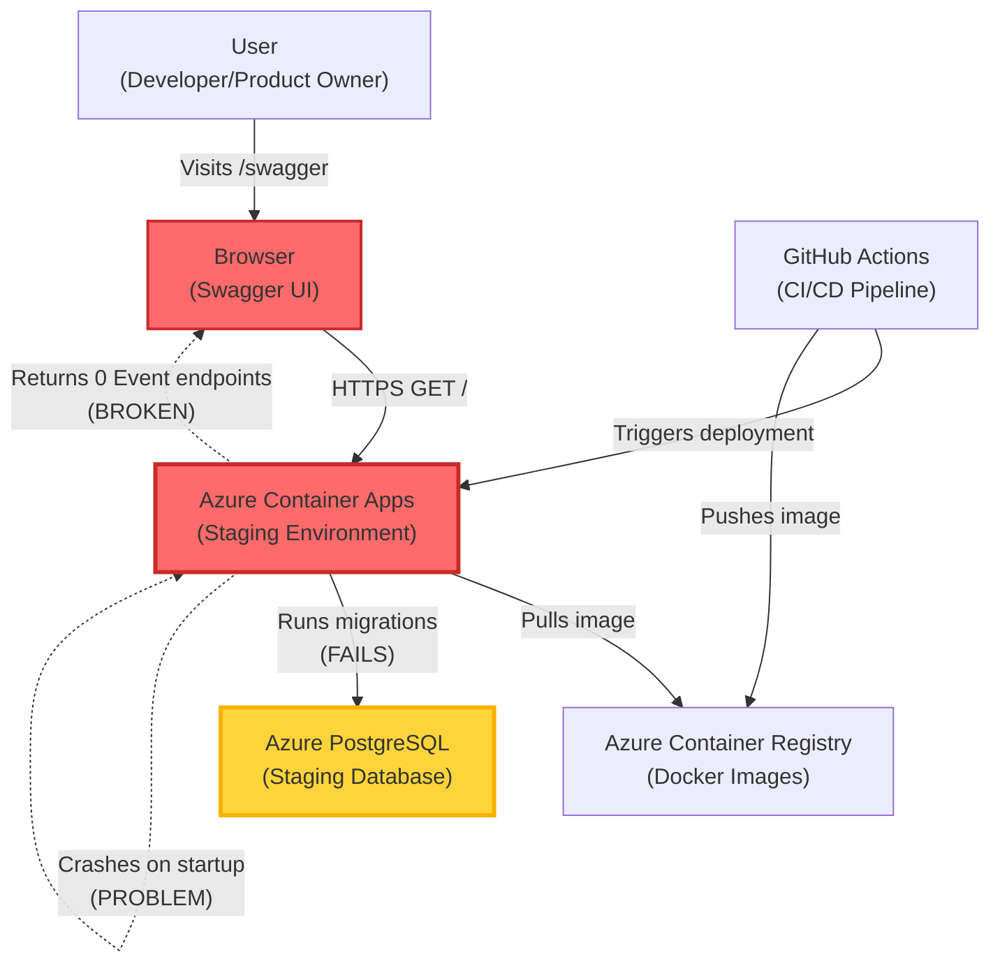

**Key Problem**: Container crashes during migration execution, preventing EventsController from loading.

---

## C4 Level 2: Container Diagram

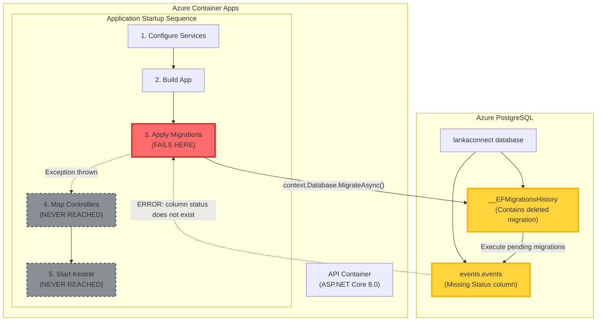

**Critical Issue**: Migrations fail at Step 3, preventing application startup.

---

## C4 Level 3: Component Diagram - Migration Execution

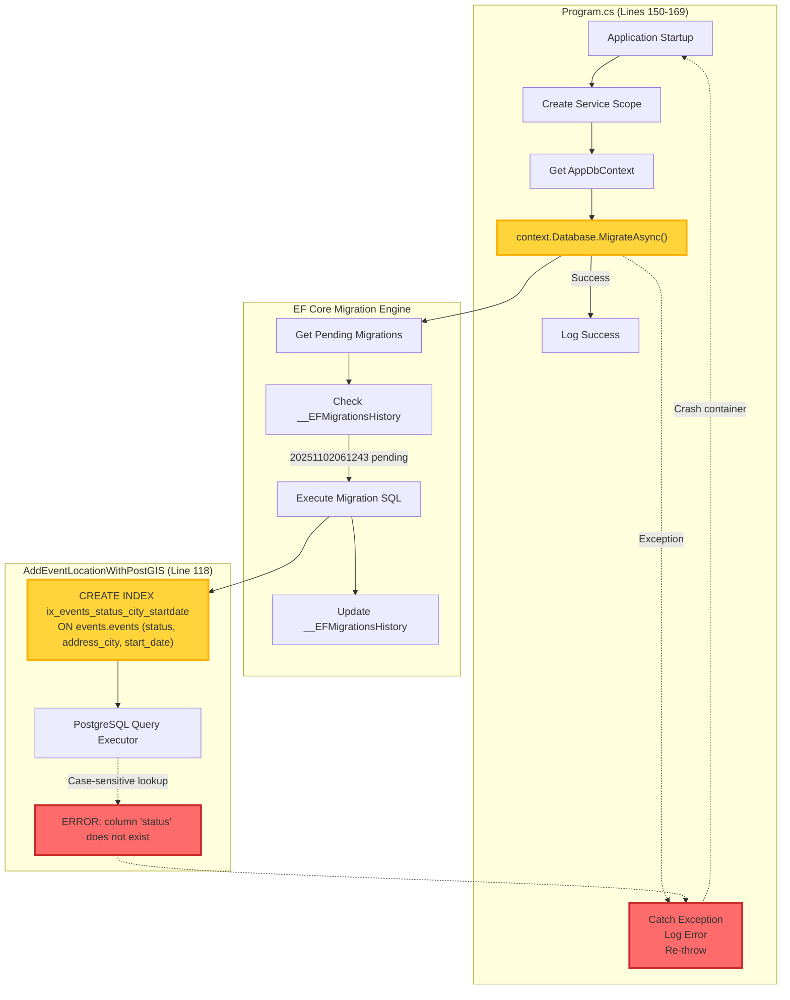

**Root Cause**: Raw SQL uses lowercase `status` but table has PascalCase `Status`.

---

## C4 Level 4: Code Diagram - Migration Failure Sequence

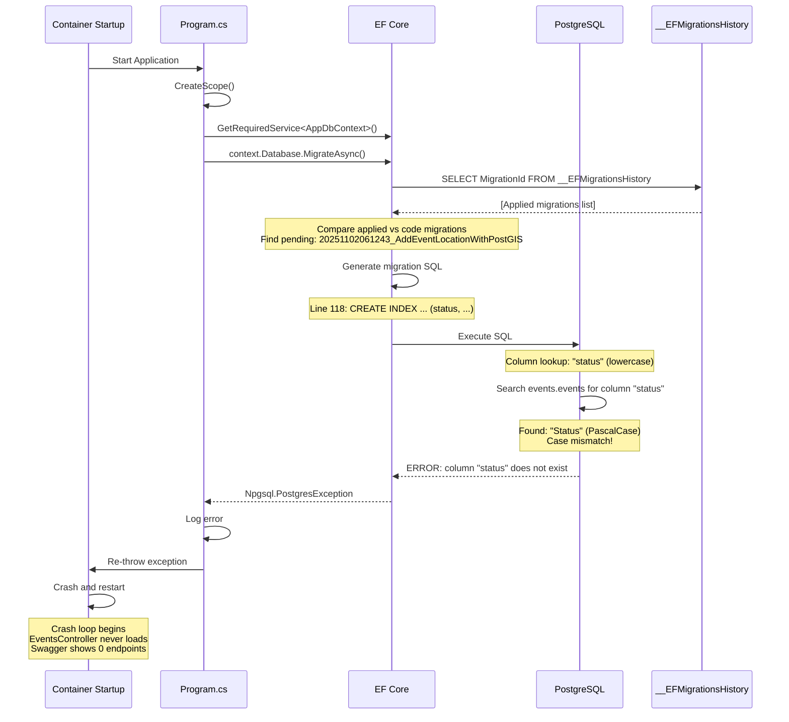

**Timeline**: Container crashes within 5 seconds of startup every time.

---

## Data Flow Diagram - Expected vs Actual

### Expected Flow (Before Deletion)

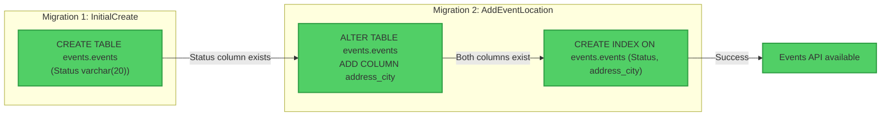

### Actual Flow (After Deletion)

```mermaid
graph LR
    subgraph "Migration 1: InitialCreate"
        M1A["CREATE TABLE events.events<br/>(Status varchar(20))"]
    end

    subgraph "Migration 2: DELETED CreateEvents (Applied to DB)"
        M2A["DROP TABLE events.events"]
        M2B["CREATE TABLE events.events<br/>(NO Status column)"]
    end

    subgraph "Migration 3: AddEventLocation (Fails)"
        M3A["ALTER TABLE events.events<br/>ADD COLUMN address_city"]
        M3B["CREATE INDEX ON events.events (status, address_city)"]
        M3C["ERROR: column 'status' does not exist"]
    end

    M1A -->|"Status exists"| M2A
    M2A -->|"Table dropped"| M2B
    M2B -.->|"Status MISSING"| M3A
    M3A -.->|"Tries to reference status"| M3B
    M3B -.->|"Failure"| M3C
    M3C -.->|"Crash"| Result["Events API UNAVAILABLE"]

    style M2A fill:#ff6b6b,stroke:#c92a2a,stroke-width:3px
    style M2B fill:#ffd43b,stroke:#fab005,stroke-width:3px
    style M3B fill:#ff6b6b,stroke:#c92a2a,stroke-width:3px
    style M3C fill:#ff6b6b,stroke:#c92a2a,stroke-width:3px
    style Result fill:#ff6b6b,stroke:#c92a2a,stroke-width:3px
```

---

## System State Diagram

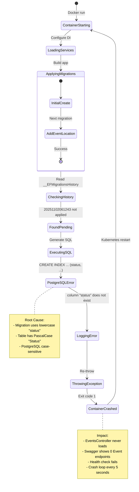

---

## Architecture Decision Flow - How This Happened

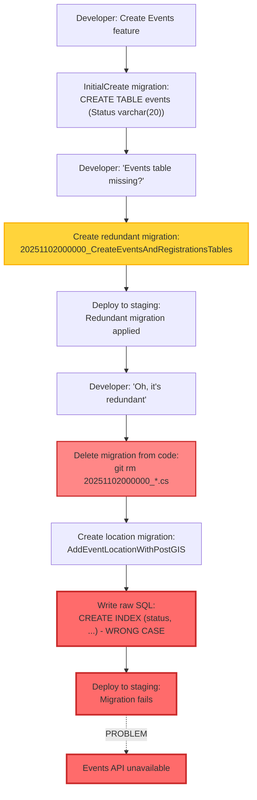

**Key Mistakes**:
1. Created redundant migration instead of verifying existing schema
2. Deleted migration from code without reverting database
3. Used lowercase column name in raw SQL (case mismatch)
4. No migration validation in CI/CD pipeline

---

## Solution Architecture

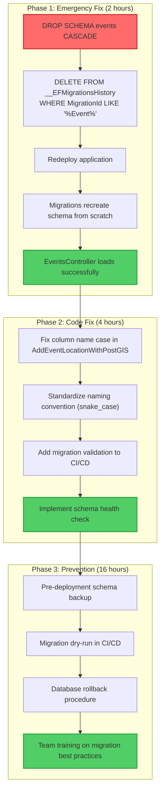

---

## Risk Matrix

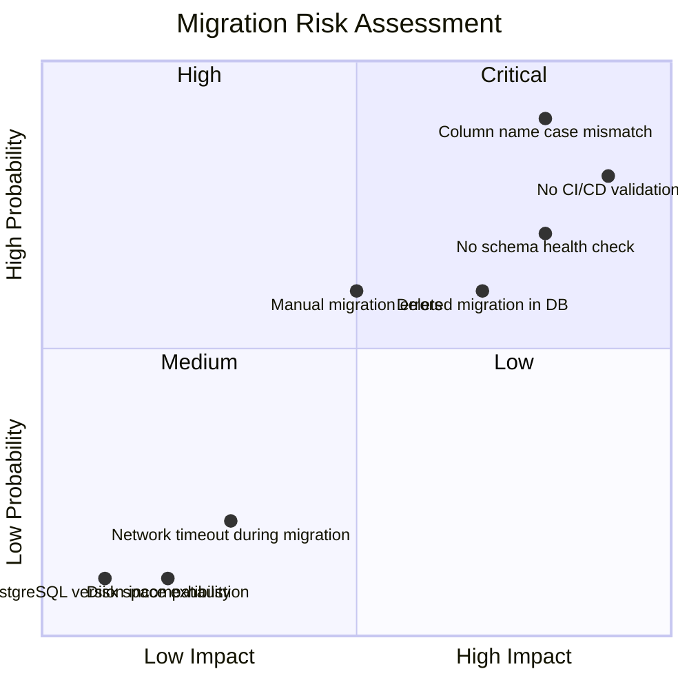

**Critical Risks** (top-right quadrant):
- Column name case mismatch
- No CI/CD validation
- No schema health check

---

## Component Interaction - Healthy State

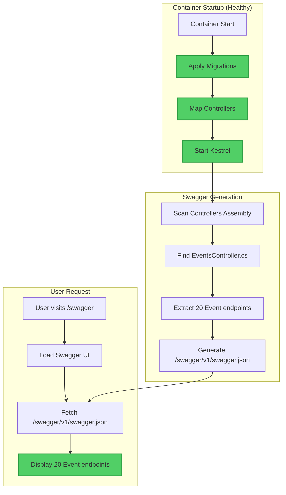

**Expected Behavior**: All steps complete successfully, Swagger shows all endpoints.

---

## Deployment Pipeline - Current vs Improved

### Current Pipeline (Problematic)

```mermaid
graph LR
    Build["dotnet build"]
    Test["dotnet test"]
    Publish["dotnet publish"]
    DockerBuild["docker build"]
    DockerPush["docker push"]
    ContainerUpdate["az containerapp update"]
    ContainerStart["Container starts"]
    MigrationFail["Migrations fail"]

    Build --> Test
    Test --> Publish
    Publish --> DockerBuild
    DockerBuild --> DockerPush
    DockerPush --> ContainerUpdate
    ContainerUpdate --> ContainerStart
    ContainerStart -.->|"No validation"| MigrationFail

    style MigrationFail fill:#ff6b6b,stroke:#c92a2a,stroke-width:3px
```

### Improved Pipeline (With Safeguards)

```mermaid
graph LR
    Build["dotnet build"]
    Test["dotnet test"]
    ValidateMigrations["Validate Migrations<br/>(NEW)"]
    GenerateScript["Generate SQL Script<br/>(NEW)"]
    DryRun["Dry-run on Test DB<br/>(NEW)"]
    Publish["dotnet publish"]
    DockerBuild["docker build"]
    DockerPush["docker push"]
    BackupSchema["Backup DB Schema<br/>(NEW)"]
    ContainerUpdate["az containerapp update"]
    ContainerStart["Container starts"]
    HealthCheck["Schema Health Check<br/>(NEW)"]
    Success["Deployment Success"]

    Build --> Test
    Test --> ValidateMigrations
    ValidateMigrations --> GenerateScript
    GenerateScript --> DryRun
    DryRun --> Publish
    Publish --> DockerBuild
    DockerBuild --> DockerPush
    DockerPush --> BackupSchema
    BackupSchema --> ContainerUpdate
    ContainerUpdate --> ContainerStart
    ContainerStart --> HealthCheck
    HealthCheck --> Success

    style ValidateMigrations fill:#51cf66,stroke:#2f9e44,stroke-width:2px
    style DryRun fill:#51cf66,stroke:#2f9e44,stroke-width:2px
    style BackupSchema fill:#51cf66,stroke:#2f9e44,stroke-width:2px
    style HealthCheck fill:#51cf66,stroke:#2f9e44,stroke-width:2px
    style Success fill:#51cf66,stroke:#2f9e44,stroke-width:3px
```

---

## Summary

These C4 diagrams illustrate:

1. **System Context**: User cannot access Event APIs due to container crash
2. **Container**: Application fails at migration step, never reaches controller mapping
3. **Component**: EF Core migration engine executes SQL with wrong column case
4. **Code**: Detailed sequence showing PostgreSQL case-sensitive column lookup failure

**Key Takeaways**:
- Root cause: Column name case mismatch in raw SQL
- Impact: Complete Event API unavailability
- Solution: Drop/recreate schema + fix migration bugs + add safeguards
- Prevention: Multi-layer validation in CI/CD pipeline
