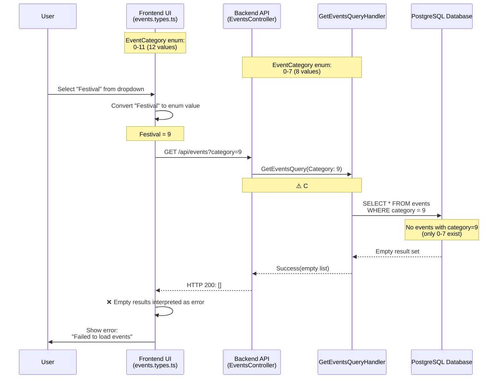
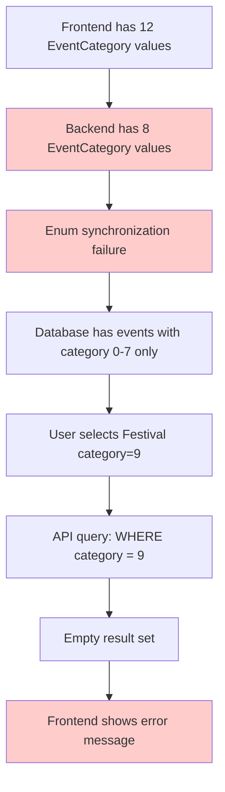
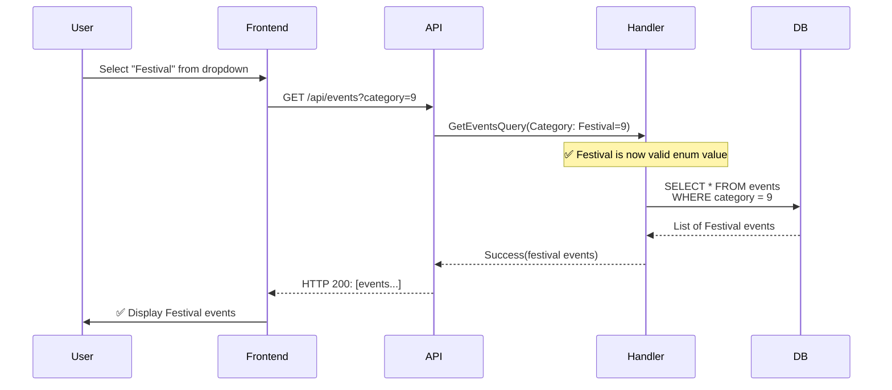
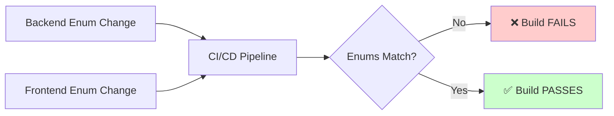

# Issue #78: Festival Filter Error - Flow Diagram



---

## Problem Visualization

### Backend EventCategory Enum (C#)
```
┌─────────────────────────────────────┐
│  EventCategory.cs                   │
├─────────────────────────────────────┤
│  0 = Religious     ✅               │
│  1 = Cultural      ✅               │
│  2 = Community     ✅               │
│  3 = Educational   ✅               │
│  4 = Social        ✅               │
│  5 = Business      ✅               │
│  6 = Charity       ✅               │
│  7 = Entertainment ✅               │
│                                     │
│  8 = ???           ❌ MISSING       │
│  9 = ???           ❌ MISSING       │
│ 10 = ???           ❌ MISSING       │
│ 11 = ???           ❌ MISSING       │
└─────────────────────────────────────┘
```

### Frontend EventCategory Enum (TypeScript)
```
┌─────────────────────────────────────┐
│  events.types.ts                    │
├─────────────────────────────────────┤
│  0 = Religious     ✅               │
│  1 = Cultural      ✅               │
│  2 = Community     ✅               │
│  3 = Educational   ✅               │
│  4 = Social        ✅               │
│  5 = Business      ✅               │
│  6 = Charity       ✅               │
│  7 = Entertainment ✅               │
│  8 = Workshop      ⚠️ EXTRA        │
│  9 = Festival      ⚠️ EXTRA        │
│ 10 = Ceremony      ⚠️ EXTRA        │
│ 11 = Celebration   ⚠️ EXTRA        │
└─────────────────────────────────────┘
```

### The Mismatch
```
Backend (8 values)    Frontend (12 values)    Database Events
─────────────────     ─────────────────────   ─────────────────
0-7: ✅ Valid         0-7: ✅ Valid           category: 0-7 ✅
8-11: ❌ UNDEFINED    8-11: ✅ Valid          category: 8-11 ❓

When user filters by Festival (9):
1. Frontend sends category=9 to API
2. Backend accepts 9 (C# allows undefined enum values)
3. Query filters WHERE category = 9
4. No events found (only 0-7 exist in DB)
5. Frontend shows error instead of "No events"
```

---

## Root Cause Chain



---

## Fix: Add Missing Categories to Backend

### Before Fix
```
EventCategory.cs (8 values)     events.types.ts (12 values)
───────────────────────────     ──────────────────────────────
Religious = 0                   Religious = 0
Cultural = 1                    Cultural = 1
Community = 2                   Community = 2
Educational = 3                 Educational = 3
Social = 4                      Social = 4
Business = 5                    Business = 5
Charity = 6                     Charity = 6
Entertainment = 7               Entertainment = 7
❌ MISSING                      Workshop = 8       ⚠️ MISMATCH
❌ MISSING                      Festival = 9       ⚠️ MISMATCH
❌ MISSING                      Ceremony = 10      ⚠️ MISMATCH
❌ MISSING                      Celebration = 11   ⚠️ MISMATCH
```

### After Fix
```
EventCategory.cs (12 values)    events.types.ts (12 values)
───────────────────────────     ──────────────────────────────
Religious = 0                   Religious = 0        ✅ MATCH
Cultural = 1                    Cultural = 1         ✅ MATCH
Community = 2                   Community = 2        ✅ MATCH
Educational = 3                 Educational = 3      ✅ MATCH
Social = 4                      Social = 4           ✅ MATCH
Business = 5                    Business = 5         ✅ MATCH
Charity = 6                     Charity = 6          ✅ MATCH
Entertainment = 7               Entertainment = 7    ✅ MATCH
Workshop = 8       ✅ ADDED     Workshop = 8         ✅ MATCH
Festival = 9       ✅ ADDED     Festival = 9         ✅ MATCH
Ceremony = 10      ✅ ADDED     Ceremony = 10        ✅ MATCH
Celebration = 11   ✅ ADDED     Celebration = 11     ✅ MATCH
```

---

## Expected Behavior After Fix



---

## Prevention: Enum Sync Validation



### Validation Script
```typescript
// scripts/validate-enum-sync.ts
function validateEnumSync() {
  const backendCategories = parseBackendEnum('EventCategory');
  const frontendCategories = parseFrontendEnum('EventCategory');

  if (!arraysEqual(backendCategories, frontendCategories)) {
    throw new Error(`
      ❌ EventCategory enum mismatch!
      Backend: ${backendCategories.length} values
      Frontend: ${frontendCategories.length} values

      Fix: Ensure both enums have identical values.
    `);
  }
}
```

---

## Summary

**Issue**: Frontend has 12 EventCategory values, backend has 8
**Impact**: Festival filter completely broken (+ Workshop, Ceremony, Celebration)
**Fix**: Add 4 missing categories to backend enum + database migration
**Prevention**: CI/CD enum synchronization validation
