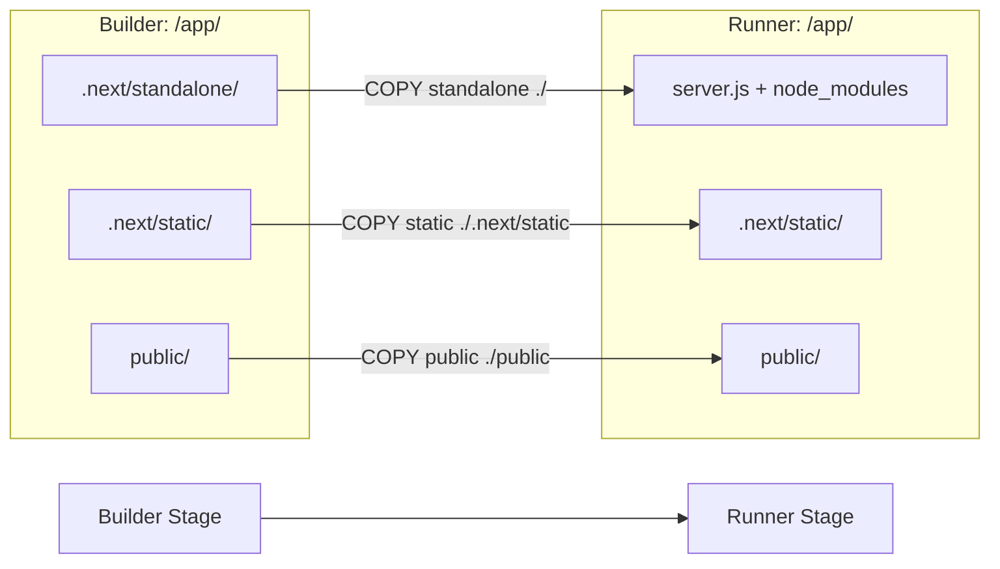

# Next.js Standalone Docker Architecture

## Build Output Structure (Builder Stage)

```
/app/                                    ← Build context
│
├── .next/                               ← Next.js build output
│   │
│   ├── standalone/                      ← Minimal server bundle (output: 'standalone')
│   │   ├── server.js                   ← Entry point (expects .next/ as sibling)
│   │   ├── package.json                ← Runtime dependencies manifest
│   │   └── node_modules/               ← Only runtime dependencies
│   │       └── ...                     ← (NOT devDependencies)
│   │
│   ├── static/                          ← Static assets (CSS, JS, fonts)
│   │   ├── chunks/                     ← Code-split bundles
│   │   │   ├── app/
│   │   │   ├── pages/
│   │   │   └── ...
│   │   ├── css/                        ← Compiled CSS
│   │   └── media/                      ← Fonts, images
│   │
│   ├── BUILD_ID                         ← Build identifier (UUID)
│   ├── cache/                           ← Build cache (not needed in runtime)
│   └── server/                          ← Server manifests (not needed, server.js replaces)
│
└── public/                              ← Static assets (favicon, images)
    ├── favicon.ico
    └── images/
```

## Runtime Container Structure (Runner Stage)

```
/app/                                    ← Runtime working directory
│
├── server.js                           ← ✅ From .next/standalone/server.js
├── package.json                        ← ✅ From .next/standalone/package.json
├── node_modules/                       ← ✅ From .next/standalone/node_modules
│   └── ...                             ← Runtime dependencies only
│
├── .next/                              ← ✅ CREATED by COPY operations
│   └── static/                         ← ✅ From .next/static/
│       ├── chunks/                     ← JavaScript bundles
│       ├── css/                        ← Stylesheets
│       └── media/                      ← Fonts, images
│
└── public/                             ← ✅ From public/
    ├── favicon.ico
    └── images/
```

## Docker COPY Operations Flow



## Key Architecture Insights

### 1. Standalone Does NOT Include .next/

**WRONG ASSUMPTION**:
```
.next/standalone/
└── .next/              ← ❌ THIS DOES NOT EXIST
    └── static/
```

**ACTUAL STRUCTURE**:
```
.next/standalone/
├── server.js           ← Entry point
├── node_modules/       ← Runtime deps
└── package.json        ← Manifest
```

### 2. server.js Expects .next/ as Sibling

**What server.js looks for**:
```javascript
// Simplified server.js logic
const buildDir = path.join(__dirname, '.next')
const staticDir = path.join(buildDir, 'static')
```

**Required runtime structure**:
```
/app/
├── server.js           ← __dirname = /app
└── .next/              ← Must exist at /app/.next
    └── static/         ← Must exist at /app/.next/static
```

### 3. Three Separate Copy Operations

```dockerfile
# Operation 1: Standalone Server Files
COPY --from=builder /app/.next/standalone ./
# Result: /app/server.js, /app/node_modules/, /app/package.json

# Operation 2: Static Assets
COPY --from=builder /app/.next/static ./.next/static
# Result: /app/.next/static/chunks/, /app/.next/static/css/

# Operation 3: Public Assets
COPY --from=builder /app/public ./public
# Result: /app/public/favicon.ico, /app/public/images/
```

## Common Pitfalls

### ❌ Pitfall 1: Copying .next Directory Directly

```dockerfile
# WRONG: This copies build artifacts, not runtime files
COPY --from=builder /app/.next ./.next
# Result: Missing server.js, wrong node_modules
```

### ❌ Pitfall 2: Not Copying Static Assets

```dockerfile
# WRONG: server.js will fail to serve CSS/JS
COPY --from=builder /app/.next/standalone ./
# Result: 404 errors for /_next/static/chunks/...
```

### ❌ Pitfall 3: Creating Empty .next Directory

```dockerfile
# WRONG: mkdir creates empty directory, no files
RUN mkdir -p /app/.next/static
# Result: Directory exists but contains no bundles
```

### ✅ Correct Pattern

```dockerfile
# 1. Copy standalone (server + runtime deps)
COPY --from=builder /app/.next/standalone ./

# 2. Copy static assets (CSS/JS bundles)
COPY --from=builder /app/.next/static ./.next/static

# 3. Copy public assets (images, fonts)
COPY --from=builder /app/public ./public
```

## Verification Commands

### Verify Builder Stage Output

```dockerfile
RUN echo "=== Standalone Contents ===" && \
    ls -la /app/.next/standalone/ && \
    echo "=== Static Contents ===" && \
    ls -la /app/.next/static/chunks/ && \
    echo "=== BUILD_ID ===" && \
    cat /app/.next/BUILD_ID
```

### Verify Runner Stage Structure

```dockerfile
RUN echo "=== Runtime Structure ===" && \
    ls -la /app/ && \
    echo "=== .next/static Contents ===" && \
    ls -la /app/.next/static/ && \
    echo "=== server.js exists ===" && \
    test -f /app/server.js && echo "✅ server.js found" || echo "❌ server.js missing"
```

### Test Container Locally

```bash
# Build container
docker build -t lankaconnect-web ./web

# Run container
docker run -p 3000:3000 lankaconnect-web

# Check logs
docker logs <container-id>

# Expected output:
# ✓ Ready in XXXms
# Listening on http://0.0.0.0:3000
```

## Performance Characteristics

| Metric | Value | Notes |
|--------|-------|-------|
| **Build Time** | 2-5 min | Depends on dependency cache |
| **Image Size** | 150-300 MB | Standalone is minimal |
| **Startup Time** | 2-5 sec | Fast server initialization |
| **Memory Usage** | 100-200 MB | Runtime memory footprint |

## Security Considerations

1. **Non-root User**: Run as `nextjs` user (UID 1001)
2. **Minimal Dependencies**: Only runtime deps in final image
3. **No Build Tools**: devDependencies excluded from runtime
4. **Read-only Filesystem**: Next.js standalone doesn't write to disk

## Related Documents

- `docs/ARCHITECTURE_NEXTJS_STANDALONE_DOCKER_COPY_STRATEGY.md` - Detailed ADR
- `web/Dockerfile` - Docker build configuration
- `web/next.config.js` - Next.js configuration

## References

- [Next.js Output: Standalone](https://nextjs.org/docs/app/api-reference/config/next-config-js/output)
- [Next.js Docker Deployment](https://nextjs.org/docs/app/getting-started/deploying)
- [Container Best Practices](https://docs.docker.com/develop/dev-best-practices/)
